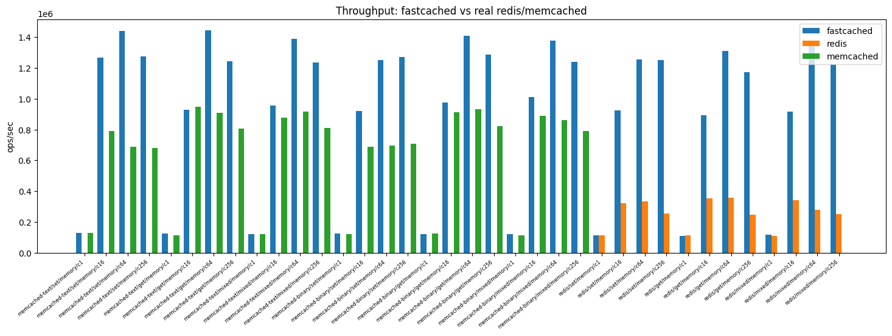

# fastcached

A small in-memory cache daemon written in C++23. It speaks a subset of three
wire protocols — the memcached text protocol, the memcached binary protocol,
and Redis RESP2 — and auto-detects which one the client is using from the
first bytes on the wire. Its concrete reason to exist is being a usable
backend for [sccache](https://github.com/mozilla/sccache); CI exercises that
case across all three protocols on every build.

It is not a general-purpose replacement for memcached or Redis — it implements
only the slice of each protocol a cache backend needs. It is in production use
as a shared sccache compile cache for a large C++ codebase, backing both CI
runners and developer machines, and on the in-memory GET workload that backend
cares about it benchmarks faster than native redis and memcached (see
[Benchmarks](#benchmarks)).

## Status

All layers are wired and the daemon runs. It serves connections on a
**reactor** (IOCP / epoll / kqueue) — one event loop multiplexes every
connection, optionally fanned out across several pinned reactor threads — so
the number of concurrent clients is bounded by memory, not by a worker count.
On top of that the codebase covers an LRU in-memory storage, an optional
copy-on-write persistent backend (the sibling
[`CowTree`](src/CowTree/README.md) library) layered behind the LRU as an L2,
key-hash sharding for parallel writes, CLI + YAML config with SIGHUP reload,
and a POSIX-daemon / Windows-service host. CI builds on Linux (clang + gcc),
macOS, and Windows (MSVC + clang-cl), and three separate jobs spin up the
daemon and assert sccache gets a cache hit using each wire protocol.

Protocol coverage is intentionally a subset:

- **memcached text:** `get`, `gets`, `set`, `add`, `replace`, `append`,
  `prepend`, `cas`, `delete`, `incr`, `decr`, `touch`, `gat`, `gats`,
  `flush_all`, `stats`, `version`, `quit`, plus the meta commands
  `mg` / `ms` / `md` / `ma` / `me` / `mn` (a subset of the memcached 1.6 meta
  flag matrix).
- **memcached binary:** the core opcodes (Get / Set / Add / Replace / Delete /
  Increment / Decrement / Append / Prepend / Flush / Quit / NoOp / Version /
  Stat, plus their quiet variants and SASL `PLAIN` authentication).
- **Redis RESP2:** `GET`, `SET` (with `NX`/`XX`/`EX`/`PX`), `SETEX`,
  `DEL` / `UNLINK`, `EXISTS`, `PING`, `ECHO`, `INFO`, `COMMAND`, `SELECT`,
  `AUTH`, `FLUSHDB` / `FLUSHALL`, `QUIT`.

For deployment beyond a trusted LAN it supports **authentication**
(`--requirepass`; redis `AUTH` + memcached SASL PLAIN), optional **TLS**
(`--tls`, an OpenSSL build), a Prometheus **`/metrics`** endpoint and a
**`/healthz`** probe (`--metrics`), and a container image with a self-contained
`--healthcheck`. See [docs/operations/deployment.md](docs/operations/deployment.md).
There is still no clustering and no replication.

## Benchmarks

Being *faster* than the servers it stands in for was the whole point of the
multi-core reactor work, so the repo ships a reproducible benchmark suite
([`bench/`](bench/README.md)) that drives fastcached and native `redis-server`
/ `memcached` over the same scenarios and compares throughput.



In-memory GET throughput on an AMD Ryzen 9 9950X3D (16C/32T, 96 GB), median of
3 reps, both competitors run as native binaries:

| Concurrency | fastcached  | vs native redis | vs native memcached |
|------------:|------------:|----------------:|--------------------:|
| 1           | ~120k ops/s | ~1.0× (tie)     | ~1.0× (tie)         |
| 16          | ~900k ops/s | **2.5×**        | ~1.0× (tie)         |
| 64          | ~1.4M ops/s | **3.7×**        | **1.6×**            |
| 256         | ~1.2M ops/s | **4.7×**        | **1.5×**            |

Geomean across the small-value in-memory scenarios is **~2.7× redis** and
**~1.35× memcached**, with 0 errors and 0 timeouts across the full sweep. At a
single connection there is no parallelism to exploit and all three tie;
fastcached's per-core reactors pull ahead of single-threaded redis from 16
connections up and overtake native memcached at 64+. On the same box the
persistent backend sustains ~11k durable SET ops/s at one connection and ~67k
at 16, p99 under 0.5 ms.

These are honest but narrow numbers: a single machine on one fast desktop CPU.
The redis baseline is the native single-threaded build, so a modern
`io-threads` redis would narrow the network gap — the multi-core architecture
advantage is what stands. Native memcached is a much stronger competitor here
than the order-of-magnitude gaps sometimes quoted against containerized
baselines. Reproduce with `python bench/fastcached_bench.py --vs redis,memcached`;
see [`bench/README.md`](bench/README.md) for the methodology.

## Use it as an sccache backend

This is the headline use case and the one CI actually exercises
(`.github/workflows/build.yml`).

```sh
fastcached --port=11211 &
export SCCACHE_MEMCACHED=tcp://127.0.0.1:11211

sccache g++ -std=c++23 -c hello.cpp -o hello.o   # miss
sccache g++ -std=c++23 -c hello.cpp -o hello.o   # hit
sccache --show-stats
```

sccache up to 0.7.x (the version Ubuntu ships) talks to memcached over the
**text** protocol; sccache ≥ 0.8 (the prebuilt from `mozilla-actions/sccache-action`)
talks **binary**. Both work against fastcached because the listener detects
the wire format from the first bytes the client sends. The same listener also
serves RESP2 — point sccache (or anything else) at it via `SCCACHE_REDIS` and
it works the same way.

## Talk to it directly

The transcripts below are copied from the actual unit tests, so they reflect
exactly what the server emits.

memcached text:

```
> set foo 0 0 5\r\nhello\r\n
< STORED\r\n
> get foo\r\n
< VALUE foo 0 5\r\nhello\r\nEND\r\n
```

Redis RESP2:

```
> *3\r\n$3\r\nSET\r\n$1\r\nk\r\n$5\r\nhello\r\n
< +OK\r\n
> *2\r\n$3\r\nGET\r\n$1\r\nk\r\n
< $5\r\nhello\r\n
```

## Production deployment

Run it authenticated, encrypted, and monitored — in a container or on a host:

```sh
# Container: cache on 11211, Prometheus /metrics + /healthz on 9259.
docker build -t fastcached .
docker run --rm -p 11211:11211 -p 9259:9259 fastcached \
    --bind=0.0.0.0 --metrics --metrics-bind=0.0.0.0 --requirepass=secret

# Or directly, with TLS (needs an OpenSSL build: -DFASTCACHED_ENABLE_TLS=ON):
fastcached --requirepass=secret --tls --tls-cert=server.crt --tls-key=server.key \
           --metrics
redis-cli --tls --insecure -a secret ping     # -> PONG
curl http://127.0.0.1:9259/healthz             # -> 200 OK
```

The image's `HEALTHCHECK` calls `fastcached --healthcheck`, a self-contained
probe of `/healthz` (no `curl` in the image). Binding `0.0.0.0` without
`--requirepass` exposes the cache to the network — pair them. Full guide,
including a Kubernetes manifest with liveness/readiness probes and a Prometheus
scrape annotation, in
[docs/operations/deployment.md](docs/operations/deployment.md).

## Command-line flags

```
usage: fastcached [options]
  --config=<path>        YAML config file; CLI flags override file values
  --bind=<addr>          bind address (default 127.0.0.1)
  --port=<num>           TCP port (default 11211)
  --max-memory=<size>    in-memory budget; k/m/g = KiB/MiB/GiB or N% of host RAM (default 64 MiB)
  --log-level=<level>    trace|debug|info|warn|error|fatal (default info)
  --log-timestamps       prefix every log line with an ISO 8601 UTC timestamp (default off)
  --storage=<path>       persist cache to a CoW-tree file (default: in-memory only)
  --storage-durability=<mode>  fsync|batched|none for --storage (default batched)
  --storage-max-value=<size>   per-value byte cap for --storage; k/m/g suffixes accepted (default 1m)
  --lru-mode=<mode>            approximate|strict in-memory LRU recency (default approximate)
                                   approximate: same-shard reads run concurrently (faster)
                                   strict: exact LRU order, reads serialise per shard
  --cpu-affinity=<mode>        none|per-core reactor thread pinning (default per-core;
                                   pins each reactor to its own core when running >1 reactor)
  --threads=<N>                number of independent pinned reactors to run
                                   (default hardware_concurrency); this is the server's
                                   across-core parallelism
  --listen-backlog=<N>         ::listen() backlog depth (default 511; clamped to SOMAXCONN)
  --storage-shards=<N>         shard storage into N partitions for write parallelism
                                   default 1 (single-file mode) when --storage names a regular
                                   file or does not yet exist; min(16, hardware_concurrency)
                                   otherwise. With N>1 and --storage set, --storage is a directory
  --daemon               daemonize (POSIX) / run under the Windows SCM (used by the installed service)
  --install-service      register fastcached as an auto-start Windows service (Windows only;
                             needs an elevated prompt; other flags are baked into the service)
  --uninstall-service    remove the fastcached Windows service (Windows only; needs elevation)
  --pidfile=<path>       POSIX daemon mode only
  --service-name=<name>  Windows service name (default FastCached)
  --help, -h             show this help and exit
  --version, -V          show version and exit
```

`--max-memory` takes an integer with an optional unit suffix:
`64m` is 64 × 1024² = 67108864 bytes; a plain integer is interpreted as bytes;
a trailing `%` (e.g. `50%`) sets the budget to that fraction of the host's
total RAM, queried at startup.

`--storage=<path>` switches the cache from in-memory-only to a copy-on-write
B+tree backed by `<path>`. Every commit is crash-consistent (the file always
matches either the previous or the new transaction; a kill -9 at any instant
leaves no half-written state), and reopening the file picks up the previous
state. `--storage-durability` trades durability for throughput: `fsync`
flushes on every commit, `batched` flushes at commit boundaries only (the
default), `none` relies on the OS page cache.

With persistent storage enabled, every shard is composed as
`LayeredStorage(InMemoryLruStorage, CowTreeStorage)`. Reads first consult
the in-memory LRU cache (L1) and only fall through to the on-disk B+tree
(L2) on a miss; the L2 result is then mirrored into L1 with **L2's CAS
preserved**, so subsequent CAS / Get calls return the same token whether
they were served from RAM or disk. Writes pass through L2 first (canonical
CAS) and then mirror into L1. `--max-memory` is the L1 byte budget; the
on-disk file grows independently as needed by the workload.

### Run with 30% of host RAM and a persistent cache file

```sh
# Linux / macOS — persist to ~/.cache/fastcached/cache.cow,
# budget = 30% of total host RAM, fsync-on-commit durability.
mkdir -p ~/.cache/fastcached
fastcached \
    --port=11211 \
    --max-memory=30% \
    --storage=$HOME/.cache/fastcached/cache.cow \
    --storage-durability=fsync &

export SCCACHE_MEMCACHED=tcp://127.0.0.1:11211
sccache g++ -std=c++23 -c hello.cpp -o hello.o
```

```powershell
# Windows (PowerShell) — same idea, %LOCALAPPDATA% for the cache directory.
New-Item -ItemType Directory -Force "$env:LOCALAPPDATA\fastcached" | Out-Null
Start-Process fastcached -ArgumentList `
    '--port=11211', `
    '--max-memory=30%', `
    "--storage=$env:LOCALAPPDATA\fastcached\cache.cow", `
    '--storage-durability=batched'

$env:SCCACHE_MEMCACHED = 'tcp://127.0.0.1:11211'
```

The first run writes entries to disk; stop the daemon (Ctrl-C, kill, or a
power loss) and start it again with the same flags and the cache picks back
up from where it left off — no warm-up.

### Concurrency: reactor + sharded storage

fastcached serves connections on a **reactor** — one event loop (IOCP / epoll
/ kqueue) multiplexes every connection, so concurrent clients are bounded by
memory rather than a worker count. `--threads=N` runs N independent reactors
(default `hardware_concurrency()`), each a single-threaded loop pinned to its
own core, with every connection pinned to one reactor for its lifetime — so
the server scales across cores without any cross-thread coroutine migration.
On Windows the reactor is additionally drained by several threads so a
blocking page-store `fsync` overlaps with serving other connections.

Storage is **sharded by key hash** when `--storage-shards>1`. Each shard
has its own `std::shared_mutex`: any number of `Get`s on the same shard
run in parallel (shared lock); writes take an exclusive lock that only
blocks operations on *that* shard, never across shards. For sccache's
read-heavy, well-hashed key space this scales reads linearly across cores.

```sh
# Reactor + sharded persistent storage (--storage is treated as a directory
# whenever --storage-shards > 1); --threads sets the reactor count:
./fastcached \
    --port=11211 \
    --max-memory=30% \
    --storage=$HOME/.cache/fastcached \
    --storage-shards=16 \
    --threads=16
```

`--storage` is interpreted as a regular file when `--storage-shards=1`
(single-file mode) and as a directory holding `shard-NN.cow` files when
`--storage-shards>1`. When `--storage-shards` is omitted (its default),
fastcached infers the mode from the path: a regular file or non-existent
path → single-file mode (1 shard); an existing directory → multi-shard
fan-out using `min(16, hardware_concurrency)` shards. This keeps the
documented `--storage=path.cow` invocation single-file regardless of the
host's core count.

When more than one reactor can reach the backend, single-shard storage is
still wrapped in a `ShardedStorage` decorator (with one shard) so the
per-shard mutex serialises the reactors against the unprotected backend.

`--storage-durability=none` skips `fsync` entirely. The OS page cache may
reorder writes against the meta page across a power loss, so crash
consistency is **not** guaranteed in this mode — use it only when you can
tolerate losing the cache on an unclean shutdown.

## YAML config (optional)

```yaml
# interface to bind on; 0.0.0.0 listens on all interfaces
bind: 0.0.0.0
# TCP port (1..65535); 11611 mirrors the value used in CI
port: 11611
# in-memory budget; k/K/m/M/g/G = KiB/MiB/GiB (1024-based),
# or "N%" to use N percent of the host's total RAM
max_memory: 30%
# one of: trace | debug | info | warn | error | fatal
log_level: debug
# optional: prefix every log line with an ISO 8601 UTC timestamp (default false)
log_timestamps: false
# optional: path to a CoW-tree file (single-shard) or directory (sharded).
storage_path: /var/lib/fastcached/cache
# optional: fsync | batched | none (default: batched)
storage_durability: batched
# optional: per-value byte cap for storage; k/m/g suffixes accepted (default 1m)
storage_max_value: 1m
# optional: shard storage across N partitions for parallel writes (0 = auto,
# 1 = single file/instance, N>1 = directory with shard-NN.cow files)
storage_shards: 16
# optional: number of independent pinned reactors to run (across-core
# parallelism); 0 = hardware_concurrency
threads: 0
# optional: approximate (default) | strict in-memory LRU recency
lru_mode: approximate
# optional: none | per-core reactor thread pinning (default per-core)
cpu_affinity: per-core
# optional: ::listen() backlog depth (default 511; clamped to SOMAXCONN)
listen_backlog: 511
```

CLI flags override YAML values. On POSIX, `SIGHUP` triggers a re-read of the
file; on Windows, the service control manager's `PARAMCHANGE` does the same.

## Running as a Windows service

`--install-service` registers fastcached with the Windows Service Control
Manager. It must be run from an **elevated** (Administrator) prompt — creating a
service is a privileged operation. Every other flag you pass alongside it is
baked into the service's launch command line, so the service starts with exactly
that configuration on every boot:

```powershell
# From an elevated PowerShell. Paths are made absolute automatically, because a
# service runs from C:\Windows\System32, not the install directory.
fastcached.exe --install-service --port=11211 --storage=C:\fastcached\cache.cow --threads=8

# The service is registered as auto-start (runs on every boot) but left stopped.
# Start it now for this session:
sc start FastCached

# Inspect it:
Get-Service FastCached

# Remove it (also elevated):
fastcached.exe --uninstall-service
```

Use `--service-name=<name>` to register (or remove) the service under a custom
name when running more than one instance. `--daemon` is the in-service runtime
hook the SCM invokes for you — you do not normally run it by hand.

## Building

Requires CMake ≥ 3.28, a C++23 compiler, and Ninja. The full set of presets
lives in `CMakePresets.json`; the three most useful ones are:

```sh
# Linux / macOS — Clang with ASan + UBSan + clang-tidy
cmake --preset clang-debug
cmake --build --preset clang-debug
ctest --preset clang-debug

# Linux — GCC
cmake --preset gcc-debug
cmake --build --preset gcc-debug

# Windows — MSVC
cmake --preset cl-debug
cmake --build --preset cl-debug
```

Dependencies (`yaml-cpp`, `Catch2`) are pulled in via
[CPM.cmake](cmake/CPM.cmake) with `CPM_USE_LOCAL_PACKAGES=ON`, so
`find_package` is tried first and only unavailable packages are fetched from
GitHub.

## Repository layout

```
src/FastCache/        library code, organised by layer (Core, Async, Net,
                      Cache, Protocol, Server, Platform, Config, Metrics)
src/CowTree/          standalone copy-on-write B+tree library (no dependency
                      on FastCache; can be lifted into other projects)
src/fastcached/       the daemon executable's main()
src/tests/            Catch2 entry point; *_test.cpp files live next to sources
cmake/                build helpers (PedanticCompiler, Sanitizers, CPM, ...)
.github/workflows/    CI
AGENT.md              design notes, conventions, and the things contributors
                      should read before touching this code
```

## Contributing

See [`AGENT.md`](AGENT.md) for the architecture, error taxonomy, live-reload
pipeline, and the contributor conventions this project follows.

## License

Licensed under the Apache License, Version 2.0. See [`LICENSE`](LICENSE).
