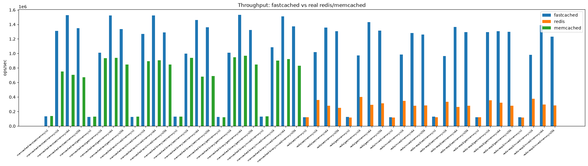

# fastcached

Two things ship from this repository:

- **`fastcached`** — a fast in-memory cache daemon that speaks the memcached
  text, memcached binary, memcached meta, and Redis RESP2 protocols on a single
  port, auto-detecting which one each client is using from its first bytes. On
  the in-memory GET workload a compile cache cares about, it benchmarks faster
  than native redis and memcached (see [Benchmarks](#benchmarks)).
- **`fastcache-cc`** — a drop-in compiler launcher in the style of
  [ccache](https://ccache.dev/) and [sccache](https://github.com/mozilla/sccache),
  backed by `fastcached`. Unlike those, its cache entries are **portable across
  checkout paths**, so CI runners and developer machines share one cache even
  when their source trees live at different depths.

Use them together for a shared compile cache, or run `fastcached` on its own as
a memcached/Redis-compatible cache — including as a plain
[sccache backend](#using-fastcached-as-an-sccache-backend).

It is not a general-purpose replacement for memcached or Redis: it implements
only the slice of each protocol a cache backend needs. It is in production use
as a shared compile cache for a large C++ codebase, backing both CI runners and
developer machines.

Full documentation: **<https://lastrada-software.github.io/fastcached/>**

## Install

Released packages — `.deb`, `.rpm`, macOS `.pkg`/`.dmg`, Windows `.msi` —
install both executables and register the daemon to start automatically.
On macOS the installer offers the launchd job as a per-user agent (default)
or a system-wide daemon, and ships `fastcached-uninstall` to remove it.

Or build it yourself; a build installs both executables into `bin/`:

```sh
cmake --preset clang-release
cmake --build --preset clang-release
cmake --install out/build/clang-release --prefix /usr/local
```

Or run the daemon in a container, built from the included `Dockerfile`:

```sh
docker build -t fastcached .
docker run --rm -p 6674:6674 fastcached
```

Requires CMake 3.28+, a C++23 compiler, and Ninja. Full details — presets,
dependencies, and platform notes — in
[Install](https://lastrada-software.github.io/fastcached/getting-started/install/).

## Quick start: the cache daemon

```sh
fastcached
```

It listens on `127.0.0.1:6674` — fastcached's own port, unassigned by IANA
(6.674×10⁻¹¹ is the gravitational constant). The number selects no protocol:
every client below reaches the same daemon on the same port, because the wire
format is detected per connection. See [Ports](#ports).

Then talk to it with any memcached or Redis client. These transcripts are copied
from the unit tests, so they reflect exactly what the server emits:

```
> set foo 0 0 5\r\nhello\r\n
< STORED\r\n
> get foo\r\n
< VALUE foo 0 5\r\nhello\r\nEND\r\n
```

```
> *3\r\n$3\r\nSET\r\n$1\r\nk\r\n$5\r\nhello\r\n
< +OK\r\n
> *2\r\n$3\r\nGET\r\n$1\r\nk\r\n
< $5\r\nhello\r\n
```

Protocol coverage is intentionally a subset — the commands a cache client
actually uses. See the
[coverage matrix](https://lastrada-software.github.io/fastcached/protocols/coverage-matrix/)
for the exact list.

## Quick start: caching your compiles

`fastcache-cc` fronts each compile: on a hit it reproduces the object file and
replays the compiler's output; on a miss it runs the real compiler and stores
the result. **If anything goes wrong — daemon down, network gone, cache
corrupt — it silently runs the real compiler.** A broken cache can slow your
build down, never break it.

### 1. Start a daemon

```sh
fastcached --storage=$HOME/.cache/fastcached/cache.cow
```

The 256 MiB default value cap already covers real object files, which routinely
exceed 16 MiB — a large C++ codebase was measured at ~122 MB for its biggest.
Pass `--storage-max-value` only to go beyond that, or to impose a smaller cap.

Point every machine that should share the cache at that one daemon.

### 2. Point the launcher at it

Three variables must **all** be set, or every compile runs uncached:

```sh
export FASTCACHE_ADDR=127.0.0.1:6674     # the daemon
export FASTCACHE_SRCROOT=$PWD            # your checkout root
export FASTCACHE_BUILDTREE=$PWD/build    # your build directory
export FASTCACHE_COHORT=myproject-main   # optional: prefetch grouping
```

`SRCROOT` and `BUILDTREE` are what make entries portable: paths under them are
rewritten to tokens before hashing, so the same source at
`/home/alice/proj` and `/ci/runner/w/1/s/proj` produces the *same* cache key.

### 3. Wire it into the build

```sh
cmake -S . -B build -G Ninja \
  -DCMAKE_C_COMPILER_LAUNCHER=fastcache-cc \
  -DCMAKE_CXX_COMPILER_LAUNCHER=fastcache-cc

cmake --build build      # first run: misses, populates the cache
rm -rf build/CMakeFiles/*.dir
cmake --build build      # second run: hits
```

It also works as a plain prefix for a single compile, which is the quickest way
to check your setup:

```sh
FASTCACHE_VERBOSE=1 fastcache-cc g++ -c src/a.cpp -o build/a.o
# fastcache-cc: MISS key=05b1b5ef9ef5135e119560a2aa140aef
# fastcache-cc: STORED key=05b1b5ef9ef5135e119560a2aa140aef bytes=1427
```

With PowerShell and MSVC:

```powershell
$env:FASTCACHE_ADDR      = '127.0.0.1:6674'
$env:FASTCACHE_SRCROOT   = $PWD
$env:FASTCACHE_BUILDTREE = "$PWD\build"

cmake -S . -B build -G Ninja `
  -DCMAKE_CXX_COMPILER_LAUNCHER=fastcache-cc.exe
```

### 4. See how it did

```sh
fastcache-cc --show-stats                    # totals, hit rate, latency distributions
fastcache-cc --show-stats --cohort ci-main   # one cohort only
fastcache-cc --zero-stats                    # discard the log
```

```
compiles     : 4
hits         : 2  (66.7% of 3 cacheable)
misses       : 1
unavailable  : 1  (25.0% of all compiles -- CACHE NOT REACHED)
fall-back reasons
  1x  connect failed
```

A non-zero `unavailable` count means the cache was never reached — check
`FASTCACHE_ADDR` and the daemon before concluding caching does not help.

Supported compilers: `gcc`/`g++`, `clang`/`clang++` (including versioned names
like `g++-14`), and MSVC `cl` / `clang-cl`. The full reference — every
environment variable, exit codes, how the key is computed, and the known
limitations — is in the
[fastcache-cc docs](https://lastrada-software.github.io/fastcached/tools/fastcache-cc/).

## Using fastcached as an sccache backend

If you already use sccache, you can keep it and just point it at fastcached:

```sh
fastcached &
export SCCACHE_MEMCACHED=tcp://127.0.0.1:6674

sccache g++ -std=c++23 -c hello.cpp -o hello.o   # miss
sccache g++ -std=c++23 -c hello.cpp -o hello.o   # hit
sccache --show-stats
```

sccache up to 0.7.x talks to memcached over the **text** protocol; sccache ≥ 0.8
talks **binary**. Both work, because the listener detects the wire format from
the first bytes the client sends. `SCCACHE_REDIS` works the same way. CI
exercises all three protocols on every build.

Note that sccache keys on absolute paths, so its entries are **not** portable
between checkouts at different paths — that is the reason `fastcache-cc` exists.

## Production deployment

Run it authenticated, encrypted, and monitored:

```sh
# Container: cache on 6674, Prometheus /metrics + /healthz on 9259.
docker run --rm -p 6674:6674 -p 9259:9259 fastcached \
    --bind=0.0.0.0 --metrics --metrics-bind=0.0.0.0 --requirepass=secret

# With TLS (needs an OpenSSL build):
fastcached --requirepass=secret --tls --tls-cert=server.crt --tls-key=server.key \
           --metrics
redis-cli --tls --insecure -a secret ping     # -> PONG
curl http://127.0.0.1:9259/healthz            # -> 200 OK
```

Binding `0.0.0.0` without `--requirepass` exposes the cache to the network —
pair them. The image's `HEALTHCHECK` calls `fastcached --healthcheck`, a
self-contained probe needing no `curl` in the image. Full guide, including a
Kubernetes manifest with liveness/readiness probes, in the
[deployment docs](https://lastrada-software.github.io/fastcached/operations/deployment/).

## Ports

fastcached's own port is **6674** — the leading digits of the gravitational
constant, G = 6.674×10⁻¹¹. It is unassigned in the IANA service-name registry,
needs no privileges to bind, and sits below the ephemeral range.

**The port selects no protocol.** The wire format is detected per connection, so
memcached text, memcached binary, memcached meta, Redis RESP2 and the compile-
cache protocol are all served on 6674 — and on any other port you bind. Earlier
releases defaulted to memcached's 11211, which implied a protocol the daemon
never restricted itself to, and collided with a real memcached on the same host.

Clients you cannot re-point keep working — bind their port *alongside* ours:

```sh
fastcached --listen=127.0.0.1:6674 --listen=127.0.0.1:11211
```

Both ports then speak every protocol, not just their namesake. The admin
endpoint (`/metrics`, `/healthz`) is separate, defaults to **9259**, and only
listens with `--metrics`.

## Configuration

Run `fastcached --help` for the complete, always-current flag list. The ones
that matter most:

| Flag | Purpose |
|------|---------|
| `--bind=<addr>` / `--port=<num>` | Where to listen (default `127.0.0.1:6674`). |
| `--listen=<host:port>` | Additional listener; repeatable. How to serve a legacy port alongside 6674. |
| `--max-memory=<size>` | In-memory budget; `k`/`m`/`g` suffixes, or `N%` of host RAM. Defaults to a quarter of host RAM, bounded to [512 MiB, 8 GiB]; under a container memory limit that limit is used instead of the host's RAM. |
| `--storage=<path>` | Persist to a crash-consistent copy-on-write B+tree; without it the cache is memory-only. |
| `--storage-max-value=<size>` | Per-value cap, and the wire payload cap with it (default 256 MiB, sized for compile caches). The memcached framings keep a fixed 16 MiB ceiling. |
| `--storage-durability=<mode>` | `fsync` / `batched` (default) / `none`. |
| `--threads=<N>` | Independent pinned reactors; the server's across-core parallelism. |
| `--requirepass=<secret>` | Require authentication (Redis `AUTH`, memcached SASL PLAIN). |
| `--metrics` | Serve Prometheus `/metrics` and `/healthz`. |

Every flag can also come from a YAML file via `--config=<path>`, with CLI flags
taking precedence; `SIGHUP` (POSIX) or the service manager's `PARAMCHANGE`
(Windows) re-reads it. On Windows, `--install-service` registers the daemon with
the Service Control Manager. See the
[configuration docs](https://lastrada-software.github.io/fastcached/getting-started/quickstart/).

### Persistence and scaling

With `--storage`, every commit is crash-consistent: the file always matches
either the previous or the new transaction, and a `kill -9` at any instant
leaves no half-written state. Restarting with the same flags picks the cache
back up with no warm-up.

Storage is composed as an in-memory LRU (L1) over the on-disk B+tree (L2), and
sharded by key hash when `--storage-shards>1` so writes to different shards
never block each other. `--threads=N` runs N single-threaded reactors, each
pinned to its own core, with every connection pinned to one reactor for its
lifetime — so the server scales across cores without cross-thread coroutine
migration. Details in the
[architecture docs](https://lastrada-software.github.io/fastcached/internals/architecture/).

## Benchmarks

The repo ships a reproducible suite ([`bench/`](bench/README.md)) that drives
fastcached and native `redis-server` / `memcached` through the same scenarios.



In-memory GET throughput on an AMD Ryzen 9 9950X3D (16C/32T, 96 GB), median of
3 reps, both competitors run as native binaries:

| Concurrency | fastcached  | vs native redis | vs native memcached |
|------------:|------------:|----------------:|--------------------:|
| 1           | ~120k ops/s | ~1.0× (tie)     | ~1.0× (tie)         |
| 16          | ~900k ops/s | **2.5×**        | ~1.0× (tie)         |
| 64          | ~1.4M ops/s | **3.7×**        | **1.6×**            |
| 256         | ~1.2M ops/s | **4.7×**        | **1.5×**            |

Geomean across the small-value in-memory scenarios is **~2.7× redis** and
**~1.35× memcached**, with 0 errors and 0 timeouts across the sweep. At a single
connection there is no parallelism to exploit and all three tie; fastcached's
per-core reactors pull ahead of single-threaded redis from 16 connections up and
overtake native memcached at 64+. The persistent backend sustains ~11k durable
SET ops/s at one connection and ~67k at 16, p99 under 0.5 ms.

These are honest but narrow numbers: one fast desktop CPU, single machine. The
redis baseline is the native single-threaded build, so a modern `io-threads`
redis would narrow the network gap — the multi-core architecture advantage is
what stands. Reproduce with `python bench/fastcached_bench.py --vs redis,memcached`.

## Contributing

See [`AGENT.md`](AGENT.md) for the architecture, error taxonomy, coding
guidelines, and how to build and test the project.

## License

Licensed under the Apache License, Version 2.0. See [`LICENSE`](LICENSE).
Memcached and Redis are registered trademarks of their respective owners.
