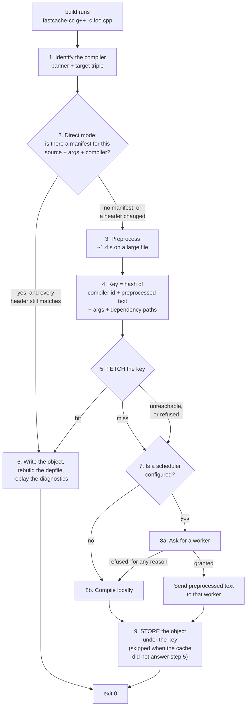

# How it works

This page is the mental model. It explains what the pieces are and follows one
compile all the way through them, so that when something misbehaves you can
reason about *where* rather than guess.

Read it once and the flag references elsewhere become lookups rather than
puzzles. Almost every "why is nothing being cached" question turns out to be
[toolchain matching](#what-makes-two-machines-share-a-cache), which is why that
gets a section of its own rather than a footnote.

---

## The three programs

| | What it is | Where it runs |
|---|---|---|
| **`fastcache-cc`** | A launcher. It is put *in front of* your compiler and decides, per translation unit, whether to compile or to fetch. | On the machine doing the build. Starts and exits once per source file. |
| **`fastcache-compile-node`** | A node. It compiles work sent to it, and holds a cache of its own. It may additionally schedule for a fleet and take part in consensus. | On any machine contributing to a fleet — including the one you are building on. |
| **`fastcached`** | The shared cache daemon. Objects land here so *other* machines get them. | One machine, or a few. It is shared infrastructure. |

Two things about this list surprise people, and both matter:

**The scheduler is not `fastcached`.** Handing out other machines' CPU time is a
decision only one node may make at a time, and a cache daemon has no way to
establish which node that is. So scheduling lives on `fastcache-compile-node`,
where cluster leadership already lives. `fastcached` answers reads and writes of
the cache and nothing else — send it a scheduling request and it tells you, by
name, where the scheduler went.

**A node is a cache too.** `fastcache-compile-node` serves a cache tier of its own
by default, on `127.0.0.1:6674` — the address the launcher already looks at. So a
developer who starts a node gets a local cache with no configuration at all.

None of these is required. `fastcache-cc` alone against a `fastcached` is a
complete, useful setup; everything else is added when you want it.

---

## One compile, start to finish

Your build system runs `fastcache-cc g++ -c foo.cpp -o foo.o` instead of
`g++ -c foo.cpp -o foo.o`. Here is what happens between those two commands.

This is the **client's** side of the story. If a fleet is involved, the same
compile seen from the machines it touches — what the scheduler decides, what a
worker is trusted with — is
[One compile, as the fleet sees it](operations/cluster-communication.md#one-compile-as-the-fleet-sees-it).



Note where the two "the cache did not serve this" edges go. A **miss** and a
**cache that could not be reached, or that refused** both arrive at step 7, and
that is the point rather than a shortcut: the cache and the scheduler are separate
services on separate machines, so a failure of one says nothing about the other.
Sending a miss to step 7 and a transport failure straight to step 8b is what made
a mistyped `FASTCACHE_ADDR` turn every build on an estate local while the fleet
sat idle and healthy, with the build green throughout
([#236](https://github.com/LASTRADA-Software/fastcached/issues/236)). What the
launcher does *not* do afterwards is push the result at a daemon that just failed
to answer — step 9 is skipped in that case, so reaching step 7 costs a wrong
`FASTCACHE_ADDR` no more connections than it cost before.

### 1. Identify the compiler

The launcher asks the compiler what it is. Two questions, not one:

- **Its version banner** — the first line of `--version`, verbatim.
- **The target it generates code for** — the CPU-and-platform triple, asked of
  the driver directly where it can answer.

Both, because a banner identifies the *program* and a program's code generation is
not a function of the program alone. `clang-cl` takes its Microsoft-ABI
compatibility level from whichever MSVC install sits beside it, so the same
`clang-cl.exe` generates differently on two machines. One stock `g++` banner
covers x86_64 and aarch64. Keying on the banner alone would let two different code
generators share an entry — which is a *wrong object*, not a missed one.

### 2. Direct mode: try to skip the expensive part

The expensive part is preprocessing: running the compiler far enough to expand
every `#include`. For one source file and the headers it pulls in — a
**translation unit** — that is roughly 25 MB of text and about **1.4 seconds** on
a large codebase. Re-hashing the headers a *previous* compile already recorded
costs about **18 ms**. So the launcher tries the cheap route first.

It builds a **manifest key** out of three things it already has without
preprocessing anything — the source file's path, the arguments, and the compiler
identity from step 1 — and fetches whatever is stored under it. A *manifest* is a
list: every header that compile opened, a hash of each one's contents, and the key
of the object that compile produced.

The launcher then re-hashes those files on disk right now. If every hash still
matches and the compiler has not changed, the manifest's object key is trustworthy
— it fetches the object under that key and jumps to step 6. If any file changed,
went missing, or the compiler moved, direct mode gives up quietly and step 3
happens.

Direct mode never decides a compile is uncacheable. It only ever decides it cannot
take the shortcut.

### 3. Preprocess

The compiler is run with preprocess-only flags, and **line markers are
suppressed**. That is deliberate: a line marker carries the absolute path of your
checkout, and a path inside the hashed text would mean two developers with
identical code at different paths never share an entry.

The same run also reports which headers were opened — `-MD` into a scratch depfile
for GCC and Clang, `/showIncludes` for MSVC. Asking for that costs about 1.5% on
top of the preprocess, because the compiler has already opened every one of those
files anyway.

### 4. Compute the key

Four inputs, hashed together into a 128-bit key:

```
compiler id  +  preprocessed text  +  arguments  +  dependency paths
```

The arguments and the dependency paths are **rewritten before hashing**. Anything
pointing inside your source root or build tree becomes a placeholder token instead
of a real path, and the dependency list is sorted and de-duplicated. That is
exactly what lets a CI runner with the checkout at `/ci/w/1/s` and a developer with
it at `/home/alice/proj` compute the *same* key for the same code — and it is why
this cache shares entries where ccache and sccache do not.

Toolchain and system headers are deliberately **not** in the dependency list. The
compiler identity already stands for them collectively, and hashing their paths
would split every pair of machines whose compilers are installed at different
prefixes.

A translation unit using `__TIME__`, `__DATE__` or `__TIMESTAMP__` is not cached
at all: its output changes every second, so it would re-key on every compile and
could never hit.

### 5. Look it up

One request, to whatever `FASTCACHE_ADDR` names. That address is always a
**cache**, never a scheduler — either a shared `fastcached`, or a node's own tier
on this machine. Mixing the two up is a common first mistake, and it presents as
every compile being refused.

If it is a node's tier, one more step happens invisibly: **a local hit answers
immediately and never consults the shared cache** — a matching key names the same
object by construction, so there is nothing upstream could add. A local *miss*
asks the shared cache, and on an answer populates the local tier before returning
it, so the next build of that object never leaves the machine.

### 6. On a hit

Three things are reproduced, not one:

- **The object file**, written to the path your build asked for.
- **The dependency record** — the depfile or the `/showIncludes` stream — with
  every path rewritten to *this* machine's layout. This is not optional. Skipping
  it leaves your build system with no header dependencies for that file, so it
  stops rebuilding when those headers change, silently.
- **The compiler's stdout and stderr**, replayed on their true streams, so
  warnings still appear.

Before serving, the launcher checks that every dependency it is about to replay
actually exists here. If one does not, the entry is a **stale hit**: the object is
fine but its dependency record is not true on this machine, so it compiles for
real and overwrites the entry rather than leaving it to mislead every later build.

### 7–8. On a miss

If no scheduler is configured, the real compiler runs locally. That is the whole
of it, and it is a complete setup.

If `FASTCACHE_SCHEDULER` is set, the launcher first asks that scheduler for a
worker, naming the toolchain fingerprint and the object key. Whatever comes back,
the build cannot break: **every refusal ends in the local compile that would have
happened anyway.** Refusals are named rather than lumped together, because they
are different problems:

| Refusal | Means | What to do |
|---|---|---|
| `no-worker` | Nothing in the fleet serves that toolchain fingerprint. | A [matching problem](#what-makes-two-machines-share-a-cache). Usually the whole answer. |
| `no-capacity` | Every matching worker is full of this build's own work. | Add machines. |
| `withdrawn` | Machines are there and unavailable — someone is using them, or a scratch disk filled. | Wait, or look at the machine. |
| `already-in-flight` | Another client is compiling this exact key right now. | Nothing. This is the feature working. |

That last one is why the scheduler is worth having at all. When a header changes
and sixty parallel clients miss the same key, the scheduler dispatches *one* job
and tells the rest to compile locally — because a lease request names the object
key, so the one node handing out capacity sees the whole fleet's misses as they
arrive.

If a worker is granted, the launcher **preprocesses a second time**, now *with*
line markers, and sends that text. The two texts differ on purpose: the key's copy
must carry no paths, while a compiler needs markers to know which lines came from
a system header — without them every warning inside libc++ or the CRT is
re-reported against your own file, and under `-Werror` that fails the compile.

The worker compiles it in a scratch directory of its own and sends back the object
and the diagnostics. It is told the *fingerprint*, never a program: it maps that to
a compiler it serves and refuses one it does not have. That is the difference
between a build accelerator and a remote shell.

### 9. Store

The **machine that asked** stores the result, never the worker that produced it.
Workers are given no cache credentials at all, so a compromised worker can only
spoil the results it hands back to one client — which that client could have
produced itself anyway — rather than writing bad objects into a cache every other
machine reads.

By this point a dispatched compile looks exactly like a local one: object on disk
where the build asked for it, dependency record written, diagnostics in hand.
Nothing after this step can tell the two apart, which is why they cannot drift.

A compile that **fails** is never cached. You get the real compiler's errors, and
nothing is stored.

---

## What makes two machines share a cache

This is where most confusion lives, so it is worth being precise. There are two
different identities, they answer different questions, and one of them carries the
target while the other deliberately does not.

| | Decides | Made of | Carries the target? |
|---|---|---|---|
| **Cache key** | which *object* may be served | compiler banner + target + preprocessed text + args + dependency paths | **yes** |
| **Toolchain fingerprint** | which *worker* may compile for you | compiler banner + a content hash of its whole include tree | **no** |

### The cache key

Two machines share an entry when all four inputs agree. In practice the ones that
bite are:

- **Different compiler patch releases** produce different banners, so they share
  nothing. That is correct, not a bug.
- **Different targets** now split too. `clang-cl` next to different MSVC installs,
  or one `g++` binary on x86_64 and aarch64, used to collide.
- **Different flags** — including ones your build system adds that you never
  typed. `-DNDEBUG` differing between two builds is a different key.

Checkout *path* is deliberately not among them: that is the whole point of the
relativization in step 4.

### The toolchain fingerprint

A fingerprint is a digest of the compiler's version banner **and the contents of
the include tree that belongs to it** — paths taken *relative to their include
root*, so the same toolchain at `/usr/lib/gcc/...` and `/opt/toolchains/gcc-13/...`
fingerprints identically. Contents, never modification times, which differ on
every machine.

Matching is **byte-identical**, and it cannot be loosened. The two errors are not
symmetric: an over-strict match costs one local compile, while an over-loose one
produces a silently wrong object that is then stored under a key every other
machine fetches.

*"The include tree that belongs to it"* does real work on Windows:

- **`cl`** carries the `VC\Tools\MSVC\<version>` toolset it lives inside, plus the
  newest Windows SDK.
- **`clang-cl`** carries only the resource directory it names when asked
  (`-print-resource-dir`). It *borrows* the VC toolset and the SDK rather than
  owning them, so two `clang-cl` machines with different SDKs installed still
  match.

Neither reads `INCLUDE`. That variable is set by a developer command prompt and is
never inherited by a Windows service — so a worker installed as a service produces
the same fingerprint as the launchers talking to it. That symmetry is the point.

Computing a fingerprint walks the include tree, which takes a couple of seconds
the first time a machine sees a toolchain. It is then cached per compiler under
your user state directory, keyed on the compiler's size, mtime and include-root
timestamps, so a toolchain upgrade invalidates it automatically.

### Diagnosing a mismatch

When the scheduler answers `no-worker`, ask both ends what they think the
fingerprint is:

```sh
fastcache-cc --print-toolchain-fingerprint /usr/bin/g++   # on the client
journalctl -u fastcache-compile-node | grep serving       # on the worker
```

They must be identical strings. If they are not, the two machines genuinely have
different toolchains — a different patch release, a different SDK, a vendored
header that is not the same file.

Note that the fingerprint deliberately omits the target, so a developer-prompt
launcher and a service-run worker still match. Dispatch closes that gap on the
command line instead: a dispatched compile states `--target=<triple>` *ahead* of
your build's own arguments, so the worker generates for your target rather than
re-deriving one from its own machine, while a `--target=` or `-m32` your build
states still wins.

---

## "Why is nothing being cached?"

The model above turns this into three separate questions with three separate
answers. Ask them in order — the first one that applies is the whole story.

Start with `fastcache-cc --show-stats`, which is a per-machine tally:

```
  compiles     : 1842
  hits         : 1631  (94% of 1734 cacheable)
    via direct : 1502  (92% of hits, no preprocess)
  misses       : 103
  uncacheable  : 8
  unavailable  : 100  (5% of all compiles -- CACHE NOT REACHED)
  fall-back reasons
    100x  fetch exchange failed
```

### 1. Was the cache reached at all?

A non-zero **`unavailable`** means the launcher never got an answer, so the hit
rate is meaningless. The reasons under it name the cause. The two usual ones:

- **`missing FASTCACHE_ADDR/SOURCE_DIR/BINARY_DIR`.** All three must be set and
  non-empty. `FASTCACHE_ADDR` has a default (`127.0.0.1:6674`), so in practice it
  is the two roots that are missing — and if you are using this project's own
  CMake module, it sets them for you.
- **`fetch exchange failed`.** Nothing answered at that address — usually nothing
  is listening. Start the daemon or the node. Note that this is a report about the
  *cache*: the compiles themselves were still dispatched if `FASTCACHE_SCHEDULER`
  names a fleet, so a build can show 100% `unavailable` and still have been fast.

### 2. The cache is reached, but everything is a miss

Then the key differs from whatever produced the entries you expected to hit. Run
one compile with `FASTCACHE_VERBOSE=1` and read the notes. The ones that matter:

| Note | Means |
|---|---|
| `the configured roots do not contain this translation unit` | Your source root and build tree do not describe this compile, so its checkout path stays in the key and nothing is portable. This is the big one. |
| `dependency set: 0 of 41 reported path(s) keyed` | Every header the compiler reported was filtered out — usually the same root problem, seen from the other side. |
| `the compiler did not report a target; keying on its banner alone` | One machine may be keying with a target and another without. |
| `STALE HIT (replayed dependency missing: …)` | The entry was found. Its dependency record names a file this machine does not have, so it was refused and rewritten. |
| `uses __TIME__/__DATE__/__TIMESTAMP__` | This file is deliberately never cached. |

And check the obvious: two machines with **different compiler patch releases**, or
**different flags**, correctly share nothing. `-DNDEBUG` present on one and absent
on the other is a different key, and build systems add flags you never typed.

### 3. Caching works, but nothing is ever dispatched

Hits and misses look normal, but no compile goes to a worker. `FASTCACHE_VERBOSE=1`
names the reason directly:

```
fastcache-cc: not dispatched (rejected (no-worker)); compiling locally
```

Rule out the cheap thing first: **`FASTCACHE_TOKEN` must not be set on a client
that dispatches.** A compile node accepts no credential today, so a token makes
every lease refused and every compile local, behind a perfectly green build
([#198](https://github.com/LASTRADA-Software/fastcached/issues/198)).

Otherwise it is a fingerprint mismatch. Compare the two machines as above; if they
differ, their toolchains genuinely differ, and the fix is to make them the same
rather than to loosen the match — an over-loose match produces a wrong object that
every other machine then fetches.

What is **not** a reason is the cache being down. `cache unavailable (…)` names a
wrong or unreachable `FASTCACHE_ADDR`, and a `DISPATCHED` line follows it — see
[the two edges out of step 5](#one-compile-start-to-finish).

---

## Who leads, and what happens when that changes

Run **one** node and it leads itself. It schedules for its own machine and nobody
else's, needs no configuration, and this is the common deployment.

Run several and exactly one must schedule at a time — two nodes handing out the
same machine's slots is not a degraded fleet, it is the one thing the design says
cannot happen. Electing that one node is what **consensus** is for. It uses Raft,
it is off until you give a node `--node-id`, and the node holding the election's
outcome is called the **leader**.

### What a node does when it starts, in order

1. **Surveys the machine for compilers** and fingerprints what it finds. This is
   the slow part on a cold start — seconds per toolchain, several at once. You see
   one line per compiler:

   ```
   found /usr/bin/g++ (usr)
   found /usr/bin/clang++ (usr)
   serving /usr/bin/g++ as 4f2c…
   ```

   The `serving` lines are the fingerprints, and they are what you compare against
   a client. A node that ends up with nothing to serve refuses to start and says
   where it looked.

2. **Binds its surfaces** — the 0xFC port (`--listen-node`), which carries the
   compile verbs, the cache tier and the scheduler verbs together, plus the admin
   and consensus ports when they are configured.

3. **Starts consensus, if `--node-id` was given**, and says so. The parenthesis is
   the part to read — it tells you whether this node brought a cluster with it:

   ```
   consensus on 0.0.0.0:6680 as n1 (3 member(s), state in /var/lib/fastcache-cluster/n1)
   consensus on 0.0.0.0:6680 as n4 (no cluster yet; waiting to be admitted, state in …)
   ```

4. **Announces its role** as soon as one is decided, and again on every change:

   ```
   consensus: this node is now the leader in term 3
   consensus: this node is now a follower in term 4 of 10.0.0.2:6675
   ```

   The term is in the line because a role change without one explains nothing. A
   node that is campaigning and not winning logs `undecided` each term, which is
   what an election that will not settle looks like.

5. **Registers with its scheduler and heartbeats**, every 20 seconds. Each
   heartbeat carries what the machine is doing — CPU, available memory, free
   scratch space, and what its cache holds.

6. **Prints one ready line**:

   ```
   compile node ready on 0.0.0.0:6674, advertising worker-01.internal:6674,
   14 slot(s) as a workstation node, 2 toolchain(s)
   ```

### Joining an existing cluster

A machine being added to a running fleet is started with **`--raft-join`**, and
that flag is not optional. Without it the node bootstraps a cluster *of itself*:
it elects itself, takes a term and a log, and afterwards refuses every leader its
own configuration does not name. Two clusters cannot be merged by any local rule,
so a joining node must never form one.

The sequence, and what you see at each step:

1. Start the joiner with `--raft-join`. It names itself in `--raft-peer` plus
   enough existing members to reach one. It logs
   `no cluster yet; waiting to be admitted` and then waits. That line is how you
   know the flag took effect — a node that says `1 member(s)` instead has
   bootstrapped a cluster of itself and must be stopped, its state directory
   removed, and started again.
2. Tell any member to admit it: `--cluster-admit=n4=10.0.0.4:6680`. The leader
   logs `cluster: proposing a quorum of 4 member(s) at index …`.
3. The leader starts replicating to the joiner, which refuses at first — its log
   is empty — and the leader walks back to the beginning. This is why the joiner
   must be reachable *before* it is admitted.
4. The joiner logs `consensus: this node is now a follower in term N of …`, and
   the admitting side logs `cluster: recorded n4 at 10.0.0.4:6680`.
5. From then on membership is a **replicated log entry**, so the new node survives
   its own restart and everybody else's without anyone editing a file on the other
   machines.

Nothing about the existing members changes. They are not restarted and their
command lines are not edited.

### When leadership moves

Scheduling requests are answered **only by the leader**. Anyone else refuses and
says where to go: a `not-leader` reply carrying the leader's *scheduler* address,
which is a different port from its consensus one. Each node announces that address
when it becomes leader, because it is the only one that knows it.

For a client that refusal is ordinary: it compiles locally, like any other
refusal. For an operator it means two things worth knowing:

- **The fleet dashboard follows leadership.** A follower answers `/fleet` with
  `503` naming the leader rather than showing a partial picture — it only knows
  about the workers that happened to register with *it*, which is not the fleet.
- **Dashboard history has a gap, not a zero.** Sampling runs only while a node
  leads, so leadership moving leaves a hole in the charts. A gap says nobody was
  watching; a zero would claim the fleet did nothing.

Workers re-register with whoever is leading on their next heartbeat, so a
leadership change costs at most one interval of scheduling.

`--discovery` is an optional layer on top of this: instead of typing every peer's
address, nodes announce themselves on the LAN and prove they hold a shared key.
It only ever *reports* who proved the key — the leader still proposes, and
membership is still a Raft decision. See
[Cluster discovery](getting-started/cluster-discovery.md).

---

## Where things are kept

| What | Where | Survives a restart? |
|---|---|---|
| Shared cached objects | `fastcached`'s `--storage` path, or memory only without it | Only with `--storage` |
| A node's own cache | Memory, plus `--cache-dir/objects.cow` if given | Only with `--cache-dir` |
| Consensus state | `--cluster-dir`, default `fastcache-cluster/<node-id>` | Yes — it must, or a node could vote twice in one term |
| Dashboard history | `fleet-history.bin` in the cluster dir, else the cache dir, else memory | Where a directory exists |
| Launcher statistics | `%LOCALAPPDATA%\fastcache-cc` or `$XDG_STATE_HOME/fastcache-cc` | Yes |
| Cached toolchain fingerprints | `toolchains/*.fingerprint` in that same state directory | Yes, until the toolchain changes |

Two consequences worth drawing out.

**Nothing but the object store needs to survive.** Lose a node's cache and it
refills from upstream. Lose the fingerprint cache and the next compile spends two
seconds rebuilding it. Lose the dashboard history and the charts start empty and
say so. Consensus state is the one exception, and it is durable by necessity: a
node that answered a vote and forgot it would vote twice in one term, which is two
leaders in one term.

**The replicated log holds configuration, not objects.** Consensus works by
copying a log of changes to every member and keeping it until it is compacted, so
multi-megabyte object files are exactly what does not belong in one. What it
carries is who is a member, where they answer, and the handful of settings every
member must agree on. Cached objects live in the caches this log merely names.

---

## What this buys, and what it does not

**Distribution is not linear scaling.** The launcher must preprocess to compute
the key *before* it can know there is a miss, and that work is unavoidable and
always local. At roughly 45 ms against compiles of 300 ms–2 s, the ceiling is
about **10–40×**, not the number of machines you own.

**Misses are bursty.** With a warm shared cache, hit rates run 90%+, so a fleet
is idle most of the time and its value is concentrated in the first build of a
commit, developer branches and toolchain bumps. Size it for that shape rather
than for steady load.

**Some compiles never distribute, by design.** A C++ module interface unit and
anything writing a precompiled header produce a second artefact beside the object,
and only the object travels — so they are compiled locally and not cached either.
So is a command line that names its own input language (`/TP`, `-x c++`), because
the launcher must state the language of the preprocessed text it sends and would
otherwise silently override yours.

**Caching never breaks a build.** Every error path — an unreachable daemon, a
refused lease, a malformed value, a stale dependency record — ends in the
translation unit being compiled anyway. A refused lease or an absent fleet makes
that the real compiler here; a daemon that could not be reached or that refused
does **not**, and the compile is still dispatched — see
[the two edges out of step 5](#one-compile-start-to-finish). Run with
`FASTCACHE_VERBOSE=1` to see which path a translation unit took.

---

## Where to go next

- [Quickstart](getting-started/quickstart.md) — a running daemon in two minutes.
- [fastcache-cc](tools/fastcache-cc.md) — every environment variable, the
  statistics, and the fall-back reasons by name.
- [Distributed compilation](getting-started/distributed-compilation.md) — setting
  up a fleet, and what to watch once it runs.
- [Cluster communication](operations/cluster-communication.md) — the same compile
  from the fleet's side, every connection in one table, and firewall rules.
- [fastcache-compile-node](tools/fastcache-compile-node.md) — every flag, the
  node's cache tier, the cluster, and the fleet dashboard.
- [Architecture](internals/architecture.md) — the module map, for contributors.
