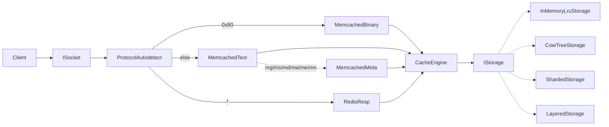
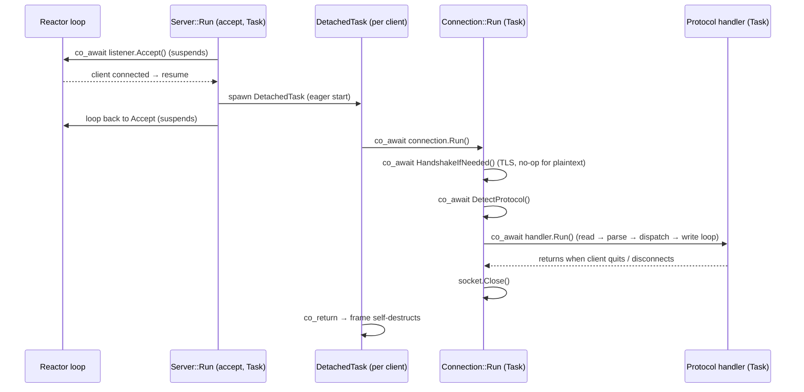

# Architecture

fastcached is a layered C++23 server. Each layer reaches its
collaborators through a narrow interface, which keeps the whole
thing testable end-to-end against an in-memory transport.

## Module map

```
src/FastCache/
  Core/         Errors taxonomy, Clock (steady + wall), Logger, BufferPool,
                Bytes, Endian, Crc32c, StringHash, Owner, Profiling (Tracy)
  Async/        Task<T>, DetachedTask, ResumeOn, SleepUntil/SleepFor,
                Cancellation, IReactor + TestReactor and the platform reactors
                (EpollReactor / IocpReactor / KqueueReactor)
  Net/          ISocket + IoAwaitable, IListener + AcceptAwaitable,
                IAdmissionControl, SocketAddress, BlockingSocket (Winsock + POSIX),
                EpollSocket / IocpSocket / KqueueSocket (reactor-driven),
                TlsSocket/TlsContext (OpenSSL decorator, optional),
                InMemoryTransport (paired pipes + InMemoryListener),
                Framing/LineReader (line and length-prefixed)
  Cache/        IStorage atomic primitives, CacheEntry, CacheEngine,
                InMemoryLruStorage, CowTreeStorage (CoW B+tree, src/CowTree),
                LayeredStorage (L1 LRU over L2 disk), ShardedStorage
                (key-hash fan-out), NotifyingStorage (keyspace events),
                TracingStorage (Tracy zones)
  Protocol/     IProtocolHandler, ProtocolAutodetect, MemcachedText,
                MemcachedMeta (1.6 mg/ms/md/ma/me/mn), MemcachedBinary,
                RedisResp (RESP2/RESP3: strings, keys, pub/sub, streams,
                MULTI/EXEC), PubSubRegistry, StreamWaiterRegistry,
                KeyspaceNotifier
  Server/       Connection (per-client coroutine), Server (accept loop),
                ReactorServerLoop (the server driver), AdminHttpServer
  Platform/     IDaemonHost (ForegroundHost / PosixDaemonHost / WindowsServiceHost),
                ISignalSource, DaemonControls (process-wide stop/reload flags),
                CpuAffinity, HostMemory, ServiceControl, Terminal
  Config/       Config, CliParser, ByteSize, YamlReader (yaml-cpp), ConfigReloader
  Metrics/      IMetricsSink + AtomicMetricsSink, PrometheusFormatter
```

## Request flow



## Concurrency model

fastcached is built on **single-threaded reactors**. One `IReactor`
(epoll / kqueue / IOCP) owns an event loop on exactly one thread; every
connection it accepts is **pinned to that reactor for its whole life**, so
all of a connection's I/O and state mutation happen on one thread. There is
no work-stealing and no per-request locking on the cache hot path.

`--threads N` runs `N` independent reactors, each pinned to its own CPU core
(`PinCallingThreadToCpu`, best-effort). How connections reach a reactor
differs by platform:

- **POSIX (Linux/macOS):** one listener per reactor, all bound with
  `SO_REUSEPORT` (`ReusePort::Yes`). The kernel load-balances incoming
  connections across the listeners, so each reactor accepts and serves its
  own share directly — no cross-thread handoff.
- **Windows:** IOCP has no `SO_REUSEPORT`, so a blocking acceptor thread per
  bind round-robins accepted sockets across the IOCP reactors. Each handed-off
  socket runs `co_await ResumeOn{reactor}` first, which re-schedules the
  coroutine onto the target reactor's thread before any I/O — restoring the
  "one connection, one reactor thread" invariant. (On the persistent-disk
  backend several threads additionally drain one IOCP so a blocking page-store
  `fsync` overlaps serving other connections; that backend is therefore always
  wrapped in a thread-safe `ShardedStorage`.)

See `Server/ReactorServerLoop.cpp` for both paths.

## Coroutine architecture

The server is one big tree of C++20 coroutines driven by a reactor. Two
coroutine *types* exist, and the choice between them is the whole design:

### `Task<T>` — lazy, owned, awaited

`Async/Task.hpp` defines `Task<T>` (and `Task<void>`). Its promise's
`initial_suspend()` returns `std::suspend_always`, so a `Task` is **lazy**:
constructing it runs none of the body. It starts only when it is driven —
either awaited from another coroutine, or run to completion by `SyncRun`
(tests and early startup, before a reactor exists).

When one `Task` `co_await`s another, the awaiter stores the awaiting
coroutine as the callee's *continuation* and hands control to the callee via
**symmetric transfer** — `await_suspend` returns a `coroutine_handle<>`
instead of `void`, so the compiler tail-resumes it without growing the C
stack. The matching `FinalAwaiter::await_suspend` (`Async/Task.hpp:35`)
returns the continuation, transferring straight back to the awaiter at
`co_return`. A deep chain of `co_await`s therefore runs in **O(1) stack
space**. `Task<T>::Awaiter` owns the callee's coroutine handle and destroys
the frame when the await leaves scope (RAII).

### `DetachedTask` — eager, fire-and-forget

`Async/Task.hpp:347` defines `DetachedTask`: `initial_suspend` and
`final_suspend` are both `std::suspend_never`, so it **starts eagerly** and
its frame **self-destructs** at `co_return`. Nobody holds a handle to it.
Crucially, `unhandled_exception()` calls `std::terminate()` — an exception
escaping a connection would otherwise tear down the whole daemon — so every
`DetachedTask` body is wrapped in a catch-all *firewall* that logs and drops
only that one connection (`RunConnectionDetached` in `Server.cpp`,
`RunHandedOffConnection` in `ReactorServerLoop.cpp`).

### How a connection is driven, end to end



- `Server::Run()` (`Server.cpp:59`) is itself a `Task<void>` — the accept
  loop. It `co_await`s `_listener.Accept()`; the reactor resumes it when a
  client connects.
- Each accepted client is spawned as a `DetachedTask` and the accept loop
  immediately loops back. The server keeps **no handle** to the connection;
  the frame owns its own lifetime and is driven forward only by reactor
  resumptions of its suspended I/O.
- `Connection::Run()` (`Connection.cpp:25`) sequences: transport handshake →
  protocol autodetect → dispatch to the matching protocol handler. The
  per-request loop (read → parse → dispatch → write) lives in the handler
  (`MemcachedTextHandler` / `MemcachedBinaryHandler` / `RedisRespHandler`),
  not in `Connection` itself.

### Synchronous storage, asynchronous I/O — the key decision

Only operations that genuinely *wait on the outside world* are coroutines:
socket reads/writes, the TLS handshake, and the blocking Redis verbs (`BLPOP`
has no analogue here, but `XREAD … BLOCK` does). **Cache operations are plain
synchronous calls.** `CacheEngine::Get/Set/Add/...` return
`std::expected<T, StorageError>` and are *never* `co_await`-ed — the hot path
inside a handler is:

```cpp
auto result = engine->Get(key);          // synchronous, microseconds
co_return co_await WriteAll(socket, ...); // only the socket write suspends
```

This is deliberate. Storage lookups hit in-memory structures (LRU hash / CoW
B+tree) and complete in microseconds; making them awaitable would add
suspend/resume overhead and frame churn for no latency win, and would force
locking concerns onto a path that is single-threaded by construction. So the
rule is: **suspend for I/O, run straight through for compute.**

### The reactor contract

`IReactor` (`Async/IReactor.hpp`) is the seam everything async hangs off:

| Method | Role |
| --- | --- |
| `Run()` | Block on the event loop until `Stop()` and the ready queue drains. |
| `Stop() noexcept` | Ask `Run()` to exit; idempotent; callable from any thread. |
| `Submit(handle)` | Post a coroutine to resume on the reactor thread (FIFO). |
| `Schedule(deadline, handle)` | Resume a coroutine when the clock reaches `deadline`. |
| `Clock()` | The `IClock` used for all deadline checks. |

One reactor per thread. `Submit` and `Schedule` are safe to call from any
thread (production reactors wake the loop via an eventfd/pipe/IOCP post). The
clock is injected: production uses `SteadyClock`, tests downcast to
`ManualClock` and `Advance()` to drive timers deterministically.

#### Readiness vs completion

`IoAwaitable` is a single, completion-shaped facade over two very different
OS models:

| | epoll (Linux) / kqueue (macOS) | IOCP (Windows) |
| --- | --- | --- |
| Model | **Readiness** — OS says "fd is now readable/writable" | **Completion** — OS says "this read of N bytes is done" |
| Per op | Try the syscall first; on `EAGAIN`, arm interest and park; the reactor retries on the next readiness event | Submit `WSARecv`/`WSASend` with an `OVERLAPPED`; the reactor dispatches when the completion is dequeued |
| Sync fast path | Yes — a `recv` that succeeds immediately resolves the awaitable as already-ready, no suspension | No — every op is submitted to the OS |

The awaitable hides this: the handler always just writes
`co_await socket->Read(buf)` and gets back an `IoResult`
(`std::expected<std::size_t, NetError>`).

## Awaitable taxonomy

Every awaitable in the codebase, what its `await_suspend` returns, and why:

| Awaitable | Defined in | `await_suspend` → | Role |
| --- | --- | --- | --- |
| `Task<T>::Awaiter` / `Task<void>::Awaiter` | `Async/Task.hpp` | `coroutine_handle<>` (symmetric transfer) | Await one `Task` from another; owns the callee frame, destroys it on scope exit. |
| `TaskPromiseBase::FinalAwaiter` | `Async/Task.hpp:35` | `coroutine_handle<>` (continuation) | `final_suspend` transfers straight back to the awaiter — zero C-stack growth on chains. |
| `IoAwaitable` | `Net/ISocket.hpp:27` | **`bool`** | `Read`/`Write`/`WriteVectored`/`WaitReadable`. The `bool` return is the subtle bit — see below. |
| `AcceptAwaitable` | `Net/IListener.hpp:30` | `void` | `IListener::Accept()`; always suspends, resumed via `Complete()`. |
| `ResumeOn` | `Async/ResumeOn.hpp:17` | `void` | Hop a coroutine onto a target reactor's thread via `IReactor::Submit` (the Windows connection handoff). |
| `SleepUntil` / `SleepFor` | `Async/SleepUntil.hpp` | `void` | Timer wait built on `IReactor::Schedule`; `SleepFor` is the relative-delay convenience. Used for `XREAD BLOCK` timeouts. |
| `StreamWaiter::Awaiter` | `Protocol/RedisResp.cpp` | `bool` | Park a blocking `XREAD`/`XREADGROUP` until one of three arms fires: an `XADD` wakes it, the timer expires, or the client disconnects. A one-shot latch makes the race safe. |
| `SuspendOnLatch` / `WakeLatch` | `Protocol/RedisResp.cpp` | (latch) | Park the pub/sub subscribe loop until a delivered message *or* an incoming client command wakes it. |
| `std::suspend_always` / `std::suspend_never` | `<coroutine>` | — | `Task`'s lazy initial-suspend; `DetachedTask`'s eager start and self-destructing final-suspend. |

### The `bool` await_suspend — a re-entrancy guard

Most awaitables return `void` (always suspend) or a handle (symmetric
transfer). `IoAwaitable` and `StreamWaiter::Awaiter` instead return `bool`,
to handle a backend that can **complete the operation synchronously from
inside the suspend callback** — e.g. the TLS decorator finding a whole record
already buffered, or the in-memory transport resolving inline. If such a
backend called `Complete()` (which resumes the handle) while still inside
`await_suspend`, it would resume the coroutine *re-entrantly* — undefined
behaviour, and in a loop it recurses one stack frame per op until it
overflows. The guard: while the suspend callback runs, a synchronous
`Complete()` only *records* the result (`_inSuspendCallback`), then
`await_suspend` returns `false`, telling the machinery to resume normally via
`await_resume` rather than suspend. `Net/IoAwaitable_test.cpp` proves this
holds across **200 000** synchronous completions in a loop without
overflowing.

## Awaitables we could add

The current set covers the server's needs, but a few generic primitives would
remove hand-rolled machinery if more concurrency lands:

- **`WhenAny` / `WhenAll` combinators.** The stream and pub/sub waiters today
  hand-roll their 2–3-arm races with bespoke one-shot latches
  (`StreamWaiter`, `WakeLatch`). A reusable `WhenAny` (resolve on the first
  arm, cancel the rest) would replace those latches with one tested
  primitive. Builds on the existing reactor `Submit`/`Schedule` seams.
- **A cancellation-aware awaitable.** `CancellationToken` (below) is
  poll-only today. An awaitable that resolves when a token trips would let any
  wait — a blocking `XREAD`, a long write — participate in shutdown directly,
  instead of relying on socket/listener close to unblock it.
- **An `async_scope` / structured-ownership handle.** Connections run as
  untracked `DetachedTask`s, so shutdown cannot *join* in-flight work. A scope
  that tracks spawned tasks and awaits them would enable a bounded graceful
  drain ("stop accepting, finish the N in-flight requests, then exit").
- **A reactor-backed `Yield` / reschedule.** `co_await` of a no-deadline
  `Submit` would let a long synchronous burst (e.g. a huge multi-key `MGET`)
  voluntarily yield the reactor thread for fairness. The
  `YieldAwaitable` already written in the reactor tests is exactly this shape,
  waiting to be promoted.

`SleepUntil`/`SleepFor` were themselves such a promotion: a per-protocol
`struct SleepUntil` duplicated in `RedisResp.cpp` and `IocpReactor_test.cpp`,
now a single generic awaitable in `Async/` (the timer twin of `ResumeOn`).

## Cancellation & shutdown

Cancellation is **cooperative and polling-based**, not preemptive.
`Async/Cancellation.hpp` provides `CancellationSource` (control) and
`CancellationToken` (cheap-to-copy observer) over a shared atomic flag
(`Cancel()` stores with release, `IsCancelled()` loads with acquire) — a
lighter `std::stop_token` without callbacks. Shutdown then works through the
seams that *do* unblock a parked coroutine:

- `Server::Shutdown()` sets a flag and calls `listener.Close()`, which makes
  the in-flight `Accept()` resolve with `NetErrorCode::Cancelled`, so the
  accept loop exits.
- Closing a socket makes its parked `Read`/`Write` resolve with an error, so
  the connection coroutine unwinds.

The honest current limitation: **in-flight connection coroutines are not
force-cancelled.** They end when their handler returns (client `quit`,
disconnect, or error). A structured `async_scope` (see above) is what a
bounded graceful drain would need.

## Design principles

- **`std::expected<T, E>`** for fallible API surfaces. Chained monadically
  with `and_then`, `or_else`, `transform`, `transform_error` rather than
  nested `if`s. Exceptions are reserved for programmer errors.
- **Dependency injection** for anything touching I/O, time, randomness, or the
  filesystem: `IClock`, `IReactor`, `ISocket`, `IListener`, `IStorage`,
  `ILogger`, `IDaemonHost`, `ISignalSource`, `IAdmissionControl`,
  `IMetricsSink`.
- **Data-driven design** — no magic literals; tables/descriptors are the
  source of truth (CLI flag table, storage-record layout, protocol dispatch).
- **RAII for resource handles**. Every socket, listener, log file, and
  coroutine handle is owned by an RAII wrapper (`Task<T>::Awaiter` owns and
  destroys the callee frame; `PooledBuffer` returns to its pool on destruction).

## Testing strategy

Catch2 tests live next to the implementation files: `Foo.cpp` has a
`Foo_test.cpp` (auto-collected by a `GLOB_RECURSE` in `src/tests/`). Tests
substitute deterministic fakes for the injected interfaces (`ManualClock`,
`TestReactor`, `InMemoryTransport`, `NullLogger`, `CapturingLogger`,
`ScriptedSignalSource`).

The coroutine machinery is exercised the same way: a `TestReactor` paired with
a `ManualClock` makes suspend/resume and timer firing fully deterministic —
`Submit` the entry coroutine, `Advance()` the clock, `Run()` to make progress
(see `Async/TestReactor_test.cpp`, `Async/SleepUntil_test.cpp`). The canonical
coroutine-correctness check is `Net/IoAwaitable_test.cpp`, whose
200 000-iteration loop guards against the re-entrant-resume stack overflow
described above.
