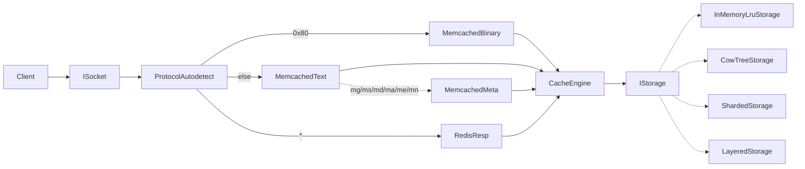

# Architecture

fastcached is a layered C++23 server. Each layer reaches its
collaborators through a narrow interface, which keeps the whole
thing testable end-to-end against an in-memory transport.

## Module map

```
src/FastCache/
  Core/         Errors taxonomy, Clock, Logger, BufferPool, Bytes, Endian,
                Crc32c, StringHash, Owner, Profiling (Tracy wrappers)
  Async/        Task<T>, Cancellation, ResumeOn, IReactor + TestReactor and the
                platform reactors (EpollReactor / IocpReactor / KqueueReactor)
  Net/          ISocket, IListener, IoAwaitable, IAdmissionControl, SocketAddress,
                BlockingSocket (Winsock + POSIX),
                EpollSocket / IocpSocket / KqueueSocket (reactor-driven),
                InMemoryTransport (paired pipes + InMemoryListener),
                Framing/ByteReader (line and length-prefixed)
  Cache/        IStorage atomic primitives, CacheEntry, CacheEngine,
                InMemoryLruStorage, CowTreeStorage (CoW B+tree, src/CowTree),
                LayeredStorage (L1 LRU over L2 disk), ShardedStorage
                (key-hash fan-out), TracingStorage (Tracy zones)
  Protocol/     IProtocolHandler, ProtocolAutodetect, MemcachedText,
                MemcachedMeta, MemcachedBinary, RedisResp (RESP2)
  Server/       Connection (per-client coroutine), Server,
                ReactorServerLoop (the server driver)
  Platform/     IDaemonHost (ForegroundHost / PosixDaemonHost / WindowsServiceHost),
                ISignalSource, DaemonControls (process-wide stop/reload flags),
                CpuAffinity, HostMemory, ServiceControl, Terminal
  Config/       Config, CliParser, ByteSize, YamlReader (yaml-cpp), ConfigReloader
  Metrics/      IMetricsSink + AtomicMetricsSink
```

## Request flow



## Design principles

- **`std::expected<T, E>`** for fallible API surfaces. Chained
  monadically with `and_then`, `or_else`, `transform`,
  `transform_error` rather than nested `if`s. Exceptions are
  reserved for programmer errors.
- **Dependency injection** for anything touching I/O, time,
  randomness, or the filesystem: `IClock`, `IReactor`, `ISocket`,
  `IListener`, `IStorage`, `ILogger`, `IDaemonHost`, `ISignalSource`,
  `IAdmissionControl`, `IMetricsSink`.
- **Data-driven design** — no magic literals; tables/descriptors are
  the source of truth (CLI flag table, storage-record layout,
  protocol dispatch).
- **RAII for resource handles**. Every socket, listener, log file,
  coroutine handle is owned by an RAII wrapper.

## Testing strategy

Catch2 tests live next to the implementation files: `Foo.cpp` has a
`Foo_test.cpp`. Tests substitute deterministic fakes for the
injected interfaces (`ManualClock`, `TestReactor`,
`InMemoryTransport`, `NullLogger`, `CapturingLogger`,
`ScriptedSignalSource`).
