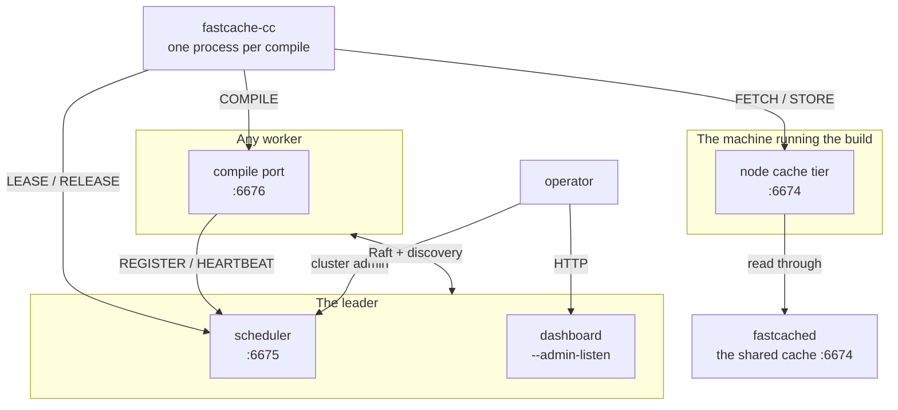
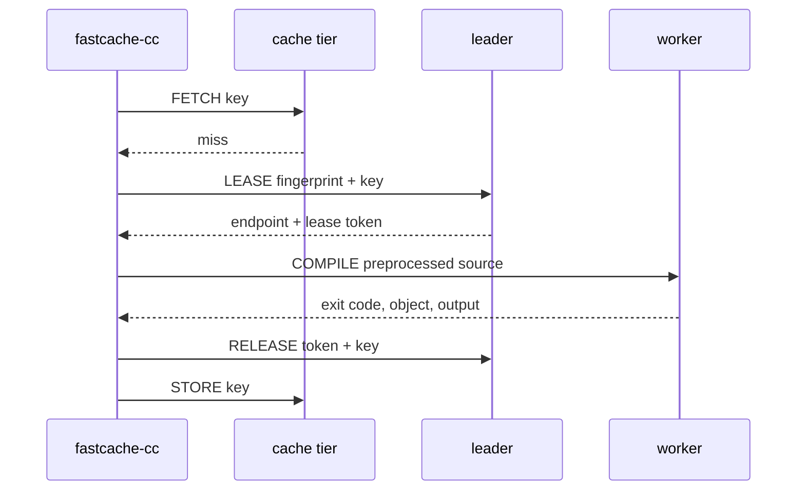

# Cluster communication

Every connection a compile fleet makes: who opens it, where it lands, how often,
and what it carries.

The page has two halves, and they are for different readings:

- **[One compile, as the fleet sees it](#one-compile-as-the-fleet-sees-it)** —
  follow a single compile request across the machines it touches. Read this to
  understand what `fastcache-compile-node` actually does.
- **[Every connection](#every-connection)** onward — the topology, the cadences,
  what to open on a firewall, and what to check when a leg stops flowing.

Two neighbouring pages tell adjacent stories, and this one deliberately does not
repeat them. [How it works](../how-it-works.md) follows one compile from the
**client's** side — how the key is derived, what direct mode skips, what a hit
reproduces. [Distributed compilation](../getting-started/distributed-compilation.md)
is how to set a fleet up. This page is the fleet's own side: what each machine
decides, on what evidence, and what it says to whom.

---

## What each program decides

Three programs, and the useful way to hold them apart is by the decision each one
owns. No decision below is shared, and none is made twice.

| Decision | Made by | On what evidence |
|---|---|---|
| Is this compile a cache hit? | `fastcache-cc`, the client | The key it derived from the preprocessed text, the arguments and the compiler's identity |
| May this compile run on another machine, and which one? | The **leader** node's scheduler | What the fleet's heartbeats have told it: toolchains, free slots, keys already in flight |
| Which compiler actually runs? | The **worker**, from its own `--toolchain` configuration | The fingerprint the client named — which selects a compiler the worker already trusts, never one the client supplies |
| What gets stored in the cache? | `fastcache-cc`, the client | The compile it just watched succeed. A worker is given no cache credential and never stores |
| Who leads? | Consensus, across the nodes | A Raft election. With one node, it leads itself and needs no configuration |

The last column is where the safety comes from. A client cannot name a program
for a worker to run, and a worker cannot put anything into a cache other machines
read. Both restrictions are what make it reasonable to leave dispatch switched on
across a fleet.

## The whole fleet in one picture



Those are **roles, not machines**. One host commonly holds several: a developer's
laptop runs the client and a cache tier; a small fleet's leader is also a worker;
a single node is all of them at once and talks to itself over loopback.

---

## One compile, as the fleet sees it



### 1. The client asks a cache

`FASTCACHE_ADDR` decides which one. Pointed at a node's own tier — the default,
and the reason that tier exists — a **local hit never leaves the machine**. A
local miss makes the node read through to whatever `--upstream` names, and
populate its own tier on the way back, so the second build of the same tree does
not pay the network again.

A hit ends the story here. Everything below happens only on a miss.

### 2. On a miss, the client asks the leader

Only the leader can answer. A follower refuses with `not-leader` and names the
leader's scheduler address, because a follower's registry holds whatever
registered against *it*, which is not the fleet.

For the client that refusal is ordinary — it compiles locally, exactly as it does
for every other refusal.

### 3. The leader decides from what heartbeats told it

It never asks the workers anything. Every fact it needs arrived on a heartbeat
already, and it checks them in this order:

1. **Is this key already in flight?** If another client holds a lease on it, this
   one is told `already-in-flight` and compiles locally. When a header changes and
   sixty clients miss the same key at once, one job is dispatched and fifty-nine
   are spared — that is the ordinary shape of a miss on a shared cache, not an
   exotic one.
2. **Which workers registered this toolchain?** The fingerprint must match
   **byte for byte**. No match is `no-worker`, which is a configuration problem
   rather than a capacity one.
3. **Which of them has the most free slots?** Ties break on utilization. Free
   slots rather than fewest running jobs, because counting jobs treats a 64-slot
   server and a 4-slot laptop as the same box and sends work to the smallest
   machines first.

Duplicate suppression being asked **before** capacity is why a busy fleet answers
`already-in-flight` for a key it is already building, rather than `no-capacity`.
Both are true; only one of them tells an operator what to do.

### 4. It grants, or it refuses

A grant is three things: the worker's endpoint, a **lease token**, and what that
worker can decompress. The last one saves a round trip — the client is about to
send a multi-megabyte payload and would otherwise have to guess or give up
compressing it.

A refusal is one of four, and they are counted apart on purpose:

| Refusal | What it means | What to do |
|---|---|---|
| `no-worker` | Nobody in the fleet has this toolchain | Fix a toolchain mismatch |
| `no-capacity` | Every matching worker is full of this fleet's own work | Add machines |
| `withdrawn` | Matching workers have pulled their capacity — busy with something else, or out of scratch | Nothing to buy; look at those machines |
| `already-in-flight` | Somebody is building this exact key right now | Nothing. It is working |

Adding those four together hides all of them.

### 5. The client dials the worker directly

**The leader is not in this path.** It never sees the translation unit, never
relays a byte of it, and is not a bottleneck on payload size. It handed out an
address and went back to answering other clients.

The client sends preprocessed text — no headers to ship, no sysroot to replicate
on the worker.

### 6. The worker compiles it, with a compiler it chose

The job names a **fingerprint**, never a program. The worker maps that to a
compiler path from its own configuration, and refuses a fingerprint it does not
have. This is the single most important rule on the worker's side: a job that
could name its own compiler would make the compile port a remote shell.

It is equally trusted with nothing else. The scratch directory, the object path
and the working directory are all the worker's own; it re-checks the arguments it
was sent rather than believing the client filtered them; and it takes only the
*base name* of the source file, sanitized, because a compiler records the name of
the file it was handed and an invented one makes the object gratuitously
different from a locally built one.

It answers with an exit code, the object and both output streams. A non-zero exit
code is a **successful exchange** — the compiler ran and rejected the code — and
the client answers that by recompiling locally to get diagnostics with the right
line numbers.

A worker runs **`slots` compiles at once**, each on its own thread, while the port
goes straight back to accepting. That is the number it registered, so what the
scheduler dispatches against and what the machine actually serves are the same
figure. Until
[#213](https://github.com/LASTRADA-Software/fastcached/issues/213) they were not:
the port served each connection to completion before accepting the next, so a node
advertising thirty ran one, and the busiest reading a saturated fleet could show
was `1 / 30 compiling`. Everything a job touches is derived per thread rather than
per job — the scratch directory above is unique across the compiles running
together, or two of them would build into the same file.

Two refusals are the worker's own rather than the scheduler's four, and both
answer a client that already holds a valid grant:

| Refusal | What it means | What to do |
|---|---|---|
| `no-capacity` | Every slot on this worker is busy | Nothing at once; the client compiles locally. Persistent means the fleet is small |
| `endpoint-busy` | Slots were free but the payloads already being read fill this worker's memory budget | Nothing to buy — more machines would not have helped |

Neither is queued, and that is deliberate: the client has a local compile waiting
either way, while queueing would hide the overload from the scheduler that is
trying to route around it.

### 7. The client hands the lease back

On **every** path out of the compile: an object built, a worker that refused the
job, a worker that could not be reached. The leader frees the key and decrements
that worker's in-flight count.

This is a second connection to the scheduler, not the one the grant arrived on —
that port sweeps a connection idle for five seconds, and a compile is longer than
that.

Expiry exists as the safety net for a client that **died** (a `Ctrl-C` on a
build), not for one that forgot. It is ten minutes by default, which is why a
lease left to expire is visible: the key stays marked in flight, and every other
client that wants it is told `already-in-flight` for that whole window. The
dashboard's *Leases outstanding* table is where they show up, oldest first.

### 8. The client stores the object

Not the worker. A store is trusted today because whoever stored it compiled it
themselves — the worst they can do is poison their own key space with something
they would have got anyway. If workers stored, one rogue worker could poison keys
that every other machine fetches.

If the store goes to a node's tier, that tier writes locally **first** and then
offers the object upstream. The local write is the one that must not be lost; the
upstream is best-effort, and a shared cache that cannot be reached costs the fleet
an entry and this machine nothing.

### 9. What got recorded

Two different records, kept by two different parties:

- **The leader** counts the dispatch outcome — granted, or which of the four
  refusals — because it is the only party that saw the decision.
- **Every node** samples its own figures once a minute, whether or not it leads,
  and hands its closed buckets to the scheduler on the heartbeat it was going to
  send anyway. Nothing extra is dialled.

That split is why the fleet's history survives an election. A leader elected this
morning does not show charts that start at breakfast; it fills the earlier windows
from what the machines handed over. Those backfilled windows show `null` rather
than `0` for the fleet-wide series, because no machine can answer for a dispatch
outcome and a zero drawn there would be a refusal count nobody measured.

---

## Every connection

The whole system, one row per leg. Everything in it is off by default except the
client's own cache connection.

| Opened by | Answered by | Port | When | Carries |
|---|---|---|---|---|
| `fastcache-cc` | a cache — `fastcached` or a node's `--listen-cache` | `FASTCACHE_ADDR`, default `127.0.0.1:6674` | once per operation | `FETCH`, `STORE` |
| `fastcache-cc` | the leader's scheduler | `FASTCACHE_SCHEDULER`, conventionally `:6675` | on a cache miss, when dispatch is configured | `LEASE` |
| `fastcache-cc` | the worker named in the grant | whatever that worker advertises; `--port`, default `6676` | once per dispatched compile, held for its duration | `COMPILE` |
| `fastcache-cc` | the leader's scheduler | `:6675` | a **second** connection, on every path out of the compile | `RELEASE` |
| a **node** | the leader's scheduler | `--scheduler`, `:6675` | `REGISTER` once per toolchain, then `HEARTBEAT` every **20 s** | capacity, load, and its closed history buckets |
| a node | the shared cache | `--upstream`, `:6674` | once per operation, best-effort | `FETCH`, `STORE` — **the only leg that carries a credential** |
| a node | another node | `--listen-raft` (no conventional number) | long-lived; the leader speaks every **50 ms** | consensus. Its own framing, not the cache protocol |
| a node | the local segment | `--discovery`, UDP, plus a per-node reply port | a beacon every **15 s** | who is here, then a challenge and a proof |
| an operator | the leader's scheduler | `:6675` | on demand | `CLUSTER-STATUS`, `-SET`, `-FORGET`, `-ADMIT` |
| a browser or scraper | a node's `--admin-listen`, or `fastcached`'s `--metrics` (default `:9259`) | as configured | on demand | HTTP: `/fleet`, `/fleet.json`, `/metrics`, `/healthz` |

Two of those numbers are real defaults and one is not. A cache listens on `6674`
and a worker's compile port on `6676` unless you say otherwise; **`6675` is only
a convention this documentation follows** — `--listen-scheduler` has no default
and a scheduler does not exist until you ask for one. Neither does a consensus or
discovery port: those have no conventional number at all. See
[Install](../getting-started/install.md#distributed-compilation) for the
port summary, and
[the compile-cache protocol](../protocols/compile-cache.md) for the verbs.

### Nothing dials a client, and nothing dials a worker except a client

Worth stating outright, because every one of these surprises somebody:

- **Workers dial the scheduler.** The scheduler never dials a worker — not to
  check on it, not to dispatch. It answers, records, and hands out addresses.
- **Clients dial workers.** The compile payload goes straight from the machine
  that has the source to the machine that will compile it.
- **Nothing ever dials a client.** `fastcache-cc` opens connections and listens on
  nothing at all.
- **Only consensus has nodes dialling each other**, and only nodes given
  `--node-id`.

So a worker needs no inbound rule for the scheduler, and a client needs none for
anything.

### Each surface answers its own verbs and refuses the rest

A worker answers `COMPILE` and nothing else. `fastcached` answers the cache verbs
and nothing else. A node's cache tier answers `FETCH` and `STORE` and nothing
else.

Anything else is refused as a **reply** — `dispatch-not-permitted`, naming where
the verb should have gone — and never by dropping the connection, which a caller
cannot tell from a dead host. If something is pointed at the wrong port, it will
say so.

## What a worker tells the scheduler

`REGISTER` carries **one** toolchain, so a node serving three compilers registers
three times. The scheduler keys those on (toolchain, endpoint), so they are three
rows on the dashboard's *Workers* table — but they heartbeat one machine-wide
in-flight count, so they fill up together and behave as one machine rather than
advertising three times the hardware.

The dashboard's *Machines* table is the grain to total a fleet over. Summing
*Workers* reports a fleet several times the size of the one you own.

Then a `HEARTBEAT` every **20 seconds**, carrying:

- **What the machine is** — cores, memory, node class, reserved cores, the
  software version it is running, its cache budgets.
- **What it is doing** — CPU busy, available memory, free scratch space, what its
  cache holds, and how many jobs are in flight.
- **Its closed history buckets**, for the fleet charts.

A worker is dropped after **90 seconds** without one. The gap between 20 and 90 is
deliberate and asymmetric: a heartbeat that arrives early costs a few bytes, while
one that arrives late costs that machine its place in the fleet until it
re-registers.

A version is refreshed on re-registration, so **an upgrade looks like a restart**
— that is how the dashboard's version column keeps up.

!!! note "A single node dials itself"

    Run one node and it leads itself, so `--scheduler` points at its own
    `127.0.0.1:6675`. Nothing is special-cased: the same register and heartbeat
    go over loopback, and everything on this page still applies with the
    round trips costing nothing.

## What the cluster says to itself

Both of these are off unless configured, and neither carries any compile traffic.

**Consensus** binds `--listen-raft` and is on only for a node given `--node-id`.
Connections between peers are long-lived; the leader speaks to each follower every
50 ms or so, and a follower that hears nothing for a few hundred milliseconds
starts an election. It is a private binary protocol, distinct from the compile
cache's — pointing a cache client at it gets nothing useful.

That cadence is the reason the consensus port wants a network that is not
congested. Nothing breaks if it is — an election settles again — but leadership
that moves repeatedly costs a scheduling interval each time and leaves gaps in
the dashboard's charts.

**Discovery** is optional on top of that, and exists so a changing fleet does not
need somebody editing a peer list on every machine. A node broadcasts a beacon
every 15 seconds to the address `--discovery` names, and answers challenges on a
separate per-node port — separate because a beacon port is shared by every node on
the segment, and only one socket sharing a port receives a unicast. That port is
kernel-chosen unless `--discovery-reply-port` pins it, which is what a site with a
host firewall scoped to the beacon port alone has to open.

Discovery only ever **reports** who proved the shared key. It changes no
membership: the leader still proposes, and admission is still a consensus
decision. See [Cluster discovery](../getting-started/cluster-discovery.md) for the
exchange and the key.

## Who a node admits

Every one of a node's three surfaces — the scheduler, the compile port and the
cache tier — asks the same question of a caller, and the answer comes from two
independent lists. A host on **either** is admitted:

| List | Set by | Answers |
|---|---|---|
| What the operator listed | `--fleet-member`, repeatable | Who may spend this node's CPU and read its cache tier |
| What the cluster agreed | consensus, on every committed membership change | Who is in the cluster |

They are separate because they answer different questions. Cluster members are
**peers**; the machines that spend a fleet's capacity are mostly not — a
developer's laptop, a CI runner, anything running `fastcache-cc` against the
fleet. Such a machine never joins consensus and never should, so `--fleet-member`
is the only route by which it is admitted at all.

Consensus therefore **adds** its member set rather than replacing what was listed.
A `--fleet-member` host stays admitted across every membership commit, and a
cluster peer is admitted without anybody listing it. This was not always so: until
[#251](https://github.com/LASTRADA-Software/fastcached/issues/251) the first
replicated commit — a node joining, a node being forgotten, a settings change —
discarded the operator's list, so a client machine stopped being served with no
configuration having changed anywhere.

Two rules that have not moved:

- **This machine is always admitted**, whatever either list says. A node that
  refused its own operator's builds would be a fleet that looks configured and
  serves nobody locally.
- **An empty policy refuses the network.** A node given neither flag admits itself
  and whatever its cluster has agreed — on a node running no consensus, that is
  itself and nothing else — rather than becoming an open scheduler by omission.
  `--fleet-open` admits every caller and is a decision somebody makes, never what
  an unset field decays to.

The node's ready line states which of these it is, so an operator sees the policy
at the one moment they are watching.

## The node's own cache, and the shared one

A node's tier is two independent halves, and the flags are separate because the
questions are:

- **`--listen-cache`** — where it *answers*, defaulting to `127.0.0.1:6674`
  because that is where `fastcache-cc` already looks. Loopback by default: this
  tier holds the machine's own build output.
- **`--upstream`** — the shared `fastcached` it *reads through to*, if any. May be
  empty, which is an ordinary configuration rather than a broken one.

The rules between them, complete:

- A **local hit never consults the upstream.** Keys are content-addressed, so a
  key that matches names the same object; there is nothing to revalidate.
- A **local miss populates the local tier** from the upstream, or the second build
  is as slow as the first.
- A **store writes local first**, then offers upstream best-effort.
- An **unreachable upstream is a miss**, never an error. A build must not be able
  to fail because a cache was down.

On a machine running both `fastcached` and a node, one of them loses the `:6674`
bind. The node warns and carries on with no local tier, and the launcher reaches
the daemon on that port instead. Give one of them a port of its own if you want
both.

## The operator's own connections

**Cluster administration** goes to the scheduler port, and is answered by the
**leader** and only to a **member**. Ask a follower and it refuses with
`not-leader`, naming where to ask:

```sh
fastcache-compile-node --scheduler 10.0.0.1:6675 --cluster-status
```

**The dashboard and metrics** are HTTP, on a node's `--admin-listen` (off unless
set) or `fastcached`'s `--metrics` port. `/fleet` and `/fleet.json` are answered
by the leader only; a follower replies `503` **naming** the leader rather than
redirecting, because where a dashboard is served is local configuration that
nothing replicates, and a guessed URL is one your browser cannot use.

## What to open on a firewall

Three shapes, in the order fleets tend to grow into them.

=== "One machine"

    Nothing. The client, the node and its tier all talk over loopback.

    ```sh
    fastcache-compile-node --listen-scheduler 6675 --scheduler 127.0.0.1:6675
    ```

=== "One scheduler, N workers"

    No consensus, so no Raft or discovery ports.

    | Machine | Inbound | From |
    |---|---|---|
    | The scheduler | `6675/tcp` | every worker, and every client that dispatches |
    | Each worker | `6676/tcp` | every client that dispatches |
    | The shared cache | `6674/tcp` | every node, and every client |

    Clients need no inbound rule at all. Workers need none for the scheduler.

=== "A cluster"

    Everything above, plus, between the nodes running consensus:

    | Machine | Inbound | From |
    |---|---|---|
    | Each consensus node | `--listen-raft` tcp | every other consensus node |
    | Each consensus node | the `--discovery` UDP port | the local segment, if discovery is on |
    | Each consensus node | its `--discovery-reply-port` udp | the local segment, if pinned |

    Discovery peers that are *seen and never admitted* is the signature of a
    firewall passing the beacon port and dropping the reply port.

!!! warning "Keep the scheduler off any network you would not run a compiler for"

    That is why it is a separate process from the cache. A cache may reasonably be
    reachable across a build LAN; the surface that makes a compiler **run** on
    another machine deserves its own rule.

## When a leg is not flowing

| What you see | Which leg | What to check |
|---|---|---|
| A worker never appears in the fleet at all | node → scheduler | Is `--requirepass` set on the node? It refuses `REGISTER`. Is the machine a `--fleet-member` of the scheduler? Does `--advertise` name an address others can reach? |
| Workers appear, then vanish, then reappear | node → scheduler | Heartbeats are not arriving inside 90 s. On the dashboard, registrations and expiries both climbing is this, not a growing fleet |
| Every compile happens locally, build stays green | client → scheduler | Is `FASTCACHE_SCHEDULER` set? Is `FASTCACHE_TOKEN` *also* set — that declines every lease. Run with `FASTCACHE_VERBOSE=1`, which names the refusal |
| A lease is granted, then the compile runs locally anyway | client → node | The worker refused the client `not-a-member`. Give that worker `--fleet-member` or `--fleet-open`: membership gates its compile port, not only a scheduler's. The scheduler's counters stay correct and flat — the lease *was* granted — so look at the **worker**: its ready line names who it admits, and `fastcache_worker_jobs_refused_not_a_member_total` counts each turned-away client ([#235](https://github.com/LASTRADA-Software/fastcached/issues/235)) |
| `no-worker`, though the toolchain looks identical | client → scheduler | Fingerprints must match byte for byte. Compare the node's `serving …` startup lines against the client's |
| `/fleet` answers `503` | operator → dashboard | You are asking a follower. The reply names the leader |
| Peers are seen but never admitted | node → segment | The reply port is being dropped while the beacon port passes. Pin `--discovery-reply-port` and open it |
| The cluster elects, then re-elects, repeatedly | node → node | Consensus traffic is not getting through promptly, or a member is unreachable. The role-change log lines carry the term |
| One machine's cache hit rate is zero | node → upstream | Is `--upstream` set on that node, and reachable? An unreachable upstream is indistinguishable from a miss by design |

## What is authenticated, and what is not

--8<-- "node-credential-gap.md"

Until that closes, a fleet's boundary is **network reachability plus membership**
— `--fleet-member`, or `--fleet-open` to drop the list — and that gate matches on
the peer's source address alone. A network where addresses can be spoofed is not a
boundary it can hold. For anything beyond a trusted build network, put mTLS in
front of every port.

The two credentials that are real and unaffected: `--dashboard-token-file` for the
fleet page, and `fastcached`'s own `--requirepass` for the shared cache.

Fuller treatment in
[Distributed compilation § Security](../getting-started/distributed-compilation.md#security)
and
[fastcache-compile-node § Security](../tools/fastcache-compile-node.md#security).

## Reference

- [How it works](../how-it-works.md) — the same compile from the client's side.
- [Distributed compilation](../getting-started/distributed-compilation.md) —
  setting a fleet up, sizing it, and what it does not do.
- [fastcache-compile-node](../tools/fastcache-compile-node.md) — every flag, the
  cache tier, the cluster, and the fleet dashboard.
- [Cluster discovery](../getting-started/cluster-discovery.md) — the beacon
  exchange and the pre-shared key.
- [Compile cache protocol](../protocols/compile-cache.md) — the wire format and
  every verb.
