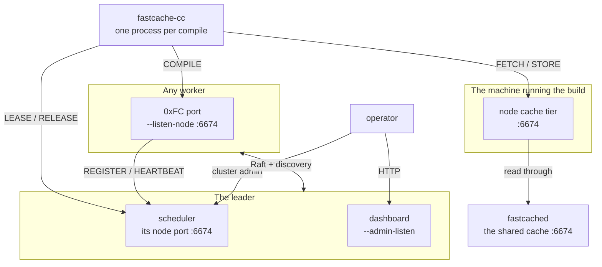
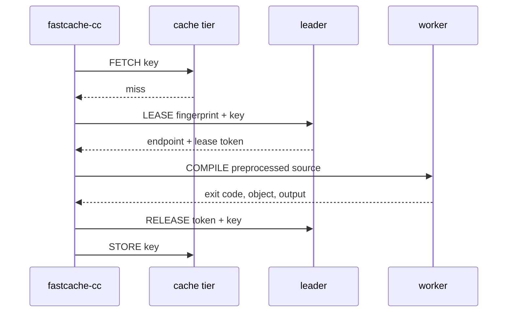

# Cluster communication

Every connection a compile fleet makes: who opens it, where it lands, how often,
and what it carries.

The page has two halves, and they are for different readings:

- **[One compile, as the fleet sees it](#one-compile-as-the-fleet-sees-it)** —
  follow a single compile request across the machines it touches. Read this to
  understand what `fastcache-compile-node` actually does.
- **[Every connection](#every-connection)** onward — the topology, the cadences,
  what to open on a firewall, and what to check when a leg stops flowing.

Two neighbouring pages tell adjacent stories, and this one deliberately does not
repeat them. [How it works](../how-it-works.md) follows one compile from the
**client's** side — how the key is derived, what direct mode skips, what a hit
reproduces. [Distributed compilation](../getting-started/distributed-compilation.md)
is how to set a fleet up. This page is the fleet's own side: what each machine
decides, on what evidence, and what it says to whom.

---

## What each program decides

Three programs, and the useful way to hold them apart is by the decision each one
owns. No decision below is shared, and none is made twice.

| Decision | Made by | On what evidence |
|---|---|---|
| Is this compile a cache hit? | `fastcache-cc`, the client | The key it derived from the preprocessed text, the arguments and the compiler's identity |
| May this compile run on another machine, and which one? | The **leader** node's scheduler | What the fleet's heartbeats have told it: toolchains, free slots, keys already in flight |
| Which compiler actually runs? | The **worker**, from its own `--toolchain` configuration | The fingerprint the client named — which selects a compiler the worker already trusts, never one the client supplies |
| What gets stored in the cache? | `fastcache-cc`, the client | The compile it just watched succeed. A worker is given no cache credential and never stores |
| Who leads? | Consensus, across the schedulers | A Raft election. A lone scheduler is a cluster of one and elects itself |

The last column is where the safety comes from. A client cannot name a program
for a worker to run, and a worker cannot put anything into a cache other machines
read. Both restrictions are what make it reasonable to leave dispatch switched on
across a fleet.

## The whole fleet in one picture


```mermaid
flowchart TB
    cc["fastcache-cc<br/>one process per compile"]

    subgraph here["The machine running the build"]
        tier["node cache tier<br/>:6674"]
    end

    subgraph lead["The leader"]
        sched["scheduler<br/>its node port :6674"]
        admin["dashboard<br/>--admin-listen"]
    end

    subgraph work["Any worker"]
        comp["0xFC port<br/>--listen-node :6674"]
    end

    shared["fastcached<br/>the shared cache :6674"]
    op["operator"]

    cc -->|"FETCH / STORE"| tier
    cc -->|"LEASE / RELEASE"| sched
    cc -->|"COMPILE"| comp
    tier -->|"read through"| shared
    comp -->|"REGISTER / HEARTBEAT"| sched
    work <-->|"Raft + discovery"| lead
    op -->|"cluster admin"| sched
    op -->|"HTTP"| admin
```

Those are **roles, not machines**. One host commonly holds several: a developer's
laptop runs the client and a cache tier; a small fleet's leader is also a worker;
a single node is all of them at once and talks to itself over loopback.

---

## One compile, as the fleet sees it


```mermaid
sequenceDiagram
    participant C as fastcache-cc
    participant K as cache tier
    participant L as leader
    participant W as worker

    C->>K: FETCH key
    K-->>C: miss
    C->>L: LEASE fingerprint + key
    L-->>C: endpoint + lease token
    C->>W: COMPILE preprocessed source
    W-->>C: exit code, object, output
    C->>L: RELEASE token + key
    C->>K: STORE key
```

### 1. The client asks a cache

`FASTCACHE_ADDR` decides which one. Pointed at a node's own tier — the default,
and the reason that tier exists — a **local hit never leaves the machine**. A
local miss makes the node read through to whatever `--upstream` names, and
populate its own tier on the way back, so the second build of the same tree does
not pay the network again.

A hit ends the story here. Everything below happens only on a miss.

### 2. On a miss, the client asks the leader

Only the leader can answer. A follower refuses with `not-leader` and names the
leader's scheduler address, because a follower's registry holds whatever
registered against *it*, which is not the fleet. A learner, which runs no
scheduler, answers the same way.

For the client that refusal is an instruction: it asks the endpoint the refusal
names, up to two hops. A `not-leader` naming nobody (an election in progress, or
a leader gone silent) means a local compile, as every other refusal does, and so
does one still naming an endpoint after two hops.

### 3. The leader decides from what heartbeats told it

It never asks the workers anything. Every fact it needs arrived on a heartbeat
already, and it checks them in this order:

1. **Is this key already in flight?** If another client holds a lease on it, this
   one is told `already-in-flight` and compiles locally. When a header changes and
   sixty clients miss the same key at once, one job is dispatched and fifty-nine
   are spared — that is the ordinary shape of a miss on a shared cache, not an
   exotic one.
2. **Which workers registered this toolchain?** The fingerprint must match
   **byte for byte**. No match is `no-worker`, which is a configuration problem
   rather than a capacity one.
3. **Which of them has the most free slots?** Ties break on utilization. Free
   slots rather than fewest running jobs, because counting jobs treats a 64-slot
   server and a 4-slot laptop as the same box and sends work to the smallest
   machines first.

Duplicate suppression being asked **before** capacity is why a busy fleet answers
`already-in-flight` for a key it is already building, rather than `no-capacity`.
Both are true; only one of them tells an operator what to do.

### 4. It grants, or it refuses

A grant is three things: the worker's endpoint, a **lease token**, and what that
worker can decompress. The last one saves a round trip — the client is about to
send a multi-megabyte payload and would otherwise have to guess or give up
compressing it.

!!! info "The lease token is signed, and what it covers is the point"

    The token is not a serial number. It is base64 text carrying the granted
    worker's endpoint, the toolchain fingerprint, the object key, an absolute
    expiry and the id of the scheduler that issued it, plus an **Ed25519 signature**
    over all of them made with that scheduler's own identity key
    ([#178](https://github.com/LASTRADA-Software/fastcached/issues/178)). A worker
    checks it against the cluster's *roster* — its voters and their keys, as the state
    the worker's own consensus applied records them — so a grant is good only while the
    machine that signed it is an unrevoked voter.

    **The endpoint is inside the signature, and that is the whole reason the token
    has a shape at all.** A signature over "somebody may compile" is a signature that lets
    a token captured on the way to one machine be replayed against every other
    machine in the fleet. This is the same rule LAN discovery follows, where the
    signature covers the `(node, endpoint)` pair.

    The expiry carries **five minutes of slack**, because not every machine in a
    fleet is NTP-managed and an unsynchronised clock is minutes out, not seconds.
    It bounds how long a leaked token is worth replaying and **nothing else** — a
    worker's slot count and in-flight byte budget are what bound what it will run,
    so an unexpired lease is not a promise that the scheduler still holds capacity
    for it.

    Every scheduler signs: a scheduler runs consensus, so it always holds an
    identity key, and there is no unsigned grant any more.

    The worker **verifies** it — see
    [The lease token, and what it buys](#the-lease-token-and-what-it-buys).

A refusal is one of four, and they are counted apart on purpose:

| Refusal | What it means | What to do |
|---|---|---|
| `no-worker` | Nobody in the fleet has this toolchain | Fix a toolchain mismatch |
| `no-capacity` | Every matching worker is full of this fleet's own work | Add machines |
| `withdrawn` | Matching workers have pulled their capacity — busy with something else, or out of scratch | Nothing to buy; look at those machines |
| `already-in-flight` | Somebody is building this exact key right now | Nothing. It is working |

Adding those four together hides all of them.

### 5. The client dials the worker directly

**The leader is not in this path.** It never sees the translation unit, never
relays a byte of it, and is not a bottleneck on payload size. It handed out an
address and went back to answering other clients.

The client sends preprocessed text — no headers to ship, no sysroot to replicate
on the worker.

!!! note "A compressed payload declares how big it will get, and that figure is not believed"

    Every bulk payload on this leg travels in a **codec envelope** — a codec byte,
    the size before compression, and the bytes. The receiver sizes its output buffer
    from that declared size, which is exactly why it may not be trusted: it is a
    32-bit number chosen by the sender, with no enforced relation to the compressed
    bytes beside it, and the buffer is *value-initialized*, so the pages are really
    touched rather than lazily reserved. A frame of a few dozen bytes could therefore
    ask a worker for a 4 GiB allocation, and the surface's in-flight byte budget
    charged only the frame length, so it sailed through admission
    ([#241](https://github.com/LASTRADA-Software/fastcached/issues/241)).

    Both ends now refuse a declared expansion above their own request ceiling
    **before decompressing a byte**, answering `payload-too-large` — a reply, not a
    dropped connection, because the frame declared its own length and the link is
    still synchronised. This applies to the worker opening a request *and* to the
    launcher opening a worker's reply: the launcher dialled a worker the scheduler
    named, which is not the same as one it trusts with its address space.

    That ceiling is **per request**, and a worker serves `slots` of them at once, so
    it is only half the answer: `slots` frames each declaring exactly the maximum are
    `slots` times it. The worker's in-flight byte budget therefore charges a request
    the larger of its frame length and its declared expansion, and a request that
    does not fit is refused with `endpoint-busy` — the same code it answers when a
    frame's own length does not fit, and still a reply rather than a close. A
    declared expansion above the *whole* budget is left to the check above instead:
    no amount of waiting would make it fit, and telling a client to come back
    shortly would be an invitation to retry forever.

### 6. The worker compiles it, with a compiler it chose

The job names a **fingerprint**, never a program. The worker maps that to a
compiler path from its own configuration, and refuses a fingerprint it does not
have. This is the single most important rule on the worker's side: a job that
could name its own compiler would make the compile port a remote shell.

Naming the compiler is not the only way to reach one, though — the client's
**arguments** are spliced into the compiler's command line, and several driver
options exist whose whole purpose is to run another program or load code into the
driver: `-wrapper prog,args` runs `prog` around every subprocess, `-fplugin=` and
`-Xclang -load` load a shared object, `-specs=` and `-B` redirect which
sub-programs the driver invokes. None of these carries a path separator, so a
filter that only asks "could this argument name a file?" waves every one of them
through — which is exactly what the worker's old filter did. Because the compile
port carries **no credential** and loopback is admitted unconditionally — that is
by design, so a single node can talk to itself over loopback — any local process
could reach the port and, through such an argument, run code as the node's service
account. The worker therefore vets each argument
against an **allowlist** of accepted flag shapes — the code-generation, language
and diagnostic options a distributed compile actually carries, per driver family —
and refuses anything else, naming the offending flag. An allowlist fails safe: a
flag it does not yet recognise costs one local compile (visible as
`fastcache_worker_jobs_refused_rejected_argument_total`), where a denylist that
missed one flag was code execution
([#240](https://github.com/LASTRADA-Software/fastcached/issues/240)).

The `-f*` family is spelled out flag by flag rather than admitted as a prefix,
which is what makes that guarantee hold for future compiler releases:
`-fmodule-mapper=|program args` makes GCC spawn a subprocess and `-fpass-plugin=`
is Clang's plugin loader, and neither would have been caught by excluding
`-fplugin=` from an otherwise-open `-f` prefix. If a build of yours uses a
code-generation flag the worker does not recognise, it compiles locally and that
counter rises — report it and the flag gets a row; nothing silently degrades.

It is equally trusted with nothing else. The scratch directory, the object path
and the working directory are all the worker's own; it re-checks the arguments it
was sent rather than believing the client filtered them; and it takes only the
*base name* of the source file, sanitized, because a compiler records the name of
the file it was handed and an invented one makes the object gratuitously
different from a locally built one.

It answers with an exit code, the object and both output streams. A non-zero exit
code is a **successful exchange** — the compiler ran and rejected the code — and
the client answers that by recompiling locally to get diagnostics with the right
line numbers.

A worker runs **`slots` compiles at once**, each on its own thread, while the port
goes straight back to accepting. That is the number it registered, so what the
scheduler dispatches against and what the machine actually serves are the same
figure. Until
[#213](https://github.com/LASTRADA-Software/fastcached/issues/213) they were not:
the port served each connection to completion before accepting the next, so a node
advertising thirty ran one, and the busiest reading a saturated fleet could show
was `1 / 30 compiling`. Everything a job touches is derived per thread rather than
per job — the scratch directory above is unique across the compiles running
together, or two of them would build into the same file.

Two refusals are the worker's own rather than the scheduler's four, and both
answer a client that already holds a valid grant:

| Refusal | What it means | What to do |
|---|---|---|
| `no-capacity` | Every slot on this worker is busy | Nothing at once; the client compiles locally. Persistent means the fleet is small |
| `endpoint-busy` | Slots were free but the payloads already being read fill this worker's memory budget | Nothing to buy — more machines would not have helped |

Neither is queued, and that is deliberate: the client has a local compile waiting
either way, while queueing would hide the overload from the scheduler that is
trying to route around it.

Four more are decided **before** the compile, opening the codec envelope the
translation unit arrived in — the check the note in step 4 describes. They are
counted apart for the same reason the scheduler's four are: each names a different
thing to go and do, and the sum of them names none.

| Refusal | Counter | What it means | What to do |
|---|---|---|---|
| `payload-too-large` | `fastcache_worker_jobs_refused_envelope_declared_too_large_total` | The envelope declared it expands past this worker's request ceiling | Nothing honest declares that by accident. Read it as a probe of the port, or as a client configured with a larger ceiling than the worker |
| `unsupported-codec` | `fastcache_worker_jobs_refused_envelope_unsupported_codec_total` | The payload is in a codec this build cannot decode | A packaging difference between two honest machines — a client built with zstd talking to a worker that was not. Every one of these cost a local compile |
| `malformed-frame` | `fastcache_worker_jobs_refused_envelope_malformed_total` | The envelope did not parse, or an uncompressed one disagreed with the bytes beside it | A version skew, or something on the port that is not this protocol at all |
| `malformed-frame` | `fastcache_worker_jobs_refused_envelope_corrupt_total` | The bytes parsed and then did not expand to their declared size | The only one of the four that implicates the transport: a codec version skew, or a link damaging payloads |

The last two share a wire code and do not share a counter, which is the split
working rather than an inconsistency. `malformed-frame` is all the *client* can act
on — it compiles locally either way — while "your framing did not parse" and "your
bytes did not expand" send an *operator* to two different places.

Only the worker counts these. The launcher opens an envelope too, on the reply a
worker sends back, and refuses it by the same rules — but it has no metrics sink,
a local compile to fall back on, and its own log to say so. The worker is the
machine an operator scrapes.

### 7. The client hands the lease back

On **every** path out of the compile: an object built, a worker that refused the
job, a worker that could not be reached. The leader frees the key and decrements
that worker's in-flight count.

This is a second connection to the scheduler, not the one the grant arrived on —
that port sweeps a connection idle for five seconds, and a compile is longer than
that.

Expiry exists as the safety net for a client that **died** (a `Ctrl-C` on a
build), not for one that forgot. It is ten minutes by default, which is why a
lease left to expire is visible: the key stays marked in flight, and every other
client that wants it is told `already-in-flight` for that whole window. The
dashboard's *Leases outstanding* table is where they show up, oldest first.

### 8. The client stores the object

Not the worker. A store is trusted today because whoever stored it compiled it
themselves — the worst they can do is poison their own key space with something
they would have got anyway. If workers stored, one rogue worker could poison keys
that every other machine fetches.

If the store goes to a node's tier, that tier writes locally **first** and then
offers the object upstream. The local write is the one that must not be lost; the
upstream is best-effort, and a shared cache that cannot be reached costs the fleet
an entry and this machine nothing.

### 9. What got recorded

Two different records, kept by two different parties:

- **The leader** counts the dispatch outcome — granted, or which of the four
  refusals — because it is the only party that saw the decision.
- **Every node** samples its own figures once a minute, whether or not it leads,
  and hands its closed buckets to the scheduler on the heartbeat it was going to
  send anyway. Nothing extra is dialled.

That split is why the fleet's history survives an election. A leader elected this
morning does not show charts that start at breakfast; it fills the earlier windows
from what the machines handed over. Those backfilled windows show `null` rather
than `0` for the fleet-wide series, because no machine can answer for a dispatch
outcome and a zero drawn there would be a refusal count nobody measured.

---

## Every connection

The whole system, one row per leg. Consensus and discovery are on by default on every
node; dispatch is on once the client knows where the scheduler is; the `--upstream` leg
and the dashboard are off unless configured.

| Opened by | Answered by | Port | When | Carries |
|---|---|---|---|---|
| `fastcache-cc` | a cache — `fastcached` or a node's `--listen-node` | `FASTCACHE_ADDR`, default `127.0.0.1:6674` | once per operation | `FETCH`, `STORE` |
| `fastcache-cc` | the leader's scheduler, or this PC's own node, which redirects to it unless it leads | `FASTCACHE_SCHEDULER`, the leader's node port or this PC's own, `:6674` by default | on a cache miss, when dispatch is configured | `LEASE` |
| `fastcache-cc` | the worker named in the grant | whatever that worker advertises, which defaults to its `--listen-node` surface | once per dispatched compile, held for its duration | `COMPILE` |
| `fastcache-cc` | the scheduler that granted the lease | `:6674` | a **second** connection, on every path out of the compile | `RELEASE` |
| a **node** | the leader's scheduler | where its formation record says the fleet's voters answer, `:6674` by default | `REGISTER` once per toolchain, then `HEARTBEAT` every **20 s** | capacity, load, and its closed history buckets — after a handshake proving the node's identity key, with every frame sealed |
| a node | the shared cache | `--upstream`, `:6674` | once per operation, best-effort | `FETCH`, `STORE` — **the only leg that carries a credential** |
| a node | a voter | `--listen-raft`, `:6680` by default; a learner listens on none and dials every voter, and both ends speak on that one connection | long-lived; the leader speaks every **50 ms** | consensus, after a handshake proving each end's identity key, with every frame tagged. Its own framing, not the cache protocol |
| a node | the local segment | `--discovery`, UDP `:6681` by default, plus a per-node reply port | a beacon every **15 s** | who is here and which fleet it is in, then a challenge and a proof |
| an operator | the leader's scheduler | `:6674` | on demand | `CLUSTER-STATUS`, `-SET`, `-FORGET`, `-ADMIT`, and the enrollment verbs |
| a browser or scraper | a node's `--admin-listen`, or `fastcached`'s `--metrics` (default `:9259`) | as configured | on demand | HTTP: `/fleet`, `/fleet.json`, `/metrics`, `/healthz` |

Every number in that table is a real default, read from `NodeSurfaceTable()` — the table
the node binds from and `--print-surfaces` prints — so a node with no configuration opens
exactly three:

| Port | Protocol | Surface | Opened by |
|---|---|---|---|
| `6674` | TCP | the node's `0xFC` port (`--listen-node`): the cache verbs for this machine, the compile verbs, the scheduler where the node's mode serves it, enrollment and the node proof | every node |
| `6680` | TCP | consensus (`--listen-raft`) | every node whose mode listens: solitary, pending and voter. A **learner opens no consensus port**: it dials every voter itself, and the voter writes to it on that connection |
| `6681` | UDP | discovery's beacon socket (`--discovery`), shared by every node on the machine | every node, beside consensus |

plus discovery's **reply** socket, UDP on a port the kernel chooses at every start unless
`--discovery-reply-port` pins it — where peers' challenges and proofs arrive. The scheduler
is whichever node leads its cluster, which a first start's does, and it is answered on
`--listen-node`, beside the cache and compile verbs, rather than on a port of its own.

The node port answers `COMPILE` as well, and it is the only port that does — the
dedicated compile listener was retired once this one could carry the verbs. So the
number this machine advertises to the fleet describes all of it, and it is the same
number a client is handed in a lease and the same number you open in a firewall. See
[Install](../getting-started/install.md#distributed-compilation) for the
port summary, and
[the compile-cache protocol](../protocols/compile-cache.md) for the verbs.

### Nothing dials a client, and nothing dials a worker except a client

Worth stating outright, because every one of these surprises somebody:

- **Workers dial the scheduler.** The scheduler never dials a worker — not to
  check on it, not to dispatch. It answers, records, and hands out addresses.
- **Clients dial workers.** The compile payload goes straight from the machine
  that has the source to the machine that will compile it.
- **Nothing ever dials a client.** `fastcache-cc` opens connections and listens on
  nothing at all.
- **Only consensus has nodes dialling each other**, and only voters are dialled: a
  learner — a laptop behind NAT, a VPN or a closed lid — dials every voter, and nobody
  dials it.

So a worker needs no inbound rule for the scheduler, a learner needs none for consensus,
and a client needs none for anything.

### Each surface answers its own verbs and refuses the rest

A worker answers `COMPILE` and nothing else. `fastcached` answers the cache verbs
and nothing else. A node's cache tier answers `FETCH` and `STORE` and nothing
else.

Anything else is refused as a **reply** — never by dropping the connection, which a
caller cannot tell from a dead host. A verb served on a *different* port is
`dispatch-not-permitted`, naming where it should have gone; a verb the surface does
not **implement** at all — `AUTH`, on all three of a node's — is `unknown-opcode`,
which is what a client is built to step over. `fastcached` is the exception: it does
implement `AUTH`, and answers a bad credential `unauthenticated`. If something is
pointed at the wrong port, it will say so.

## What a worker tells the scheduler

`REGISTER` carries **one** toolchain, so a node serving three compilers registers
three times. The scheduler keys those on (toolchain, endpoint), so they are three
rows on the dashboard's *Workers* table — but they heartbeat one machine-wide
in-flight count, so they fill up together and behave as one machine rather than
advertising three times the hardware.

The dashboard's *Machines* table is the grain to total a fleet over. Summing
*Workers* reports a fleet several times the size of the one you own.

Then a `HEARTBEAT` every **20 seconds**, carrying:

- **What the machine is** — cores, memory, node class, reserved cores, the
  software version it is running, its cache budgets.
- **What it is doing** — CPU busy, available memory, free scratch space, what its
  cache holds, and how many jobs are in flight.
- **Its closed history buckets**, for the fleet charts.

A worker is dropped after **90 seconds** without one. The gap between 20 and 90 is
deliberate and asymmetric: a heartbeat that arrives early costs a few bytes, while
one that arrives late costs that machine its place in the fleet until it
re-registers.

A version is refreshed on re-registration, so **an upgrade looks like a restart**
— that is how the dashboard's version column keeps up.

!!! note "A single node dials itself"

    A first start leads a cluster of one, so its own worker registers with its own
    scheduler, at the endpoint the node serves (loopback, for a wildcard bind). Nothing is
    special-cased: the same register and heartbeat
    go over loopback, and everything on this page still applies with the
    round trips costing nothing.

### The endpoint a registration names is not verified

`REGISTER` carries the `--advertise` endpoint, and the scheduler hands it to
clients verbatim — they dial it and send the whole preprocessed translation unit.
That endpoint is **not** checked against the address the registration arrived
from ([#242](https://github.com/LASTRADA-Software/fastcached/issues/242)). A
registration therefore asserts where a toolchain's work should be sent, and the
only thing standing in front of it is membership, which is itself a source-address
check ([#180](https://github.com/LASTRADA-Software/fastcached/issues/180)).

What exists today is a **measurement**, not a control. When an endpoint's host
differs from the caller's, the registration is still accepted and the scheduler
counts it:

```
fastcached_dispatch_worker_endpoint_mismatch_total
```

alongside an **info** line naming both addresses and the toolchain, written for the
first twenty mismatches and then left to the counter. Info rather than a warning
deliberately: on a fleet that advertises DNS names this is every registration and
nothing is wrong, and a signal that fires permanently on a correct deployment is one
operators learn to filter.

**A rise here is not by itself a fault.** Comparing hosts refuses far more than it
protects, and the legitimate mismatches are the common shapes rather than the
exotic ones:

| Shape | Why it mismatches |
|---|---|
| `--advertise` names a DNS host | The scheduler cannot resolve it — it is I/O-free, and a resolver is not something a security decision may depend on |
| A single node dialling itself | It registers over loopback while advertising an address clients can route to — the setup on the getting-started page |
| Multi-homed worker | It reaches the scheduler on one interface and serves clients on another |
| NAT or a VPN | The scheduler sees the translated or overlay address |

So the counter answers a question nobody can currently answer: how often endpoints
legitimately differ on a real estate. That number decides whether a stricter rule
is deployable at all. Closing the hole properly means a credential rather than an
address comparison — the mechanism
[cluster discovery](../getting-started/cluster-discovery.md) already uses.

Until that lands, a fleet's boundary is the one described under [what is
authenticated, and what is not](#what-is-authenticated-and-what-is-not): admit only
machines you operate, and do not put a scheduler where machines you do not operate
can reach it.

## What the cluster says to itself

Both of these are on by default, and neither carries any compile traffic.

**Consensus** runs on every node: a first start founds a cluster of one, and the node's
**mode** — read from the formation record in its state directory, never from a flag —
decides whether it binds `--listen-raft` (`6680`): solitary, pending and voter nodes do, a
learner does not and dials every voter instead. An empty `--listen-raft=` runs none, which
only a cache-only node (`--slots=0`) may do. Connections between peers are long-lived; the leader speaks to each follower every
50 ms or so, and a follower that hears nothing for a few hundred milliseconds
starts an election. It is a private binary protocol, distinct from the compile
cache's — pointing a cache client at it gets nothing useful.

**Every consensus connection proves which member is at each end before a single
message is read**, each with its own identity key, checked against the key the cluster
records for each member. That is the one leg of this page whose every byte is
authenticated; what it checks and how a failure shows is under
[Raft peer authentication](#raft-peer-authentication). The same key signs every lease a
member issues and is what a member proves on the node port; there is no shared secret any
member holds ([#178](https://github.com/LASTRADA-Software/fastcached/issues/178)).

That cadence is the reason the consensus port wants a network that is not
congested. Nothing breaks if it is — an election settles again — but leadership
that moves repeatedly costs a scheduling interval each time and leaves gaps in
the dashboard's charts.

**Discovery** runs beside it, and is how a machine with no configuration finds a fleet
to join. A node broadcasts a beacon — its fleet summary, signed when challenged — every 15
seconds, to every eligible interface's directed broadcast on port `6681` unless
`--discovery` names one address, and answers challenges on a
separate per-node port — separate because a beacon port is shared by every node on
the segment, and only one socket sharing a port receives a unicast. That port is
kernel-chosen unless `--discovery-reply-port` pins it, which is what a site with a
host firewall scoped to the beacon port alone has to open.

Discovery **admits nobody**
([#178](https://github.com/LASTRADA-Software/fastcached/issues/178)). It reports which
members proved the key the cluster holds for them, and hands another fleet's proven
summary to formation, which decides whether this machine asks to join it. Admission is an
operator's act — an `--enroll-approve`, or a time-boxed `--enroll-auto-approve` — or
`--cluster-admit ...@<key>`. See [Cluster discovery](../getting-started/cluster-discovery.md)
for the exchange and the whole zero-config sequence.

## Who a node admits

The scheduler verbs and the compile verbs ask membership of a caller, and the answer is
about the caller's **machine**, never its address. One fold decides it, with five
participants:

| Route | What admits | Set by |
|---|---|---|
| Loopback | A process on this machine, presenting nothing | always on |
| A proven key | A node that signs this connection's handshake with an identity key the roster holds live | the cluster, by admitting the key |
| A machine ticket | A client that presents a ticket signed by such a key, for this endpoint, once | the cluster, by admitting the key |
| `--fleet-open` | Any caller at all | the operator, on this node |
| A revoked key | Nobody: it **refuses**, and outranks every route above | `--cluster-forget` |

The **cache tier is not one of them** and asks a different question entirely —
"is this caller on this machine" — which no route can answer and none is consulted
for. That is [#287](https://github.com/LASTRADA-Software/fastcached/issues/287), below.

**An address admits nobody but this machine.** A machine on a VPN, behind NAT or on
DHCP has no address worth listing, so every machine is admitted by the key it holds in
its state directory: a node proves it, and a machine that only asks — a laptop, a CI
runner running `fastcache-cc` — has its own node mint a ticket per exchange. Either way
the machine's key is admitted to the cluster once, as a member or as a learner that never
votes, and every node admits it from whatever address it dials. See [a machine that only
asks](../tools/fastcache-compile-node.md#a-machine-that-only-asks-tickets).

Two rules that have not moved:

- **This machine is always admitted**, with nothing to present. A node that refused its
  own operator's builds would be a fleet that looks configured and serves nobody
  locally.
- **An empty policy refuses the network.** A node with no roster and no `--fleet-open`
  admits itself and nothing else, rather than becoming an open scheduler by omission.
  `--fleet-open` admits every caller and is a decision somebody makes, never what an
  unset field decays to.

The node's ready line states which of these it is, so an operator sees the policy at the
one moment they are watching, and `fastcache-cli explain-admission` answers the same
question about any one connection or machine.

### Revocation

**`--cluster-forget=<id>` revokes the machine's key, and that reaches everything.** The
record leaves the cluster and the key it held is revoked in the same entry
([#1555](https://github.com/LASTRADA-Software/fastcached/issues/1555)). Every node asks
the replicated keys on every request, so the forget reaches every node as it applies the
entry — every surface, every connection already open, from any address, including this
machine's own loopback — with nothing to edit or reload on any machine. A connection that
presents the revoked key, by a proof or by a ticket, is refused as the forgotten machine's
on every later request, and counted apart from a stranger's
(`fastcache_node_requests_refused_key_revoked_total`), because *a machine an operator
removed* and *a machine nobody ever admitted* are opposite diagnoses. Only a **new** key
brings the machine back: re-admitting the key it still holds is refused by name.

**Removal used to fail open, and a key is why it no longer does.** When admission was an
address list, the list lived on every node that named the host, and the one an operator
forgot to edit went on serving it with nothing reporting it — admission succeeding is the
ordinary case. A key lives in one replicated state, so there is no second copy to forget.

**Under `--fleet-open` the forget still bites, on the key.** The flag says *I have not
enumerated who may use this fleet*, and a forget names one machine, so a connection that
presents the revoked key is refused there too. What such a node still serves is a caller
presenting NOTHING — the flag admits anonymous callers by design, and a forgotten machine
that presents nothing is one of them. Closing a node to those is dropping `fleet_open:` from
its file and `SIGHUP`. A forgotten machine's ticket on an open node is refused where a
stranger's is served, so there its holder can tell that the machine was forgotten.

Every worker a reload can reach checks its leases. A worker runs consensus, either its own
fleet's or a fleet it joined as a learner, and one that runs none is refused at startup, before
there is anything to reload. (`--listen-raft` is not reloadable, so no reload can close it
either.) A reload still asks what the running worker actually BUILT: if its lease check
verifies nothing, a reload that would newly admit a remote host is refused by name and nothing
is applied. That way a path nobody foresaw cannot open an unchecked compile port. Narrowing is
always allowed.

**It does not contradict the rule that absence from `ClusterState` is not removal.**
That rule is about *absence* — a member the state has never named, which a node must
not read as a removal. An explicit `--cluster-forget` is a positive act, and it revokes
the key the removed record held.

## The node's own cache, and the shared one

A node's tier is two independent halves, and the flags are separate because the
questions are:

- **`--listen-node`** — where it *answers*, defaulting to port `6674` because that
  is where `fastcache-cc` already looks. The wildcard by default, because that one
  listener also answers the fleet's scheduler and compile verbs; this tier holds the
  machine's own build output, and its verbs answer this machine alone whatever the bind.

    It is served to **this machine and to nothing else**, always
    ([#287](https://github.com/LASTRADA-Software/fastcached/issues/287)). Not to a
    machine the cluster admitted, by proof or by ticket: a peer that may spend this
    machine's CPU is not thereby entitled to read everything it has ever compiled. The rule belongs to the **verb**, so
    widening the bind does not widen who is served, and every off-box `FETCH` is
    refused `not-a-member` and counted in
    `fastcache_node_cache_requests_refused_not_local_total`.

    A cache several machines share is `--upstream` pointed at a `fastcached`. That
    one is shared infrastructure somebody operates and serves non-members on
    purpose; a node's tier is a developer's private one, and the two are different
    things that happen to speak one protocol.
- **`--upstream`** — the shared `fastcached` it *reads through to*, if any. May be
  empty, which is an ordinary configuration rather than a broken one.

The rules between them, complete:

- A **local hit never consults the upstream.** Keys are content-addressed, so a
  key that matches names the same object; there is nothing to revalidate.
- A **local miss populates the local tier** from the upstream, or the second build
  is as slow as the first.
- A **store writes local first**, then offers upstream best-effort.
- An **unreachable upstream is a miss**, never an error. A build must not be able
  to fail because a cache was down.

On a machine running both `fastcached` and a node, one of them loses the `:6674`
bind, and a node that loses it refuses to start. Run one of them — the node answers
every verb the daemon does — or give one of them a port of its own.

## The operator's own connections

**Cluster administration** goes to the scheduler port, and is answered by the
**leader** and only to a **member**. Ask a follower and it refuses with
`not-leader`, naming where to ask:

```sh
fastcache-compile-node --scheduler 10.0.0.1:6674 --cluster-status
```

**The dashboard and metrics** are HTTP, on a node's `--admin-listen` (off unless
set) or `fastcached`'s `--metrics` port. `/fleet` and `/fleet.json` are answered
by the leader only; a follower replies `503` **naming** the leader rather than
redirecting, because where a dashboard is served is local configuration that
nothing replicates, and a guessed URL is one your browser cannot use.

## What to open on a firewall

**Ask the binary first.** `fastcache-compile-node --print-surfaces`, given the flags
that machine actually runs with, lists every port it would bind and the protocol of
each, then exits without opening anything:

```console
$ fastcache-compile-node --print-surfaces --listen-node 6675 \
      --advertise 10.0.0.7:6675 --fleet-open \
      --node-id n1 --listen-raft 6680 --raft-self 10.0.0.7 \
      --discovery 10.0.0.255:6681
mode: solitary (no cluster minted yet; the first start mints one)

node              0.0.0.0:6675  TCP
admin             -             not served; set --admin-listen
raft              0.0.0.0:6680  TCP
discovery beacon  0.0.0.0:6681  UDP
discovery reply   0.0.0.0:*     UDP, port chosen by the kernel at bind

dialled at:
  consensus endpoint  10.0.0.7:6680  -- what peers DIAL; the raft row above is what this node BINDS

state directory:
  <state directory> (per-user: this process is not privileged, so it keeps its identity apart from the machine's service)

fleet:
  cluster    none minted yet
  pinned to  none (--fleet-id unset: discovery is trust-on-first-use)

notes:
  …
```

`<state directory>` stands for the path the run printed, and `…` for the notes left out.

!!! note "Why the invocation carries more than the surfaces it prints"

    `--print-surfaces` prints the map for any configuration and then judges it by the
    **startup policy rules**: one the node would refuse exits 2, naming the rule, after
    the map. So a transcript worth copying is a command the node would actually accept.
    The rules that apply to the flags above each refuse a configuration that would start
    and silently not work: consensus needs an address its peers dial (`--raft-self`, or
    this machine's resolved name), and membership needs an `--advertise` peers can dial.
    (`--listen-raft` needed a `--cluster-key-file` as well, and
    `--discovery` a key rule of its own, until
    [#178](https://github.com/LASTRADA-Software/fastcached/issues/178) moved every proof to
    each node's identity key.) An earlier version of this transcript omitted the five that
    applied then, and the binary refused it with exit 2 — the printed table was right, the
    invocation was not
    ([#807](https://github.com/LASTRADA-Software/fastcached/issues/807)).

The node opens its ports from the same table that prints, so the list and the sockets
cannot disagree — which is the point of generating a worksheet rather than
transcribing one. It also prints a `notes:` block, which is where the two facts a
column cannot carry live: that a systemd `.socket` unit is not yet served on the
node surface — an inherited descriptor cannot be adopted onto the reactor yet, so an
activated worker is refused at startup rather than left listening on nothing — and
that `--discovery`'s address is where beacons are *sent* while its sockets bind the
wildcard. [The node's own page](../tools/fastcache-compile-node.md#every-port-it-opens)
carries the full four-surface table.

**On Windows, `--install-service` opens them for you.** It creates one inbound rule
per surface the registered configuration binds beyond loopback — the rows
`--print-surfaces` prints, walked from the same table — admitting
`fastcache-compile-node.exe` running as its service, on every network profile, and
`--uninstall-service` removes them. The discovery reply socket always gets one: exactly
its UDP port when `--discovery-reply-port` pins it, and otherwise — the default, a port
the kernel chooses at bind — a rule admitting any local UDP port, named `… discovery-reply
udp/any`. That rule is still scoped to the program and its service, so what it exposes is
only the UDP sockets this program opens, which is discovery alone.
`--firewall-allow=<address[/prefix]>` narrows who may connect, on that rule as on the others. `fastcached`'s own `--install-service` does the same for its cache listeners
and metrics endpoint. On macOS the install opens nothing and names the surfaces that
need a rule of your own; the tables below are that worksheet, and the one for any
firewall between machines.

What to open is decided by each machine's **mode**, which the fleet sets as it forms,
rather than by which flags it was given — the same three ports on every machine, with one
difference for a learner:

| Machine | Inbound | From |
|---|---|---|
| Every node | `6674/tcp`, its `--listen-node` port | every client that dispatches, and every other node (registrations, heartbeats, enrollment, the shared cache's verbs on the machine the setting names) |
| A voter — the founder, and every machine an operator promoted | `6680/tcp`, its `--listen-raft` port | every other member, learners included: they dial it |
| A learner — every other machine | **nothing for consensus**: it opens no `6680` and dials every voter itself | — |
| Every node | `6681/udp`, the `--discovery` port | the local segment |
| Every node | its `--discovery-reply-port` udp, or — unpinned — any UDP port, scoped to the program | the local segment |
| A machine running `fastcached` for `--upstream` | its cache port, `6674/tcp` by default | every node that reads through to it |

Clients need no inbound rule at all, and no machine needs one for a connection it only
dials. A solitary or pending node opens `6680` like a voter, because until it joins a fleet
it is the voter of its own: a laptop that will become a learner opens it only until its
approval. Discovery peers that are *seen and never admitted* is the signature of a firewall
passing the beacon port and dropping the reply port.

**One machine** needs nothing open: the client, the node and its tier talk over loopback,
and a machine whose name reaches only itself confines its consensus to loopback and asks to
join nobody (`host-name-reaches-only-this-machine`).

**The admin surface is absent from all three on purpose.** `--admin-listen` is off
unless set, and a bare port binds loopback — so it needs no rule until you widen it,
and widening it is what makes `--dashboard-token-file` required. If you did widen it,
`--print-surfaces` shows the address rather than a `-`, and that address is the one to
open.

!!! warning "Keep the node port off any network you would not run a compiler for"

    The scheduler and the compile verbs answer on the same `--listen-node` port as the
    cache verbs, so that port faces whatever network the fleet does. The cache verbs answer
    this machine alone whatever the bind
    ([#287](https://github.com/LASTRADA-Software/fastcached/issues/287)), but the port is
    the surface that makes a compiler **run** on this machine: scope its rule with
    `--firewall-allow` where the fleet's machines share a range.

## When a leg is not flowing

| What you see | Which leg | What to check |
|---|---|---|
| A worker never appears in the fleet at all | node → scheduler | Is the worker's key admitted to the cluster? A `REGISTER` from a key the cluster does not hold is refused, and `fastcache_scheduler_requests_refused_node_identity_required_total` or `fastcache_node_proofs_refused_unknown_key_total` climbs on the scheduler. Does `--advertise` name an address others can reach? |
| Workers appear, then vanish, then reappear | node → scheduler | Heartbeats are not arriving inside 90 s. On the dashboard, registrations and expiries both climbing is this, not a growing fleet |
| Every compile happens locally, build stays green | client → scheduler | Is `FASTCACHE_SCHEDULER` set? Is this machine admitted — does a node run here, at `FASTCACHE_ADDR`, to mint its tickets, and is that node's key admitted to the cluster? `fastcache-cli explain-admission <machine>` on the scheduler says. Run with `FASTCACHE_VERBOSE=1`, which names the refusal |
| A lease is granted, then the compile runs locally anyway | client → node | The worker refused the client `not-a-member`. Is that worker a member of the fleet, so the state it applies admits the machines the cluster admitted? Or give it `--fleet-open`: membership gates its compile port, not only a scheduler's. The scheduler's counters stay correct and flat — the lease *was* granted — so look at the **worker**: its ready line names who it admits, and `fastcache_worker_jobs_refused_not_a_member_total` counts each turned-away client ([#235](https://github.com/LASTRADA-Software/fastcached/issues/235)) |
| `no-worker`, though the toolchain looks identical | client → scheduler | Fingerprints must match byte for byte. Compare the node's `serving …` startup lines against the client's |
| `/fleet` answers `503` | operator → dashboard | You are asking a follower. The reply names the leader |
| Peers are seen but never authenticated | node → segment | The reply port is being dropped while the beacon port passes. Scope the rule to the program, or pin `--discovery-reply-port` and open that port; on Windows, run `--install-service` again, which opens it. If `fastcache_discovery_proofs_refused_unknown_key_total` climbs instead, the handshake completes and the key is one the cluster does not hold: discovery admits nobody, so enrol the machine or `--cluster-admit` it under the key the warning names |
| The cluster elects, then re-elects, repeatedly | node → node | Consensus traffic is not getting through promptly, or a member is unreachable. The role-change log lines carry the term |
| A consensus member never joins, and the others' `fastcache_raft_peer_connections_refused_proof_total` climbs | node → node | The key it proves is not the one the cluster records for it. Its own `fastcache_raft_peer_dials_ended_by_acceptor_total` climbs for the same connections. Compare its `--print-identity` with the cluster's record, and admit it under the key it holds -- `--enroll-approve`, or `--cluster-admit ...@<key>` |
| `fastcache_raft_peer_dials_refused_wrong_target_total` climbs | node → node | An address this node has for one member now answers as another: a node moved, or two swapped addresses. The log line names both ids; the other end counts `..._connections_refused_wrong_target_total` |
| `..._refused_own_id_total` climbs on either end | node → node | Two machines answer to one id — a copied `--cluster-dir` or a duplicated `--node-id`. The address in the accepting node's log is the second machine |
| `fastcache_raft_peer_dials_refused_timeout_total` climbs after an upgrade | node → node | The peer runs a build from before the handshake, which never sends a challenge. Consensus members upgrade together; see [Raft peer authentication](#raft-peer-authentication) |
| One machine's cache hit rate is zero | node → upstream | Is `--upstream` set on that node, and reachable? An unreachable upstream is indistinguishable from a miss by design |

## What is authenticated, and what is not

--8<-- "node-credential-gap.md"

A fleet's boundary on those surfaces is **network reachability plus membership**, and
membership is a machine's key: a proof, or a ticket signed with it. No source address
admits anybody but this machine, so a spoofed one buys a stranger nothing. A ticket
travels in the clear, which is why it names one endpoint, lives a minute and is spent
once; `--fleet-open` drops the check altogether. For anything beyond a trusted build
network, put mTLS in front of every port.

The credentials that are real and unaffected: `--dashboard-token-file` for the fleet
page, and `fastcached`'s own `--requirepass` for the shared cache. **Each member's own
identity key is real too**: every consensus connection proves it (next), and the scheduler
signs every lease grant with it ([below](#the-lease-token-and-what-it-buys)) — which is
stronger than any shared key: it proves WHICH machine, and removing one is a single
revocation rather than a new key everywhere.

### Raft peer authentication

The consensus port checks, on every connection and before it reads a message, that the
machine at the other end IS the member it claims to be. Anything that can reach
`--listen-raft` used to be able to vote, depose a leader or replicate a log under any
member's name, because each message names its own sender and nothing tied that name to the
connection. Each connection now opens with a handshake, in this order:

1. **The accepting node sends a challenge** — a fresh random nonce and an ephemeral key —
   before it has read anything. It signs nothing for a peer that has not proved who it is.
2. **The dialling node answers with a proof**: its own id, the id of the member it meant
   to dial, a nonce and an ephemeral key of its own, and an **Ed25519 signature** over all
   of that and the challenge, made with its own [identity key](../tools/fastcache-compile-node.md#its-identity-key).
3. **The acceptor checks the signature first**, under the key the cluster records for the
   id the proof claims, and only then the claims. It answers with a **signed verdict** —
   accepted, *you dialled another member*, *that id is mine*, or *your key is revoked* —
   and closes on any refusal.
4. **The dialler checks the verdict's signature** under the key the cluster records for
   the member that answered, before it sends a single consensus message. Both ends then
   derive a session key from the two ephemeral keys, which neither sent, and every message
   after that carries a 32-byte tag under it over a running sequence number and the message.

Each signature covers everything the handshake has carried so far, so nothing on the path
can change one field — least of all an ephemeral key, which would let it share the session
key with each end — and keep the signature.

What that refuses, and what it does not:

- **A machine claiming a member's id it cannot prove** is refused before anything it sent
  is read, so it cannot vote. That includes a former member holding every byte it ever
  held — its own key, the log — claiming another member's id: only that
  member's own key signs as it. It hears nothing either: a member dialling it is refused the
  same way from the other side, and sends it no message.
- **A machine the cluster has removed** — its key revoked — is refused with a signed
  *your key is revoked*, whatever id it claims, so it reports its own removal rather than a
  key problem somewhere else. **Revoking a key closes the connections it proved at their next message**: both
  ends ask the cluster's record of keys again for every message, so a revocation reaches an
  open connection within a heartbeat, and its redial is refused. Nothing on any other
  member changes — no key is rotated anywhere.
- **A recorded connection, replayed later**, fails against a new challenge. **A message
  replayed, reordered, dropped or injected** into a live connection fails its tag, and so
  does one spliced in from another connection, which agreed another key.
- **A message naming a sender other than the member the connection proved** closes the
  connection. The proven id is the one consensus acts on.
- **It does not encrypt.** Log entries — membership, settings — cross in cleartext, as
  before.
- **The address is deliberately not part of the proof.** A node binds the wildcard and
  its peers reach it through `--raft-self` or NAT, so the two ends could never state the
  address identically; a relay elsewhere can only forward messages whose tags it cannot
  make.

**Where the keys come from.** A member's key is what the cluster records for it —
`--cluster-admit` states it after the address (`--cluster-admit=n2=10.0.0.2:6680@<key>`),
and a leader announces its own — and, until the cluster has recorded anything, what the
roster the node started from names: its own alone on a node that founded its cluster, the
approved enrollment roster on one that joined. The cluster's record wins wherever it says
anything, and a key the cluster has revoked stays revoked. A member admitted without a key
cannot be verified. `fastcache-compile-node --print-identity`, run with a node's own flags
and as the account it runs as, mints its identity into its state directory and prints the
line an operator admits it with:

```
node-id n1
public-key 11qYAYKxCrfVS_7TyWQHOg7hcvPapiMlrwIaaPcHURo
cluster-admit n1=10.0.0.1:6680@11qYAYKxCrfVS_7TyWQHOg7hcvPapiMlrwIaaPcHURo
```

**A node running consensus without an identity key does not start**, and no configuration
leads there: a node that runs consensus always has a state directory, and mints its key into
it on its first start. It is decided once, at startup, and never per connection: a node that
quietly ran consensus unsigned would look healthy from both ends while trusting anybody.
The pre-shared `--cluster-key-file` a consensus node once also needed is gone: the leases
and the node port prove identity keys too
([#178](https://github.com/LASTRADA-Software/fastcached/issues/178)).

**Upgrading.** The consensus wire is version 5: it moved to 4 with identity keys (it was 2
with the first handshake, which proved the cluster key, and 3 with learners), and to 5 when
the proof came to state the session direction it asks for, with the session keys derived
per direction. A version 5 node and an older one cannot talk at all — there is no
compatibility mode, on purpose: an older peer proves only the cluster key, or names no
direction for the keys that seal its session, and accepting one would be the fallback the
handshake exists to refuse. A version 4 member is refused at the handshake, by version, and
only the dialling side can see it, because the acceptor challenges first: an upgraded member
dialling an old one counts `fastcache_raft_peer_dials_refused_no_challenge_total`, while an
old member dialling an upgraded one refuses its challenge and closes before a proof, which the
upgraded acceptor counts nowhere. So:

- on the build that introduced it, whose members still named one another with the
  since-retired `--raft-peer`, every member's list was given every other member's
  `@<key>` first — a cluster whose members cannot verify each other does not form;
- then upgrade **all** consensus members together. A mixed cluster shows as
  `fastcache_raft_peer_dials_refused_no_challenge_total` on the new nodes (an older peer's
  challenge is at another version). Their accepting side counts nothing: an older dialler
  refuses the newer challenge and closes before it sends a proof.

**How long a handshake may take.** Five seconds, at either end. An accepting node closes
a connection that has not proved an id by then — before, a connection that sent nothing
held a slot for as long as its socket lived — and a dialling node gives up on an address
that sent no challenge or no verdict, then retries on its ordinary backoff.

**Reading a refusal.** Every refusal has its own counter, on the node that saw it, and the
same misconfiguration usually shows on both ends of the connection:

| You see | On the accepting node | On the dialling node | Meaning |
|---|---|---|---|
| A key never given | `..._connections_refused_unknown_key_total` | `..._dials_ended_by_acceptor_total` | The acceptor holds no key for the id the dialler claims: a machine that is not a member, since every member the roster records holds its key. It cannot sign a verdict for a proof it could not check, so the dialler sees the connection close |
| A member's id, claimed by another machine | `..._connections_refused_proof_total` | `..._dials_ended_by_acceptor_total` | The proof did not verify under the key the acceptor holds for that id |
| A key this node was never given | — | `..._dials_refused_acceptor_key_unknown_total` | The member that answered signed its verdict, and this node holds no key to check it with. Nothing was sent to it |
| An impostor at a member's address | — (it is not a member) | `..._dials_refused_acceptor_proof_total` | Whatever answers there signed its verdict with a key that is not the member's. Nothing was sent to it |
| A removed machine, still dialling | `..._connections_refused_revoked_key_total` | `..._dials_refused_own_key_revoked_total` | Its key is revoked. The acceptor says so, signed; the removed machine needs a new identity and a new admission |
| A removed machine, still answering | — | `..._dials_refused_acceptor_key_revoked_total` | The member at that address signed with a revoked key |
| A key revoked mid-connection | `..._connections_ended_key_withdrawn_total` | `..._dials_ended_key_withdrawn_total` | The connection had proved a key the cluster no longer holds for that member, and was closed at its next message |
| A stale address | `..._connections_refused_wrong_target_total` | `..._dials_refused_wrong_target_total` | Both proved their ids, and the address answers as a different member. The logs name both ids |
| One identity on two machines | `..._connections_refused_own_id_total` | `..._dials_refused_own_id_total` | A copied `--cluster-dir`: two machines holding one private key. The accepting node's log names the second machine's address |
| An old build, or not a consensus port | `..._connections_refused_no_handshake_total` | `..._dials_refused_timeout_total` or `..._dials_refused_no_challenge_total` | The other end does not speak this handshake |
| Something tampering in flight | `..._frames_refused_tag_total` | `..._dials_ended_frame_tag_total` (a learner's two-way session) | A message on a proven connection failed its tag. A correct peer never produces one. Each end counts the direction it reads |
| A message naming another member | `..._frames_refused_sender_total` | `..._dials_ended_frame_sender_total` (a learner's two-way session) | A message whose tag verified named a sender other than the member the connection proved |
| A frame the reader cannot use | `..._frames_refused_unreadable_total`, `..._frames_refused_over_cap_total` or `..._frames_refused_bad_magic_total` | `..._dials_ended_frame_unreadable_total`, `..._dials_ended_frame_over_cap_total` or `..._dials_ended_frame_bad_magic_total` (a learner's two-way session) | A frame at another wire version, one declaring more than the reader buffers, or one that is not this wire at all |

Every series is prefixed `fastcache_raft_peer_`. Refusals before an id is proved are
logged at most once a minute and name only the source address — anything on the network
can provoke them, and an id nobody proved is not worth printing — except a revoked key,
which is named whole, since it is what you match against the revocation you made; refusals
after it name both member ids. The full list, with a description of each series, is on
[the node's page](../tools/fastcache-compile-node.md#what-a-refused-connection-looks-like).

### The lease token, and what it buys

A lease grant is a **signed capability** rather than a serial number: the scheduler
signs the granted endpoint, the toolchain, the object key, an expiry and its own id
with its own Ed25519 identity key
([#281](https://github.com/LASTRADA-Software/fastcached/issues/281),
[#178](https://github.com/LASTRADA-Software/fastcached/issues/178)), and the worker
checks that signature before it decompresses anything, let alone compiles
([#282](https://github.com/LASTRADA-Software/fastcached/issues/282)). A token is
unforgeable, and one minted for one worker does not authenticate against another.

The check costs a job one signature verification over a few hundred bytes, with no
round trip back to the scheduler. It happens **before** the payload is decompressed,
so an unauthorized peer cannot make a worker do the expensive part.

#### The roster a worker checks against

A signature is only as good as the answer to *is this key one of the cluster's
voters, and not revoked*. **Every worker answers it from the state its own consensus
applied** (`StateLeaseRoster`): every machine in a fleet is a member — a voter, or a
learner that applies the replicated state without voting — so the cluster's voters and
its revoked keys are the state it already holds, and nothing has to be handed to it,
certified or renewed.

- **A learner offline for days verifies against the state it last applied**, and catches
  up through consensus when it returns (a snapshot, if it fell behind the leader's
  compaction). A grant from a voter the cluster forgot meanwhile is refused as soon as the
  learner applies the forget.
- **A worker that has heard from no leader its fleet counts for 65 minutes refuses every
  grant**, answered `grant-unverifiable` and counted in
  `fastcache_worker_jobs_refused_lease_isolated_total`: an hour plus the lease clock slack,
  because a worker cut off from its fleet still lists a voter the fleet may have forgotten
  meanwhile. Shorter would refuse legitimate work through a partition that cuts only
  consensus; longer widens that window. It lifts the moment a leader speaks again.
- **A worker whose applied state names no voter yet refuses every grant**, answered
  `grant-unverifiable` too and counted in `fastcache_worker_jobs_refused_lease_no_roster_total`:
  a node that has started or joined but not yet applied its fleet's state.

The certified roster that came before this — endorsements from a majority of voters on
NODE-ANNOUNCE, `--voter-key` anchors, a kept roster file and the `roster-expired` refusal —
existed for a worker that ran no consensus. No such worker exists any more, so all of it was
removed rather than kept dormant.

The refusals reachable at the compile port, each with its own counter, because they
are different things for an operator to do:

| Refusal | What it means | What to do |
|---|---|---|
| `lease-unauthorized` | The token is junk, signed by a key that is no voter the roster names — or signed by one the cluster has **revoked**, which has a counter of its own | Somebody is probing the port — or a machine was removed and is still leasing out work |
| `lease-endpoint-mismatch` | An authentic grant, issued for a different address | This worker's `--advertise` is not what the scheduler registered it under |
| `lease-expired` | An authentic grant, older than its expiry plus five minutes of slack | A clock on one of the two machines is wrong |
| `grant-unverifiable` | This worker can check nobody's grant right now: the state it applied names no voter yet, or it has heard from no leader for 65 minutes | Wait for it to apply its fleet's state, or reconnect it to its fleet; the two causes have counters of their own (`..._lease_no_roster_total`, `..._lease_isolated_total`) |

#### Whether a worker checks at all is a startup decision

**Not a per-request fallback.** A worker with no roster cannot verify, and "no roster,
so skip the check" decided per request is the worst of both: the port is open, every
refusal counter reads zero, and the fleet looks healthy from both ends. So the
decision is made once, before anything is served:

- A node that **another machine could dial** and has no way to check a lease — it
  runs no consensus, so it applies no roster (an empty `--listen-raft=` on a node that
  still runs a worker) — is refused at startup, by name. Both halves have to be true — a node bound to
  loopback answers nobody else whatever the roster or `--fleet-open` say, and
  a node admitting only its own machine escalates nobody however it is bound.
- A node that **nothing else can dial** runs without the check and logs a warning
  saying so, once, at startup. This is the ordinary single-machine install: a
  process on that host already has that host's compiler.

The lease format arrived in one release, and a worker and a scheduler from either side of
it do not understand each other's grants — so a fleet upgrades its schedulers and workers
together.

Fuller treatment in
[Distributed compilation § Security](../getting-started/distributed-compilation.md#security)
and
[fastcache-compile-node § Security](../tools/fastcache-compile-node.md#security).

## Reference

- [How it works](../how-it-works.md) — the same compile from the client's side.
- [Distributed compilation](../getting-started/distributed-compilation.md) —
  setting a fleet up, sizing it, and what it does not do.
- [fastcache-compile-node](../tools/fastcache-compile-node.md) — every flag, the
  cache tier, the cluster, and the fleet dashboard.
- [Cluster discovery](../getting-started/cluster-discovery.md) — the beacon
  exchange and the identity key it proves.
- [Compile cache protocol](../protocols/compile-cache.md) — the wire format and
  every verb.
