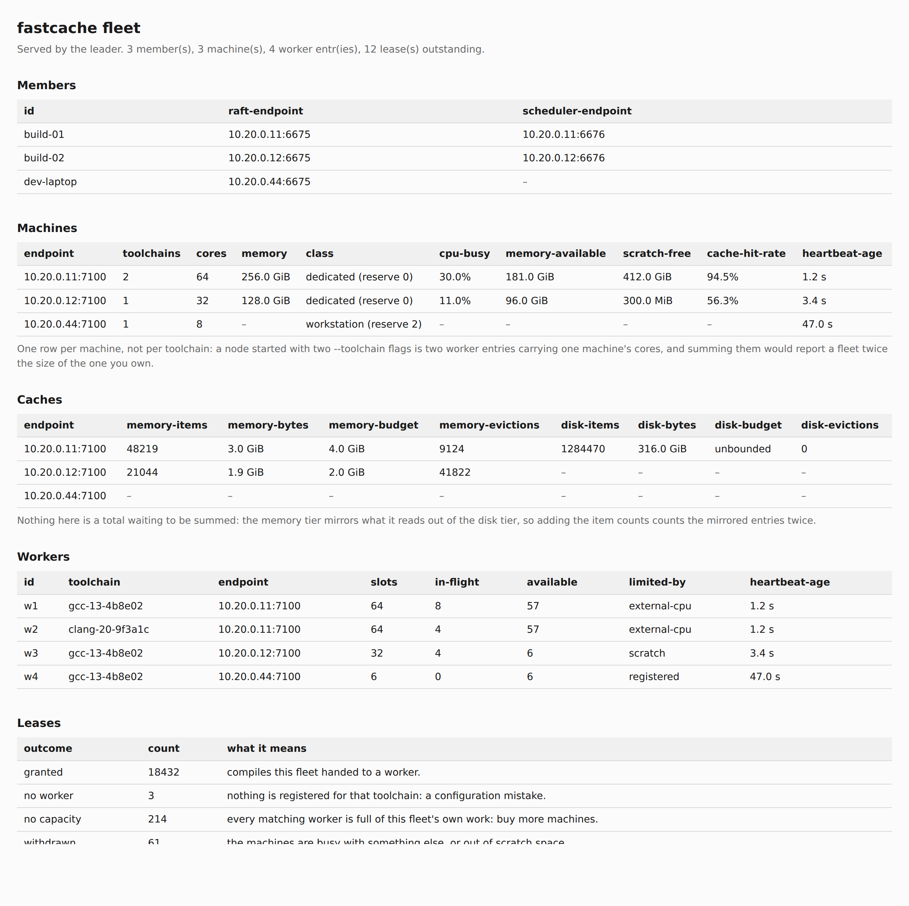

# fastcache-compile-node

A compile worker. It takes translation units that missed the cache and compiles
them, so a build is not limited to the cores of the machine running it.

It is the fleet's one binary, and it wears several hats. Compiling is the only one
it always wears; the rest are surfaces you switch on, and every section below is
about one of them:

| Role | What switches it on | Default |
|---|---|---|
| [A cache tier of its own](#a-cache-of-its-own) | `--cache-memory`, `--cache-dir` | on, 25% of RAM in memory |
| [Fleet scheduler](#a-cluster-and-who-leads-it) | `--serve-scheduler` | **off** |
| [Consensus member](#a-cluster-and-who-leads-it) | `--node-id`, `--listen-raft` | **off** — a lone node leads itself |
| [Peer discovery](#finding-peers-instead-of-typing-them) | `--discovery` | **off** — **UDP**, unlike every other surface |
| [Metrics, and the fleet dashboard](#watching-one) | `--admin-listen`, `--dashboard` | **off** |

That is the list of **roles**, and it is not a firewall list — `--node-id` switches
consensus on but is not a port, and a role's default here is not the address it binds
for a given command line. For the ports, see
[Every port it opens](#every-port-it-opens) below, or generate the list from the
binary with `--print-surfaces`.

What it never does is **write to the shared cache**. A worker is given no
credentials for it: the object it produces goes back to the client that asked for
it, and the *client* stores it, so a rogue worker can poison only its own key
space.

This page is the reference. For why a node is shaped this way — who leads, what a
joining node does in order, and what decides whether a worker matches a client at
all — read [How it works](../how-it-works.md#who-leads-and-what-happens-when-that-changes).

## How the pieces fit

A node is up to four surfaces in one process: a **compile worker** always, and
optionally a **scheduler**, a **cache tier** and a **consensus member**. A client
misses its cache, asks the scheduler for a worker, sends that worker preprocessed
text, and stores the object it gets back.

[Cluster communication](../operations/cluster-communication.md) draws the whole
fleet and follows one compile across it, including the parts below the surface —
what the scheduler decides and on what evidence, and what the nodes say to each
other.

**Every refusal ends in a local compile.** No matching toolchain, no free slot,
another client already compiling this key, an unreachable worker — all of them
fall back. Distribution cannot fail a build; that is what makes it safe to leave
switched on in a fleet where machines come and go.

## Every port it opens

**Ask the binary, not this page.** `--print-surfaces` lists every port a given
configuration would bind, with its protocol, and exits without opening anything:

```console
$ fastcache-compile-node --print-surfaces --serve-scheduler --listen-node 6675 \
      --node-id n1 --listen-raft 6680 --discovery 255.255.255.255:6681
node              0.0.0.0:6675  TCP
admin             -             not served; set --admin-listen
raft              0.0.0.0:6680  TCP
discovery beacon  0.0.0.0:6681  UDP

notes:
  node: a systemd .socket unit is NOT yet served on this surface; one 0xFC port
        for the cache verbs, this node's own compile verbs, and …
  …
```

The `notes:` block is part of the output, not an afterthought: it carries the facts a
column cannot, including the one that says this list can be **wrong** for the compile
port. Do not clip it when pasting the worksheet to somebody.

Pass the flags you would actually run with. It prints what **that** configuration
serves rather than the defaults, so a widened `--listen-node 0.0.0.0:6674` shows
as the wildcard and a surface you never turned on says so and names the flag that
would. The node opens its ports from the same table this prints, so the list and
the sockets cannot disagree — which is the whole reason to generate a firewall
worksheet from the binary rather than transcribe one from documentation.

The surfaces, and what each is for:

| Surface | Flags | Default | Protocol |
|---|---|---|---|
| Node port — cache verbs, compile jobs, and the scheduler's with `--serve-scheduler` | `--listen-node` | `6674` — **always on**; a bare port takes **loopback**, or the **wildcard** with `--serve-scheduler` | TCP |
| Admin / metrics | `--admin-listen` | off; a bare port takes **loopback** | TCP |
| Consensus peer | `--listen-raft` | off; a bare port takes the **wildcard**, and needs `--node-id` | TCP |
| Discovery | `--discovery` + `--discovery-reply-port` | off; always binds the **wildcard** | **UDP** |

Three things on that table are easy to get wrong and expensive to get wrong:

- **Discovery is UDP.** Five TCP rules and one wrong one leaves a beacon that
  reaches nobody, and that presents as a fleet that never forms rather than as a
  firewall mistake.
- **`--discovery`'s address is where beacons are *sent*, not where they are heard.**
  Both of its sockets bind the wildcard whatever you write, so
  `--discovery=255.255.255.255:6681` opens `0.0.0.0:6681` — do not put the broadcast
  address in a firewall rule. It also takes a **second** port for replies: without
  `--discovery-reply-port` that one is kernel-chosen, which a restrictive host
  firewall has to allow as outbound, and a node that can hear beacons but not answer
  challenges completes no handshake.
- **A bare port does not always mean the same thing on the same flag.**
  `--listen-node 6674` is loopback because a node's cache is this machine's entire
  build output; the same `--listen-node 6674` beside `--serve-scheduler` is the
  **wildcard**, because a scheduler no peer can dial does nothing. One port carries
  every verb family, so it keeps both answers and picks on that flag.
  `--admin-listen`'s loopback is the sharpest of the three: it is what the dashboard's
  credential rule turns on, so widening that address is what makes a token required.

**One caveat `--print-surfaces` states and cannot compute.** Under systemd socket
activation the `.socket` unit owns the port, and `--listen-node` is read
by nothing, and this process is never told which port it got — so `--advertise`
becomes required and is what names where clients actually go. The command is run by
hand, never under the supervisor, so it cannot detect this; it prints the note
instead of guessing.

`--advertise` is deliberately **not** a surface. It is what this node tells other
machines to dial, not a socket it opens.

## Quick start

Three processes. A cache:

```sh
fastcached --listen=0.0.0.0:6674
```

A scheduler, which is a compile node rather than the cache — handing out capacity
is a decision only one node may make at a time, and the cache cannot establish
which node that is:

```sh
fastcache-compile-node \
    --serve-scheduler --listen-node=0.0.0.0:6675 --fleet-open \
    --scheduler=127.0.0.1:6675 \
    --advertise=scheduler.internal:6674 \
    --toolchain=/usr/bin/g++
```

One of `--fleet-member` or `--fleet-open` is required: a scheduler with no member
list refuses every caller, which is the right default and not a working
configuration.

A worker, on each machine that should take work:

```sh
fastcache-compile-node \
    --scheduler=build-cache.internal:6675 \
    --advertise=worker-01.internal:6674 \
    --fleet-open \
    --toolchain=/usr/bin/g++
```

**A worker needs a membership flag too**, and that is the half most easily
missed: the same `--fleet-member` / `--fleet-open` policy gates this node's
*compile port*, not only a scheduler's. Without one the worker admits its own
machine and refuses the network — it is leased out, dialled, and answers
`not-a-member` — so every snippet below that omits it is showing you a narrower
subject, not a complete command line
([#235](https://github.com/LASTRADA-Software/fastcached/issues/235)).

And the client, which is the launcher you already use:

```sh
export FASTCACHE_ADDR=build-cache.internal:6674
export FASTCACHE_SCHEDULER=build-cache.internal:6675
cmake -DCMAKE_CXX_COMPILER_LAUNCHER=fastcache-cc ...
```

Unset `FASTCACHE_SCHEDULER` and every miss compiles locally again, which is the
behaviour without this feature.

## `--advertise` is the flag to get right

The scheduler hands your string to clients **verbatim**. A worker that
advertises `127.0.0.1` is leased and then never answers, and the symptom is a
build that mysteriously falls back to local compiles on every machine but one.

It defaults to `--listen-node`, which is correct only when that already
name an address other machines can reach.

## Anything the fleet reads has to be text

A value that leaves this machine has to be valid UTF-8, because every other
member reads it back: `/fleet.json` is JSON, the fleet page is HTML, and a chart
is SVG. The flags that carry one are `--advertise`, `--node-id`,
`--raft-peer`, `--cluster-id`, `--cluster-admit`, `--cluster-set`, and the
`<fingerprint>` half of `--toolchain=<fingerprint>=<compiler>`. A worker refuses
to start rather than registering a value the scheduler would then reject on every
heartbeat.

Non-ASCII is fine — the rule is about the encoding, not about the alphabet. What
is refused is a byte sequence that is not UTF-8 at all, and on Windows that used
to be what a non-ASCII argument *became* on the way into the process. Every
binary here now declares UTF-8 as its code page, which Windows honours from
Windows 10 1903 and Windows Server 2022 onwards.

On an older Windows the declaration is ignored, and `chcp` does **not** help:
that sets the console's code page, while arguments are transcoded through the
system's *ANSI* one. A refused start says which code page this host is on. Either
keep those values ASCII, or turn on the system-wide *Beta: Use Unicode UTF-8 for
worldwide language support* setting, which is what makes `GetACP()` answer 65001
on such a host.

Paths are deliberately not covered by the rule — `--cache-dir` and the compiler
half of `--toolchain` name files on this machine and nowhere else, so whatever
this host calls a filename is accepted.

## Toolchains

**A worker surveys this machine at startup and serves what it finds.** Nothing has
to be typed:

```sh
fastcache-compile-node --scheduler=... --advertise=...
```

```
[INFO] found /usr/bin/g++ (usr)
[INFO] found /usr/bin/clang++ (usr)
[INFO] serving /usr/bin/g++ as 4f2c...
[INFO] discovered 2 toolchain(s) on this machine; pass --toolchain to serve a narrower set
```

### When a compiler is upgraded under a running node

**The node notices, and re-registers under the new fingerprint.** A worker
fingerprints its machine at startup and then runs for weeks, while `fastcache-cc`
recomputes per invocation — so without this, a compiler patched in place would leave
the node advertising the *pre-upgrade* digest while spawning the *post-upgrade*
compiler. Clients would receive objects built by a compiler they did not key against
and store them in the shared cache under the old key, where the whole fleet then
reads them ([#238](https://github.com/LASTRADA-Software/fastcached/issues/238)).

Each heartbeat re-checks the evidence the fingerprint was derived from — the
compiler binary's size and modification time, and the modification time of each
include search root. That is a handful of `stat` calls and **no compiler is
spawned**, so it costs a heartbeat essentially nothing. Only when something has
moved does the node pay for the full re-survey.

That pair of checks covers the two upgrades that happen in practice: a distribution
replacing `gcc` in place moves the binary, and a Windows SDK update that never
touches `cl.exe` moves an include root. A header *edited* in place under an
unchanged directory is deliberately not covered — a system toolchain's headers are
installed rather than edited, and catching it would mean the multi-second walk of
the whole include tree on every heartbeat.

When something did move:

```
[INFO] the toolchain behind 4f2c… changed on this machine; re-deriving what this worker serves
[INFO] no longer serving 4f2c… (/usr/bin/g++)
[INFO] now serving 9b71… (/usr/bin/g++)
```

The old fingerprint **stops being served immediately**, before the new registration
is announced. A client still holding a lease for it is refused `unknown-fingerprint`
and compiles locally — the ordinary fallback, counted by
`fastcache_worker_jobs_refused_unknown_fingerprint_total`.

A witness-driven check can only ever notice what it is already watching, so once
every fifteen minutes the node surveys the machine **unconditionally**. That is the
way back from serving less than the machine has: a toolchain dropped by a transient
probe failure, or removed and later reinstalled, rejoins on that sweep rather than
waiting for a restart. A sweep that finds nothing changed is not reported as a
change, so it costs the fleet no re-registration.

Two consequences worth knowing. An operator's pinned `<fingerprint>=<compiler>` is
**never** re-derived: it is not probed in the first place, and pinning a digest by
hand is how you force a fleet to agree while a machine is being repaired. And a
machine whose only compiler an upgrade removed or broke keeps running while serving
nothing, rather than exiting — the compiler may come back with the next package, and
a routine upgrade must not be able to take a machine out of the fleet permanently.
It says so, its registry entries expire on their own within 90 seconds, and the
next sweep is what brings it back:

```
[WARN] this machine now has no usable toolchain; serving nothing until one returns
```

`--toolchain` is an **override** that narrows that set:

```sh
--toolchain=/usr/bin/g++                 # this node computes the fingerprint
--toolchain=<fingerprint>=/usr/bin/g++   # or pin it explicitly
--no-toolchain-discovery                 # do not survey the machine at all
```

Naming any `--toolchain` pins the worker to exactly those; naming none means
"serve what this machine has". The two are never merged, because a merged set
would quietly re-add a compiler you had deliberately narrowed away.

A job names a **fingerprint, never a program**. The worker maps that fingerprint
to a compiler it serves and refuses one it does not have — which is the difference
between a build accelerator and a remote shell, and is why there is still no
default *compiler*. "No default" and "no discovery" are different claims: a
default is how a job ends up running against something nobody chose, while which
compilers a machine holds is a fact the worker can establish.

A compiler that is found but **cannot be executed** is dropped at startup, named,
with the layout that found it — rather than registering and failing every job it
is sent. So is one whose fingerprint would say nothing about which compiler it
is: a driver this build cannot ask for a version *and* whose include tree could
not be located digests to its own basename, which every install of that compiler
on earth would also produce. Pin such a toolchain with
`--toolchain=<fingerprint>=<compiler>` if you want it served anyway. A worker
that ends up with nothing to serve refuses to start and prints where it looked.

### Where it looks

| Layout | Where |
|---|---|
| `visual-studio` | `vswhere`, then every toolset under `VC\Tools\MSVC` |
| `visual-studio-llvm` | the same installation's bundled clang-cl, under `VC\Tools\Llvm` |
| `llvm-registry`, `llvm-program-files` | `HKLM\SOFTWARE\LLVM\LLVM`, `%ProgramFiles%\LLVM` |
| `msys2`, `mingw-w64` | `C:\msys64\{ucrt64,mingw64,clang64}`, `C:\mingw64` |
| `usr-local`, `usr` | `/usr/local/bin`, `/usr/bin` — version suffixes included (`g++-13`) |
| `macports`, `homebrew` | `/opt/local/bin`, `/opt/homebrew/bin` |
| `xcode` | `xcrun --find` |

**Visual Studio is two rows, not one.** It ships clang-cl itself, under
`VC\Tools\Llvm` rather than beside `cl`, and the three LLVM rows all describe a
*standalone* install. A machine whose only clang-cl came with Visual Studio would
otherwise advertise no clang-cl toolchain at all — its clang-cl builds would still
be **cached**, since a launcher needs no worker for that, and could never be
**dispatched**, since nothing advertised the fingerprint. `vswhere` is still run
once: the two rows share its answer.

Only the bindir matching this machine's own architecture is offered, from either
row. The other holds a compiler built for a different *host*, which this machine
cannot run.

The fingerprint is a digest of the compiler's version banner **and its whole
include tree**, so two machines with the same compiler at different install
prefixes match, while two machines whose headers differ do not. The banner names
the target as well as the version — `... Version 19.51.36252 for x64` — which is
what tells the x86 and x64 `cl.exe` of one toolset apart, since those two share an
include tree exactly. Matching is
byte-identical and cannot be loosened: an over-strict match costs a local
compile, an over-loose one produces a silently wrong object that is then stored
under a key other machines fetch.

Computing it walks the include tree, which takes a few seconds the first time a
machine sees a toolchain and is cached afterwards.

**Which tree, per driver.** GCC and Clang are asked directly (`-E -v`), and so is
`clang-cl` (`-print-resource-dir`). `cl` prints no search list at any verbosity, so
its tree is read off its install layout instead: the `VC\Tools\MSVC\<version>`
toolset it lives inside, plus the newest Windows SDK the registry names. (Its
*version* it does state — on every invocation, which is why it is asked for it with
no options at all.) `clang-cl` covers only its own resource
directory, `<prefix>\lib\clang\<version>\include`: it borrows the VC toolset and
the SDK rather than owning them, and a worker compiles text the client already
preprocessed, so it opens no header from either.

Neither takes its answer from `INCLUDE`, which a developer command prompt sets
and a Windows service never inherits — that is why a service-run worker and a
developer-prompt launcher agree. `cl` still falls back to it for a driver outside
any `VC\Tools\MSVC` layout, because a banner alone cannot see a patched header;
`clang-cl` never does, since it owns a resource directory it can be asked for.

### When no worker matches

The launcher reports `not dispatched (rejected (no-worker): ...)`. Ask both ends
what they think the fingerprint is:

```sh
fastcache-cc --print-toolchain-fingerprint /usr/bin/g++   # on the client
journalctl -u fastcache-compile-node | grep 'serving'     # on the worker
```

They must be identical. If they are not, the two machines really do have
different toolchains — different patch releases, different SDKs, a vendored
header that differs. `--print-toolchain-fingerprint` recomputes rather than
reading the cache, so it also repairs a stale entry on its way past.

### A node that never appears in the fleet at all

A pinned fingerprint is yours to choose, and it has to be **text** —
specifically, valid UTF-8. So do `--advertise` and the version the node reports
about itself. A scheduler refuses a registration that is not, with
`malformed-registration` naming the offending field, and the node says so once
per heartbeat:

```
scheduler scheduler.internal:6675 did not register a1b2c3:
  rejected (malformed-registration): fingerprint is not valid UTF-8
```

It is refused rather than cleaned up because a fingerprint is matched byte for
byte: a worker admitted under a repaired name would match no client's toolchain
and would sit in the fleet registered and never picked. The leader counts it as
`fastcached_dispatch_worker_registrations_malformed_total`, which is the only
trace a peer that never says anything else leaves behind.

The commonest way to produce one is a `--toolchain=<fingerprint>=...` label
typed in a shell whose encoding is not UTF-8. A computed fingerprint is hex and
cannot hit this.

### After an election, a node re-points itself

`--scheduler` names **a** member of the fleet, not the current leader. A
scheduler that is not leading refuses every verb — registration included — and
says where the leader is, so a node follows that and announces itself there
instead:

```
scheduler scheduler.internal:6675 is not the leader; announcing to 10.0.0.7:6675 instead
```

At `info`, and once — the endpoint that answered is remembered, so a fleet in
steady state does not pay a redirect on every heartbeat. Nothing has to be
re-pointed by hand, and `--scheduler` can keep naming a machine that has not led
for months.

Two things follow that are worth knowing when reading logs:

- A remembered leader that stops answering is dropped immediately and the
  configured `--scheduler` is tried again **in the same heartbeat**, not the next
  one. That is the `falling back to the configured endpoint` line, and it means
  the node was out of the fleet for a connect timeout rather than for a whole
  interval.
- The chain is bounded at two hops. Two schedulers that disagree about who leads
  — a partition healing — produce `gave up following leader redirects` and the
  node simply tries again next heartbeat. Seeing that line *repeatedly* is worth
  investigating; seeing it once around an election is not.

A node whose own registration is refused for any other reason still reports it
per heartbeat, as above — a redirect is the one refusal that is not a problem.

### A change the leader will not record

The flags above are refused by the binary an operator typed them into. The
scheduler refuses the same values again when they arrive as a request, whoever
sent them — a client built before that check existed, or a peer — because a
cluster change is committed through consensus and an entry is applied *after* it
commits, with nobody left to refuse it:

```
$ fastcache-compile-node --scheduler=scheduler.internal:6675 --cluster-admit='...'
a member id is not valid UTF-8
```

**`--cluster-forget` is deliberately exempt, at both ends.** Its operand *is* the
offending id, so a check covering it would make a member that reached replicated
state through an older peer impossible to remove — and it would count towards
quorum forever.

## A cache of its own

A node can hold a cache tier in front of the shared `fastcached`, and point the
launcher at itself:

```sh
fastcache-compile-node \
    --listen-node=6677 --cache-memory=8g \
    --upstream=build-cache.internal:6674 \
    --scheduler=scheduler.internal:6675 \
    --advertise=worker-01.internal:6674 \
    --toolchain=/usr/bin/g++
```

```sh
export FASTCACHE_ADDR=127.0.0.1:6677   # the node, not the shared cache
```

### Why a second copy is not redundant

The shared cache already holds every object, so caching them again on the node
looks like waste. What the tier saves is not the compile — it is the **round
trip**. A developer who rebuilds the same tree twenty times a day pays that trip
twenty times for objects that never left their machine, and on a slow or lossy
link that is the difference between a cache that helps and one that hurts.

Four rules, and none of them is the obvious choice:

- **A local hit does not consult the upstream at all.** Revalidating would move the
  round trip rather than remove it. It is safe by construction: an object key is a
  digest over the preprocessed text, the arguments, the compiler identity and the
  dependency set, so a key that matches names the same object.
- **A local miss populates the tier from the upstream.** Without that the tier is a
  proxy and the second build is exactly as slow as the first.
- **A store writes local first, then offers upstream.** The local write must not fail
  for a reason the network chose. Offering it to the fleet is best-effort: a shared
  cache that cannot be reached costs the fleet one entry and costs this machine
  nothing.
- **An unreachable shared cache is a miss, not an error.** Every caller compiles
  either way, so a build never fails because a cache was down.

`scripts/dist-compile-e2e.sh` asserts the first of those by **stopping the shared
cache** and requiring the next compile to still hit, with a byte-correct object.

### Two halves, each named separately

The tier is an in-memory store, an on-disk store, or both — the same
`LayeredStorage` the daemon's `--storage` builds, an LRU mirror over a canonical
B+tree:

| Configuration | What you get |
|---|---|
| `--cache-memory=8g` (the default is 25% of RAM, within `512m`–`8g`) | Memory only. Fast, and gone at restart. |
| `--cache-dir=/var/cache/fastcache-node` | Both halves: the memory tier in front of a store that survives a restart. |
| `--cache-memory=0 --cache-dir=…` | Disk only. |
| `--cache-memory=0` and no `--cache-dir` | **No tier at all**, which is what a node that only compiles for others wants. |

A release that changes the on-disk record layout refuses an older `--cache-dir`
store at startup rather than mis-reading it. Convert it with
`fastcache-compile-node --migrate-cache --cache-dir=…`, with the worker stopped;
see [Upgrading a store](../operations/upgrading-a-store.md).

`--cache-memory` takes bytes (`k`/`m`/`g` = KiB/MiB/GiB, or a bare count with an
optional `B`) or a share of host RAM (`N%`) — the vocabulary its own default is
stated in, so "a quarter, but half of that" is `--cache-memory=12%` rather than
arithmetic you do per machine. **Zero turns the tier off**; it does not mean
"unbounded", which is what zero means to the store underneath.

Whatever the node logs at startup can be typed straight back to pin it, and pinning
it that way survives `--install-service`: the flag is written into the unit because
you *stated* it, not because it differs from the default — otherwise typing the
machine's current quarter would look identical to saying nothing, and the service
would go back to re-deriving from RAM at every start.

**The tier's memory is subtracted from what a compile can have.** A node budgets
one job per gigabyte of RAM, and its own cache is resident memory that is not going
to yield — so a 64-thread host with 32 GiB used to offer 32 slots *and* hold 8 GiB
of cache, which is forty gigabytes of promises on a thirty-two gigabyte machine. It
now offers 24. The figure travels with the registration, so a node that asks the
scheduler to size it (`--slots 0`) gets the same answer at the other end, and a
peer too old to report it is sized exactly as it always was.

**What is subtracted is what the tier actually holds, not what you asked for.** A
node that ends up with no tier subtracts nothing and offers the whole machine. Two
ways of ending up there leave `--cache-memory` reading as though it still meant
something: `--cache-memory=0` with no `--cache-dir` leaves nowhere to keep objects
and so builds no tier, and a *default* `--listen-node` that something else already
holds — a `fastcached` on the same box, usually — is a warning the node carries on
past. Both used to reserve the
configured budget regardless, so on a 32 GiB machine such a node held back the
default 8 GiB it was not using and offered 24 slots where it could serve 32. A
disk-only cache (`--cache-memory=0 --cache-dir=…`) is resident nowhere and so
subtracts nothing either, which is the one case that was always right.

The default follows the machine because the machines this runs on vary by more
than an order of magnitude, and one object file is routinely megabytes: a cache
sized for a laptop is close to useless on a 96 GB workstation, and a flat number
misses on exactly the rebuild the tier exists to serve. The clamp is what makes a
fraction safe at both ends — a small laptop still gets a cache worth having, and a
512 GB build server does not silently take 128 GB resident for one.

`--cache-disk` caps the on-disk half, which is otherwise allowed to grow as
needed — the same default `--storage-max-disk` has on the daemon. On a build
server that is usually right; on somebody's workstation it usually is not.

!!! note "One node per `--cache-dir`, and the store enforces it"

    The store claims its file exclusively for the life of the process, so a
    second node pointed at one directory refuses to start and says so:

    ```
    --cache-dir cannot open /var/cache/fastcache-node/objects.cow: another process
    already has this cache open. A --cache-dir belongs to one node; give this one a
    path of its own.
    ```

    If a machine runs several nodes — one per toolchain is a common shape — give
    each its own path. Nothing is written to the file to do this, so a store is
    readable by any build either way.

    Some filesystems cannot enforce this — network mounts and user-mode
    filesystems that either refuse to lock or accept a share mode and ignore it.
    The node checks rather than assumes, starts anyway, and warns that nothing
    is stopping a second one. That is the only case where the rule is still
    yours to keep.

Its reads and writes happen on the reactor thread the node's framed surfaces
share, so a large store can briefly delay other connections on it
([#136](https://github.com/LASTRADA-Software/fastcached/issues/136)). Worth
knowing before profiling a node that feels slow under load.

### `--upstream` may be empty

That is the honest configuration for one developer's machine, not a broken one: the
tier caches locally and never tries to reach a fleet.

### Reading it

Eight counters on `/metrics`, and the splits are the point:

| Series | Says |
|---|---|
| `fastcache_node_cache_hits_total` | Served without touching the network. |
| `fastcache_node_cache_misses_total` | The local tier did not hold it. |
| `fastcache_node_cache_upstream_hits_total` | The shared cache answered after a local miss. |
| `fastcache_node_cache_fill_failures_total` | The upstream supplied it and the local tier refused. |
| `fastcache_node_cache_store_failures_total` | A local write failed — this one is reported to the client. |
| `fastcache_node_cache_upstream_stores_total` | The fleet accepted an object this node offered. |
| `fastcache_node_cache_upstream_store_failures_total` | The fleet would not take it. Zero on a node with no shared cache — see below. |
| `fastcache_node_cache_requests_refused_not_local_total` | A caller that is not on this machine asked this tier for something. Zero forever on the default loopback bind; on a widened one it is your peers, whose access [#287](https://github.com/LASTRADA-Software/fastcached/issues/287) withdrew — give them a shared `fastcached` via `--upstream`. |
| `fastcache_node_upstream_configured` | `1` when this node has a shared cache to read through to, `0` when it does not. Absent on a node running no cache at all. |

Read the two upstream counters beside the gauge, never on their own. They are
cumulative, so a node with **no** shared cache and a node with one it has not yet
written to both report zero — the counters cannot tell those apart and the gauge is
what does. Until
[#214](https://github.com/LASTRADA-Software/fastcached/issues/214) the failure
counter answered the question the wrong way round: a node with no upstream counted
every local store as an upstream failure, so a single-machine install reported a
100 % failure rate against a shared cache it never had.

The alert worth writing is `fastcache_node_upstream_configured == 1` **and** a
rising failure counter. That is a fleet whose shared cache is unreachable. Without
the first clause it fires on every laptop.

A high **upstream**-hit rate against a low **local**-hit rate means the tier is too
small for this machine's working set — a different problem from a fleet that is
missing a lot, and a different fix. An upstream *store* failure says the fleet is
unreachable; a local store failure says this node is broken.

Beside them, what the tier is holding. `fastcached_items`, `fastcached_bytes_used`
and `fastcached_bytes_limit` describe the cache as a whole, and a per-tier set
carries the split a merged view cannot:

| Series | Says |
|---|---|
| `fastcached_tier_items{tier="memory"\|"disk"}` | Live entries in that tier. |
| `fastcached_tier_bytes_used{tier=…}` | Bytes it holds. |
| `fastcached_tier_bytes_limit{tier=…}` | Its budget; `0` means unbounded. |
| `fastcached_tier_evictions_total{tier=…}` | Entries it dropped to stay inside that budget. |
| `fastcached_tier_index_bytes{tier=…}` | Resident memory its key index costs. Always RAM, even for a disk tier, so it is **not** comparable with `bytes_limit` and must not be added to it. |

**Do not sum across tiers.** The memory tier mirrors what it reads out of the disk
tier, so adding the two item counts counts the mirrored entries twice — and the
unlabelled `fastcached_*` series above are already the cache's own totals. What
each label answers is "how is *this* tier doing": whether the mirror is populated,
which tier is evicting, how close the disk half is to `--cache-disk`.

A tier the node does not run emits **no line at all** rather than a zero. A
memory-only node has no `tier="disk"` series, which is a different claim from a
disk tier standing empty.

### It answers where `fastcache-cc` already looks

`--listen-node` defaults to port **6674** on loopback — the address the launcher uses
when nobody sets `FASTCACHE_ADDR`, and the one `cmake/portable/CompileCache.cmake`
passes. So the whole thing works with no configuration: start a node, build, and
the launcher finds it.

**It is one port for every verb family this node answers, and it is the only one.**
The cache verbs are answered here always; the scheduler verbs are answered here too
once you pass `--serve-scheduler`; and **`COMPILE` is answered here as well**, by the
same worker, against the same slot count and the same member list. That flag also
moves where a bare port binds — loopback without it, the wildcard with it — because a
scheduler no peer can dial does nothing. There is no second listen flag to set, and
no way for two to end up on addresses that disagree.

A worker used to open a dedicated compile port beside this one, configured by flags
of its own. It does not any more: `--listen-node` is what a worker advertises and
what a dispatched compile arrives on, so there is one address to open in a firewall,
one address in a lease, and one address to get wrong.

That port is also `fastcached`'s, and what happens when both want it depends on
whether **you typed the address**:

| `--listen-node` | Port already held |
|---|---|
| defaulted | Warned, and the node starts **with no 0xFC port at all** — no local tier and no `COMPILE`. Your builds reach the daemon on that port instead, so local caching still works; but this node no longer has a second port for dispatched compiles to arrive on, so it can serve none. It still registers with its `--scheduler` and advertises that address, which means clients are leased an endpoint nothing is listening on. Do not run a node and a `fastcached` on one machine: the node answers every verb the daemon does. |
| named by you | Fatal. The node refuses to start and says so. |

The asymmetry is the point: a node sharing a machine with `fastcached` should not
refuse to start over a convenience nobody requested, while an address an operator
typed is a promise and a broken promise is fatal. Neither is silent. Give one of
them a port of its own if you want the node's tier as well.

**"Named by you" means you typed the flag, not that you typed something unusual.**
`--listen-node=127.0.0.1:6674` — reading the address off the startup line and
typing it back to pin it — is a named address, and a port already held is fatal for
it. Until #286 the node decided this by comparing your value against the default,
so pinning the default port was indistinguishable from never mentioning it: the node
started, logged a warning, reported healthy on `/healthz`, and served no cache.

The distinction survives `--install-service`. The registration records
`--listen-node` when you typed it, whatever its value, so a service installed with
a port you named refuses to start when something else holds it — rather than warning
past it at every boot. A port you never named is left out of the registration, so
the service picks up a changed default rather than one frozen at install time.

### Who may use it

**The cache is this machine's. The other two surfaces are this machine's and your
fleet's.**

| Caller | Cache (`--listen-node`) | Fleet (`--serve-scheduler`) | Compile (`--listen-node`) |
| --- | --- | --- | --- |
| A process on this machine | always | always | always |
| A `--fleet-member` peer | **refused** | yes | yes |
| A cluster member | **refused** | yes | yes |
| Anyone else | refused | refused | refused |

The cache column changed in
[#287](https://github.com/LASTRADA-Software/fastcached/issues/287), and it is the
one breaking change on this page: a fleet peer used to be served this tier and no
longer is. The two questions were never the same one. `--fleet-member` names a
machine that may spend this node's **CPU**; the cache tier is this machine's entire
**build output**, and nothing about contributing capacity makes another host
entitled to read it.

The rule is a property of the **verb**, not of the bind: a `FETCH` or `STORE` whose
peer address is not one of this host's own addresses is refused whatever
`--listen-node` was widened to. That is what keeps it true now that the surfaces
share one listener, where "it is only bound to loopback" has stopped being available
as an argument — on a node running `--serve-scheduler` the port faces the network by
design, and the cache verbs are closed by this rule alone. "This host's own addresses" is loopback plus every address on its
interfaces, so a local client dialling the node at its routable address is still
local; the set is re-read every 30 seconds, so an address the machine has just been
given is refused for at most that long and then works.

The compile column is on ONE port, which is what #290 stage 3 finished: the
dedicated compile listener is gone, `COMPILE` arrives on `--listen-node` beside the
cache and scheduler verbs, and it is answered through the same membership check the
dedicated port applied. A caller with no claim on this machine is refused before a
byte of its preprocessed source is read.

A non-member now reaches that refusal a step later than it used to. The dedicated
listener classified the peer at **accept**, from the kernel's address, before any
byte was read; the merged surface asks per FRAME, at the first point the verb is
known — and it has to, because membership is the policy of the compile verbs while
the same socket answers cache verbs on locality, so a gate at accept would decide
both and make the listener the policy again. The widening is that a non-member holds
a connection until it sends a header, bounded by the header timeout and by the
surface's maximum open connections. That is the exposure the cache verbs have
carried on this listener since #416.

**Whether this node verifies the lease a client presents is decided once, at
startup**, from whether a machine that is not this one could reach the compile verbs
*at all*. `--listen-node` binds the wildcard on any
node running `--serve-scheduler`, so such a node needs `--cluster-key-file` and is
refused at startup without it. For one release the question had TWO answers to
combine, and asking either alone let an open surface pass: `--bind 127.0.0.1
--serve-scheduler --fleet-open` looked local and served unauthenticated compiles on a
wildcard-bound port. There is one surface now, so there is one answer again.

Refusals are counted, because this withdrew access somebody may have been relying
on:

```
fastcache_node_cache_requests_refused_not_local_total
```

Zero forever on the default loopback bind. If your peers stopped getting cache hits
after an upgrade, that counter is where it says so — give them a shared `fastcached`
via `--upstream`, which is what a cache several machines read is for.

The flags are the node's, not the scheduler's. `--fleet-member` and `--fleet-open`
are accepted on **any** node and read by all three columns above, so a plain worker
is configured with them exactly as a scheduler is. They were once refused on a node
running no `--serve-scheduler`, which left every worker's compile port on the first
row of that table and nothing else
([#235](https://github.com/LASTRADA-Software/fastcached/issues/235)).

The **compile verbs** matter most here. A node that widens `--listen-node` so peers
can dial it would, without a check, let anybody who can route to that port have this
machine run their compiler on source they chose. It is refused
before the request payload is read — a caller with no claim on this machine must not
be able to make it buffer a multi-megabyte translation unit first, which would be a
memory-exhaustion hole opened by the check meant to close one.

Two mechanisms, and only one of them is a policy:

- **The locality check** is the policy, and it is the whole of it for the cache.
  Every caller that is not on this machine gets a typed `not-a-member` refusal
  rather than a dropped connection — member or not, and whatever the surface is
  bound to. A refusal, so a misconfigured client learns which it is instead of
  seeing a connection it cannot tell from a dead host.
- **The bind** is defence in depth and nothing more — and on a scheduling node it is
  not even that. `--listen-node` takes loopback for a bare port on a worker, so a
  packet from another machine does not reach the process at all; widening it —
  `--listen-node 0.0.0.0:6674` — is only useful for reaching the tier from *this* host
  under another address, and does not widen who is served. Pass `--serve-scheduler`
  and that bare port becomes the wildcard, because the same listener now answers the
  fleet: the socket stops contributing anything and the locality check is the whole
  defence.

Until [#287](https://github.com/LASTRADA-Software/fastcached/issues/287) the bind
carried more than that: the policy admitted members, so widening the address really
did hand the tier to your peers. It no longer does, and the flag is now a
reachability decision rather than a trust one.

That ordering mattered:
[#290](https://github.com/LASTRADA-Software/fastcached/issues/290) put the cache and
scheduler verbs on one listener, and could only do so once the tier stopped depending
on its socket to stay private. On a scheduling node
`fastcache_node_cache_requests_refused_not_local_total` therefore rises in normal
operation — it counts peers reaching the right host for the wrong verb — where on a
worker it stays at zero.

**This machine is always a member of its own fleet**, whatever `--fleet-member`
says. Anti-leeching exists to stop *other* machines spending capacity they do not
contribute; a process here already has this machine's CPU. Without that rule a node
whose operator had listed their peers would refuse their own builds — a fleet that
looks configured and serves nobody locally.

The cache tier is deliberately stricter than `fastcached`'s own cache, which serves
non-members on purpose. That one is shared infrastructure somebody operates; this is
a developer's private tier. The two are different things that happen to speak one
protocol, and `--upstream` is how a node reaches the first one.

On a shared multi-user machine, "local" means every account on it. That is the same
trust level the daemon assumes, and there is currently no way to narrow it: a node
serves no `AUTH` verb, so it has no inbound credential to require
([#198](https://github.com/LASTRADA-Software/fastcached/issues/198)). If that is
not the trust level you want, do not serve the tier — `--cache-memory=0` with no
`--cache-dir` turns it
off.

## A cluster, and who leads it

Run one node and it leads itself: it schedules for its own machine, nobody else's,
and that needs no configuration. That is the common deployment and the default.

Run several and exactly one of them must schedule at a time. Without consensus
every node believes it does — and two nodes handing out the same machine's slots is
not a degraded fleet, it is the one thing the architecture says only one node may
do. So a fleet gives each node an identity and tells it who its peers are:

```sh
fastcache-compile-node \
    --node-id=n1 --listen-raft=6680 \
    --raft-peer=n1=10.0.0.1:6680 \
    --raft-peer=n2=10.0.0.2:6680 \
    --raft-peer=n3=10.0.0.3:6680 \
    --serve-scheduler --listen-node=6675 --fleet-open \
    --advertise=10.0.0.1:6674 \
    --toolchain=/usr/bin/g++
```

Each peer is an **identity and an address in one token**, because they are one
fact. A member id with no address is a node the cluster counts towards every quorum
and cannot reach: the fleet is then one node short of forming one, and nothing says
why.

A node must name itself among its own peers, and it is refused if it does not —
such a node could never win a vote and could never be voted for, so it would stand
for election forever against a cluster that has never heard of it.

Giving `--node-id` is what turns consensus on, and three things then have to hold.
Each is decided by the command line alone, so each is refused at startup **and** at
`--install-service`, where you are watching, rather than at every boot into a log
nobody reads:

| What has to hold | Why |
|---|---|
| every `--raft-peer` is `<id>=<host>:<port>` | A token that names no member is refused by the parser, which is the only place that can tell you *which* token. `--cluster-admit` takes the same one. |
| one of them is this node | The address its peers dial is the half only it knows — whether it bootstraps a cluster or joins one with `--raft-join`. |
| `--listen-raft` names a usable port | That is where every peer dials it. Without one nothing binds and no vote could arrive. |

The reverse holds too: `--listen-raft` or `--raft-peer` **without** `--node-id` is
refused rather than ignored. This node would run no consensus at all, so neither
flag is read by anybody and nothing would say so. (`--cluster-dir` is not one of
them — the dashboard keeps its history file there, so a node with no consensus
still has a use for it.)

### Two ports, and why a member records both

`--raft-peer` names the **consensus** port. A client that is redirected to the
leader needs the **scheduler** port, which is a different number, so a member
carries both — and that is a correctness matter rather than a convenience. A
follower refusing a client answers `NotLeader` *with the leader's endpoint*, and
while only one address was recorded that endpoint was the consensus one: the client
took the advice and spoke the scheduler protocol at a socket that has never heard of
it.

Only the *leader's* scheduler port matters, and only the node itself knows it — no
peer ever dials it, so there is nothing to learn it from. So **a node announces its
own record when it becomes leader**, and the address it announces is the host from
its own `--raft-peer` entry with the port its scheduler surface actually bound.
Neither half can supply the other: `--serve-scheduler --listen-node=6675` binds the
wildcard, which no client can dial, while the consensus endpoint is dialable by
construction and names the wrong port.

A member that has never led carries no scheduler endpoint, which is not a fault:
there is nowhere to redirect to a node that does not lead, and a follower answering
`NotLeader` with nothing is exactly the "an election is in progress" case a client
already handles by compiling locally.

### What the log carries

Cluster configuration and nothing else: **who is a member, where they answer**, and
the handful of settings every member must agree on. Not the cache — a log is
replicated to every member and kept until it is snapshotted, and multi-megabyte
objects written constantly are the opposite of what belongs in one. Cached objects
live in the `fastcached` this state merely names.

| Setting | Means |
| --- | --- |
| `upstream` | host:port of the shared `fastcached` every member reads through to |
| `fleet-open` | `1` to admit every caller to the fleet, `0` for members only |

A key the build does not know is **refused when it is proposed**, not stored. The
alternative is a typo replicated to every node, snapshotted, carried across
restarts — and doing nothing, with the only symptom being that the thing you
configured did not happen.

### Membership at runtime

`--raft-peer` is the **bootstrap** set. Once the cluster is running, membership is
a replicated log entry, and that is what makes a node admitted at runtime survive a
restart without anybody editing a config file on every other machine.

The agreed member set joins the fleet's admission policy directly, so a node the
cluster admitted is served by the two surfaces membership governs — its compile
port and the scheduler. Not the cache tier: since
[#287](https://github.com/LASTRADA-Software/fastcached/issues/287) that one serves
its own machine and nothing else, whatever any member list says.

It **adds** to `--fleet-member` and never replaces it. The two lists answer
different questions: cluster members are peers, while most of the machines that
spend a fleet's capacity are not — a laptop, a CI runner, anything running
`fastcache-cc` against the fleet. Those never join consensus, so `--fleet-member` is
the only route by which they are admitted at all, and it keeps working on a
clustered node exactly as it does on a standalone one. Until
[#251](https://github.com/LASTRADA-Software/fastcached/issues/251) it did not: the
first committed membership change discarded the listed hosts, so a client machine
stopped being served the moment the fleet agreed anything.

**It reaches consensus too.** The leader moves the *quorum* to match the member set
one machine at a time, so a node the cluster admitted votes, is counted, and is
dialled by the peers that admitted it. Growing a cluster no longer means restarting
its existing members with a longer `--raft-peer` list — only the new machine is
started, and only it names anybody.

### Adding a machine to a running cluster

Two commands, on two machines. The joining node is started with `--raft-join`:

```sh
fastcache-compile-node \
    --node-id=n4 --raft-join \
    --listen-raft=6680 \
    --raft-peer=n4=10.0.0.4:6680 \
    --raft-peer=n1=10.0.0.1:6680 --raft-peer=n2=10.0.0.2:6680 --raft-peer=n3=10.0.0.3:6680 \
    --serve-scheduler --listen-node=6675 --fleet-open \
    --advertise=10.0.0.4:6674 \
    --toolchain=/usr/bin/g++
```

and any member of the cluster is then told to admit it:

```sh
fastcache-compile-node --scheduler=10.0.0.1:6675 --cluster-admit=n4=10.0.0.4:6680
```

**`--raft-join` is not optional and its absence is not a smaller mistake.** Without
it that command line bootstraps a cluster *of n4*: it elects itself, takes a term
and a log of its own, and afterwards refuses `AppendEntries` from every leader its
own configuration does not name. A cluster that admitted such a node would be
counting towards its quorum a machine that answers nobody, and two clusters cannot
be merged by any local rule — so the joining node must never form one.

**Under `--raft-join` the `--raft-peer` list means something else**: these are nodes
this one can *reach*, not a cluster it belongs to. It still needs the cluster's
addresses, and that is load-bearing rather than convenient. A leader admitting a new
member starts replicating at its own last index; the joiner's log is empty and
refuses that; and the leader only walks back to the beginning when the refusal
reaches it. A joiner that cannot send one is admitted, dialled, and permanently
silent.

With `--discovery` the same node names only itself, because discovery supplies the
addresses — see below.

**Nothing about the existing members changes.** They are not restarted, their
command lines are not edited, and the new member survives *their* restarts as well
as its own, because it is a log entry rather than a flag.

### Changing it while it runs

The log carries the cluster's configuration so it can be changed without editing a
file on every machine and restarting them. Three flags ask a running cluster
directly, and each exits when it has an answer:

```sh
fastcache-compile-node --scheduler=10.0.0.1:6675 --cluster-status
fastcache-compile-node --scheduler=10.0.0.1:6675 --cluster-set=upstream=cache.internal:6674
fastcache-compile-node --scheduler=10.0.0.1:6675 --cluster-admit=n4=10.0.0.4:6680
fastcache-compile-node --scheduler=10.0.0.1:6675 --cluster-forget=n3
```

`--cluster-status` prints the members, the settings, and **every key this build
knows** — because the question an operator usually has is "what *can* I set", and a
report listing only what somebody had already set would answer it wrongly by
omission.

**They go through the same gate as everything else on that port**, which for a read
is worth stating: a follower's copy of the state is perfectly valid and merely
older, so `--cluster-status` could have been answered by any member. Refusing and
naming the leader keeps one rule for the whole surface — a verb added without the
gate is the regression the arrangement exists to make impossible — and it sends you
to the node you would have needed anyway to change anything. A follower answers with
where to ask instead:

```
fastcache-compile-node: this node does not lead the cluster; ask --scheduler=10.0.0.2:6675 instead
```

**A non-member is refused too**, and here anti-leeching is not about capacity: a
stranger who could set `upstream` would point the whole fleet's cache at a host of
their choosing.

**A node running no cluster says so** rather than answering as though it had one. A
single node started without `--node-id` leads itself and has no replicated state,
which is a different fact from "ask somebody else" — being sent elsewhere would have
you looking for a node that does not exist.

**A change is reported as accepted, not as committed.** The leader appends the entry
and answers; whether a majority has taken it is not something it knows yet. Ask for
the status again to see the result — which is the round trip you were going to make
anyway.

**`--cluster-admit` takes the same token `--raft-peer` does**, and for the same
reason: an id with no address is a node the cluster counts towards quorum and never
reaches. One verb covers adding a member and recording that one has *moved*, because
they are one intention — a node that moved has the same identity and a new address,
and making an operator remove it first would leave a window in which the cluster has
agreed it does not exist.

**`--cluster-forget` is the one membership change nothing automatic makes.**
Discovery only ever adds, for the reason below, so removing a machine that has left
for good is a decision somebody makes on purpose. It takes the member out of the
quorum as well as out of the fleet — but only a member that was **admitted at
runtime**, which is what tells "the operator forgot it" apart from "nobody ever
wrote it down". A member a machine names in its own `--raft-peer` list is a member
by that operator's assertion: forgetting it removes the record every surface reads,
and the quorum goes on counting it. Taking a *typed* member out of the quorum means
dropping it from `--raft-peer` on the machines that name it and restarting them —
a leader never proposes removing a member its own bootstrap list asserts.

**It withdraws the admission consensus granted, and only that.** A host that a node
also lists in its own `--fleet-member` stays admitted to that node's three surfaces
after the forget, because the two are separate routes and forgetting speaks for one
of them — see [who a node
admits](../operations/cluster-communication.md#who-a-node-admits). Revoking such a
host means dropping it from `--fleet-member` on the machines that list it.

### Finding peers instead of typing them

`--raft-peer` works and needs no network magic, but it means editing a file on every
machine each time one joins. `--discovery` replaces the editing with a broadcast:

```sh
head -c 32 /dev/urandom | base64 > /etc/fastcached/cluster.key   # once, per fleet
chmod 600 /etc/fastcached/cluster.key                            # then copy it around

fastcache-compile-node \
    --node-id=n1 --listen-raft=6680 --raft-peer=n1=10.0.0.1:6680 \
    --discovery=255.255.255.255:6681 \
    --cluster-key-file=/etc/fastcached/cluster.key \
    --cluster-id=build-farm \
    --serve-scheduler --listen-node=6675 --fleet-open --toolchain=/usr/bin/g++
```

Every node still names **itself** in `--raft-peer`, because that is the address its
peers dial and only it knows it. What it no longer has to name is anybody else.

**The key authenticates a handshake; it never travels in a beacon.** A beacon says
what a node *is* — cluster, id, consensus endpoint — and nothing derived from the
key, because a broadcast reaches every listener on the segment and anything
key-derived in one hands them what they need to join. The key appears only inside an
HMAC over a nonce the challenger chose, and that MAC covers the `(node, endpoint)`
**pair**: signing the nonce alone would let anyone who observed one valid proof
replay its tag with a different endpoint substituted, admitting a legitimate node id
at an attacker's address.

**`--cluster-key-file` is a file and not a flag**, and that is the whole reason it
exists in that shape. A command line is readable through `ps` on every POSIX system,
and a service's arguments end up in a unit file or a registry key that more accounts
can read than can read a mode-0600 file. A leaked key admits a node, an admitted node
is assigned compile jobs, and the objects it returns are cached fleet-wide — so it is
object injection into everybody's build.

**Three surfaces read it, not one.** Discovery proves the cluster's identity with
it; the scheduler **signs lease grants** with it — a MAC over the granted worker's
endpoint, the toolchain, the object key and an expiry
([#281](https://github.com/LASTRADA-Software/fastcached/issues/281)); and the worker
**verifies** that MAC before it compiles anything
([#282](https://github.com/LASTRADA-Software/fastcached/issues/282)). So every node
wants the key, not only the one running `--serve-scheduler`.

A worker that another machine could dial and has no key **will not start** — the
refusal names the flag. One nothing else can dial runs without the check and warns
once, loudly. A scheduler with no key hands out unsigned grants and says so at the
first one. Provision the key everywhere *before* rolling the binary: a worker that
has it and a scheduler that does not is a worker refusing every grant that scheduler
issues.

There is no longer a refusal for a key nothing reads. That rule was wrong twice —
each new reader made it reject the configuration that reader needed — and whether a
worker tier exists is not something the flag table can see.

**`--cluster-id` is routing, not authentication.** It is plain text in every beacon,
so treating it as a credential would be the mistake. What it buys is that two
unrelated fleets on one segment ignore each other, which holds even when somebody
shares a key across fleets — which they should not.

**A node listens on the `--discovery` port and answers somewhere else.** Every node
on the segment binds that port — a beacon is a broadcast, so they have to — and only
one of the sockets sharing a port is handed a *unicast*. Since the challenge and the
proof are both unicast, a node answering there would be answering for its whole
machine, which is why two nodes on one host used to see each other and never finish
proving the key. Each one therefore also holds a port of its own, and that is where
its peers reach it.

Two consequences worth knowing before you deploy it:

- **A firewall rule scoped to `udp/6681` alone is no longer enough.** It passes the
  beacons and drops every challenge and proof, and the symptom is peers that are
  discovered and never admitted. A rule scoped to the *program* covers it. Where a
  site must name the port, `--discovery-reply-port=6682` pins it — one port per node
  on the machine, since two nodes cannot share one, and naming the `--discovery`
  port there is refused rather than left to fail at bind.
- **The startup line reports both**, which is what to check:

  ```
  discovery listening on 0.0.0.0:6681, answering from 0.0.0.0:52341, for cluster build-farm, announcing 10.0.0.1:6680
  ```

Running several nodes on one machine works, and each needs its own `--node-id`,
`--listen-raft` and — if you pin them — `--discovery-reply-port`.

**Discovery never changes membership by itself.** It answers who proved the key and
where they answer; the *leader* proposes, and only the leader, because admitting a
node is a Raft decision. Every node on the segment sees the same peers and all but
one of them do nothing about it.

**A node joining a discovered fleet still needs `--raft-join`**, and nothing else
about the *cluster*: discovery supplies the addresses a typed join has to list by
hand. It still names itself — `--node-id`, `--listen-raft` and its own
`--raft-peer` entry — as every node with an identity does. One
node bootstraps the cluster and the rest join it — and exactly one, because two
nodes that each bootstrapped a cluster of themselves cannot be merged. A membership
change proposed against such a node never commits, and the leader says so once the
wait becomes unreasonable rather than leaving it to be inferred.

**It never proposes a removal either.** A peer vanishes from a broadcast for reasons
that are almost never "it left" — a lost datagram, a switch rebooting, a laptop
closed for an hour — and a cluster that re-computed its membership from reachability
could shrink itself below a majority and never come back. Raft already tolerates a
member that does not answer. Removing one stays an operator decision.

### Where its state lives

`--cluster-dir`, defaulting to `fastcache-cluster/<node-id>`. Durable by necessity
rather than by preference: a node that answered a vote and forgot it would vote
twice in one term after a restart, which is two leaders in one term.

## Running it as a service

### Linux

The package ships a socket-activated unit. Enable the **socket**, not the
service:

```sh
sudoedit /etc/fastcached/fastcache-compile-node.yaml   # scheduler and advertise;
                                                       # the compilers are discovered
sudo systemctl enable --now fastcache-compile-node.socket
```

The unit's `ExecStart` names that file, and the shipped copy is every setting
commented out — so an untouched install behaves exactly like running the worker
with no flags, and anything it does that you did not want is something written
there. Every key is one flag with underscores instead of dashes, a flag on the
command line wins over the same key, and there is no setting the file can express
that a command line cannot. It is a dpkg conffile and an rpm `%config(noreplace)`,
so an upgrade leaves your edits alone.

Its **mode is not checked**: anyone who can write it decides what this worker
runs and which compilers it serves. The package installs it `0644 root:root`, so
keep it writable only by root
([#384](https://github.com/LASTRADA-Software/fastcached/issues/384)) — and
tighten it to `0640 root:fastcache-node` if you put a `requirepass:` in it, since
the default is readable by every local account.

Socket activation means systemd owns the port: it answers from boot, so a client
that leases this worker never races its startup, and an idle worker costs
nothing — which suits a compile fleet, where misses on a warm shared cache are
bursty and rare.

The service runs as its own `fastcache-node` account, deliberately not
`fastcached`'s: a worker runs a compiler on input that arrived over the network,
while `fastcached` owns the cache storage, and sharing an account would let a
compromised compile rewrite every cached object.

`systemctl edit fastcache-compile-node` for local overrides; the shipped unit is
replaced on upgrade.

### Stopping one, and what a stop waits for

A stopping worker has to wait for something: a compile legitimately holds its slot
for seconds, and abandoning one loses work a client is still waiting on. So a stop
closes the port first, then waits for the compiles already running.

That wait is bounded by **`--drain-timeout`**, 30 seconds by default, and the node
says what it is waiting for while it waits:

```
[INFO] worker: waiting for 3 compile(s) to finish before stopping
[INFO] worker: waiting for 1 compile(s) to finish before stopping
```

If the bound is spent, it names what it is abandoning and ends the process itself,
exiting **75**:

```
[ERROR] worker: giving up after 30s with 1 compile(s) still running; ending now
        rather than waiting for the supervisor to kill this process without
        saying why (#239)
```

**That is a deliberate ending, not a crash.** Left unbounded, the wait does not
avoid that ending — it only hands the choice to `systemd` or the Windows SCM, which
answer it with a `SIGKILL` and no diagnostic at all. On Windows that surfaces as an
SCM stop timeout, which reads as *"the service is hung"* rather than *"a compile is
still running"*. Exiting on our own terms puts the count and the bound in the log
instead.

`--drain-timeout=0` waits forever, which is what the node did before the bound
existed. Use it if you would rather your supervisor's own timeout be the one that
decides.

!!! note "A wedged compiler is a separate gap"

    Nothing yet bounds an individual compile
    ([#239](https://github.com/LASTRADA-Software/fastcached/issues/239) is only
    half closed). A compiler that never exits holds its slot for the life of the
    process, so the machine's advertised capacity drifts above its real capacity
    and the scheduler keeps routing there — free slots is exactly what it ranks
    on. Until that lands, a drain bound converts the resulting hang into a stated
    abandonment; it does not prevent the wedge.

### macOS and Windows

```sh
fastcache-compile-node --install-service \
    --scheduler=cache.internal:6675 \
    --advertise=worker-01.internal:6674 \
    --service-scope=user            # macOS: registers a launchd agent for you
```

No `--toolchain` is needed: the registered service surveys the machine at every
start, which is also why a toolchain *upgrade* no longer means re-registering.

Every other flag on that command line is **baked into the registration** and
reused at every start, so this is also where a wrong one is expensive. An install
is therefore judged by *every* rule a start is judged by, plus the ones below that
only a registration can break — a command line that would be refused at startup
is refused here instead, where you are watching, rather than at every boot into a
log nobody reads.

These are specific to registering:

| Missing | Why it is refused here |
|---|---|
| `--advertise` | Without it the registration bakes in whatever `--listen-node` resolves to, which is **loopback** on a worker and not an address another machine can dial. Such a worker registers, heartbeats, is leased out, and is never reached — with no error at either end. |
| `--scheduler` | The service would start and exit at every boot. |
| `--toolchain` *(only with `--no-toolchain-discovery`)* | With both, the worker has nothing to serve: it would register and then refuse every job sent to it. Without the flag the machine answers at boot, so a registration needs no toolchain at all. |
| `--cluster-dir` *(only with `--listen-raft`)* | Consensus state would otherwise land in `fastcache-cluster/<node-id>` relative to the working directory, and a service does not inherit the installing shell's — it resolves under `C:\Windows\System32` for the SCM and under `/` for launchd, writable only by the privileges a worker is deliberately not given. |

Everything else the worker refuses at startup — `--tls-cert` without `--tls-key`,
`--serve-scheduler` without `--fleet-member` or `--fleet-open`, a membership flag
on a `--scheduler` worker whose `--advertise` is still the wildcard, `--dashboard`
without `--admin-listen`, and the rest — is refused here too. Each is decided by
the command line alone, and a registration replays that command line forever, so
there is nothing to gain by waiting for the first boot to say so.

That includes a **value that is not an address**. `--listen-node`,
`--admin-listen`, `--listen-raft` and `--discovery` each name one, and a typo in
any of them is refused where you typed it rather than when the surface is opened —
the message names the flag and echoes what you wrote. A bare port is fine for the
three that are bound — it takes that surface's own default host. A port with a bare
colon in front of it is **not** the same thing and is refused: an empty host binds
the wildcard, so `--listen-node=:6674` would serve this node's private cache to the
whole network rather than to loopback. `--discovery` is *sent to* an address, so it
takes `<address>:<port>` and nothing shorter.

Addresses this node **dials** rather than opens — `--advertise`, `--scheduler`,
`--upstream`, `--fleet-member` — are not checked at install today.
Whether one *resolves* genuinely cannot be settled then: a host that is down on
the day you install may be the right one by the time the worker boots. Whether it
is the right *shape* could be, and is not yet
([#208](https://github.com/LASTRADA-Software/fastcached/issues/208)) — so a typo
in `--advertise` still installs, and the worker registers, is leased out and is
never reached.

`--requirepass` is refused too, for the reason it is on the daemon: a supervisor
records launch arguments where every local account can read them, and for a
worker that token is what the scheduler authenticates it *by*.

Where it goes instead is the configuration file: `requirepass:` in
`/etc/fastcached/fastcache-compile-node.yaml`, which the worker reads at every
start and which is not a world-readable command line — mode `0640
root:fastcache-node` for a file that holds one. Where `--install-service` is the
registration mechanism, pass `--config=<path>` alongside it: what gets baked into
the launch arguments is then the path, not the secret.

On macOS and Windows there is no packaged copy of that file yet — the `.pkg`
and the MSI have no conffile mechanism, and the seeding their installers do
handles `fastcached.yaml` alone
([#397](https://github.com/LASTRADA-Software/fastcached/issues/397)) — so write
the file yourself and name it with `--config`.

**macOS scope.** `--service-scope=user` registers a LaunchAgent that runs as
you, which is the per-developer case. `--service-scope=system` registers a
LaunchDaemon that runs as the unprivileged `fastcache-node` account — the same
one the Linux unit uses — because a system job with no account named runs as
*root*, and this process compiles input that arrived over the network.

The `.pkg` creates that account, from its **Runtime** component, so it is there
whichever launchd choice you made for `fastcached` itself. Installing from a
tarball or a source build does not create it, and the registration is then
refused with a message saying so rather than registering a job launchd would
accept and never spawn.

Neither scope bakes a `--config` or `--storage` into the registration: this
worker takes neither flag, and a registration carrying one is a job that answers
its own command line with `unrecognised argument` at every start. Everything the
worker needs is on the `--install-service` command line itself.

**Windows** registers an SCM service (auto-start, left stopped; `sc start
FastCacheCompileNode`). The default service name is `FastCacheCompileNode`, not
the daemon's `FastCached`, so a machine can run both without one install
displacing the other.

It logs on as the **virtual account** `NT SERVICE\FastCacheCompileNode`, for the
reason the macOS job runs as `fastcache-node`: told no account, the SCM would use
LocalSystem, and a process that compiles input arriving over the network should
not have the machine. The SCM derives that account from the service name and
creates it itself — there is nothing to create and no password to keep.

Because it is no longer LocalSystem, a `--cache-dir` or `--cluster-dir` you name
is granted to that account at install time; the grant is reported if it fails and
the registration is kept, so you can repair it with `icacls` rather than being
left with nothing. If you rename the service with `--service-name`, the account
follows the new name.

The MSI can do that registration for you, given the two things an installer
cannot guess:

```
msiexec /i fastcached.msi ^
    FASTCACHE_NODE_SCHEDULER=build-cache.internal:6675 ^
    FASTCACHE_NODE_ADVERTISE=worker-01.internal:6674
```

Both are required together or nothing is registered: a registration naming a
scheduler and no advertised endpoint bakes in `0.0.0.0`, and that worker is
leased out and never reached.

Remove a registration with `--uninstall-service` (and the same
`--service-scope`, on macOS: which domain a job lives in is decided at install
time and re-probing would boot out one that was never there).

## Capacity

Say nothing and the worker sizes itself. It takes its hardware threads, clamps
that by what its memory supports, and subtracts what its **node class** reserves:

| `--node-class` | Cores held back | For |
| --- | --- | --- |
| `workstation` (default) | 2 | a machine somebody is sitting at |
| `dedicated` | 0 | a machine nobody is sitting at |

`workstation` is the default because it is the **safe** answer, not the common
one. A node whose class nobody set is somebody's desktop until proven otherwise,
and getting that backwards is a failure the person experiences as "my editor
stutters" and never connects to a build fleet. Two cores rather than one: a
modern editor, its language server and a browser will each want one, and the
point of the reserve is that the machine stays usable while it contributes.

```sh
# A build server. Nobody is at it, so drive it to its limit.
fastcache-compile-node --node-class dedicated ...

# A workstation whose owner wants four cores kept free, not two.
fastcache-compile-node --reserve-cores 4 ...

# A workstation whose owner wants none kept free. This is NOT the same as
# omitting the flag -- see below.
fastcache-compile-node --reserve-cores 0 ...
```

`--reserve-cores 0` and omitting `--reserve-cores` are different instructions.
Omitting it means "reserve whatever the class reserves"; typing zero means
"reserve nothing". A worker that could not tell them apart would have to pick
one, and one of the two answers is somebody's desktop becoming unusable.

### The memory clamp

One job per core is wrong on a machine whose cores outrun its RAM. A C++
translation unit with heavy template instantiation routinely peaks in the
hundreds of megabytes, so a 128-thread box with 32 GiB asked for 128 concurrent
compiles swaps, or the OOM killer takes them — and those come back as refusals
the client retries locally, so **distribution appears to work while making the
build slower than not distributing at all**. The worker therefore also caps
itself at one job per gigabyte of physical memory. It is deliberately generous
enough not to bind on any machine with a gigabyte per thread, which is every
ordinary build host.

### `--slots` overrides all of it

A number given to `--slots` is the answer, not a hint: it is neither capped at
the core count nor reduced by the class reserve nor clamped by the memory
heuristic. You are the person whose machine this is. Capping it would silently
refuse the deliberate oversubscription an I/O-heavy build wants, and subtracting
the reserve on top of it would make `--slots 4` on a workstation quietly offer
two, which is not what the flag says.

Whatever the number ends up being, it is advertised to the scheduler **and**
enforced locally, from one calculation — a worker running to one number while
the scheduler leases against another is exactly the overload the cap exists to
prevent. A job over the cap is refused rather than queued, because the client has
a local compile waiting either way and queueing only hides the overload from the
scheduler trying to route around it.

It is also the number this worker actually runs at once. Each admitted compile is
handed to a pool of that many threads, so a 30-slot machine serves thirty; the
accept loop stays free to answer the thirty-first with a refusal rather than
making it wait. Until
[#213](https://github.com/LASTRADA-Software/fastcached/issues/213) the loop
served each connection inline, which meant a worker advertising thirty ran
exactly one at a time — the cap could never be reached, the
`fastcache_worker_jobs_refused_no_slot_total` counter could never move, and a
saturated fleet reported `1 / 30 compiling`.

Slots bound CPU; they do not bound memory, and the two are separate questions now
that compiles run side by side. A worker also caps the payload bytes all its jobs
are reading at once at 256 MiB — one request's worth, so ordinary translation units
run together and a single enormous one cannot be joined by a second. A job refused
by that budget is told `endpoint-busy` rather than `no-capacity`, and counted as
`fastcache_worker_jobs_refused_endpoint_busy_total`: slots were free and memory was
not, so more machines would not have helped.

Because the compiles now outlive the accept loop, stopping the node waits for
them. A stop closes the listener first, so nothing new is admitted, and then
blocks until every compile still running has finished and answered its client.
There is no deadline on that wait: a compile is a client's answer, and abandoning
one would hand that client a broken connection to save a few seconds of shutdown.
A node stopping while it is full therefore takes as long as its longest running
translation unit.

### Withdrawing while the machine is busy

The class reserve is static — two cores held back permanently. What happens when
the machine's owner starts using six more of them is the other half, and it rides
on the heartbeat: every 20 seconds a worker reports its host CPU, its available
memory and the free space where it compiles, and the scheduler subtracts what
that leaves from the slots it may be given.

Three things about it are worth knowing:

- **The fleet's own jobs are subtracted first.** Without that, giving a machine
  work raises its CPU, which withdraws the capacity that let it take the work,
  which frees the CPU — a fleet that oscillates for reasons nobody can see from
  either end. So only load that is *not* this fleet's counts against it.
- **A worker can withdraw to zero, and come back.** Unlike the registered slot
  count, which never reaches zero, the live figure may: a machine whose scratch
  filesystem has filled cannot compile anything, and continuing to send it jobs
  would only produce refusals. It is picked again as soon as it says so.
- **Absent is not zero.** A worker whose platform will not report its CPU is
  scheduled on everything else, not treated as idle *or* as saturated.

The refusal an operator sees distinguishes the two cases, because the fixes are
opposite:

| Refusal | Counter | What to do |
| --- | --- | --- |
| `no-worker` | `fastcached_dispatch_leases_no_worker_total` | Nothing serves that toolchain — a fingerprint mismatch. |
| `no-capacity` | `fastcached_dispatch_leases_no_capacity_total` | The fleet is full of your own build. Add machines. |
| `withdrawn` | `fastcached_dispatch_leases_withdrawn_total` | The machines are there and unavailable — somebody is using them, or a disk is full. |

Never sum them. `withdrawn` folded into `no-capacity` reads as "the fleet is too
small", so a fleet whose build hosts have all filled their scratch disks would
send you shopping for hardware you already own.

### How the scheduler picks

Among workers with a byte-identical toolchain fingerprint, the one with the most
**free slots** wins — not the one running the fewest jobs. Absolute counts treat
every machine as an identical box, so a 64-slot server running 8 jobs looks
busier than a 4-slot laptop running 2, when the server has 56 slots free and the
laptop has none. Across a fleet of mixed machines, which is the ordinary case,
that sends work to the smallest machines first and leaves the big ones idle.
Equal headroom is broken by utilization, so between two workers with four slots
free the one with proportionally more of itself left takes the job.

## Watching one

`--admin-listen` serves `/metrics` and `/healthz`, and is **off unless you ask
for it**: a scrape surface reachable from the network is a decision, not a
default. A bare port binds loopback, so `--admin-listen 6677` is reachable from
the machine and nowhere else; write `--admin-listen 0.0.0.0:6677` when you mean
the network.

```sh
fastcache-compile-node --scheduler scheduler.internal:6675 \
                       --advertise worker-01.internal:6674 \
                       --admin-listen 6677
curl -s localhost:6677/healthz     # 200 while the worker is answering
curl -s localhost:6677/metrics     # Prometheus exposition
```

It is the same endpoint and the same renderer the daemon serves. A node that
runs no cache tier at all reports the cache series as **absent** rather than
present and zero, which a dashboard would otherwise read as an empty unbounded
cache rather than as no cache at all.

`/healthz` is worth wiring even if you never scrape: without it a supervisor can
tell that the process is alive but not that it is *answering*, which is the state
a wedged worker is in. It is what `systemd`'s and Kubernetes' probes want.

### What a refused connection looks like

Every refusal the `0xFC` listener answers moves exactly one counter, and the ones
below are the whole of what a probe of that port looks like from outside the
machine. They are separate series rather than one `refused_total` because an
operator does a different thing about each; where two of them share a wire code,
that is said explicitly.

| Series | Says |
|---|---|
| `fastcache_worker_frames_refused_payload_too_large_total` | A header declared more payload than the surface will buffer, so nothing was read. **The cheapest probe there is** — it needs 24 bytes where the envelope series needs a whole frame sent and read — which is why it has its own counter rather than leaning on them. |
| `fastcache_worker_jobs_refused_endpoint_busy_total` | A request would not fit in the bytes already in flight. A slot was free and the memory was not, so more machines would not have helped. |
| `fastcache_node_frame_connections_refused_at_capacity_total` | The listener already holds every *connection* it will, so a new one was turned away before it sent anything. |
| `fastcache_scheduler_credentials_rejected_total` | Somebody presented a scheduler token and it was **wrong**. |
| `fastcache_scheduler_credentials_malformed_total` | An `AUTH` frame that would not decode at all — a client built against another release. |
| `fastcache_scheduler_requests_refused_unauthenticated_total` | A verb was reached *without* a credential ever having been presented. |

Two pairs must never be summed, and both pairs share a wire code, so a dashboard
grouping by the code an operator sees in a client log gets them wrong:

- **`endpoint-busy`** is answered by both byte-budget and connection-capacity
  refusals. The first says *one request was too big right now* and is fixed by
  looking at request sizes; the second says *this surface has no room for another
  conversation* and is fixed by raising a connection ceiling.
- **`unauthenticated`** is answered both by a wrong token and by never having
  presented one. The first is a rotated key or somebody trying; the second is a
  fleet member misconfigured. Summed, "is my scheduler port being probed" stops
  being answerable — and the *rejection* half is the half that means somebody is
  trying.

All six were once answered correctly on the wire while moving nothing, on the
merged listener that is now the only `0xFC` port a node opens
([#447](https://github.com/LASTRADA-Software/fastcached/issues/447)). Two of them
had counted on the dedicated compile port that
[#290](https://github.com/LASTRADA-Software/fastcached/issues/290) retired, so the
series went flat at a migration rather than at a code change, and nothing failed. A
refusal answered while nothing rises makes a port being hammered look, on
`/metrics`, exactly like a port nobody is talking to.

## Looking at the whole fleet

`--dashboard` adds four more routes to that same endpoint: `/fleet`, a page;
`/fleet.json`, the same facts for anything that is not a browser;
`/fleet/chart/<chart>.svg`, one image per chart; and `/fleet/series.json`, the
numbers those images are drawn from.

```sh
fastcache-compile-node --scheduler 127.0.0.1:6675 \
                       --advertise 10.0.0.1:6674 \
                       --serve-scheduler --listen-node 6675 --fleet-member 10.0.0.2 \
                       --admin-listen 6677 \
                       --dashboard --dashboard-token-file /etc/fastcached/dashboard.token
curl -s -u ":$(cat /etc/fastcached/dashboard.token)" localhost:6677/fleet.json | jq .
```



**The leader answers it, and nobody else can.** A follower's registry holds
whatever registered against *it* rather than the fleet, which is the same reason
`--cluster-status` is refused by one. Ask a follower and it replies `503` naming
the leader and its scheduler endpoint — deliberately not a redirect, and
deliberately not a link: where the dashboard is served is configuration on that
node, nothing replicates it, and a URL built by guessing is one your browser
cannot use.

What it shows, and why each part is split the way it is:

| Section | What it answers |
|---|---|
| The readouts | Six figures across the top: compiles dispatched over the selected range (with a sparkline), compiling now, cache hit rate, the share of dispatch decisions refused, leases outstanding, and the **oldest** heartbeat in the fleet. The oldest and not the mean — one machine that stopped answering an hour ago is the fact worth surfacing, and an average over a healthy fleet buries it. |
| Fleet capacity | One meter over every registered slot, split three ways: compiling, free, and **withheld** by a ceiling. The third is the one to read first — slots a ceiling withdrew are not this fleet being busy, so buying machines does not return them. A fleet that has never been dispatched to says *that* instead, because the same three numbers mean something else there — see below. |
| Machines | One row **per machine**, not per toolchain: the software version it is running, cores, memory, free scratch, class and reserve, cache hit rate, heartbeat age. |
| Workers | One row per `(toolchain, endpoint)` registry entry: slots, in flight, available — and *which* limit withdrew the difference. The `compiler` column says what the toolchain **is** (`cl 19.44.35207`); the `toolchain` fingerprint beside it is what actually decides a match, and a row shows `–` when the node did not say, which a pinned `--toolchain=<fingerprint>=<compiler>` override never does. |
| Leases outstanding | One row per lease the scheduler has handed out and not yet seen resolved: the object key, the worker it went to, that worker's endpoint, and how long it has been held. **Oldest first, and bounded** — the header says `the 50 oldest of 900` when there are more, so a truncated table is not read as the whole fleet's work. A client hands its lease back when the job ends however it ended, so a row that has been there for minutes is a client that died mid-build, and the endpoint is where its work was going. A row with no endpoint is a lease against a worker that is no longer registered. |
| Why requests were refused | Granted, and refused split four ways, each with what it tells you to do. |
| Cache tiers | Items, bytes, budget, evictions and index RAM **per tier**. A tier no member runs has no column at all, and a fleet where nobody runs one says so rather than showing an empty table. `index-ram` is what the tier's key index costs in memory: always RAM, even for a disk tier whose budget is bytes on a filesystem, so the two are not comparable and must not be added. |
| Over time | Four charts over 24 hours or 7 days: compiles dispatched, refusals stacked four ways, offerable capacity against jobs in flight, and cache hit rate per bucket. |
| Members | Who the cluster has agreed on, and where each answers. A member that has never led shows no scheduler endpoint, because it has not said. |

Three of those distinctions cost real debugging time when they are collapsed:

- **A machine is not a worker.** A node started with two `--toolchain` flags is
  two registry entries carrying one machine's cores. The Machines table is the
  grain a fleet total is computed over; summing the Workers table reports a fleet
  twice the size of the one you own.
- **`limited-by` is the whole diagnosis.** A node offering 2 of its 16 slots is
  three different problems: `external-cpu` means somebody is using that machine,
  `memory` and `scratch` mean it is out of something. Buying hardware fixes
  exactly one of them.
- **Do not add the lease refusals together.** `no-worker` is a misconfiguration,
  `no-capacity` says buy more machines, `withdrawn` says your machines are busy
  with something else, and `duplicate` says it is already being built. A total
  hides all four.

A value nobody reported renders as `–` on the page and `null` in the JSON, never
as `0` — a zero is a claim, and "this cache holds nothing" is a different fact
from "this node never told us".

### An unused fleet is not an idle one

**Dispatch is opt-in.** A client asks for a lease only when `FASTCACHE_SCHEDULER`
names a scheduler; `FASTCACHE_ADDR` alone points the launcher at a *cache*. A node
deployed the common way — as a shared cache for a build that compiles locally —
therefore registers its slots, is never asked for a lease, and reports **0
compiling** for as long as it runs.

That zero is honest and it is not idleness, so the capacity panel says which it is
rather than leaving the three numbers to be read the wrong way. It matters because
the reading underneath is otherwise actively misleading: `withheld` is derived from
the host's CPU, memory and scratch *minus* the jobs this fleet handed out, so on a
node that was handed none, **every** core your own build is using is attributed to
somebody else. The panel would tell you your machines were busy with a third
party's work while the third party was you.

Once one lease has been granted, the ordinary readings return — from then on, host
load this fleet cannot account for genuinely is somebody else's.

### Which build each machine is running

The `version` column is what a node's own binary reports at registration — the
same string `fastcache-compile-node --version` prints. It is compiled in and not
configurable: the column exists to answer *which binary is actually on that box*,
most often part-way through a rolling upgrade, and a version a node could be
**told** to report is one that can be wrong exactly when somebody is relying on it.

It rides inside the REGISTER message's nested capacity record rather than as a
field of its own, because that message's top-level arity is exact and fixed
forever — a sixth field there would make two builds of a fleet unable to speak at
all. The nested record is read with the variable-arity split, so compatibility runs
both ways: a node built before this field registers with a new leader and simply
reports nothing, and a new node registering with an old leader has the extra field
skipped.

A node that cannot report one renders as `–`, not as a blank. That node is exactly
the one an operator is hunting for mid-upgrade, so it must not look like the least
interesting row in the table. The version is also **refreshed when a machine
re-registers**, which is the path a restart takes — a value held over from the
first registration would leave the page reporting the old binary for as long as the
new process stayed up.

### The charts, and what they are sampled from

The leader samples the fleet **once a minute, and only while it leads**. A
follower's registry holds whatever registered against it, so sampling there would
record a fraction of the fleet as though it were the whole — and the chart would
then show the fleet shrinking every time leadership moved. Losing leadership stops
sampling and leaves a gap.

**A bucket nobody sampled draws a gap, never a zero.** Zero says the fleet did
nothing; a gap says nobody was watching. The same distinction the tables make at
the cell, made here at the point. It falls out of storing each counter's *raw*
cumulative value and taking the difference at render time: a restart returns the
counter to zero, the difference goes negative, and that bucket is a gap rather
than an enormous spike.

The cache hit rate is **per bucket and never cumulative** — a running total stops
moving once it is large, so an afternoon of misses barely bends it. A bucket that
served no reads has no hit rate at all and is absent, because 0% is the claim that
the cache missed everything.

### Eight windows, and what each one is folded from

The range control offers **1 h, 2 h, 8 h, 24 h, 7 d, 1 month, 6 months and
12 months**. Three rings are stored — one bucket a minute for a day, one an hour
for a month, one a day for four hundred days — and every window is a fold of one
of them, so a longer view is a wider bucket rather than a longer file. Every
sample is written into all three as it is taken, rather than a coarse ring being
filled by buckets ageing out of the one below: both give the same numbers, and
this way there is no second code path that first runs twenty-four hours in.

Folding sixty readings into one bucket would throw away the part worth looking at,
so each bucket also keeps the **low, the high and the total** per slot. A refusal
spike averaged over a day is invisible; a gauge's floor — the moment the fleet had
nothing left — is the end that matters. Neither can be recovered afterwards, so
both are computed while folding.

### Every node records itself, and a leader keeps what the others send

A node samples **its own** figures — its cache, its offerable slots, its compiles
— once a minute whether or not it leads, and hands its closed buckets to the
scheduler on the heartbeat it already sends. Nothing extra is dialled and nothing
is acknowledged: the leader keeps a high-water mark per machine, so a heartbeat
redelivered after a reply the node never saw is ignored rather than counted twice.

The **fleet-wide** figures — the dispatch outcomes — stay leader-only, because only
a scheduler produces them and a follower's registry holds whatever registered
against *it*. A leader therefore has a complete record of the windows it was
elected for, and fills the rest from what the machines handed over. Those windows
are marked, and their scheduler-scoped series read `null` rather than zero: no
machine can answer for a dispatch outcome, and a zero drawn there would be a
refusal count nobody measured.

That is why the fleet's year survives an election. A machine decommissioned last
month is still in the twelve-month view, and a leader elected this morning does not
show a chart that starts at breakfast.

### Partly observed windows

A bucket carries how many samples actually landed in it. On the 24 h view a full
bucket holds five; a node that was down for four of those five minutes contributes
one. The reading is still true — a gauge's last sample, a rate over the span
actually seen — so it is drawn like any other point, and the page says in words how
many settled windows were only partly observed rather than implying the number
itself is suspect. `/fleet/series.json` carries `coverage` per bucket beside
`covers`, which is what a fully observed one holds.

The newest window is never counted there. It is still filling, and is partly
covered by definition.

### What it costs

Fixed, and reported rather than estimated. The rings do not grow: 1440 + 720 + 400
buckets are allocated in full at construction, so this is the steady state rather
than a ceiling to watch.

| | measured |
|---|---|
| one series, in memory and on disk | **800 KiB** (819,253 bytes) |
| a node's own two series | 1.6 MiB |
| a leader, per machine reporting to it | + 800 KiB |

A leader of a twenty-machine fleet therefore holds about 18 MiB of history, for
twelve months of it. The node logs the same figures at startup, so the number an
operator sizes against comes from the build they are running rather than from this
page.

### Where it is kept

Where the history is kept follows the directories the node already has: the
`--cluster-dir` if there is one, otherwise the `--cache-dir`, otherwise memory
only — and the page says which. There is no flag for it: a third place to say "put
state here" is a third place to point at the wrong disk. Three files live there:
this machine's own series, the fleet-wide series, and what the other machines
handed over.

Any failure to read one — missing, short, wrong version, bad checksum — starts
empty and logs one line. History is a convenience and must never keep a node from
starting. One case is different and is called out at `WARN`: a file written by a
**newer** build than the one running is kept and never written over, because
replacing it would destroy readings the build it was rolled back from could still
read.

Each chart is **its own resource** rather than being inlined, so a browser caches
it:

```sh
curl -s -u ":$(cat /etc/fastcached/dashboard.token)" \
     "localhost:6677/fleet/chart/refusals.svg?range=7d" > refusals.svg
curl -s -u ":$(cat /etc/fastcached/dashboard.token)" \
     "localhost:6677/fleet/series.json?range=24h" | jq .
```

`range` is one of `1h`, `2h`, `8h`, `24h`, `7d`, `1mo`, `6mo` or `12mo`, and an
unrecognised one is refused with `400` that **names** the ones that are served —
a substituted range puts a reader on a different axis with nothing on the page
saying so. `theme` is `auto` (the
default), `light` or `dark`, and an unrecognised one *is* silently `auto`, because
that one renders correctly under either setting and costs a reader nothing.

Each answer carries an `ETag` and a `Cache-Control` that runs only to the end of
the bucket it drew, so `If-None-Match` gets a `304` until there is something new —
not a fixed lifetime, which would leave a viewer a whole bucket behind for the
rest of it.

**The chart routes need the credential too.** An image URL that answered without
one would leak the fleet's whole history while `/fleet` itself stayed locked.
Browsers replay Basic on same-origin subresources, so a credential typed once at
the page covers the images; a Bearer client sets the header per request.

### Getting at it safely

The page is a map of every member's hostname, endpoint and capacity, so:

- **A bare port binds loopback**, as `--admin-listen` always has.
- **`--dashboard-token-file` is required when it is not on loopback.** The node
  refuses to start otherwise. A file rather than a flag, because a command line is
  readable through `ps` — and its own secret rather than `--requirepass`, which
  every member of the fleet already holds and which points the other way.
- Present it as `Authorization: Bearer <token>` or as HTTP Basic with any
  username (`curl -u :$TOKEN`). Basic is there because browsers prompt for it and
  do not prompt for Bearer.

`/metrics` and `/healthz` are **not** behind the credential, so turning the
dashboard on changes nothing for a scraper or a probe already pointed at them.
And `/metrics` stays the source of truth for anything you alert on: the dashboard
reads the same counters and computes no number of its own.

### Plain HTTP, HTTPS, or HTTPS with nothing to obtain

**HTTP is the default and is a supported way to run this.** The admin surface is
plaintext unless you ask for TLS, so the example above — loopback, no
certificate — is a complete configuration. Reaching loopback already means being
on the machine, which is why it needs no credential either.

There are three ways to run the surface, and they differ only in what you had to
obtain first:

| | Flags | What you get |
|---|---|---|
| Plain HTTP | *(none)* | No encryption. Fine on loopback, or behind something that terminates TLS for you. |
| HTTPS, generated certificate | `--tls-self-signed` | Encryption with nothing to obtain. Does **not** prove which node answered. |
| HTTPS, your certificate | `--tls-cert` + `--tls-key` | Encryption, and an identity a client can actually verify. |

```sh
# An encrypted dashboard on an internal network, with no certificate to obtain:
fastcache-compile-node ... --admin-listen 0.0.0.0:6677 \
                       --dashboard --dashboard-token-file /etc/fastcached/dashboard.token \
                       --tls-self-signed
```

`--tls-self-signed` generates a P-256 key and a certificate at startup, valid for
`localhost`, `127.0.0.1`, `::1`, this machine's own hostname, and the address
`--admin-listen` names when it is a particular interface rather than a wildcard.
Those names matter: every modern client ignores a certificate's common name, and a
name mismatch is a second browser warning on top of the unknown issuer — a much
harder one to click past.

Two things to know before you rely on it:

- **It encrypts; it does not identify.** Nothing signs it, so a client that has
  not been told its fingerprint out of band cannot tell your node from anything
  else answering on that address. The node logs the SHA-256 fingerprint at
  startup for exactly that reason — compare it with what your browser shows. This
  is also why the credential is still required off loopback: TLS authenticates the
  *server* to the browser and says nothing about who the browser is.
- **It is held in memory and regenerated on every restart**, so a browser
  exception pinned to it has to be granted again. Nothing is written to disk,
  which means no private key to leak and no permissions to get wrong. If you want
  a stable identity, name a real certificate.

There is deliberately no `--tls` boolean: TLS is on because you named material or
asked for material to be made, so "TLS requested, nothing to serve it with" is not
a state you can reach. `--tls-self-signed` and `--tls-cert` contradict each other
and the node refuses both together, rather than silently serving an identity you
did not choose.

What the counters mean is tabulated under
[Distributed compilation](../getting-started/distributed-compilation.md#confirming-it-works).

## The scratch root, and running two nodes on one machine

A worker compiles into a scratch directory of its own, beneath a root under the
system temporary directory. **That root is claimed exclusively for the life of the
process**, so two compile nodes on one machine get different ones.

They used to get the same one. The root carried nothing per process and each node
numbered its jobs from 1, so a second node derived the identical `job-1` — and
creating a directory that already exists succeeds, so it was told nothing. One
node's cleanup then removed the directory out from under the other's compile, or
the two shared an object file and one answered with the other's
([#279](https://github.com/LASTRADA-Software/fastcached/issues/279)).

**`TEMP` (or `TMPDIR`) relocates the root**, and that is the supported way to give a
node its own — there is deliberately no separate flag, because the environment
already says this and two ways to say one thing is how they come to disagree. The
fixture that proves the isolation uses exactly this mechanism as its control.

A node that cannot claim a root **refuses to start**, by name, rather than sharing
one:

| Refusal | What it means | What to do |
|---|---|---|
| `scratch-roots-exhausted` | Every candidate root is held by another running node. | Stop one, or give this node its own `TEMP`. |
| `scratch-unavailable` | The directory could not be created, or the filesystem cannot lock. | Check the disk and its permissions. Point `TEMP` at a local filesystem if this one is a network mount. |

There is no unclaimed fallback. Carrying on without the claim would restore the
defect above on exactly the machines least able to diagnose it, and would do so
while everything looked healthy.

A root left behind by a node that died — the abandoned-drain path exits without
running its cleanup, by design — is **reclaimed** by the next node that takes it,
and counted as `fastcache_worker_scratch_roots_reclaimed_total`. Reclaiming is safe
without any staleness guess: the claim is an operating-system lock, so a root whose
lock is free is one whose owner is gone, however it went.

## What a worker will not do

- **Run a program a client named.** The compiler comes from `--toolchain`.
- **Touch a path a client named.** The object path and the directory are the
  worker's own, inside a per-job scratch directory it creates and removes. A
  command line carrying anything that could name a file is refused outright, on
  both ends — the client's check protects an honest client from dispatching
  something that would not work, and the worker's protects it from a client that
  is not honest.

  The one thing a client does get to choose is what its translation unit is
  **called**, because a compiler records the name of the file it was handed and an
  object built under an invented name is gratuitously different from a locally
  built one. The name is reduced to a single component and an allow-listed shape
  before it becomes a path — no separators, no parent-directory segments, no
  drive letters, a bounded length, an extension from a fixed set, and never a
  Windows device name such as `CON` — and anything failing that is compiled as
  `tu.cpp` rather than refused. **The language never rides on it:** the client
  states the language explicitly (`-x c++-cpp-output`, `/TP`), so a name the
  worker had to invent cannot decide how the text is compiled.
- **Write to the cache.** Workers get no cache credentials.

## Security

--8<-- "node-credential-gap.md"

Until it closes, a fleet's boundary is **network reachability plus membership**,
and a token on it is worse than no token. The credentials that *are* real:
`--dashboard-token-file` for the fleet page, and `fastcached`'s own
`--requirepass` for the shared cache.

Keep `--serve-scheduler` off any network you would not run a compiler for. That
is why it is a separate process from the cache: the cache may reasonably be
reachable across a build LAN, while the surface that makes a compiler *run* on
another machine should be firewalled separately. A scheduling verb arriving at a
`fastcached` listener is refused with a typed reply naming where the scheduler
went.

`--fleet-member` restricts which hosts may reach **all three** of this node's
surfaces: its compile port, its scheduler, and its own cache tier. This machine is
always admitted, whatever the list says, so a node is useful to its owner with no
configuration and closed to the network until they name a peer.

Note where this differs from `fastcached`. There, membership is a policy about
*contribution* and a non-member still reads and writes the shared cache — that
cache is shared infrastructure somebody operates. A node's tier is a developer's
own build output, and its compile port is its own CPU, so both are closed by
default. On a node, membership does not merely complement a credential — it is the
whole of the policy, because there is no credential to complement (#198). Its
gate is also the peer's **source address** alone
([#180](https://github.com/LASTRADA-Software/fastcached/issues/180)), so a network
where addresses can be spoofed is not a boundary this can hold.

For anything beyond a trusted build network, put mTLS in front of every port.

## Known limitations

- **Preprocessing does not distribute.** The client must preprocess to compute
  the cache key before it knows there is a miss, so at roughly 45 ms against
  compiles of 300 ms–2 s the ceiling is about 10–40×, not linear.
- **`-g` embeds the worker's scratch path** in DWARF. Use
  `-fdebug-prefix-map`/`-ffile-prefix-map` if that matters to you.
- **Diagnostics from a failed remote compile are not shown.** A worker that
  reports a non-zero exit is retried locally and the *local* result is what you
  see, which also regenerates diagnostics with correct line numbers.
- **On MSVC a dispatched object is not byte-identical to a locally compiled
  one — the code in it is.** Measured on MSVC 14.51 and clang-cl, three things
  differ and no more:

    - every MSVC-family driver stamps the **clock** into the COFF header (two
      compiles of one file to one path two seconds apart differ in exactly byte
      4; `/Brepro` is what suppresses it);
    - `cl` records the **absolute path of the object file** in `.debug$S`, even
      without `/Zi`;
    - `cl` hashes the source file it opened into `.chks64`, and a worker opens
      its own scratch file.

    Everything carrying code or data is byte-identical: same compiler, same
    flags, same preprocessed input. What it affects is debugging, in the same way
    `-fdebug-prefix-map` addresses for GCC and clang — a debugger will need
    `/PDBALTPATH` or an equivalent source-path mapping to find your sources.

    So the Windows end-to-end fixture compares **section by section** against a
    per-driver table of what may differ, and clang-cl's table is *empty*: it
    records only the source's base name, which the worker is told, so its objects
    differ by the clock alone. The POSIX fixture asserts strict byte-identity and
    should — GCC and clang embed nothing path-dependent without `-g`. If your
    build compares object bytes across machines, compare sections.
