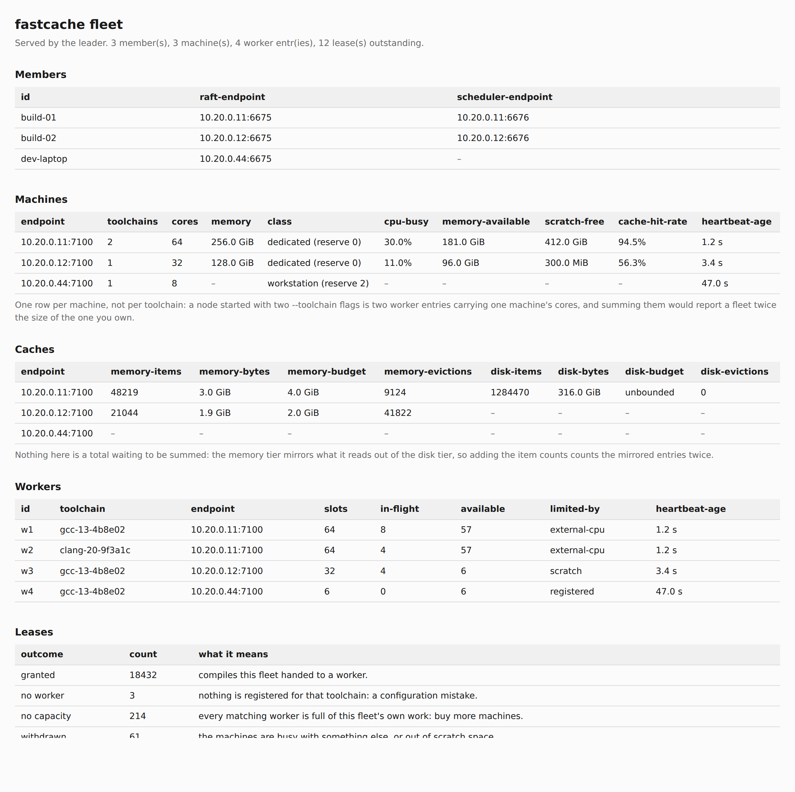

# fastcache-compile-node

A compile worker. It takes translation units that missed the cache and compiles
them, so a build is not limited to the cores of the machine running it.

It is the fleet's one binary, and it wears several hats. Compiling is the only one
it always wears; the rest are surfaces you switch on, and every section below is
about one of them:

| Role | What switches it on | Default |
|---|---|---|
| [A cache tier of its own](#a-cache-of-its-own) | `--cache-memory`, `--cache-dir` | on, 25% of RAM in memory, uncompressed |
| [Fleet scheduler](#a-cluster-and-who-leads-it) | the node's **mode**, and consensus | **on** — a first start is a cluster of one, and serves it |
| [Consensus member](#a-cluster-and-who-leads-it) | `--listen-raft`, and the mode | **on** (`6680`) — an empty `--listen-raft=` runs none |
| [The fleet's shared cache](#the-fleets-shared-cache) | `--cluster-set=shared-cache=<id>`, once, for the whole cluster | **off** — no machine is named |
| [Peer discovery](#finding-peers-instead-of-typing-them) | `--discovery` | **off** — **UDP**, unlike every other surface |
| [Metrics, and the fleet dashboard](#watching-one) | `--admin-listen`, `--dashboard` | **off** |

That is the list of **roles**, and it is not a firewall list — a role's default here
is not the address it binds for a given command line. For the ports, see
[Every port it opens](#every-port-it-opens) below, or generate the list from the
binary with `--print-surfaces`.

What it never does is **write to the shared cache**. A worker is given no
credentials for it: the object it produces goes back to the client that asked for
it, and the *client* stores it, so a rogue worker can poison only its own key
space.

This page is the reference. For why a node is shaped this way — who leads, what a
joining node does in order, and what decides whether a worker matches a client at
all — read [How it works](../how-it-works.md#who-leads-and-what-happens-when-that-changes).

## How the pieces fit

A node is up to four surfaces in one process: a **compile worker** always, and
optionally a **scheduler**, a **cache tier** and a **consensus member**. A client
misses its cache, asks the scheduler for a worker, sends that worker preprocessed
text, and stores the object it gets back.

[Cluster communication](../operations/cluster-communication.md) draws the whole
fleet and follows one compile across it, including the parts below the surface —
what the scheduler decides and on what evidence, and what the nodes say to each
other.

**Every refusal ends in a local compile.** No matching toolchain, no free slot,
another client already compiling this key, an unreachable worker — all of them
fall back. Distribution cannot fail a build; that is what makes it safe to leave
switched on in a fleet where machines come and go.

## Every port it opens

**Ask the binary, not this page.** `--print-surfaces` lists every port a given
configuration would bind, with its protocol, and exits without opening anything:

```console
$ fastcache-compile-node --print-surfaces --listen-node 6675 \
      --scheduler 127.0.0.1:6675 --node-id n1 --listen-raft 6680 \
      --discovery 192.168.1.255:6681
mode: solitary (no cluster minted yet; the first start mints one)

node              0.0.0.0:6675  TCP
admin             -             not served; set --admin-listen
raft              0.0.0.0:6680  TCP
discovery beacon  0.0.0.0:6681  UDP

dialled at:
  consensus endpoint  AT STARTUP  -- this machine's fully qualified name on the raft port, resolved when the node starts; give --raft-self to state it now

state directory:
  <state directory> (per-user: this process is not privileged, so it keeps its identity apart from the machine's service)

notes:
  node: a systemd .socket unit is served on this surface: the unit owns the address, …
  …
  discovery: UDP, and the only surface that is. … Without --discovery-reply-port the reply socket takes a kernel-chosen port, new at every start, and peers send their challenges and proofs TO it: a restrictive firewall has to let it in, INBOUND, by program, since no port rule can name it. …
```

That is a real run, with two kinds of substitution: `<state directory>` stands for the path this
machine printed (a per-user one here, since the run was not privileged; a service's is the
machine-wide one), and each `…` stands for text left out of a note. The worksheet exits `0`
only for a configuration the node would start with, which is why the command names a
`--scheduler`: without one it prints the same worksheet and then refuses, `--scheduler is
required`, with exit status `2`.

The first line is the node's **mode**, read from the formation record in its state
directory: `solitary`, `pending`, `learner` or `voter`. The mode, not a flag, decides
whether consensus runs, whether the `raft` row is served and whether the scheduler is.
Before the first start has minted a record it reads `solitary (no cluster minted yet; the
first start mints one)`, which is what that start will be. A learner's `raft` row reads
`not served (learner: dials the leader)`: it opens no consensus port, and dials every
voter instead.

The `dialled at:` block is not a port to open. It is the address peers dial for
consensus -- routinely not the `raft` row, because a bare `--listen-raft` binds the
wildcard -- and it is the one to compare against `--cluster-admit`'s receipt (see
[Membership at runtime](#membership-at-runtime)). This invocation names none, so the
block says when it will be known: `AT STARTUP`, this machine's fully qualified name on the
raft port. With `--raft-self 10.0.0.7` added it reads `10.0.0.7:6680`.

The `notes:` block is part of the output, not an afterthought: it carries the facts a
column cannot, including the one that says this list can be **wrong** for the compile
port. Do not clip it when pasting the worksheet to somebody.

Pass the flags you would actually run with. It prints what **that** configuration
serves rather than the defaults, so a widened `--listen-node 0.0.0.0:6674` shows
as the wildcard and a surface you never turned on says so and names the flag that
would. The node opens its ports from the same table this prints, so the list and
the sockets cannot disagree — which is the whole reason to generate a firewall
worksheet from the binary rather than transcribe one from documentation.

The surfaces, and what each is for:

| Surface | Flags | Default | Protocol |
|---|---|---|---|
| Node port — cache verbs, compile jobs, and the scheduler's where the mode serves them | `--listen-node` | `6674` — **always on**; a bare port takes the **wildcard** | TCP |
| Admin / metrics | `--admin-listen` | off; a bare port takes **loopback** | TCP |
| Consensus peer | `--listen-raft` | `6680`; the **mode** opens it (every mode but a learner's), an empty `--listen-raft=` closes it, and a bare port takes the **wildcard** | TCP |
| Discovery | `--discovery` + `--discovery-reply-port` | off; always binds the **wildcard** | **UDP** |

Several things on that table are easy to get wrong and expensive to get wrong:

- **Discovery is UDP.** Three TCP rules and one wrong one leaves a beacon that
  reaches nobody, and that presents as a fleet that never forms rather than as a
  firewall mistake.
- **`--discovery`'s address is where beacons are *sent*, not where they are heard.**
  Both of its sockets bind the wildcard whatever you write, so
  `--discovery=192.168.1.255:6681` opens `0.0.0.0:6681` — do not put the broadcast
  address in a firewall rule.
- **The reply socket's port is kernel-chosen unless `--discovery-reply-port` names
  it.** Discovery takes a **second** port, the one peers unicast their challenges and
  proofs to. Unnamed, the kernel picks it at every start, so a restrictive host
  firewall has to let it in — **inbound**, by program rather than by port — and a node
  that can hear beacons but not answer challenges completes no handshake.
- **Unless you name `--discovery`, the node beacons its summary on every eligible
  subnet** — its cluster id, node id and consensus endpoint, to each up interface's
  *directed* broadcast on port 6681 (a `/24` at `192.168.86.24` sends to
  `192.168.86.255`). **VPN-type adapters are included**: one that carries a real
  subnet is beaconed on like a LAN, so the summary reaches whatever that VPN's subnet
  reaches. The set is re-read on an interval, so a link that comes up later is beaconed
  on too. Never to `255.255.255.255`: the limited broadcast leaves by one interface the
  stack guesses, which on a machine with a VPN-type adapter is the adapter rather than
  the LAN. Loopback, down, link-local (`169.254/16`) and `/31`-`/32` interfaces are
  passed over, and so, on Linux and macOS, is a point-to-point or non-broadcast link
  such as a WireGuard `wg0` or a `tun`, whatever its prefix. A node with none left says
  so in its log with each interface and why, and names `--fleet-seed` and DNS SRV for a
  machine with no broadcast link.
- **Naming `--discovery` restricts beaconing to that ONE address.** It is used exactly,
  and no other interface is beaconed on. Name a directed broadcast
  (`--discovery=192.168.1.255:6681`), never `255.255.255.255`: named, the limited
  broadcast is exactly what you get, one guessed interface included.
- **A bare port does not mean the same thing on every flag.** `--listen-node 6674`
  and `--listen-raft 6680` bind the **wildcard**, because every node is a fleet
  participant and a port no peer can dial does nothing; the cache verbs on that port
  still answer this machine alone, whatever it is bound to. `--admin-listen 6677` binds
  **loopback**, and that is the sharpest of the three: it is what the dashboard's
  credential rule turns on, so widening that address is what makes a token required.

**One caveat `--print-surfaces` states and cannot compute.** Under systemd socket
activation the `.socket` unit owns the port, and `--listen-node` is read
by nothing, and this process is never told which port it got — so `--advertise`
becomes required and is what names where clients actually go. The command is run by
hand, never under the supervisor, so it cannot detect this; it prints the note
instead of guessing.

`--advertise` is deliberately **not** a surface. It is what this node tells other
machines to dial, not a socket it opens.

## Quick start

Three processes. A cache:

```sh
fastcached --listen=0.0.0.0:6674
```

A scheduler, which is a compile node rather than the cache — handing out capacity
is a decision only one node may make at a time, and the cache cannot establish
which node that is:

```sh
fastcache-compile-node \
    --listen-node=0.0.0.0:6675 \
    --raft-self=scheduler.internal \
    --fleet-open \
    --scheduler=127.0.0.1:6675 \
    --advertise=scheduler.internal:6675 \
    --toolchain=/usr/bin/g++
```

No flag makes it a scheduler. Its first start mints a **formation record** into its
state directory: a cluster of one, which it leads, and whose mode serves the fleet's
scheduler. That is consensus even on one machine — a scheduler signs every lease with its
own identity key and hands its workers a roster its cluster's voters certify
([#178](https://github.com/LASTRADA-Software/fastcached/issues/178)) — so consensus is on
by default (`--listen-raft` defaults to `6680`), and `--raft-self` says where another
member would dial it; without one, it is dialled at this machine's fully qualified name.
The same line with `--print-identity` added prints the key its workers name:

```sh
fastcache-compile-node --print-identity --raft-self=scheduler.internal
```

Give `--fleet-open` too: a scheduler that admits no other machine refuses every caller
but its own machine, which is the right default and not a working configuration.

A worker, on each machine that should take work:

```sh
fastcache-compile-node \
    --scheduler=build-cache.internal:6675 \
    --listen-node=0.0.0.0:6674 \
    --advertise=worker-01.internal:6674 \
    --fleet-open \
    --cluster-dir=/var/lib/fastcache-node \
    --toolchain=/usr/bin/g++
```

`--cluster-dir` is not optional: a worker proves **which machine it is** on every
connection to its scheduler, with an identity key it mints into that directory on its
first start, and the scheduler refuses every verb a machine joins the fleet with —
registering, announcing, heartbeating — on a connection that proved nothing. The
cluster admits that key once, either way round:

```sh
# on the worker: ask a member to enrol it, and wait for an operator to approve
fastcache-compile-node --cluster-dir=/var/lib/fastcache-node --enroll-from=build-cache.internal:6675

# or print its identity on the worker, and admit it from anywhere
fastcache-compile-node --cluster-dir=/var/lib/fastcache-node --print-identity
fastcache-compile-node --scheduler=build-cache.internal:6675 --cluster-admit-worker=<id>@<key>
```

A worker runs consensus like every node — `--listen-raft` defaults to `6680` — and checks
the lease a client presents against the voters of the cluster state it has applied, so it
names no `--voter-key`; one that does is refused at startup, since its cluster's own state
is the roster. That check is what makes `--fleet-open` over a bind that faces the network
safe: the node compiles only for a client holding a lease its cluster's voters issued. A
worker started with `--listen-raft=` runs none, and names the voters it trusts with
`--voter-key` instead — one flag per voter, each the `public-key` line its
`--print-identity` prints — or keeps the certified roster enrollment hands it. See
[A node proves which machine it is](#a-node-proves-which-machine-it-is-and-every-frame-after-it-is-sealed).

**`--listen-node` and `--advertise` are typed together or neither is worth
anything.** A bare `--listen-node` binds **loopback** on a worker, so naming only
`--advertise` tells peers to dial an address this node never accepts on; and naming
only `--listen-node=0.0.0.0:6674` advertises the wildcard, which resolves to the
*caller's* machine. Both are refused at startup by name; so, since
[#463](https://github.com/LASTRADA-Software/fastcached/issues/463), is naming
neither while `--scheduler` points at another machine. Whichever you got wrong, the
refusal names the flag and a working value.

All three refusals are scoped to a node that admits other machines, because that
is what says peers are meant to dial this worker at all. One that admits nobody but
its own machine refuses every dispatched compile — a different problem, which the
startup line reports rather than this table.

**A worker admits other machines by their keys**, and that is the half most easily
missed: the policy that gates a scheduler gates this node's *compile port* too
([#235](https://github.com/LASTRADA-Software/fastcached/issues/235)). A client on another
machine presents a **machine ticket** its own node mints, and this worker checks it
against the roster it holds — so a worker with a roster admits every machine the cluster
admitted, whatever address it dials from, and one with no roster admits its own machine
alone. See [who may use it](#who-may-use-it).

And the client, which is the launcher you already use:

```sh
export FASTCACHE_ADDR=build-cache.internal:6674
export FASTCACHE_SCHEDULER=build-cache.internal:6675
cmake -DCMAKE_CXX_COMPILER_LAUNCHER=fastcache-cc ...
```

Unset `FASTCACHE_SCHEDULER` and every miss compiles locally again, which is the
behaviour without this feature.

## `--advertise` is the flag to get right

The scheduler hands your string to clients **verbatim**. A worker that
advertises `127.0.0.1` is leased and then never answers, and the symptom is a
build that mysteriously falls back to local compiles on every machine but one.

It defaults to `--listen-node`, which is correct only when that already names an
address other machines can reach.

### Why a fleet worker still has to widen `--listen-node` by hand

Serving the scheduler moved a bare port to the wildcard; `--scheduler` and
`--fleet-open` did not, and
[#463](https://github.com/LASTRADA-Software/fastcached/issues/463) asked whether they
should. They did not, for the four reasons below — and the zero-config defaults have
since moved the default to the wildcard on every node (see the table above), on the
strength of admission rather than of the socket:

- **It would save one flag, and only after three others.** Widening the bind is what
  makes the compile verbs face the network, so a roster to check leases against becomes
  required;
  and the widened bind becomes the advertised endpoint, so `--advertise` becomes
  required too. A fleet worker still names four flags either way.
- **It would silence the message that teaches.** The refusal you get today for naming
  `--advertise` and leaving the bind alone *is* the fix, spelled out, while you are
  watching.
- **A defaulted `--listen-node` whose port is already held is a warning, not fatal**
  (see the table above). Today a fleet worker types that address, so a collision stops
  the node. Under a widened default the fleet-facing case would land on the warning
  path — no `0xFC` port, still registering, still leased, answering nothing.
- **A listening socket that widened itself on a predicate over three flags is a
  security decision nobody typed.** The cache verbs would stay closed —
  `CacheResponder` admits this machine alone whatever the bind is — but that is a
  property of today's responder set, not a promise about what is served there next.

What the ticket *did* find is that a worker naming neither flag — and naming a
membership flag and a `--scheduler` on another machine — was refused by nothing at a
hand start, while `--install-service` refused the same command line. That is now a
startup refusal as well.

## Anything the fleet reads has to be text

A value that leaves this machine has to be valid UTF-8, because every other
member reads it back: `/fleet.json` is JSON, the fleet page is HTML, `/fleet.txt`
is tab-separated text, and a chart is SVG. The flags that carry one are
`--advertise`, `--node-id`,
`--fleet-seed`, `--cluster-admit`, `--cluster-set`, and the
`<fingerprint>` half of `--toolchain=<fingerprint>=<compiler>`. A worker refuses
to start rather than registering a value the scheduler would then reject on every
heartbeat.

Valid UTF-8 is not the same as safe in every one of those formats, and this gate
deliberately does not try to be. A tab is valid UTF-8 and is legal XML `Char`
besides, so it passes here — and unescaped in a tab-separated row it would shift
every later column, while a newline would invent a row outright. Each encoder owes
its own format that much, exactly as the JSON encoder owes JSON its quotes, so
`/fleet.txt` spells out `\t`, `\n`, `\r` and `\\`. Narrowing the gate instead
would let a rendering concern decide what a machine may call itself.

Non-ASCII is fine — the rule is about the encoding, not about the alphabet. What
is refused is a byte sequence that is not UTF-8 at all, and on Windows that used
to be what a non-ASCII argument *became* on the way into the process. Every
binary here now declares UTF-8 as its code page, which Windows honours from
Windows 10 1903 and Windows Server 2022 onwards.

On an older Windows the declaration is ignored, and `chcp` does **not** help:
that sets the console's code page, while arguments are transcoded through the
system's *ANSI* one. A refused start says which code page this host is on. Either
keep those values ASCII, or turn on the system-wide *Beta: Use Unicode UTF-8 for
worldwide language support* setting, which is what makes `GetACP()` answer 65001
on such a host.

Paths are deliberately not covered by the rule — `--cache-dir` and the compiler
half of `--toolchain` name files on this machine and nowhere else, so whatever
this host calls a filename is accepted.

## Toolchains

**A worker surveys this machine at startup and serves what it finds.** Nothing has
to be typed:

```sh
fastcache-compile-node --scheduler=... --advertise=...
```

```
[INFO] found /usr/bin/g++ (usr)
[INFO] found /usr/bin/clang++ (usr)
[INFO] serving /usr/bin/g++ as 4f2c...
[INFO] discovered 2 toolchain(s) on this machine; pass --toolchain to serve a narrower set
```

### When a compiler is upgraded under a running node

**The node notices, and re-registers under the new fingerprint.** A worker
fingerprints its machine at startup and then runs for weeks, while `fastcache-cc`
recomputes per invocation — so without this, a compiler patched in place would leave
the node advertising the *pre-upgrade* digest while spawning the *post-upgrade*
compiler. Clients would receive objects built by a compiler they did not key against
and store them in the shared cache under the old key, where the whole fleet then
reads them ([#238](https://github.com/LASTRADA-Software/fastcached/issues/238)).

Each heartbeat re-checks the evidence the fingerprint was derived from — the
compiler binary's size and modification time, and the modification time of each
include search root. That is a handful of `stat` calls and **no compiler is
spawned**, so it costs a heartbeat essentially nothing. Only when something has
moved does the node pay for the full re-survey.

That pair of checks covers the two upgrades that happen in practice: a distribution
replacing `gcc` in place moves the binary, and a Windows SDK update that never
touches `cl.exe` moves an include root. A header *edited* in place under an
unchanged directory is deliberately not covered — a system toolchain's headers are
installed rather than edited, and catching it would mean the multi-second walk of
the whole include tree on every heartbeat.

When something did move:

```
[INFO] the toolchain behind 4f2c… changed on this machine; re-deriving what this worker serves
[INFO] no longer serving 4f2c… (/usr/bin/g++)
[INFO] now serving 9b71… (/usr/bin/g++)
```

The old fingerprint **stops being served immediately**, before the new registration
is announced. A client still holding a lease for it is refused `unknown-fingerprint`
and compiles locally — the ordinary fallback, counted by
`fastcache_worker_jobs_refused_unknown_fingerprint_total`.

A witness-driven check can only ever notice what it is already watching, so once
every fifteen minutes the node surveys the machine **unconditionally**. That is the
way back from serving less than the machine has: a toolchain dropped by a transient
probe failure, or removed and later reinstalled, rejoins on that sweep rather than
waiting for a restart. A sweep that finds nothing changed is not reported as a
change, so it costs the fleet no re-registration.

Two consequences worth knowing. An operator's pinned `<fingerprint>=<compiler>` is
**never** re-derived: it is not probed in the first place, and pinning a digest by
hand is how you force a fleet to agree while a machine is being repaired. And a
machine whose only compiler an upgrade removed or broke keeps running while serving
nothing, rather than exiting — the compiler may come back with the next package, and
a routine upgrade must not be able to take a machine out of the fleet permanently.
It says so, it retires its registry entries at once so the scheduler stops picking
it rather than dispatching for up to 90 seconds to a worker that would refuse every
job, and the next sweep is what brings it back:

```
[WARN] this machine now has no usable toolchain; serving nothing until one returns
```

`--toolchain` is an **override** that narrows that set:

```sh
--toolchain=/usr/bin/g++                 # this node computes the fingerprint
--toolchain=<fingerprint>=/usr/bin/g++   # or pin it explicitly
--no-toolchain-discovery                 # do not survey the machine at all
```

Naming any `--toolchain` pins the worker to exactly those; naming none means
"serve what this machine has". The two are never merged, because a merged set
would quietly re-add a compiler you had deliberately narrowed away.

A job names a **fingerprint, never a program**. The worker maps that fingerprint
to a compiler it serves and refuses one it does not have — which is the difference
between a build accelerator and a remote shell, and is why there is still no
default *compiler*. "No default" and "no discovery" are different claims: a
default is how a job ends up running against something nobody chose, while which
compilers a machine holds is a fact the worker can establish.

A compiler that is found but **cannot be executed** is dropped at startup, named,
with the layout that found it — rather than registering and failing every job it
is sent. So is one whose fingerprint would say nothing about which compiler it
is: a driver this build cannot ask for a version *and* whose include tree could
not be located digests to its own basename, which every install of that compiler
on earth would also produce. Pin such a toolchain with
`--toolchain=<fingerprint>=<compiler>` if you want it served anyway. A worker
that ends up with nothing to serve refuses to start and prints where it looked.

### Where it looks

| Layout | Where |
|---|---|
| `visual-studio` | `vswhere`, then every toolset under `VC\Tools\MSVC` |
| `visual-studio-llvm` | the same installation's bundled clang-cl, under `VC\Tools\Llvm` |
| `llvm-registry`, `llvm-program-files` | `HKLM\SOFTWARE\LLVM\LLVM`, `%ProgramFiles%\LLVM` |
| `msys2`, `mingw-w64` | `C:\msys64\{ucrt64,mingw64,clang64}`, `C:\mingw64` |
| `usr-local`, `usr` | `/usr/local/bin`, `/usr/bin` — version suffixes included (`g++-13`) |
| `macports`, `homebrew` | `/opt/local/bin`, `/opt/homebrew/bin` |
| `xcode` | `xcrun --find` |

**Visual Studio is two rows, not one.** It ships clang-cl itself, under
`VC\Tools\Llvm` rather than beside `cl`, and the three LLVM rows all describe a
*standalone* install. A machine whose only clang-cl came with Visual Studio would
otherwise advertise no clang-cl toolchain at all — its clang-cl builds would still
be **cached**, since a launcher needs no worker for that, and could never be
**dispatched**, since nothing advertised the fingerprint. `vswhere` is still run
once: the two rows share its answer.

Only the bindir matching this machine's own architecture is offered, from either
row. The other holds a compiler built for a different *host*, which this machine
cannot run.

The fingerprint is a digest of the compiler's version banner **and its whole
include tree**, so two machines with the same compiler at different install
prefixes match, while two machines whose headers differ do not. The banner names
the target as well as the version — `... Version 19.51.36252 for x64` — which is
what tells the x86 and x64 `cl.exe` of one toolset apart, since those two share an
include tree exactly. Matching is
byte-identical and cannot be loosened: an over-strict match costs a local
compile, an over-loose one produces a silently wrong object that is then stored
under a key other machines fetch.

Computing it walks the include tree, which takes a few seconds the first time a
machine sees a toolchain and is cached afterwards.

**Which tree, per driver.** GCC and Clang are asked directly (`-E -v`), and so is
`clang-cl` (`-print-resource-dir`). `cl` prints no search list at any verbosity, so
its tree is read off its install layout instead: the `VC\Tools\MSVC\<version>`
toolset it lives inside, plus the newest Windows SDK the registry names. (Its
*version* it does state — on every invocation, which is why it is asked for it with
no options at all.) `clang-cl` covers only its own resource
directory, `<prefix>\lib\clang\<version>\include`: it borrows the VC toolset and
the SDK rather than owning them, and a worker compiles text the client already
preprocessed, so it opens no header from either.

Neither takes its answer from `INCLUDE`, which a developer command prompt sets
and a Windows service never inherits — that is why a service-run worker and a
developer-prompt launcher agree. `cl` still falls back to it for a driver outside
any `VC\Tools\MSVC` layout, because a banner alone cannot see a patched header;
`clang-cl` never does, since it owns a resource directory it can be asked for.

### When no worker matches

The launcher reports `not dispatched (rejected (no-worker): ...)`. Ask both ends
what they think the fingerprint is:

```sh
fastcache-cc --print-toolchain-fingerprint /usr/bin/g++   # on the client
journalctl -u fastcache-compile-node | grep 'serving'     # on the worker
```

They must be identical. If they are not, the two machines really do have
different toolchains — different patch releases, different SDKs, a vendored
header that differs. `--print-toolchain-fingerprint` recomputes rather than
reading the cache, so it also repairs a stale entry on its way past.

### A node that never appears in the fleet at all

A pinned fingerprint is yours to choose, and it has to be **text** —
specifically, valid UTF-8. So do `--advertise` and the version the node reports
about itself. A scheduler refuses a registration that is not, with
`malformed-registration` naming the offending field, and the node says so at
warn when it starts, then at info every ten minutes while it lasts (every
heartbeat in between is debug):

```
scheduler scheduler.internal:6675 did not register a1b2c3:
  rejected (malformed-registration): fingerprint is not valid UTF-8
```

It is refused rather than cleaned up because a fingerprint is matched byte for
byte: a worker admitted under a repaired name would match no client's toolchain
and would sit in the fleet registered and never picked. The leader counts it as
`fastcached_dispatch_worker_registrations_malformed_total`, which is the only
trace a peer that never says anything else leaves behind.

The commonest way to produce one is a `--toolchain=<fingerprint>=...` label
typed in a shell whose encoding is not UTF-8. A computed fingerprint is hex and
cannot hit this.

### After an election, a node re-points itself

`--scheduler` names **a** member of the fleet, not the current leader. A
scheduler that is not leading refuses every verb — registration included — and
says where the leader is, so a node follows that and announces itself there
instead:

```
scheduler scheduler.internal:6675 is not the leader; announcing to 10.0.0.7:6675 instead
```

At `info`, and once — the endpoint that answered is remembered, so a fleet in
steady state does not pay a redirect on every heartbeat. Nothing has to be
re-pointed by hand, and `--scheduler` can keep naming a machine that has not led
for months.

Two things follow that are worth knowing when reading logs:

- A remembered leader that stops answering is dropped immediately and the
  configured `--scheduler` values are tried again **in the same heartbeat**, not the
  next one. That is the `scheduler 10.0.0.7:6675 unreachable; trying
  scheduler.internal:6675` line, and it means the node was out of the fleet for a
  connect timeout rather than for a whole interval. The same line names the next
  value when one of several `--scheduler`s does not answer; with none left to try it
  ends at `unreachable`.
- That line, and every refusal line in this section, is said at `warn` **once**, when it
  starts -- not once per heartbeat. While it lasts the node says so again at `info` every
  ten minutes (`scheduler … unreachable -- still, after 600s`), and when it ends it says
  so at the level of the loudest line said about it (`scheduler … reachable again after
  1260s unreachable`). Every heartbeat in between is `debug`. One scheduler gets at most one
  `warn` LOSS (and its recovery) every ten minutes, so a link that keeps dropping, or a
  scheduler that changes from refusing to unreachable and back, says the rest at `info` or
  `debug`. The worker's
  heartbeat and the machine's presence announcement share that record, so a machine
  running both says each change once. While any scheduler does not answer, `--node-status`
  also shows the `scheduler-unreachable` condition.
- The chain is bounded at two hops. Two schedulers that disagree about who leads
  — a partition healing — produce `gave up following leader redirects` and the
  node simply tries again next heartbeat. Seeing that line *repeatedly* is worth
  investigating; seeing it once around an election is not.

A node whose own registration is refused for any other reason still reports it
on its own transitions, as above — a redirect is the one refusal that is not a
problem.

### A change the leader will not record

The flags above are refused by the binary an operator typed them into. The
scheduler refuses the same values again when they arrive as a request, whoever
sent them — a client built before that check existed, or a peer — because a
cluster change is committed through consensus and an entry is applied *after* it
commits, with nobody left to refuse it:

```
$ fastcache-compile-node --scheduler=scheduler.internal:6675 --cluster-admit='...'
a member id is not valid UTF-8
```

**`--cluster-forget` is deliberately exempt, at both ends.** Its operand *is* the
offending id, so a check covering it would make a member that reached replicated
state through an older peer impossible to remove — and it would count towards
quorum forever.

### A machine is admitted and forgotten by its key

An address is not an identity, so the cluster records no host for anybody: a machine is
admitted by the identity key it proves and forgotten by revoking that key. So a member is
never admitted without one -- `--cluster-admit=<id>=<host>:<port>@<key>`, or a re-admission
of a member whose key is already recorded -- and a forget that would revoke nothing is
refused by name before it is proposed:

```
$ fastcache-compile-node --scheduler=scheduler.internal:6675 --cluster-admit=pc-9=10.0.0.9:6680
pc-9 would be admitted with no identity key; a machine is admitted and forgotten by its key, so give --cluster-admit=pc-9@<key>
```

A forgotten machine is refused at every door, from any address, once its connection proves
the revoked key or presents a ticket signed by it; the refusal is counted as
`fastcache_node_requests_refused_key_revoked_total`, apart from a stranger's, because *a machine
you removed* and *a machine nobody admitted* are opposite diagnoses. Only a connection that
PROVED the key is told why. One that showed it in a ticket is answered in a stranger's words: a
ticket is bytes anybody may have captured, and *revoked* would tell its holder that the machine
was forgotten. On a node that is not `--fleet-open`, the counter is the only place the two
differ. **On a `--fleet-open` node the holder does learn it**: an unknown ticket or no ticket
at all is served there and a revoked one is not, and the self form of `explain-admission`
answers the revoked ticket *refused* where a stranger is told *admitted, by fleet-open* -- the
forget biting where it must, and the one place it is visible. The address it used is nothing to
anybody afterwards: another machine there is judged on its own key.

Because admission is a **fold** over several routes -- this machine, `--fleet-open`, the key a
caller proved and the ticket it presented -- the question *why is this machine still served*
rarely has one answer. Ask the node that is behaving oddly:

```console
$ fastcache-cli explain-admission pc-07 --addr=worker-07.internal:6677
subject     pc-07
standing    learner
verdict     admitted
decided-by  proven-key, ticket
```

It names **every route that decided**, not only the winning one, and where the machine stands in
that node's roster. And because the answer is that node's own fold, two nodes disagreeing about
one machine is the finding -- invisible from any single one of them. With no operand it answers
about the connection asking, which a machine the node refuses can ask too.

## A cache of its own

A node can hold a cache tier in front of the shared `fastcached`, and point the
launcher at itself:

```sh
fastcache-compile-node \
    --listen-node=6677 --cache-memory=8g \
    --upstream=build-cache.internal:6674 \
    --scheduler=scheduler.internal:6675 \
    --advertise=worker-01.internal:6677 \
    --cluster-dir=/var/lib/fastcache-node \
    --toolchain=/usr/bin/g++
```

```sh
export FASTCACHE_ADDR=127.0.0.1:6677   # the node, not the shared cache
```

### Why a second copy is not redundant

The shared cache already holds every object, so caching them again on the node
looks like waste. What the tier saves is not the compile — it is the **round
trip**. A developer who rebuilds the same tree twenty times a day pays that trip
twenty times for objects that never left their machine, and on a slow or lossy
link that is the difference between a cache that helps and one that hurts.

Four rules, and none of them is the obvious choice:

- **A local hit does not consult the upstream at all.** Revalidating would move the
  round trip rather than remove it. It is safe by construction: an object key is a
  digest over the preprocessed text, the arguments, the compiler identity and the
  dependency set, so a key that matches names the same object.
- **A local miss populates the tier from the upstream.** Without that the tier is a
  proxy and the second build is exactly as slow as the first.
- **A store writes local first, then offers upstream.** The local write must not fail
  for a reason the network chose. Offering it to the fleet is best-effort: a shared
  cache that cannot be reached costs the fleet one entry and costs this machine
  nothing.
- **An unreachable shared cache is a miss, not an error.** Every caller compiles
  either way, so a build never fails because a cache was down.

`scripts/dist-compile-e2e.sh` asserts the first of those by **stopping the shared
cache** and requiring the next compile to still hit, with a byte-correct object.

### Two halves, each named separately

The tier is an in-memory store, an on-disk store, or both — the same
`LayeredStorage` the daemon's `--storage` builds, an LRU mirror over a canonical
B+tree:

| Configuration | What you get |
|---|---|
| `--cache-memory=8g` (the default is 25% of RAM, within `512m`–`8g`) | Memory only. Fast, and gone at restart. |
| `--cache-dir=/var/cache/fastcache-node` | Both halves: the memory tier in front of a store that survives a restart. |
| `--cache-memory=0 --cache-dir=…` | Disk only. |
| `--cache-memory=0` and no `--cache-dir` | **No tier at all**, which is what a node that only compiles for others wants. |

A release that changes the on-disk record layout refuses an older `--cache-dir`
store at startup rather than mis-reading it. Convert it with
`fastcache-compile-node --migrate-cache --cache-dir=…`, with the worker stopped;
see [Upgrading a store](../operations/upgrading-a-store.md).

`--cache-memory` takes bytes (`k`/`m`/`g` = KiB/MiB/GiB, or a bare count with an
optional `B`) or a share of host RAM (`N%`) — the vocabulary its own default is
stated in, so "a quarter, but half of that" is `--cache-memory=12%` rather than
arithmetic you do per machine. **Zero turns the tier off**; it does not mean
"unbounded", which is what zero means to the store underneath.

Whatever the node logs at startup can be typed straight back to pin it, and pinning
it that way survives `--install-service`: the flag is written into the unit because
you *stated* it, not because it differs from the default — otherwise typing the
machine's current quarter would look identical to saying nothing, and the service
would go back to re-deriving from RAM at every start.

**The tier's memory is subtracted from what a compile can have.** A node budgets
one job per gigabyte of RAM, and its own cache is resident memory that is not going
to yield — so a 64-thread host with 32 GiB used to offer 32 slots *and* hold 8 GiB
of cache, which is forty gigabytes of promises on a thirty-two gigabyte machine. It
now offers 24. The figure travels with the registration, so a node that asks the
scheduler to size it (by naming no `--slots`) gets the same answer at the other end,
and a peer too old to report it is sized exactly as it always was.

**What is subtracted is what the tier actually holds, not what you asked for.** A
node that ends up with no tier subtracts nothing and offers the whole machine. Two
ways of ending up there leave `--cache-memory` reading as though it still meant
something: `--cache-memory=0` with no `--cache-dir` leaves nowhere to keep objects
and so builds no tier, and a *default* `--listen-node` that something else already
holds — a `fastcached` on the same box, usually — is a warning the node carries on
past. Both used to reserve the
configured budget regardless, so on a 32 GiB machine such a node held back the
default 8 GiB it was not using and offered 24 slots where it could serve 32. A
disk-only cache (`--cache-memory=0 --cache-dir=…`) is resident nowhere and so
subtracts nothing either, which is the one case that was always right.

The default follows the machine because the machines this runs on vary by more
than an order of magnitude, and one object file is routinely megabytes: a cache
sized for a laptop is close to useless on a 96 GB workstation, and a flat number
misses on exactly the rebuild the tier exists to serve. The clamp is what makes a
fraction safe at both ends — a small laptop still gets a cache worth having, and a
512 GB build server does not silently take 128 GB resident for one.

`--cache-disk` caps the on-disk half, which is otherwise allowed to grow as
needed — the same default `--storage-max-disk` has on the daemon. On a build
server that is usually right; on somebody's workstation it usually is not.

!!! note "One node per `--cache-dir`, and the store enforces it"

    The store claims its file exclusively for the life of the process, so a
    second node pointed at one directory refuses to start and says so:

    ```
    --cache-dir cannot open /var/cache/fastcache-node/objects.cow: another process
    already has this cache open. A --cache-dir belongs to one node; give this one a
    path of its own.
    ```

    If a machine runs several nodes — one per toolchain is a common shape — give
    each its own path. Nothing is written to the file to do this, so a store is
    readable by any build either way.

    Some filesystems cannot enforce this — network mounts and user-mode
    filesystems that either refuse to lock or accept a share mode and ignore it.
    The node checks rather than assumes, starts anyway, and warns that nothing
    is stopping a second one. That is the only case where the rule is still
    yours to keep.

Its reads and writes happen on the reactor thread the node's framed surfaces
share, so a large store can briefly delay other connections on it
([#136](https://github.com/LASTRADA-Software/fastcached/issues/136)). Worth
knowing before profiling a node that feels slow under load.

### Compressing what each tier holds

Both halves take a codec, spelled exactly as `fastcached` spells it, and the two are
independent:

| Flag | Applies to | Default |
|---|---|---|
| `--compression`, `--compression-level`, `--compression-min-bytes` | the `--cache-dir` half | `zstd`, level `3`, above `256` bytes |
| `--memory-compression`, `--memory-compression-level`, `--memory-compression-min-bytes` | the `--cache-memory` half | **off**, level `3`, above `4096` bytes |

The disk half has always compressed with zstd; these flags only give you the dial
that was already turning. The memory half has never compressed, and still does not
unless you say so — turning it on by default would change the CPU cost of every
existing node on upgrade.

**Naming a codec for the memory tier makes `--cache-memory` hold more, not less.**
The in-memory budget counts the bytes a value actually occupies, so compressing them
is what lets a given budget hold more entries — compile-cache objects with debug
information compress well. What it costs is a decompress on every read, paid on the
hit path. That trade is worth making when the working set is larger than the budget
and not when it fits comfortably inside it.

**The two budgets are denominated differently, and it is worth knowing which.**
`--cache-memory` bounds *compressed* bytes — what the tier occupies in RAM.
`--cache-disk` bounds *logical* bytes: the store accounts a value at its
pre-compression size, so a compressed disk tier reaches its cap holding that much
original data while occupying less than that on the filesystem. `--cache-disk=36g`
with zstd is therefore 36 GB of objects, not 36 GB of file.

Changing a codec needs no migration and no `--migrate-cache`: every record carries
the codec it was written under, so reads keep decoding correctly and only later
writes follow the new setting. A store written by a mixed sequence of settings is
readable throughout.

`none` is always available; `lz4` and `zstd` depend on
`FASTCACHED_ENABLE_COMPRESSION`, and **which half of that rule you meet depends on
whether you named the codec or inherited it.** A codec you *name* is refused by name
at startup:

```
--memory-compression=zstd: codec 'zstd' is not available in this build
(rebuild with FASTCACHED_ENABLE_COMPRESSION)
```

The disk half's **default** is `zstd`, and a default is typed by nobody and validated
by nothing — so on a build without those codecs it is not refused. The tier falls
back to storing plaintext, the startup line reports `none` rather than the `zstd` that
was configured, and a warning says why. That is deliberate: refusing would stop a
build that never asked for compression from running at all.

A codec configured for a half this node does not build **is** refused, because a
setting that reaches nothing looks from every surface exactly like one that works:
`--memory-compression*` with `--cache-memory=0`, and `--compression*` with no
`--cache-dir`, each name their remedy and stop the node. A default you did not type
never triggers this.

All six settings are read once at startup and are **not** reloadable: the tiers are
built as the node starts and nothing can reach them afterwards, so a reload that
appeared to change a codec would be a configuration claiming something about a live
tier that is not true.

Which codec each tier actually holds is on the startup line, because nothing else
reports it — and it is the **effective** codec, not the configured one, so a build
without the codec reads `none` here rather than claiming a compression it is not
doing:

```console
local cache tier (memory 36G zstd, disk 36G zstd at /var/cache/fastcache-node, upstream none)
```

### `--upstream` may be empty

That is the honest configuration for one developer's machine, not a broken one: the
tier caches locally and never tries to reach a fleet. On a node that runs consensus, an
empty `--upstream` is also what lets the fleet's
[`shared-cache` setting](#the-fleets-shared-cache) decide where the tier reads through
to.

### An unreachable `--upstream`

A shared cache that does not answer -- a dial that does not connect, or a connection
that stalls until the per-operation timeout or loses its peer -- is remembered as
unreachable for ten seconds. Inside that window a local miss is answered as a miss and a
store is not offered upstream, without dialling, so a build with the shared cache down
pays at most one timeout every ten seconds rather than one per miss. The first operation
after the window tries again, and one that gets any answer ends the window at once. A
store skipped this way counts in `fastcache_node_cache_upstream_store_failures_total`,
exactly as a refused one does: the fleet did not get the object either way.

### Reading it

Eight counters on `/metrics`, and the splits are the point:

| Series | Says |
|---|---|
| `fastcache_node_cache_hits_total` | Served without touching the network. |
| `fastcache_node_cache_misses_total` | The local tier did not hold it. |
| `fastcache_node_cache_upstream_hits_total` | The shared cache answered after a local miss. |
| `fastcache_node_cache_fill_failures_total` | The upstream supplied it and the local tier refused. |
| `fastcache_node_cache_store_failures_total` | A local write failed — this one is reported to the client. |
| `fastcache_node_cache_upstream_stores_total` | The fleet accepted an object this node offered. |
| `fastcache_node_cache_upstream_store_failures_total` | The fleet would not take it. Zero on a node with no shared cache — see below. |
| `fastcache_node_cache_requests_refused_not_local_total` | A caller that is not on this machine asked this tier for something. The node port faces the network on every node, so this counts other machines: ordinary on a node clients are pointed at for the scheduler — peers reaching the right host for the wrong verb — and, anywhere else, something off-box asking for this machine's build output, which [#287](https://github.com/LASTRADA-Software/fastcached/issues/287) withdrew from peers — give them a shared `fastcached` via `--upstream`. |
| `fastcache_node_upstream_configured` | `1` when this node has a shared cache to read through to, `0` when it does not. Absent on a node running no cache at all. |

### The operator verbs

`node-status` and `node-metrics` are answered over the `0xFC` port to **fleet
members**, and `fastcache-cli node` / `fastcache-cli node-metrics` are what read
them. They report what this process is — version, minted identity, uptime, the
components it actually started, the ports it opened, and **how far its worker has
got in identifying the toolchains it will serve** — and, through `node-metrics`, the
reading `/metrics` renders: every counter this build carries, the cache tier's storage
and per-tier figures, and the host figures beside them. It is one reading in the
encoding a live-stats cache subscription streams, so a node with no `--admin-listen`
still shows what its cache tier holds and how many drops it has served.

That last one is the answer to *why is this node not taking any work*, and it is
the reason these verbs are worth reaching for on a default install: a node serves
while it identifies its toolchains, so between start and the heartbeat thread's
first completed round it runs a worker that can honour nothing. `toolchains`
reports `surveying`, `serving` or `nothing-to-serve` with the counts beside it; the
component mask cannot, because its `worker` bit is a constant on this binary.

Beside it they report **what that worker is offering** (`compile-slots`,
`compiles-in-flight`), **whether a scheduler knows about it** (`registrars-registered`
of `registrars-total`, and `last-registration-seconds-ago`, which is **absent** when
none ever has), and **this node's consensus role** (`scheduler-role`, plus the `leader`
it would redirect to). The last one closes the gap the dashboard already covers and the
CLI did not: a leading scheduler and a following one are identical in the component
mask, and a follower's registry is empty and reads exactly like an idle fleet.

Together that is the first ten seconds of diagnosing a node with no `--admin-listen`,
over a port that is up by definition and gated on fleet membership.

They are gated on membership, and membership is a key: the node checks no password, so
there is none to demand. Loopback is always a member; a remote caller is admitted by a key
the roster holds — a proof, or a machine ticket — or by `--fleet-open`. What they hand over
is no more than `/metrics` already serves unauthenticated.

| Counter | What a rise means |
|---|---|
| `fastcache_node_status_requests_refused_not_a_member_total` | An operator verb was refused because the caller is not a fleet member: `node-status`, `node-metrics`, or `explain-admission` asked about a machine (asked about the caller's own connection, it is answered to anyone and moves nothing). Unlike the cache tier's not-local refusal this is not ordinary on any deployment: a steady rise is `fastcache-cli` run from a machine the cluster has not admitted, or has forgotten, and a burst from one host is somebody scanning. |
| `fastcache_node_status_requests_refused_payload_too_large_total` | A header declared more payload than these verbs may carry. `node-status` and `node-metrics` are **fieldless**, so against either this came from no client of this tree at any version. `explain-admission` carries one subject -- a machine id or a 43-character key -- under its own 512-byte ceiling, and is reachable before admission, so against it this is an operand no roster could name or a stranger probing the port. Never sum it with the cache tier's row of the same name. |
| `fastcache_node_admission_explanations_refused_malformed_total` | An `explain-admission` arrived that was not exactly one field naming its subject. No shipped client can build one -- the CLI encodes it through `EncodeExplainAdmissionRequest` -- so a rise is a client of another build or somebody probing the port by hand, and the two are told apart by whether anything else on this surface refuses at the same time. Kept apart from the node-status refusals, which are fieldless verbs and cannot arise from the same mistake. |
| `fastcache_node_status_requests_refused_endpoint_busy_total` | The surface had no bytes left in flight. These are the verbs somebody reaches for when a node is in trouble, so this is the node saying it is too busy to say what it is. Read it beside `fastcache_node_cache_requests_refused_endpoint_busy_total`, never summed: this says the diagnosis failed, that says why. |

#### A host the cluster has forgotten

One counter for the whole node rather than one per surface, because the answer does not
depend on which door the caller knocked at:

| Counter | What a rise means |
|---|---|

**Never sum it with a `..._refused_not_a_member_total` row**, and it does not double-count
into one: a forgotten host is refused through this counter *instead*, so the
`not_a_member` rows keep meaning what they always did -- a host nobody ever listed. The
two are opposite diagnoses. A stranger is something to go and investigate; a forgotten
host is something an operator already decided, and a rise means the other end has not
been told.

Zero is the ordinary reading, including on a node with no cluster at all, which never
classifies anybody as forgotten. It is an honest zero rather than an absence: the series
is rendered by every node.

### Live stats

`fastcache-cli live-stats` subscribes over `0xFC` and this node pushes what the dashboard draws, instead of the dashboard polling `/metrics` and `/fleet.txt` ([#1399](https://github.com/LASTRADA-Software/fastcached/issues/1399)).

| Counter | What a rise means |
|---|---|
| `fastcache_live_subscriptions_opened_total` | A `fastcache-cli live-stats` session subscribed and was granted a stream. One per dashboard opened against this node; a climb nobody explains is a client re-subscribing in a loop rather than holding its stream. |
| `fastcache_live_snapshots_rendered_total` | A snapshot was rendered for a subject. **Once per subject per tick, whatever the number of watchers** -- read it against the opened count: a rate that grows with the number of dashboards rather than with time is the render being paid per watcher again. |
| `fastcache_live_snapshots_skipped_total` | A subscriber was still writing a previous snapshot when the next was due, so it was sent the newest and told how many it missed. **The node never waits for a slow watcher**; a rise is a slow link or a stalled terminal on the watching side. |
| `fastcache_live_subscriptions_revoked_total` | A stream ended because its peer stopped passing the gate -- a reload or a replicated removal revoked a host that was still watching. Removal fails open unless something re-checks live connections; this is that re-check acting. |
| `fastcache_live_subscriptions_ended_not_leader_total` | A fleet stream ended because this node stopped leading; the watcher was told where the new leader is and follows it. A rise with no election you know of is leadership flapping. |
| `fastcache_live_subscriptions_refused_at_capacity_total` | A subscription was refused because the node already streams to its maximum number of watchers. Long before a team reaches it, dashboards left open everywhere do. |
| `fastcache_live_subscriptions_refused_unauthenticated_total` | A fleet subscription was refused: a wrong or missing dashboard credential, or a remote peer while no `--dashboard-token-file` is configured. The fleet map is behind the same credential here as on `/fleet`; a burst from one host is somebody guessing. |
| `fastcache_live_subscriptions_stalled_total` | A stream ended because a single push stayed unwritten past its bound -- the watcher stopped reading altogether, so its buffers were released rather than held. |
| `fastcache_live_subscriptions_ended_by_client_total` | A watching client closed its stream -- the ordinary way a dashboard ends. Opened minus this, minus the ended rows above, is the streams still open. |
| `fastcache_live_subscriptions_ended_by_reset_total` | A watching client reset its connection instead of closing it -- a dashboard killed while pushes were still unread does this. Counted apart from the orderly close, because only a reset says the watcher went away abruptly. |
| `fastcache_live_subscriptions_refused_not_a_member_total` | A subscription was refused because its peer is not a fleet member. Live stats stream to the same peers `NodeStatus` answers; a burst from one host is a stranger probing the port. |
| `fastcache_live_subscriptions_refused_malformed_total` | A `SUBSCRIBE` did not decode, or named a subject this build does not serve. No client of this tree sends one; a rise is a client of another build, or not a client at all. |
| `fastcache_live_subscriptions_refused_payload_too_large_total` | A `SUBSCRIBE` header declared more than the control payload the verb is bounded to, and was refused before a byte of it was read. No client of this tree at any version sends one. |
| `fastcache_live_subscriptions_refused_endpoint_busy_total` | A subscription was refused because the `0xFC` listener's in-flight byte budget was full of other requests. The dashboard retries; a rise says the view went missing exactly when the node was busiest. |

### The fleet document over `0xFC`

A `fleet-text` request reads the fleet document once, one section or all of them, over `0xFC` rather than `/fleet.txt` over HTTP ([#1391](https://github.com/LASTRADA-Software/fastcached/issues/1391)) -- so a fleet table is readable from a leader that serves no admin surface at all. `fastcache-cli fleet <section>` is its client, and follows a follower's `not-leader` to the leader. The text is the route's to the byte: both answer from one function, which parses the section and the range and renders the document, so neither door has a renderer of its own.

It is admitted as the fleet subject of a subscription is, by the same decision: a fleet member, then the dashboard credential (or, with no `--dashboard-token-file`, this machine only), then leadership. A follower refuses `not-leader` naming the leader, and the client follows it; a node running no scheduler says the fleet is served elsewhere; a section or a range this build does not serve is `unknown-fleet-selector`, listing the ones it does. None of those three is counted -- the first two are what a healthy fleet answers a client pointed at the wrong node, and the third is a typo its typist already sees.

| Counter | What a rise means |
|---|---|
| `fastcache_fleet_text_requests_refused_not_a_member_total` | A fleet read was refused because its peer is not a fleet member. The fleet is read by the same peers a subscription to it streams to; a burst from one host is a stranger probing the port. |
| `fastcache_fleet_text_requests_refused_unauthenticated_total` | A fleet read was refused: a wrong or missing dashboard credential, or a remote peer while no `--dashboard-token-file` is configured. The fleet map is behind the same credential here as on `/fleet`; a burst from one host is somebody guessing. |
| `fastcache_fleet_text_requests_refused_malformed_total` | A `fleet-text` request did not decode. No client of this tree sends one; a rise is a client of another build, or not a client at all. |
| `fastcache_fleet_text_requests_refused_payload_too_large_total` | A `fleet-text` header declared more than the control payload the verb is bounded to, and was refused before a byte of it was read. No client of this tree at any version sends one. |
| `fastcache_fleet_text_requests_refused_endpoint_busy_total` | A fleet read was refused because the `0xFC` listener's in-flight byte budget was full of other requests. A rise says an operator asked for the fleet exactly when the leader was busiest. |


Read the two upstream counters beside the gauge, never on their own. They are
cumulative, so a node with **no** shared cache and a node with one it has not yet
written to both report zero — the counters cannot tell those apart and the gauge is
what does. Until
[#214](https://github.com/LASTRADA-Software/fastcached/issues/214) the failure
counter answered the question the wrong way round: a node with no upstream counted
every local store as an upstream failure, so a single-machine install reported a
100 % failure rate against a shared cache it never had.

The alert worth writing is `fastcache_node_upstream_configured == 1` **and** a
rising failure counter. That is a fleet whose shared cache is unreachable. Without
the first clause it fires on every laptop.

A high **upstream**-hit rate against a low **local**-hit rate means the tier is too
small for this machine's working set — a different problem from a fleet that is
missing a lot, and a different fix. An upstream *store* failure says the fleet is
unreachable; a local store failure says this node is broken.

Beside them, what the tier is holding. `fastcached_items`, `fastcached_bytes_used`
and `fastcached_bytes_limit` describe the cache as a whole, and a per-tier set
carries the split a merged view cannot:

| Series | Says |
|---|---|
| `fastcached_tier_items{tier="memory"\|"disk"}` | Live entries in that tier. |
| `fastcached_tier_bytes_used{tier=…}` | Bytes it holds. |
| `fastcached_tier_bytes_limit{tier=…}` | Its budget; `0` means unbounded. |
| `fastcached_tier_evictions_total{tier=…}` | Entries it dropped to stay inside that budget. |
| `fastcached_tier_index_bytes{tier=…}` | Resident memory its key index costs. Always RAM, even for a disk tier, so it is **not** comparable with `bytes_limit` and must not be added to it. |

**Do not sum across tiers.** The memory tier mirrors what it reads out of the disk
tier, so adding the two item counts counts the mirrored entries twice — and the
unlabelled `fastcached_*` series above are already the cache's own totals. What
each label answers is "how is *this* tier doing": whether the mirror is populated,
which tier is evicting, how close the disk half is to `--cache-disk`.

A tier the node does not run emits **no line at all** rather than a zero. A
memory-only node has no `tier="disk"` series, which is a different claim from a
disk tier standing empty.

### It answers where `fastcache-cc` already looks

`--listen-node` defaults to port **6674** on loopback — the address the launcher uses
when nobody sets `FASTCACHE_ADDR`, and the one `cmake/portable/CompileCache.cmake`
passes. So the whole thing works with no configuration: start a node, build, and
the launcher finds it.

**It is one port for every verb family this node answers, and it is the only one.**
The cache verbs are answered here always; the scheduler verbs are answered here too
wherever the node's mode serves them, which a first start's does; and **`COMPILE` is
answered here as well**, by the same worker, against the same slot count and the same
member list. A bare port binds the wildcard, because a scheduler or a worker no peer can
dial does nothing. There is no second listen flag to set, and no way for two to end up
on addresses that disagree.

A worker used to open a dedicated compile port beside this one, configured by flags
of its own. It does not any more: `--listen-node` is what a worker advertises and
what a dispatched compile arrives on, so there is one address to open in a firewall,
one address in a lease, and one address to get wrong.

That port is also `fastcached`'s, and what happens when both want it depends on
whether **you typed the address**:

| `--listen-node` | Port already held |
|---|---|
| defaulted | Warned, and the node starts **with no 0xFC port at all** — no local tier and no `COMPILE`. Your builds reach the daemon on that port instead, so local caching still works; but this node no longer has a second port for dispatched compiles to arrive on, so it can serve none. It still registers with its `--scheduler` and advertises that address, which means clients are leased an endpoint nothing is listening on. Do not run a node and a `fastcached` on one machine: the node answers every verb the daemon does. |
| named by you | Fatal. The node refuses to start and says so. |

The asymmetry is the point: a node sharing a machine with `fastcached` should not
refuse to start over a convenience nobody requested, while an address an operator
typed is a promise and a broken promise is fatal. Neither is silent. Give one of
them a port of its own if you want the node's tier as well.

**"Named by you" means you typed the flag, not that you typed something unusual.**
`--listen-node=127.0.0.1:6674` — reading the address off the startup line and
typing it back to pin it — is a named address, and a port already held is fatal for
it. Until #286 the node decided this by comparing your value against the default,
so pinning the default port was indistinguishable from never mentioning it: the node
started, logged a warning, reported healthy on `/healthz`, and served no cache.

The distinction survives `--install-service`. The registration records
`--listen-node` when you typed it, whatever its value, so a service installed with
a port you named refuses to start when something else holds it — rather than warning
past it at every boot. A port you never named is left out of the registration, so
the service picks up a changed default rather than one frozen at install time.

### Who may use it

**The cache is this machine's. The other two surfaces are this machine's and your
fleet's.**

| Caller | Cache (`--listen-node`) | Fleet (the scheduler) | Compile (`--listen-node`) |
| --- | --- | --- | --- |
| A process on this machine | always | always | always |
| A machine the roster admits — by its proven key, or a machine ticket it minted | **refused** | yes | yes |
| Any caller, on a `--fleet-open` node | **refused** | yes | yes |
| A machine the cluster forgot — its key revoked, from any address | refused | refused | refused |
| Anyone else | refused | refused | refused |

"Fleet" here is what the scheduler **serves** -- a lease, a status. What **decides** the fleet --
`--cluster-admit` in every form, `--cluster-forget`, `--cluster-set`, and the enrollment decisions
(`--enroll-approve`, `--enroll-reject`, auto-approval, the list) -- is answered only to a caller
this node can identify: a process on this machine, or a machine the roster admits. A caller
that only `--fleet-open` admits is refused `identified-caller-required`, and it is counted on
`fastcache_scheduler_requests_refused_identified_caller_required_total` or
`fastcache_enrollment_control_refused_identified_caller_required_total`. Otherwise, on an open
node, anybody could approve their own enrollment.

The cache column changed in
[#287](https://github.com/LASTRADA-Software/fastcached/issues/287), and it is the
one breaking change on this page: a fleet peer used to be served this tier and no
longer is. The two questions were never the same one. Admission names a machine that
may spend this node's **CPU**; the cache tier is this machine's entire **build
output**, and nothing about contributing capacity makes another machine entitled to
read it. A ticket opens it no more than a proof does.

The rule is a property of the **verb**, not of the bind: a `FETCH` or `STORE` whose
peer address is not one of this host's own addresses is refused whatever
`--listen-node` was widened to. That is what keeps it true now that the surfaces
share one listener, where "it is only bound to loopback" has stopped being available
as an argument — on a node that serves the fleet's scheduler the port faces the network
by design, and the cache verbs are closed by this rule alone. "This host's own addresses" is loopback plus every address on its
interfaces, so a local client dialling the node at its routable address is still
local; the set is re-read every 30 seconds, so an address the machine has just been
given is refused for at most that long and then works.

The compile column is on ONE port, which is what #290 stage 3 finished: the
dedicated compile listener is gone, `COMPILE` arrives on `--listen-node` beside the
cache and scheduler verbs, and it is answered through the same membership check the
dedicated port applied. A caller with no claim on this machine is refused before a
byte of its preprocessed source is read.

A non-member now reaches that refusal a step later than it used to. The dedicated
listener classified the peer at **accept**, from the kernel's address, before any
byte was read; the merged surface asks per FRAME, at the first point the verb is
known — and it has to, because membership is the policy of the compile verbs while
the same socket answers cache verbs on locality, so a gate at accept would decide
both and make the listener the policy again. The widening is that a non-member holds
a connection until it sends a header, bounded by the header timeout and by the
surface's maximum open connections. That is the exposure the cache verbs have
carried on this listener since #416.

**Whether this node verifies the lease a client presents is decided once, at
startup**, from whether a machine that is not this one could reach the compile verbs
*at all*. `--listen-node` binds the wildcard on any
node that serves the fleet's scheduler, so such a node needs a roster to check leases
against, and runs consensus -- whose applied state IS that roster. For one release the
question had TWO answers to combine, and asking either alone let an open surface pass: a
scheduler with `--bind 127.0.0.1 --fleet-open` looked local and served unauthenticated
compiles on a wildcard-bound port. There is one surface now, so there is one answer again.

Refusals are counted, because this withdrew access somebody may have been relying
on:

```
fastcache_node_cache_requests_refused_not_local_total
```

The node port faces the network on every node, so this counts every other machine that
asks. If your peers stopped getting cache hits after an upgrade, that counter is where it
says so — give them a shared `fastcached` via `--upstream`, which is what a cache several
machines read is for.

The policy is the node's, not the scheduler's. The key routes and `--fleet-open` are
read on **any** node, by all three columns above, so a plain worker admits exactly as a
scheduler does. Admitting other machines was once refused on a node that served no
scheduler, which left every worker's compile port on the first row of that
table and nothing else
([#235](https://github.com/LASTRADA-Software/fastcached/issues/235)).

#### A machine that only asks: tickets

A laptop or a CI runner that runs `fastcache-cc` against the fleet never joins its
consensus and needs no scheduler of its own, but it is admitted the way every machine is:
**by its key**. It runs a node of its own — the one `FASTCACHE_ADDR` already points at,
serving this machine's cache tier — and that node's identity key is admitted to the
cluster, as a [learner](#a-machine-that-is-usually-away-admitting-a-learner) so its
absence costs no quorum. A machine that joins by
[enrollment](#finding-peers-instead-of-typing-them) is one already; one admitted by hand
is named with its key:

```sh
fastcache-compile-node --scheduler=10.0.0.1:6675 --cluster-admit-learner=laptop=10.0.0.9:6680@<key>
```

From then on the launcher asks its own node, over loopback, for a **machine ticket** for
each exchange with another machine — the scheduler, a worker, a remote cache — and
presents it in an `AUTH` pipelined ahead of the command, so it costs no round trip. Every
node checks the ticket against the roster it holds, whatever address the laptop dials
from. A ticket:

- is signed by the machine's own identity key and names **one** endpoint, the one it is
  presented to — a ticket seen on the way to one node is refused at every other;
- lives a minute and is **spent once** at the node that accepts it, so one captured on the
  wire cannot be replayed;
- is minted for **this machine's** processes only: a node answers `MINT-TICKET` over
  loopback and refuses it from any other address.

`fastcache-cli explain-admission` says which route admitted a connection, and
`explain-admission <machine>` where a machine stands in this node's roster. A ticket
refused is counted by its reason (the `node_tickets_refused_*` series below).

The **compile verbs** matter most here. A node that widens `--listen-node` so peers
can dial it would, without a check, let anybody who can route to that port have this
machine run their compiler on source they chose. It is refused
before the request payload is read — a caller with no claim on this machine must not
be able to make it buffer a multi-megabyte translation unit first, which would be a
memory-exhaustion hole opened by the check meant to close one.

Two mechanisms, and only one of them is a policy:

- **The locality check** is the policy, and it is the whole of it for the cache.
  Every caller that is not on this machine gets a typed `not-a-member` refusal
  rather than a dropped connection — member or not, and whatever the surface is
  bound to. A refusal, so a misconfigured client learns which it is instead of
  seeing a connection it cannot tell from a dead host.
- **The bind** is defence in depth and nothing more — and by default it is not even
  that. A bare `--listen-node` port binds the wildcard on every node, because the same
  listener answers the fleet: the socket contributes nothing and the locality check is
  the whole defence. Narrowing it — `--listen-node 127.0.0.1:6674` — keeps a packet
  from another machine out of the process altogether, on a node no other machine needs
  to reach, and does not narrow who is served on the machine itself.

Until [#287](https://github.com/LASTRADA-Software/fastcached/issues/287) the bind
carried more than that: the policy admitted members, so widening the address really
did hand the tier to your peers. It no longer does, and the flag is now a
reachability decision rather than a trust one.

That ordering mattered:
[#290](https://github.com/LASTRADA-Software/fastcached/issues/290) put the cache and
scheduler verbs on one listener, and could only do so once the tier stopped depending
on its socket to stay private. On a scheduling node
`fastcache_node_cache_requests_refused_not_local_total` therefore rises in normal
operation — it counts peers reaching the right host for the wrong verb — where on a
node nobody points clients at it stays at zero.

**This machine is always a member of its own fleet**, with no key and nothing to
present. Anti-leeching exists to stop *other* machines spending capacity they do not
contribute; a process here already has this machine's CPU. Without that rule a node
whose operator had listed their peers would refuse their own builds — a fleet that
looks configured and serves nobody locally.

The cache tier is deliberately stricter than `fastcached`'s own cache, which serves
non-members on purpose. That one is shared infrastructure somebody operates; this is
a developer's private tier. The two are different things that happen to speak one
protocol, and `--upstream` is how a node reaches the first one.

On a shared multi-user machine, "local" means every account on it. That is the same
trust level the daemon assumes, and there is currently no way to narrow it: a node's
`AUTH` verifies machine tickets, which name a MACHINE and never an account on it, so
there is no inbound credential that could tell two local accounts apart
([#198](https://github.com/LASTRADA-Software/fastcached/issues/198)). If that is
not the trust level you want, do not serve the tier — `--cache-memory=0` with no
`--cache-dir` turns it
off.

## A cluster, and who leads it

Every node is a cluster from its first start. It mints a **formation record** into its
state directory — a cluster of one, under a cluster id it draws itself — leads itself, and
serves the fleet's scheduler; consensus is what it runs even alone
([#178](https://github.com/LASTRADA-Software/fastcached/issues/178)). Every lease it
grants is signed with its own identity key, and every worker checks that signature
against a *roster* — the cluster's voters and their keys — that a strict majority of
those voters endorse. The roster is replicated state, so even a lone node keeps it
through consensus. A worker that runs no consensus — an empty `--listen-raft=` — is not a
member at all; it is admitted as a *worker principal* by its identity key, keeps the
roster enrollment handed it or names the voters it trusts with `--voter-key`, and adopts
each roster they endorse from its scheduler's replies.

Run several and exactly one of them must schedule at a time. Without consensus
every node believes it does — and two nodes handing out the same machine's slots is
not a degraded fleet, it is the one thing the architecture says only one node may
do. So a fleet is one cluster: **one machine founds it and every other machine joins
it**, and no command line says which. The formation record does. It holds the node's
**mode**, which `--print-surfaces` prints on its first line, and the mode decides
whether the node bootstraps a cluster, whether its consensus port opens and whether it
serves the scheduler:

| Mode | What the node is | Consensus port | Scheduler |
|---|---|---|---|
| `solitary` | the cluster of one it minted | open | serves it |
| `pending` | still its own cluster, asking to join a fleet | open | serves it |
| `learner` | a member of the fleet it joined, counted by no quorum | closed; it dials every voter | none |
| `voter` | a member counted by every quorum; a fleet's founder is its first | open | answers while it leads |

**None of that is a flag.** `--raft-peer`, `--raft-join`, `--cluster-id` and
`--serve-scheduler`, which once carried a cluster's shape on every command line, are
gone: each would be a second author that could disagree with the record. A command line
naming one is refused as a flag this node does not have, and a configuration file naming
`raft_peer`, `raft_join`, `cluster_id` or `serve_scheduler` is refused by name.

### A node's identity is its own

**You do not invent a name per machine.** On its first start a node with a consensus
port -- or a worker given `--cluster-dir` -- mints an identity and writes it into its state
directory, beside its Raft log if it runs one; every later start reads it back. That is what the cluster admits, what every vote is
counted against, and what survives a rename, a re-image and a restart.

It says which it did, once, at startup:

```
node identity 3f1c…8a02 (newly minted; this node has not been admitted to any cluster yet)
node identity 3f1c…8a02 (recorded)
node identity n1 (from --node-id, recorded)
```

Those three are worth telling apart. **Newly minted** after a restart means the state
directory was lost — this node is no longer the member the cluster is counting.

`--node-id` still works and is an **override**: give it once and it is recorded, so
you need not give it again. It is the right answer when you already run a fleet named
by hand.

**A minted identity is typed nowhere**, and a node must name the endpoint its peers
dial — so `--raft-self=<host>` says it, and the port comes from `--listen-raft`. Without
it the node is dialled at this machine's fully qualified name, resolved when it starts.

```sh
# The whole of a first node
fastcache-compile-node --raft-self=10.0.0.1 --cluster-dir=/var/lib/fastcache-node/cluster ...
```

**An admission has to name a node by the id it actually has**, because every Raft
message is addressed by member id: a `--cluster-admit` under a name nobody answers to
records a member that receives the leader's replication and has nowhere to send its
refusal — admitted, dialled and permanently silent. Read it off the node's startup line,
or out of its `--cluster-dir`:

```sh
grep 'node identity' /var/log/fastcache-compile-node.log
cat /var/lib/fastcache-node/cluster/node-id
```

Nothing answers "what is your id" over a port today. If typing ids about is what your
fleet does, `--node-id` on every node is still the shorter road.

**The identity belongs to the state directory, not to the machine.** Two nodes on one
machine need two `--cluster-dir`s anyway — two Raft logs cannot share one — so they
get two identities with nothing to invent. Copy a machine without its state directory
and the copy mints its own, which is right. Copy the state directory and you have
copied the node, which is what you asked for and is as dangerous as it sounds: two
processes holding one identity and one vote record is two voters the cluster believes
are one. Nothing refuses that today; see the note at the end of this section.

Deleting the identity file gives this node a **new** identity, and the cluster must
then admit it — the old one stays in the configuration until you `--cluster-forget`
it. That is the safe direction rather than an inconvenience: the vote record went
with the file, and a node that came back under its old name having forgotten which
term it voted in is how one term gets two leaders.

### Its identity key

A node with a state directory — one that runs consensus, or names `--cluster-dir` —
also holds an **Ed25519 identity key**, in a file called `node-key` beside `node-id`.
It is minted on the first start from the operating system's random source and read
back on every start after, and it says which, once:

```
identity key 11qYAYKxCrfVS_7TyWQHOg7hcvPapiMlrwIaaPcHURo (newly minted; no cluster has admitted this key yet)
identity key 11qYAYKxCrfVS_7TyWQHOg7hcvPapiMlrwIaaPcHURo (recorded)
no identity key: this node runs no consensus and names no --cluster-dir, so it has no state directory a key would survive a restart in; name --cluster-dir to give it one
```

The **public** half is always shown whole — 43 characters of unpadded base64url, never
abbreviated — and it is the string to compare between machines: `fastcache-cli node`
reports it as `public-key`, and `--cluster-status` and `fastcache-cli cluster-members`
show the key the cluster has recorded for each member. The secret half never leaves
the machine and is never logged.

**A key file that is there and cannot be used is refused, never replaced.** Unreadable,
cut short by a crash, not a key file at all, written by a build that lays keys out
differently, or damaged so its two halves disagree: each stops the node with a sentence
naming the file and what is wrong with it. Replacing it would make this machine a
stranger to a cluster that may already have admitted its key, with nothing anywhere
saying why. Removing the file deliberately mints a new identity, which the cluster must
then admit. Only a file that is **absent** is minted.

A node with no state directory holds no key rather than one minted afresh at every
boot, which would be a new machine at every boot. Its working directory is no place to
keep one: under the packaged unit it is a runtime directory emptied at every boot, and
under the Windows SCM it is `System32`.

The file is readable by its owner and the administrators alone, whoever created the
directory it is in: on POSIX mode 0600, on Windows a protected access list of SYSTEM,
Administrators and the file's owner. It is created that way -- the list is part of the
create, and on Windows nothing else can open the file while the key is written -- and
the protection is read back before the key goes in; a file whose protection does not
read back is removed and the node refuses to start, saying so.

**The key is this node's only if nobody else could have put it there.** A state
directory other accounts can create or delete entries in is refused, with the commands
that restrict it: on POSIX `chmod go-w`; on Windows TWO commands, run in order,
`icacls <dir> /inheritance:d` and then `icacls <dir> /remove:g` over the broad groups. One
command does not work on a directory that inherits its grants, as one under
`%ProgramData%` does: it reports success and removes nothing. Restricting the directory
also takes away any read an older key file there inherited, so when the key is readable by
other accounts the refusal asks the key's question too (below), in the same message:
answer it before running the commands, since afterwards nothing shows the key was ever
exposed. The sticky bit is no exception: it stops other accounts
removing an entry, not creating one that is not there yet. A directory the node creates
itself is created its owner's alone. A key file owned by another account -- neither the
one the node runs as nor an administrative one -- is refused, naming the owner, and so
is any link in the directory: the node writes none, and a link's owner says nothing
about the file it points at.

The same holds for every file the node keeps in its state directory: the id, the
formation record, the consensus store (`raft-state`, `raft-log`, `raft-snapshot`), the
remembered cluster endpoints (`fleet-endpoints`) and the roster. One owned by another
account refuses the start, naming the file, what it holds and its owner, and is left as it
is -- remove it, or move the consensus store aside, as the refusal says. So does any entry
the node does not keep. The history files are the exception, because a history may never
keep a node from starting: one owned by another account is set aside with a warning, not
read and not written over, and the node keeps no history there until it is removed. The
key is the only file there created readable by its owner and the administrators alone;
every other file takes the directory's own list, which is its owner's alone (or the node
refuses the directory) and carries the service account's grant, so a file an elevated
command wrote stays readable by the service.

**A key file that other accounts on the machine can read is refused, and left as it
is.** Whether the key was read while it was exposed is a question only you can answer:
if nothing can have read it, restrict the file with the command the refusal prints and
start again with the same identity. Otherwise treat the key as disclosed, and what that
takes depends on the cluster. A node that is its cluster's **only** voter -- a node
started with no cluster flags is one -- cannot be forgotten (`--cluster-forget` refuses
to remove the only voter): remove the key and the consensus state the refusal names, and
start it again as a new one-voter cluster. A member of a larger cluster is forgotten with
`--cluster-forget=<its id>` against the leader, then the key is removed and the new one
admitted. The file is also one of the secrets this node re-checks at every reload, with
the same owner-only remedy.
`--install-service` mints no key: the service mints its own at its first start, as the
account it runs as.

`@<key>` states a member's key on `--cluster-admit` and `--cluster-admit-learner`,
after the address: `--cluster-admit=n2=10.0.0.2:6680@<key>`. A key the grammar cannot
read is refused where it is typed, with the sentence that says what a key looks like.
Both verbs carry the key to the leader, which reads it once more and refuses one that is
not a key, or one the cluster has revoked, before anything is proposed. The receipt prints
the key the leader recorded. Without `@<key>` an admission keeps whatever key is already
recorded, and a member's key also reaches the cluster from the member itself, which
announces the key it holds when it leads.

**Every consensus connection proves these keys**: the node at each end signs the
handshake with its own key, and the other checks the signature against the key the
cluster records for the id it claims -- or, until the cluster has recorded any, the key the
roster it started from names: its own alone on a node that founded its cluster, the
approved enrollment roster on one that joined. A member admitted without a key cannot be
verified. What that refuses, and how a refusal reads, is under
[Raft peer authentication](../operations/cluster-communication.md#raft-peer-authentication).
**Every lease is signed with it too**: a grant carries the id of the scheduler that
issued it and that scheduler's signature, and a worker verifies it against the cluster's
roster of voters, unrevoked
([#178](https://github.com/LASTRADA-Software/fastcached/issues/178); how a worker that
runs no consensus comes to hold one is under
[the lease token](../operations/cluster-communication.md#the-roster-a-worker-checks-against)).
Discovery and enrollment prove these keys too, and hand no secret to anybody. The cluster
key is still what the node port uses
([#178](https://github.com/LASTRADA-Software/fastcached/issues/178) moves it next).

`--print-identity` is how you learn a node's key before it is admitted. Run it with the
flags the node runs with, **as the account the node runs as** -- it mints the id and the key
into the state directory when it holds none yet, and a key file another account created is
one the service cannot read -- and it prints the three things an operator admitting it
needs.

**On Windows a service's virtual account cannot be run as by hand, so start the service
FIRST.** It mints its own key, and an elevated `--print-identity` afterwards READS it --
the administrators may read every key file. The other order mints the key owned by
Administrators, which the service's account cannot read; its start then refuses the file
as unreadable and prints the command that hands it over,
`icacls "<key file>" /setowner "NT SERVICE\<service name>"`.

```
node-id n1
public-key 11qYAYKxCrfVS_7TyWQHOg7hcvPapiMlrwIaaPcHURo
cluster-admit n1=10.0.0.1:6680@11qYAYKxCrfVS_7TyWQHOg7hcvPapiMlrwIaaPcHURo
```

The `cluster-admit` line is the value `--cluster-admit` takes to admit this node with its
key, and the first start afterwards reads the same key back (`recorded`). A node that
could name no address its peers dial yet prints no line rather than a guessed one. Without
a state directory there is no identity to print, and it says so.

**Removing a machine is revoking its key.** A revoked key is refused on every connection,
the connections it proved close at their next message, and its redial is answered with a
signed *your key is revoked*. Nothing on any other member changes -- no key is rotated
anywhere, which is what a key per machine buys over a key shared by all of them.

Consensus is on unless an empty `--listen-raft=` turns it off, and two things then have
to hold. Each is decided by the command line alone, so each is refused at startup **and**
at `--install-service`, where you are watching, rather than at every boot into a log
nobody reads:

| What has to hold | Why |
|---|---|
| this node names where its peers dial it, by `--raft-self` or by this machine's resolved name | The address its peers dial is the half only it knows: a node that could name none could never win a vote and could never be voted for. A name that resolves to nothing is refused; one that reaches only this machine (`localhost`) stands consensus down unless `--raft-self` names it. |
| `--listen-raft` names a usable port | That is where every peer dials it. A value that is not an address is refused with the text you typed. |

The reverse holds too: `--raft-self` **without** consensus is refused rather than ignored,
since there is no port to pair the host with and nothing would say so. (`--node-id` and
`--cluster-dir` are not refused there — a worker proves the identity it keeps, and the
dashboard keeps its history file in that directory, so a node with no consensus still has
a use for both.)

### Two ports, and why a member records both

A member's record names its **consensus** port. A client that is redirected to the
leader needs the **scheduler** port, which is a different number, so a member
carries both — and that is a correctness matter rather than a convenience. A
follower refusing a client answers `NotLeader` *with the leader's endpoint*, and
while only one address was recorded that endpoint was the consensus one: the client
took the advice and spoke the scheduler protocol at a socket that has never heard of
it.

Only the *leader's* scheduler port matters, and only the node itself knows it — no
peer ever dials it, so there is nothing to learn it from. So **a node announces its
own record when it becomes leader**, and the address it announces is the host from
its own consensus endpoint with the port its scheduler surface actually bound.
Neither half can supply the other: `--listen-node=6675` binds the
wildcard, which no client can dial, while the consensus endpoint is dialable by
construction and names the wrong port.

A member that has never led carries no scheduler endpoint, which is not a fault:
there is nowhere to redirect to a node that does not lead, and a follower answering
`NotLeader` with nothing is exactly the "an election is in progress" case a client
already handles by compiling locally.

### What the log carries

Cluster configuration and nothing else: **who is a member, where they answer**, and
the handful of settings every member must agree on. Not the cache — a log is
replicated to every member and kept until it is snapshotted, and multi-megabyte
objects written constantly are the opposite of what belongs in one. Cached objects
live in the `fastcached` this state merely names.

| Setting | Means |
| --- | --- |
| `fleet-open` | `1` to admit every caller to the fleet, `0` for members only |
| `lease-lifetime` | how long a compile lease lives end to end, as a duration (`20min`) |
| `shared-cache` | the id of the member every node reads through to as the fleet's shared cache, empty for none — see [the fleet's shared cache](#the-fleets-shared-cache) |

A key the build does not know is **refused when it is proposed**, not stored. The
alternative is a typo replicated to every node, snapshotted, carried across
restarts — and doing nothing, with the only symptom being that the thing you
configured did not happen.

**`upstream` was in this table and is not any more, and the build refuses the key by
name.** A node reads through to the shared cache its own `--upstream` names, and it
presents its own `--requirepass` credential there on every fetch and every store — so
a replicated address would decide where every member sends a secret that is
configured per machine, and one committed entry would redirect all of them. The
refusal says that and names the flag, rather than answering *no such cluster
setting*, which reads as a typo or as a node too old
([#1123](https://github.com/LASTRADA-Software/fastcached/issues/1123)). Nothing read
the setting, so there is nothing to move: `--upstream` on the node that reads through
is what has always decided this.

`shared-cache` is the replicated way to say the same thing, and it is safe where
`upstream` was not:

- it names a member by **id**;
- a node sends nothing until that machine proves the key the roster holds for it;
- the leg carries no credential at all.

So one committed entry can move where the fleet's objects go, but never where anybody's
secret goes. The refusal of `upstream` names it.

### Membership at runtime

The formation record decides the **bootstrap** set: this node alone where it founded
its cluster, the approved roster where it joined one. Once the cluster is running,
membership is a replicated log entry, and that is what makes a node admitted at runtime
survive a restart without anybody editing a config file on any machine.

The agreed keys join the fleet's admission policy directly, so a machine the
cluster admitted is served by the two surfaces membership governs — its compile
port and the scheduler — by the key it proves or the ticket it presents, whatever
address it dials from. Not the cache tier: since
[#287](https://github.com/LASTRADA-Software/fastcached/issues/287) that one serves
its own machine and nothing else, whatever the roster says.

Most of the machines that spend a fleet's capacity are not peers — a laptop, a CI
runner, anything running `fastcache-cc` against the fleet — and they are admitted the
same way, as learners that never vote: see [a machine that only asks](#a-machine-that-only-asks-tickets).

**It reaches consensus too.** The leader moves the *quorum* to match the member set
one machine at a time, so a node the cluster admitted votes, is counted, and is
dialled by the peers that admitted it. Growing a cluster never means restarting its
existing members — only the new machine is started.

### Adding a machine to a running cluster

A machine **joins** a fleet rather than founding one, and it is admitted rather than
configured: nothing on its command line says which fleet. It starts as every node does,
a cluster of one, and is admitted through [enrollment](#enrolling-a-machine-instead-of-typing-it): it asks a member, an
operator there approves its key, and it **dissolves** its own cluster and becomes a
[learner](#a-machine-that-is-usually-away-admitting-a-learner) of the fleet's, recorded
so in its formation record — every later start comes back as that learner.

A member can also be recorded directly, from any machine, with the id and consensus
endpoint the joining machine prints (`--print-identity`):

```sh
fastcache-compile-node --scheduler=10.0.0.1:6675 --cluster-admit=n4=10.0.0.4:6680
```

It prints back the three things the leader wrote down:

```
recorded, as received:
  member id           n4
  consensus endpoint  10.0.0.4:6680
  identity key        none stated (a key already recorded stays)
  seat                voter (the verb this request was sent as)

Appended, not committed: a majority has to take it, and this leader cannot
see that yet. Ask for the cluster state again to see the result.

Compare the first three lines against the machine itself -- the id it minted
into --cluster-dir, the consensus endpoint its own --print-surfaces prints,
and the identity key its --node-status prints (or `fastcache-cli node`
against it). Each is one thing spelled on two machines, and nothing else
compares them.
```

`--cluster-admit=n4=10.0.0.4:6680@<key>` states the member's identity key as well, and
the receipt then prints the key the leader recorded in place of *none stated*.

The seat is not an echo: the leader's receipt does not carry it, because it can only
have answered the verb it was sent, so it is printed as what it is.

**Read both lines against the machine you are bringing in, because that comparison
is the whole reason they are printed.** The address typed here and the one that node
answers consensus on — `--raft-self` together with `--listen-raft` — are two spellings
of one address, and nothing compares them for you. The id is the same story: the
joiner mints its own into `--cluster-dir`, and the one typed here has to match it.

The machine prints its half under the same label. `fastcache-compile-node
--print-surfaces`, run with that machine's own flags, follows its table with a
`dialled at:` block naming the `consensus endpoint`, and `fastcache-cli node` against
the running node reports it as `consensus-endpoint`:

```
dialled at:
  consensus endpoint  10.0.0.4:6680  -- what peers DIAL; the raft row above is what this node BINDS
```

**Compare against that line, never against the `raft` row of the table.** The row is
the address the node BINDS, and a bare `--listen-raft` binds the wildcard, so that
comparison fails on every correctly configured machine and teaches you to ignore it.
A node running no consensus prints the line as absent, never as an empty address, and
one running consensus that names itself neither way prints `NOT STATED` and the two
flags that would state it.

When they disagree the result is a member that is in the cluster's configuration and
contacts nobody. At three members or more that presents as an election storm which
then settles, so the symptom points at consensus rather than at the character you
mistyped — which is why one address can cost an afternoon, and why comparing two
printed strings is worth the ten seconds.

**Recorded is not in force, and the report says so.** The leader knows what it wrote
into the command the instant it writes it; whether a majority has taken it, it cannot
know until one answers. So the wording stops at *appended* — ask `--cluster-status`
again to see the result.

**A node that founded a cluster of its own is never admitted to another as it
stands.** It has elected itself, taken a term and a log of its own, and afterwards refuses
`AppendEntries` from every leader its own configuration does not name; a cluster that
admitted it would count towards its quorum a machine that answers nobody, and two clusters
cannot be merged by any local rule. So a joiner **dissolves** its cluster before it adopts
the fleet's roster, and starts from an **empty** configuration, which it learns from the
leader's first message.

That is also why it reaches the fleet's voters itself, and it is load-bearing rather than
convenient. A leader admitting a new member starts replicating at its own last index; the
joiner's log is empty and refuses that; and the leader only walks back to the beginning
when the refusal reaches it. A joiner that cannot send one is admitted, dialled, and
permanently silent.

Discovery finds the fleet's members and where they answer — see below. It does not
supply the admission: that is still the enrollment's approval, or the `--cluster-admit`
above.

**Nothing about the existing members changes.** They are not restarted, their
command lines are not edited, and the new member survives *their* restarts as well
as its own, because it is a log entry rather than a flag.

### A machine that is usually away: admitting a learner

A member admitted with `--cluster-admit` is a **voter**: every quorum counts it — the
one that commits an entry, the one that elects a leader, and the one a leader checks it
still has contact with. (A machine that joins by enrollment is a learner until you
promote it — [see below](#finding-peers-instead-of-typing-them).) That is right for a machine that is always on, and wrong for
one that is not. In a cluster of an always-on node and a laptop, the laptop leaving the
VPN costs the always-on node its majority, so it stops leading at its next check: the
scheduler answers `NotLeader`, and the fleet page and history go dark until the laptop
comes back ([#178](https://github.com/LASTRADA-Software/fastcached/issues/178)).

Admit such a machine as a **learner** instead — the same token:

```sh
fastcache-compile-node --scheduler=10.0.0.1:6675 --cluster-admit-learner=laptop=10.0.0.9:6680
```

A learner is replicated to and **counted by nothing** (#1449):

- it receives the log and snapshots and applies them like any member, so it holds the
  same cluster state, and it serves whatever surfaces its other tiers serve;
- it **never stands for election and never votes**. A learner asked for a vote refuses
  it — an explicit refusal, not silence — and one whose election timer would have fired
  has no election timer at all;
- it counts towards no commitment and no leadership check, so its absence costs the
  cluster nothing: the always-on node above keeps leading while the laptop is away, and
  restarted on its own it becomes leader again with no one else present;
- it can never be the leader.

**It answers as any follower does, and that includes writes.** A learner follows the
leader it hears from, so its scheduler asked for anything a leader must decide answers
`NotLeader` naming the leader's scheduler endpoint, exactly as a following voter's does
— clients and `--scheduler` lists follow that redirect the same way. Before it has
heard from any leader it is `undecided`, as every node waiting to be admitted is.

**Promotion and demotion are re-admissions.** `--cluster-admit` on a learner promotes
it; `--cluster-admit-learner` on a voter demotes it. The cluster moves one member at a
time, in a fixed order — additions, then promotions, then demotions, then removals —
because a configuration change that moved two voters at once could give the old and the
new configuration majorities with no voter in common. A demotion that would leave the
cluster with no voter at all is never proposed.

**A voter is counted only once it has caught up**
([#1537](https://github.com/LASTRADA-Software/fastcached/issues/1537)). Every member
enters the configuration as a learner — an admitted voter too — and one recorded as a
voter is promoted once its address can be dialled **and** it holds every entry the
cluster has committed. Counted any earlier, a voter that is away makes every commit
wait for it: in a one-voter cluster the promotion itself cannot commit, and nothing
after it can either. So promoting a machine that is away costs the cluster nothing until
it returns. `--cluster-status` shows `seat=voter` throughout, since that is the record;
the machine's own `consensus-standing` says `learner` until it is counted, and the
leader says why, once, and again at Warn if it is still waiting after thirty seconds:

```
cluster: n2 is recorded as a voter and counted as a learner until it has caught up: it holds entry 3 of the 17 committed
```
 A learner is removed on exactly the
terms any member is — `--cluster-forget` — and **never for being absent**: nothing here
asks whether a member answers.

`--cluster-status` shows which seat each member was admitted into (`seat=voter` or
`seat=learner`). That is the record the leader is moving towards, so for a moment
after an admit it can run ahead of what consensus counts; `fastcache-cli node` against
the machine reports `consensus-standing`, which is what consensus counts that machine
as **now**, and each node logs it whenever its configuration changes:

```
consensus: this node counts 1 member(s): n1; learners, counted by no quorum: laptop; it is a voter
```

A learner that should be promoted before the voter it replaces is retired is promoted
first and forgotten second — the fixed order above does that for you if both are
recorded at once. And the one thing a learner cannot do for you: if the only voters
are gone for good, a learner cannot take over, because it was never part of the
majority that decides. Promote it while a voter is still there to commit the change.

### Enrolling a machine instead of typing it

The two commands above need the operator to know the joiner's id, its consensus
address and its identity key, and to type all three correctly on a machine that is
not the one being added. The enrollment window is the same expansion asked for from
the other end: the joiner states who it is and which key it holds, an operator
compares that key and approves it, and the cluster's **roster** travels back —
every member's public key, and **no secret at all**
([#178](https://github.com/LASTRADA-Software/fastcached/issues/178)).

**The leader records every request, and the approval is the gate.** Nothing crosses
but public keys and the roster, so there is no window to open first: a request is put
on a bounded list, and nothing on it is admitted until an operator approves it.

The list holds 64 requests, and **one address holds at most 4 of them that nobody has
decided about** — so one machine asking under ever-new ids cannot fill it and keep every
real joiner out. A NAT or a VM host with more machines behind it than that enrolls them a
few at a time: an approved or rejected row stops counting at once. Past its share an
address is refused `enrollment-host-full` and counted in
`fastcache_enrollment_requests_refused_host_cap_total`, apart from a full list. If many
addresses fill the list anyway, drop everything nobody has decided about:

```sh
fastcache-compile-node --scheduler=10.0.0.1:6675 --enroll-clear
```

Approved and rejected rows stay, the leader logs which ids went, and
`fastcache_enrollment_requests_cleared_total` counts them. It bans nobody: a machine still
asking is recorded again at its next poll.

The joiner is started with `--enroll-from` naming any member that runs
consensus. It mints its id and its identity key into its state directory, **prints
the key**, asks, polls until somebody decides, checks the roster it is handed, prints
what to start it with, and **exits** — it is a one-shot join and not a way to run a
node:

```sh
fastcache-compile-node --enroll-from=10.0.0.1:6675 --raft-self=10.0.0.4 --listen-raft=6680
```

A node that runs consensus asks **as a learner**, and one that does not asks **as a
worker**: a worker is admitted as a *principal* — an id and a key the roster records —
and never counts towards a quorum. The role follows from what the node is, so nobody
can ask for one the machine will not be. A worker names `--cluster-dir`, because that
is the only place a node running no consensus keeps its key:

```sh
fastcache-compile-node --enroll-from=10.0.0.1:6675 --cluster-dir=/var/lib/fastcache-node
```

**On Windows, install and start the service FIRST, then enroll**, for the reason
`--print-identity` gives: an elevated `--enroll-from` run before the service's first start
mints the identity key owned by Administrators, which the service's account cannot read.
Its start then refuses the key as unreadable and prints the command that hands it over,
`icacls "<key file>" /setowner "NT SERVICE\<service name>"`. Everything else enrollment
writes (the id, the roster) takes the state directory's list, which carries the service's
grant, so the service reads those whoever wrote them. Any state file the node cannot open
is refused with the same command naming that file.

**No `--node-id`**, and it matters less than it did. The mode mints one into the state
directory — a node *is* its state directory — as 128 bits of randomness in 32 hex
characters. The id is a label; the key is the credential, so a short guessable id can
no longer be answered to. It can still be *squatted*: whoever asks first under an id
holds that row, and the key comparison below is what catches it.

While it polls, the window's holder reports what is waiting:

```sh
fastcache-compile-node --scheduler=10.0.0.1:6675 --enroll-list
```

Each row names the id and the role the machine claims, the consensus address it
claims, the host the kernel says the request came from, and **its key, whole**.
**Compare that key with the one the joiner printed before you approve: the comparison
is the whole of what makes an approval safe.** Nothing secret changes hands, so what
somebody between the two ends can do is substitute a key of their own — and the key on
the row is exactly the key an approval admits.

The row keeps the **first** key its id asked with. A later poll under that id with
another key is another machine: it is counted on the row's "later poll" mark,
answered as still pending, and never recorded — so a key cannot be swapped between
`--enroll-list` and `--enroll-approve`. A joiner that genuinely minted a new key (a
wiped state directory is a new machine) is enrolled again once the leader has
forgotten the old row — a restart of the leader forgets every row.

The claimed address and the observed host are shown side by side and never checked
against each other — [#242](https://github.com/LASTRADA-Software/fastcached/issues/242)
settled that enforcing agreement refuses the documented setup and stops only a third
host — so a disagreement is *marked* for a person to read rather than refused.

Each row also shows the host it **first** asked from (`first from`), which never changes, and
marks a row whose machine has since asked from another address. One host holds at most four
undecided rows, counted by that first address. So when a request is refused because its host is
at its cap, the refusal names the host as `first from` shows it. The four rows are the ones
carrying that host, wherever their machines ask from now.

Approving admits the machine under the key the approval NAMES — the `--cluster-admit
...@<key>` above for a member, a worker principal otherwise — from inside the cluster.
`--enroll-list` prints this line, ready to paste, for every row nobody has decided about:

```sh
fastcache-compile-node --scheduler=10.0.0.1:6675 --enroll-approve=<id>@<key>
```

The key is required, and it must be the one the row holds, or nothing is admitted and
`fastcache_enrollment_approvals_refused_key_mismatch_total` counts it. An id alone names a
row, and a row whose machine stopped asking is replaced by the next machine to ask under
that id — which an approval by id would have admitted without anybody comparing its key.

An id the cluster already seats is refused by name — *already a member as voter; an
approval does not change a member's seat* — rather than approved into a different seat.
A machine the cluster already records under the key it asks with needs no approval at
all: it is answered the roster straight away, whichever node leads.

```sh
fastcache-compile-node --scheduler=10.0.0.1:6675 --enroll-reject=<id>
```

The list is held in memory on the leader and nowhere else, so a restart forgets
everything pending, and so does a change of leader: a node that stops leading drops its
list and lowers `enrollment-requests-waiting`, and every joiner still asking is sent to
the new leader and recorded there.

**Rolling out many machines at once is a deadline, not a mode.** An armed auto-approve
window admits every machine that asks before it ends, as a learner, under the key it asks
with — **with nobody comparing that key** — including a machine already waiting when it is
armed, at its next poll, so a row that must not be admitted is rejected first:

```sh
fastcache-compile-node --scheduler=10.0.0.1:6675 --enroll-auto-approve=30min
fastcache-compile-node --scheduler=10.0.0.1:6675 --enroll-auto-approve=off
```

It is at most `24h`; running it again re-arms it from now, and `=off` ends it. It is held
in the leader's memory alone, so a restart ends it, and so does a change of leader — a
leader that loses leadership and wins it back does not resume admitting. While it is armed,
`enrollment-window-open` is raised naming the deadline and when it was armed, and `--node-status` reports
`auto-approve (N min left)`. Afterwards, `--enroll-list` marks every row the window
admitted with when the window was armed, and
`fastcache_enrollment_approvals_auto_total` counts them apart from the approvals a person
made — the question after a window is who got in while nobody was looking. A later poll
under an id with a different key is still never auto-approved: the row keeps its first key
whether or not the window is armed.

**The joiner prints a roster fingerprint, and `--enroll-list` shows the one it was
sent.** The approved reply is answered only once the leader's own roster records the
joiner, and the joiner refuses a roster that does not record it under its own key —
either somebody approved a different key for this id, or something rewrote the reply.
Otherwise it prints `SHA256:` and 43 characters; the joiner's row on the list shows
the fingerprint of the roster the leader SENT it. The two agreeing is what says
nothing between them rewrote the roster. The fingerprint is per row, because the
roster moves with every admission and a batch of approvals would otherwise make every
joiner disagree with the list for a reason that is no attack at all.

**A lost reply costs nothing.** An approval is answered on every poll — a roster is no
secret — so a joiner whose reply went missing simply asks again. There is no spend,
no re-approval and nothing to re-arm; that whole mechanism existed because a key
handed over could not be handed over twice, and it went with the key.

**Enrollment hands over no secret at all.** The cluster's pre-shared key it used to
carry is gone ([#178](https://github.com/LASTRADA-Software/fastcached/issues/178)): every
wire proves a node's own identity key, so an admitted joiner needs nothing placed by hand.
A worker is handed the cluster's *certified* roster beside the one it compares, and keeps it
as its trust root once a majority of the compared roster's voters are seen to endorse it --
so it checks the grants it is handed from its first start, with no `--voter-key`.

`--node-status` carries the window's mode and the number waiting, and
`fastcache_enrollment_requests_refused_full_total` counts the requests a full list
turned away.

#### A joiner that already ran a cluster of its own

Every node has: its first start founds a cluster of one. So enrollment does not refuse
consensus history, it **archives** it. Once a joiner is approved, its solitary store — the
term, the vote and the log it wrote while it led itself — is moved out of `--cluster-dir`
and kept beside it, and the node starts as the fleet's learner from an empty
configuration. That move is the [dissolve](#adding-a-machine-to-a-running-cluster) above,
and it is what keeps the joiner from refusing `AppendEntries` from every leader its own
configuration does not name — the silent failure a joiner that kept its store would have:
enrolled, admitted, counted towards the quorum, and answering nobody. Nothing is wrong
until the leader goes and the cluster cannot re-elect.

The store is archived rather than deleted because it is the only account of the cluster
the node ran, and the **identity is kept**: the id and the key are what the operator
approved, so the joiner that starts is the member the fleet recorded. Clearing only the
log of a node that stays in the SAME cluster is the opposite case and the wrong fix — a
machine the cluster believes it already knows, with the same id and no vote record — and
enrollment never does it.

This is not a startup rule either. The startup table judges a configuration this node will
*serve* with, and a directory holding consensus history is exactly what every healthy
running member has.

### Changing it while it runs

The log carries the cluster's configuration so it can be changed without editing a
file on every machine and restarting them. Three flags ask a running cluster
directly, and each exits when it has an answer:

```sh
fastcache-compile-node --scheduler=10.0.0.1:6675 --cluster-status
fastcache-compile-node --scheduler=10.0.0.1:6675 --cluster-set=fleet-open=1
fastcache-compile-node --scheduler=10.0.0.1:6675 --cluster-admit=n4=10.0.0.4:6680
fastcache-compile-node --scheduler=10.0.0.1:6675 --cluster-admit-learner=laptop=10.0.0.9:6680
fastcache-compile-node --scheduler=10.0.0.1:6675 --cluster-forget=n3
```

`--cluster-status` prints the members — each with the `seat` it was admitted into,
`voter` or `learner` (see [admitting a learner](#a-machine-that-is-usually-away-admitting-a-learner))
— the settings, and **every key this build knows** — because the question an operator usually has is "what *can* I set", and a
report listing only what somebody had already set would answer it wrongly by
omission.

A member with no scheduler endpoint says why: `scheduler=- (never-announced)` is a
member that has not led, which is ordinary, and `scheduler=- (cleared)` is one whose
endpoint a `--cluster-admit` (or an enrollment re-approval) wiped. Re-admitting
replaces both of a member's endpoints, because a node that moved moved both ports; a
cleared endpoint comes back when that member next leads. The fleet page's
`scheduler-endpoint-state` column says the same.

### `lease-lifetime`: telling the fleet your translation units are long

```sh
fastcache-compile-node --scheduler=10.0.0.1:6675 --cluster-set=lease-lifetime=40min
```

A duration: a whole number and one of `ms`, `s`, `min`, `h`, `d`. The default is
`10min` and the ceiling is `1h`. A bare number is refused when it is set; a value
committed while this setting was a count of milliseconds (`2400000`) is no longer
readable, so the scheduler grants the default and says so once in its log, naming
the value — set it again in the new spelling.

**It is the lifetime of a LEASE, end to end — not how long a compiler may run.** The
span it covers is the whole dispatched job: uploading the preprocessed translation
unit, waiting for a slot on the worker, the compile itself, and the object coming
back. Sizing it to your slowest *compile* sizes it too small, and the symptom is the
one this setting exists to remove — a translation unit that is distributed, compiled,
and then thrown away because everybody stopped waiting.

**One number, because three machines have to agree on it.** The scheduler reclaims the
key at that bound, the worker stops serving at it, and the client stops waiting at it.
There is deliberately no node-side flag: a worker told to serve longer than the fleet
agreed produces an object for a key the scheduler has already re-granted, so the work
is done twice and one result is discarded, with every counter reading normal. Being
replicated is what makes two members disagreeing about the value impossible rather
than merely unlikely — there is one value, in the state every member reads.

**In-flight leases keep the bound they were granted under.** Changing this does not
move the expiry of a grant already issued, so a build running when you change it
finishes under the old value at all three ends.

**Two things stop being free as it grows, which is why there is a ceiling.** A worker
restart empties its record of which grants have already been spent, so a captured
grant is replayable once afterwards for whatever is left of its lifetime — the expiry
is what bounds that window, and a rolling upgrade is a fleet of restarts. And a
member uploading a translation unit may hold a compile socket for up to the ceiling.
Both are bounded by this number, so it is an hour rather than something rounder: six
times the default covers "our translation units are long" with room, and a site whose
*single* translation unit exceeds an hour has a build problem no lease lifetime fixes.

A value at or below the 30-second silence budget is refused, not clamped: below it a
healthy worker's own scheduling jitter outlives the job, and the fleet reads as
stopped. So is a value above the ceiling, and so is anything that is not a plain
number of milliseconds — `600000ms` and `600 000` are both refused rather than
half-read. Refusals arrive from the leader before the change is replicated, so a
rejected value is an error you see rather than a setting that quietly does nothing.

**What tells you it is too short**: `fastcached_dispatch_leases_released_late_total`
on the scheduler — a client reporting back after its own lease had expired, which is
a real compile that outran the bound — and
`fastcache_worker_jobs_refused_lease_expired_total` on the workers. Both mean a job
outlived its lease, and both are the signal to raise this number. Neither counts
leases that merely expired: a client that never reports back reaches neither.

**They go through the same gate as everything else on that port**, which for a read
is worth stating: a follower's copy of the state is perfectly valid and merely
older, so `--cluster-status` could have been answered by any member. Refusing and
naming the leader keeps one rule for the whole surface — a verb added without the
gate is the regression the arrangement exists to make impossible — and it sends you
to the node you would have needed anyway to change anything. A follower answers with
where to ask instead:

```
fastcache-compile-node: this node does not lead the cluster; ask --scheduler=10.0.0.2:6675 instead
```

**A non-member is refused too**, and here anti-leeching is not about capacity: a
stranger who could set `fleet-open` would admit every caller on the network to the
fleet. This paragraph named `upstream` until #1123 removed that row — the attack it
described is closed at the table now rather than at the gate, and the gate is still
what stands between a stranger and the rows that remain.

**A node running no cluster says so** rather than answering as though it had one. A
node started without `--listen-raft` is a pure worker or cache and has no replicated
state, which is a different fact from "ask somebody else" — being sent elsewhere would
have you looking for a node that does not exist.

**A change is reported as accepted, not as committed.** The leader appends the entry
and answers; whether a majority has taken it is not something it knows yet. Ask for
the status again to see the result — which is the round trip you were going to make
anyway.

**`--cluster-admit` takes an id and an address in one token**, because an id with no
address is a node the cluster counts towards quorum and never reaches. One verb covers adding a member and recording that one has *moved*, because
they are one intention — a node that moved has the same identity and a new address,
and making an operator remove it first would leave a window in which the cluster has
agreed it does not exist.

**`--cluster-forget` is the one membership change nothing automatic makes.**
Discovery only ever adds, for the reason below, so removing a machine that has left
for good is a decision somebody makes on purpose.

**It forgets a machine, not only a record**
([#1555](https://github.com/LASTRADA-Software/fastcached/issues/1555)). The id leaves
whichever list the cluster records it in — a member, or a worker `--enroll-from`
admitted as a principal — and the identity key it was admitted under is **revoked** in
the same committed entry.
A revoked key is never admitted again, by any route. On the consensus wire it keeps
its sessions only until the configuration stops counting it — a reconcile pass, since
losing another voter before then must not leave a quorum nobody can reach — and then
every connection it proved ends at its next frame and every redial is refused, even by
a node whose bootstrap roster still names that key. Discovery reports its beacon as revoked.
Enrollment refuses it at the door (`fastcache_enrollment_requests_refused_revoked_key_total`),
and an approval or a `--cluster-admit` naming it is refused by name. No verb revokes a
key without forgetting its machine, or forgets one without revoking: the first would
leave a member the quorum goes on counting, whose revocation therefore never reaches the
consensus wire, and the second a machine every node naming its key goes on accepting.

It takes the member out of the quorum as well as out of the fleet, **whatever put it
there**. A leader never removes a member for being *absent* from the record, but a
forget is not absence: a member still counted keeps its revoked key for itself, so one
kept would go on voting, and whoever leads takes it out.

**Bringing a forgotten machine back takes a new identity.** Move its `--cluster-dir`
aside so its next start mints a new key, and admit it under that — `--enroll-from`, or
`--cluster-admit=n3=10.0.0.3:6680@<new key>`. Its old key stays revoked for good.

**It sticks while the machine is still running**
([#1528](https://github.com/LASTRADA-Software/fastcached/issues/1528)). A forgotten
machine keeps running and keeps announcing itself, and the leader will not record the id
again -- wherever it now dials from, since what was revoked is its key. It says so once,
naming the revoked key:

```
cluster: not recording n3 at 10.0.9.3:6680: the cluster forgot it and revoked its key (<key>), and only --cluster-admit under a new key undoes a forget
```

**Forgetting the leader removes it too**
([#1539](https://github.com/LASTRADA-Software/fastcached/issues/1539)). A forget means
the same thing whoever currently leads, so the forgotten leader stops recording itself
and proposes its own removal — last, after any other change it still has to make — and
steps down once that commits; its revoked key stays live for it until then. The other
voters elect a leader, and it never admits the forgotten machine again. Should the
forgotten leader be lost before its removal commits, whoever leads next removes it. It
says so:

```
cluster: the cluster forgot this node (n1), so it proposes its own removal and steps down once that commits
```

**Forgetting the cluster's only voter is refused**, by name, before anything is
recorded: a configuration with nobody counted in it can commit nothing, including the
change that would undo it. Admit or promote another voter first.

```
cannot forget n1: it is the cluster's only voter, and a configuration with no voter can commit nothing -- admit or promote another voter first
```

**It revokes the machine's key, everywhere at once.** A machine is admitted by its key
and nothing else, so the forget reaches every node as it applies the entry — every
surface, every connection already open, from any address, with nothing to edit on any
machine — see [who a node
admits](../operations/cluster-communication.md#who-a-node-admits). That includes a
`--fleet-open` node: a connection that presents the revoked key, as a proof or as a
ticket, is refused there too. What such a node still serves is a caller that presents
nothing, because `--fleet-open` admits anonymous callers by design; dropping the flag
and reloading is what closes it to them.

### Finding peers instead of typing them

A fleet's machines find one another by broadcast rather than by an address list on
every command line. `--discovery` is on by default, beside consensus, and names where
beacons are sent:

```sh
fastcache-compile-node \
    --discovery=10.0.0.255:6681 \
    --raft-self=10.0.0.1 \
    --scheduler=10.0.0.1:6675 --advertise=10.0.0.1:6675 \
    --listen-node=6675 --fleet-open --toolchain=/usr/bin/g++
```

Every node still names **itself** — `--raft-self`, or this machine's name — because that
is the address its peers dial and only it knows it. What it never names is anybody else.

**Discovery finds members; it no longer admits anybody**
([#178](https://github.com/LASTRADA-Software/fastcached/issues/178)). A beacon says
what a node *is* — cluster, id, consensus endpoint — and the challenge that follows it
is answered with a **signature by that node's own identity key**, over a nonce the
challenger chose, its id, its endpoint and the key itself. A peer is then desired only
when the key it proved is **the key the cluster's roster holds for that id**. A key
the roster does not hold is *reported* — counted, and logged with the id, the address
it came from, the key whole and the `--cluster-admit` that would admit it — and never
desired; a key the roster has revoked is reported as revoked. So discovery can tell
the cluster that a known member now answers at a new address, and cannot add a member:
that is an operator's act, through `--enroll-approve` or `--cluster-admit ...@<key>`.

Under the shared key it could. A proof then showed possession of the fleet's key, and
possession *was* membership, so any machine holding the file was desired and the
leader admitted it. That is what ended: a copied key file no longer turns into a
member by being on the right segment.

What the signature covers matters as much as who signs. It covers the `(node,
endpoint)` **pair** and the key: signing the nonce alone would let anyone who observed
one valid proof replay it with a different endpoint substituted, pointing a known id
at an attacker's address. The datagram grammar changed with it — a key and a 64-byte
signature where a 32-byte MAC was — so the discovery wire moved to version 2, and a
node on an older build is refused rather than misread; upgrade a segment's consensus
members together.

**There is no cluster key any more.** The pre-shared `--cluster-key-file` every member
used to hold -- which signed lease grants, proved a node on the node port and, before
that, admitted discovered peers -- is gone, and the flag with it
([#178](https://github.com/LASTRADA-Software/fastcached/issues/178)): a grant is signed by
the voter that issued it, a node proves its own identity key, and removing one machine is
revoking that one key rather than rotating a secret on every other. A command line naming
`--cluster-key-file` is refused as a flag this node does not have.

A worker nothing else can dial runs without the lease check and warns once, loudly. A
scheduler with no key hands out unsigned grants and says so at the first one.
Provision the key everywhere *before* rolling the binary: a worker that has it and a
scheduler that does not is a worker refusing every grant that scheduler issues.

**The cluster id is routing, not authentication.** A node draws it into its formation
record at its first start, and it is plain text in every beacon, so treating it as a
credential would be the mistake. What it buys is that two
unrelated fleets on one segment ignore each other, even where one roster knows
machines in both.

**A node listens on the `--discovery` port and answers somewhere else.** Every node
on the segment binds that port — a beacon is a broadcast, so they have to — and only
one of the sockets sharing a port is handed a *unicast*. Since the challenge and the
proof are both unicast, a node answering there would be answering for its whole
machine, which is why two nodes on one host used to see each other and never finish
the handshake. Each one therefore also holds a port of its own, and that is where
its peers reach it.

Two consequences worth knowing before you deploy it:

- **A firewall rule scoped to `udp/6681` alone is no longer enough.** It passes the
  beacons and drops every challenge and proof, and the symptom is peers that are
  discovered and never admitted. A rule scoped to the *program* covers it. Where a
  site must name the port, `--discovery-reply-port=6682` pins it — one port per node
  on the machine, since two nodes cannot share one, and naming the `--discovery`
  port there is refused rather than left to fail at bind.
- **The startup line reports both**, which is what to check:

  ```
  discovery listening on 0.0.0.0:6681, answering from 0.0.0.0:52341, for cluster 7d0e…2e63, announcing 10.0.0.1:6680, beaconing to 10.0.0.255:6681
  ```

Running several nodes on one machine works, and each needs its own `--cluster-dir`,
`--listen-raft` and — if you pin them — `--discovery-reply-port`. The identity comes
with the directory: two Raft logs cannot share one, so there is no name to invent.

**Discovery never changes membership by itself.** It answers which known members
proved their keys and where they answer; the *leader* proposes, and only the leader,
because a membership change is a Raft decision. Every node on the segment sees the same peers and all but
one of them do nothing about it.

**A node joining a discovered fleet still needs an operator to admit its key** —
`--enroll-approve`, or `--cluster-admit ...@<key>`: discovery supplies the addresses,
and never the admission. It still names itself — `--raft-self`, or this machine's name —
as every node in a cluster must. One machine founds the fleet and the rest join it — and
only one stays a founder, because two clusters cannot be merged: a joiner dissolves the
cluster of one it started as. A membership
change proposed against such a node never commits, and the leader says so once the
wait becomes unreasonable rather than leaving it to be inferred.

**A discovered machine joins as a [learner](#a-machine-that-is-usually-away-admitting-a-learner),
and you decide which ones vote**
([#1535](https://github.com/LASTRADA-Software/fastcached/issues/1535)). It is replicated
to from the moment it is recorded, holds the cluster state and serves whatever its other
tiers serve, and it is counted by no quorum. Proving the key says a machine holds it
*now*; a vote says it will go on answering, and every voter is one more machine the
cluster needs a majority of — a laptop on a VPN admitted as a voter beside one always-on
machine makes that machine unable to commit or re-elect alone. Only you know which
machines stay, so promotion is yours, and it is not automatic when the learner has caught
up: catching up says it can answer now, which the proof already said. Promote with the id
and address `--cluster-status` shows:

```sh
fastcache-compile-node --scheduler=10.0.0.1:6675 --cluster-admit=n2=10.0.0.2:6680
```

So a fleet formed by discovery alone has **one** voter — the machine that founded it —
until you promote more, and a voter lost is a cluster that can neither commit nor elect.
Promote two for three voters, which survive losing one. A promotion takes effect once
the learner has caught up
([#1537](https://github.com/LASTRADA-Software/fastcached/issues/1537)), so promoting one
that is away costs the cluster nothing until it returns. A machine already recorded or
counted keeps its seat when it is discovered again: a promoted learner stays a voter,
and a demoted voter stays demoted.

**It never proposes a removal either.** A peer vanishes from a broadcast for reasons
that are almost never "it left" — a lost datagram, a switch rebooting, a laptop
closed for an hour — and a cluster that re-computed its membership from reachability
could shrink itself below a majority and never come back. Raft already tolerates a
member that does not answer. Removing one stays an operator decision.

### Where its state lives

`--cluster-dir`, defaulting to `fastcache-cluster`. Durable by necessity rather than
by preference: a node that answered a vote and forgot it would vote twice in one term
after a restart, which is two leaders in one term.

It holds this node's **identity** as well, in a file called `node-id`, which is why
the default no longer ends in the id — a name read out of a directory cannot name the
directory — and the key that proves it, in `node-key`. Losing this directory loses all
of them, and losing them together is the safe pairing: a node that kept its identity
across a lost vote record is the two-leaders case above, arriving automatically.

**A state directory copied to a second machine copies the node**, identity and all,
and nothing refuses that. It cannot be refused where it would be noticed:
`--cluster-admit=<id>=<host>:<port>` re-pointing an id at a new address is *how you
record a node that has moved*, so the request is byte-identical to the honest one,
and what separates them — whether the old address still answers — is wrong in both
directions at the moment it is asked (a moved node's old address never answers, and a
cloned one's answers only while both happen to be running). Copy the directory when
you mean to move a node, not to make a second one.

## The fleet's shared cache

A cluster can name one of its members as the fleet's shared cache. Every other node that
runs consensus then reads through to that machine after a local miss, and offers it what it
stores. The machine is named by its **id**, once, in the replicated configuration. No
`fastcached` is needed for this, and no address is typed on any other machine.

### Setting it once

```sh
fastcache-compile-node --scheduler=10.0.0.1:6675 --cluster-set=shared-cache=n2
fastcache-compile-node --scheduler=10.0.0.1:6675 --cluster-set=shared-cache=
```

The first command names `n2`, and the second, with an empty value, unsets the setting.

The value must be a member's id and is never an address. It is refused when it is
proposed if:

- it is shaped like an address;
- it names no member the cluster holds a live key for. A forgotten id is refused too, and
  the refusal says that its key was revoked.

A machine admitted only by its key, such as a roaming worker, is not a member and cannot be
named. `--cluster-status` shows the setting beside the others.

### What every node does

Every node that runs consensus, whether a voter or a learner, does the following:

- **It resolves the id at every change the cluster applies.** The result is the key the
  roster records for that member and the `0xFC` endpoint the member announced about itself.
  Moving the machine, forgetting it or naming another one reaches every node that way, with
  nothing to edit and nothing to restart.
- **It proves the key before it sends anything.** A machine that answers at the announced
  address but proves another key has been sent a challenge and nothing else. The node
  counts it, raises `shared-cache-unproven`, and compiles locally.
- **It keeps one proven session open.** An idle session is hung up before the named
  machine would close it. A kept session found dead is proved again once, in the same
  operation. A failure on a fresh session is the answer: the build compiles locally.
- **It speaks the fleet cache verbs, `shared-fetch` and `shared-store`.** These are not
  the `FETCH` and `STORE` a launcher sends. A `fastcached` refuses them by name.
- **It presents no credential.** The proven session identifies both ends, so this node's
  `--requirepass` never goes there. A node presents that secret to one machine only: the
  `fastcached` its own `--upstream` names.

An unreachable or refusing shared cache is a miss and never an error. A node that runs no
consensus holds no cluster state, so the setting does not reach it. Its cache tier reads
through to its `--upstream`, or to nothing.

### Overriding it on one machine

`--upstream=<host>:<port>` on a node wins over the setting. That node reads through to the
`fastcached` it names, speaks that daemon's `FETCH` and `STORE`, and presents its
`--requirepass` there. The override is fixed for the process. The startup line reports it
as `<host>:<port> (override, fastcached verbs)`. `--node-status` reports it as `override`,
and its detail names the machine the setting names, if any.

### The named machine

When the fleet's `shared-cache` setting names this machine, its store lives at
`<state-dir>/shared-cache/objects.cow` — a directory of its own inside the node's state
directory (`--cluster-dir`, or the default the start resolves), never `--cache-dir`: the private tier's store is already claimed exclusively by
this process, and the two tiers answer to different verbs and different callers.

`--shared-cache-disk` caps it, defaulting to `64g`; `0` grows it as needed, the same
rule `--cache-disk` follows for the private tier.

The store is opened when the cluster applies a state naming this machine — on a thread
of the node's own, never on the apply path — and closed within 30 seconds of the setting
naming another machine and the last answer reading it finishing. Naming the machine again while the
store is still open reuses it. If it will not open, the node raises
`shared-cache-unavailable` (below) and answers `not-shared-cache` until it does.

This machine's own builds read the tier **in process**, never through its own socket.

Every node answers the fleet cache verbs on its `0xFC` port, which is `--listen-node`. No
port is added for them. The endpoint other nodes dial is the one this machine announces:
its consensus host with the port `--listen-node` bound. So `--listen-node` must face the
network on the named machine, as it already must on a scheduler.

A node serves the fleet cache verbs only while it is the named machine. Any other node
answers `not-shared-cache`. A caller is served only when its connection proved a key the
fleet holds or presented a ticket the node verifies. This machine's own address and
`--fleet-open` admit nobody here, and a revoked key is refused from any address.

### When it does not work

Start with `--node-status` on the node whose builds are missing. Its `shared-cache` line
says where the shared cache comes from: `none`, `setting`, `override` or `this-machine`.
`shared-cache-state` says how the last attempt went: `not-tried`, `proven`, `unresolved`,
`wrong-key`, `unreachable`, `proof-refused`, or `serving` or `unavailable` on the named
machine. `shared-cache-detail` says why. The fields are listed on
[the CLI page](fastcache-cli.md).

Two conditions name the cases an operator must act on:

- **`shared-cache-unproven`**, on a node reading through. The node is not reaching the
  shared cache, for one of these reasons:
  - a machine at the announced address proved another key;
  - the named machine refused this node's key;
  - the named machine did not answer;
  - the setting names a machine this cluster cannot reach by key.
- **`shared-cache-unavailable`**, on the named machine. Its tier will not open.

Both appear in the [conditions table](#conditions) with their remedies.

Five counters on the node that reads through tell the story over time:

- `proofs_refused_wrong_key` is an impostor or a reassigned address.
- `proofs_failed` is the network.
- `unresolved` is the setting.
- `stale_hints` is a remembered address that went away.
- `sessions_opened` says whether the kept session holds: about one per burst of misses is
  healthy, one per miss is not.

### Reading the shared cache's counters

Fifteen counters, on whichever end of the fleet cache verbs this node is: ten on
the machine the `shared-cache` setting names, which serves them; five on every
other node, reading through to it.

| Series | Says |
|---|---|
| `fastcache_node_shared_cache_hits_total` | Objects the fleet's shared tier on this machine answered. |
| `fastcache_node_shared_cache_misses_total` | Objects the shared tier on this machine did not hold. |
| `fastcache_node_shared_cache_store_failures_total` | Objects the shared tier could not keep. A sustained rate is this machine's disk. |
| `fastcache_node_shared_cache_requests_refused_not_a_member_total` | A caller that proved no key and presented no ticket the fleet admits. |
| `fastcache_node_shared_cache_requests_refused_not_serving_total` | Answered `not-shared-cache`: the setting names another machine, or this one and its tier is unavailable. |
| `fastcache_node_shared_cache_requests_refused_payload_too_large_total` | A request declaring more than one object's ceiling. |
| `fastcache_node_shared_cache_requests_refused_endpoint_busy_total` | Refused because the surface's in-flight byte budget was spent. |
| `fastcache_node_shared_cache_requests_refused_unsupported_version_total` | A request from a build of another wire version. |
| `fastcache_node_shared_cache_requests_refused_malformed_payload_total` | A request whose payload would not decode. |
| `fastcache_node_shared_cache_requests_refused_foreign_generation_total` | A store of a value generation this build does not implement. |
| `fastcache_node_shared_cache_proofs_refused_wrong_key_total` | The machine answering at the shared cache's announced address proved a key that is not the named machine's; nothing was sent. |
| `fastcache_node_shared_cache_proofs_failed_total` | The shared cache could not be reached, or did not complete the handshake; the build compiled locally. |
| `fastcache_node_shared_cache_unresolved_total` | Operations skipped because the `shared-cache` setting names no machine this node can reach by key; `--node-status` says which reason. |
| `fastcache_node_shared_cache_stale_hints_total` | The address this node's last proven session to the shared cache connected to failed, and the announced name was dialled instead. |
| `fastcache_node_shared_cache_sessions_opened_total` | Proven sessions this node opened to the shared cache. One per burst of misses is healthy; one per miss means the kept session is being lost. |

## Running it as a service

### Linux

The package ships a socket-activated unit. Enable the **socket**, not the
service:

```sh
sudoedit /etc/fastcached/fastcache-compile-node.yaml   # scheduler, advertise and
                                                       # cluster_dir; the compilers
                                                       # are discovered
sudo systemctl enable --now fastcache-compile-node.socket
```

`cluster_dir: /var/lib/fastcache-node` is the one to know about: the unit creates
that directory for the worker (`StateDirectory=`), it is where the worker keeps the
identity key it proves to its scheduler, and a worker naming a scheduler without one
refuses to start. Its first start mints the key; admit it as
[the node proof section says](#a-node-proves-which-machine-it-is-and-every-frame-after-it-is-sealed).

The unit's `ExecStart` names that file, and the shipped copy is every setting
commented out — so an untouched install behaves exactly like running the worker
with no flags, and anything it does that you did not want is something written
there. Every key is one flag with underscores instead of dashes, a flag on the
command line wins over the same key, and there is no setting the file can express
that a command line cannot. It is a dpkg conffile and an rpm `%config(noreplace)`,
so an upgrade leaves your edits alone.

Its **mode is not checked**: anyone who can write it decides what this worker
runs and which compilers it serves. The package installs it `0644 root:root`, so
keep it writable only by root
([#384](https://github.com/LASTRADA-Software/fastcached/issues/384)) — and
tighten it to `0640 root:fastcache-node` if you put a `requirepass:` in it, since
the default is readable by every local account.

Socket activation means systemd owns the port: it answers from boot, so a client
that leases this worker never races its startup, and an idle worker costs
nothing — which suits a compile fleet, where misses on a warm shared cache are
bursty and rare.

The service runs as its own `fastcache-node` account, deliberately not
`fastcached`'s: a worker runs a compiler on input that arrived over the network,
while `fastcached` owns the cache storage, and sharing an account would let a
compromised compile rewrite every cached object.

`systemctl edit fastcache-compile-node` for local overrides; the shipped unit is
replaced on upgrade.

### Stopping one, and what a stop waits for

A stopping worker has to wait for something: a compile legitimately holds its slot
for seconds, and abandoning one loses work a client is still waiting on. So a stop
closes the port first, then waits for the compiles already running.

That wait is bounded by **`--drain-timeout`**, `30s` by default, and the node
says what it is waiting for while it waits:

```
[INFO] worker: waiting for 3 compile(s) to finish before stopping
[INFO] worker: waiting for 1 compile(s) to finish before stopping
```

If the bound is spent, it names what it is abandoning and ends the process itself,
exiting **75**:

```
[ERROR] worker: giving up after 30s with 1 compile(s) still running; ending now
        rather than waiting for the supervisor to kill this process without
        saying why (#239)
```

**That is a deliberate ending, not a crash.** Left unbounded, the wait does not
avoid that ending — it only hands the choice to `systemd` or the Windows SCM, which
answer it with a `SIGKILL` and no diagnostic at all. On Windows that surfaces as an
SCM stop timeout, which reads as *"the service is hung"* rather than *"a compile is
still running"*. Exiting on our own terms puts the count and the bound in the log
instead.

`--drain-timeout=0s` waits forever, which is what the node did before the bound
existed. Use it if you would rather your supervisor's own timeout be the one that
decides.

!!! note "A wedged compiler is a separate gap"

    Nothing yet bounds an individual compile
    ([#239](https://github.com/LASTRADA-Software/fastcached/issues/239) is only
    half closed). A compiler that never exits holds its slot for the life of the
    process, so the machine's advertised capacity drifts above its real capacity
    and the scheduler keeps routing there — free slots is exactly what it ranks
    on. Until that lands, a drain bound converts the resulting hang into a stated
    abandonment; it does not prevent the wedge.

### Taking a machine out before a reboot: the cordon

A bounded stop abandons whatever outlives `--drain-timeout`, and a translation unit
longer than the bound is exactly the compile that was about to succeed. So before a
planned stop, **cordon** the worker first, wait for it to drain, and stop it then:

```sh
fastcache-cli cordon          # or: fastcache-compile-node --cordon
fastcache-cli node            # poll until the cordon field reads drained
systemctl stop fastcache-compile-node
```

A cordoned worker **refuses every new compile and lets the running ones finish.** It
stays registered and on the fleet page, where its `limited-by` cell reads
`cordoned` and its in-flight count falls; the scheduler stops leasing it within a
second, because the cordon wakes the heartbeat rather than waiting out the 20-second
interval. The node says when the last compile has been delivered, once:

```
[INFO] worker: cordoned; refusing new compiles and letting 2 running compile(s) finish
[INFO] worker: cordoned and drained; no compile is running, so stopping this node now abandons nothing
```

`drained` means **delivered**, not merely compiled: a compile holds its slot until its
object has been written to the client, so a stop taken on that line cuts nothing off.

Three properties are deliberate:

- **It is asked of this machine.** The node answers a cordon from its own machine only —
  `--cordon` dials this node's own `--listen-node`, and `fastcache-cli cordon` must be
  pointed at the node on the machine it runs on — and refuses
  one from anywhere else, counted in `fastcache_worker_cordons_refused_not_local_total`.
  Whether a machine serves the fleet is decided on that machine.
- **It is not persisted, and a restart lifts it.** The cordon lives in the running
  worker's memory and nowhere else: not in the configuration, not in the cluster's
  replicated state. A cordon that survived a restart would be a machine that silently
  never came back to the fleet. `fastcache-cli uncordon` (or `--uncordon`) lifts it
  without one.
- **It is not a withdrawal.** A withdrawn registration disappears from every surface; a
  cordoned worker is visible while it drains, which is the point.

A compile that reaches a cordoned worker anyway — leased in the second before the
scheduler heard, or dialled directly — is refused `no-capacity` and compiled locally
by its client, counted in `fastcache_worker_jobs_refused_cordoned_total`. A steady rise
there says the scheduler is not hearing this worker's heartbeat.

### macOS and Windows

```sh
fastcache-compile-node --install-service \
    --scheduler=cache.internal:6675 \
    --advertise=worker-01.internal:6674 \
    --service-scope=user            # macOS: registers a launchd agent for you
```

No `--toolchain` is needed: the registered service surveys the machine at every
start, which is also why a toolchain *upgrade* no longer means re-registering.

#### Name the scheduler by something that outlives one machine

**Decide this before the rollout, not after it.** `--scheduler` is written into the
registration of every worker in the fleet and replayed at every start. Pointed at a
scheduler's literal address, retiring that machine means re-registering every service,
and nothing warns you until the day it is gone. Point it at a **DNS name or a VIP you
control** instead — `cache.internal` above, never `10.0.0.1` — and retiring the machine
behind it is a change in one place.

Two things make it cheaper still, and neither replaces a stable name:

- **`--scheduler` may be given more than once.** Every value is registered, in order.
  A node that cannot reach one tries the next **in the same heartbeat**, and the round
  after starts wherever its registration last landed, so a retired first entry costs
  one connect timeout rather than one per heartbeat. It is a list of ways to *reach*
  the fleet, not a list of leaders: a `not the leader` answer is still followed to the
  endpoint it names. The operator commands (`--cluster-*`, `--enroll-*`) ask the first
  value that connects, and never try another once a connection was made — the request
  may already have been applied where it landed.
- **A `scheduler:` list in the configuration file** needs no `--scheduler` on the install
  command line at all. The registration carries the file's *path*, so re-pointing the
  fleet is an edit and a restart rather than a re-registration. A `--scheduler` on the
  command line **replaces** the file's list rather than adding to it.

Every other flag on that command line is **baked into the registration** and
reused at every start, so this is also where a wrong one is expensive. An install
is therefore judged by *every* rule a start is judged by, plus the ones below that
only a registration can break — a command line that would be refused at startup
is refused here instead, where you are watching, rather than at every boot into a
log nobody reads.

These are specific to registering:

| Missing | Why it is refused here |
|---|---|
| `--advertise` | Without it the registration bakes in whatever `--listen-node` resolves to, which is **loopback** on a worker and not an address another machine can dial. Such a worker registers, heartbeats, is leased out, and is never reached — with no error at either end. |
| `--scheduler` | The service would start and exit at every boot. |
| `--toolchain` *(only with `--no-toolchain-discovery`)* | With both, the worker has nothing to serve: it would register and then refuse every job sent to it. Without the flag the machine answers at boot, so a registration needs no toolchain at all. |
| `--cluster-dir` *(only with `--listen-raft`)* | Consensus state would otherwise land in `fastcache-cluster/<node-id>` relative to the working directory, and a service does not inherit the installing shell's — it resolves under `C:\Windows\System32` for the SCM and under `/` for launchd, writable only by the privileges a worker is deliberately not given. |

Everything else the worker refuses at startup — `--tls-cert` without `--tls-key`,
a worker that admits other
machines while its `--advertise` is still the wildcard, `--dashboard`
without `--admin-listen`, and the rest — is refused here too. Each is decided by
the command line alone, and a registration replays that command line forever, so
there is nothing to gain by waiting for the first boot to say so.

That includes a **value that is not an address**. `--listen-node`,
`--admin-listen`, `--listen-raft` and `--discovery` each name one, and a typo in
any of them is refused where you typed it rather than when the surface is opened —
the message names the flag and echoes what you wrote. A bare port is fine for the
three that are bound — it takes that surface's own default host. A port with a bare
colon in front of it is **not** the same thing and is refused: an empty host binds
the wildcard, so `--listen-node=:6674` would serve this node's private cache to the
whole network rather than to loopback. `--discovery` is *sent to* an address, so it
takes `<address>:<port>` and nothing shorter.

Addresses this node **dials** rather than opens — `--advertise`, `--scheduler`,
`--upstream`, `--enroll-from` — are checked for *shape* at install and at startup:
each must be `<host>:<port>`, since a bare port names no machine to dial, and every
`--scheduler` value is checked, not only the first. Whether an address *resolves* genuinely cannot be
settled at install: a host that is down on the day you install may be the right one
by the time the worker boots.

`--requirepass` is refused too, for the reason it is on the daemon: a supervisor
records launch arguments where every local account can read them, and on a worker
it is the secret of the shared cache behind `--upstream`. It is not what the
scheduler authenticates a worker by — that is the worker's proven identity key —
but a secret on a readable command line is exposed all the same.

Where it goes instead is the configuration file: `requirepass:` in
`/etc/fastcached/fastcache-compile-node.yaml`, which the worker reads at every
start and which is not a world-readable command line — mode `0640
root:fastcache-node` for a file that holds one. Where `--install-service` is the
registration mechanism, pass `--config=<path>` alongside it: what gets baked into
the launch arguments is then the path, not the secret.

Every package ships that file, on every platform. Neither a `.pkg` nor an MSI
has a conffile mechanism, so their equivalent is a `.default` template plus a
seed-once step that copies it the first time and never again — which is what
lets your edits survive an upgrade. The worker seeds its own: the destination
comes from the same lookup table its startup reads, so the path the installer
writes and the path the worker reads cannot drift apart.

**macOS scope.** `--service-scope=user` registers a LaunchAgent that runs as
you, which is the per-developer case. `--service-scope=system` registers a
LaunchDaemon that runs as the unprivileged `fastcache-node` account — the same
one the Linux unit uses — because a system job with no account named runs as
*root*, and this process compiles input that arrived over the network.

The `.pkg` creates that account, from its **Runtime** component, so it is there
whichever launchd choice you made for `fastcached` itself. Installing from a
tarball or a source build does not create it, and the registration is then
refused with a message saying so rather than registering a job launchd would
accept and never spawn.

Neither scope bakes a `--config` or `--storage` into the registration: this
worker takes neither flag, and a registration carrying one is a job that answers
its own command line with `unrecognised argument` at every start. Everything the
worker needs is on the `--install-service` command line itself.

**Windows** registers an SCM service (auto-start, left stopped; `sc start
FastCacheCompileNode`). The default service name is `FastCacheCompileNode`, not
the daemon's `FastCached`, so a machine can run both without one install
displacing the other.

It logs on as the **virtual account** `NT SERVICE\FastCacheCompileNode`, for the
reason the macOS job runs as `fastcache-node`: told no account, the SCM would use
LocalSystem, and a process that compiles input arriving over the network should
not have the machine. The SCM derives that account from the service name and
creates it itself — there is nothing to create and no password to keep.

Because it is no longer LocalSystem, a `--cache-dir` or `--cluster-dir` you name
is granted to that account at install time; the grant is reported if it fails and
the registration is kept, so you can repair it with `icacls` rather than being
left with nothing. If you rename the service with `--service-name`, the account
follows the new name.

The MSI can do that registration for you, given the two things an installer
cannot guess:

```
msiexec /i fastcached.msi ^
    FASTCACHE_NODE_SCHEDULER=build-cache.internal:6675 ^
    FASTCACHE_NODE_ADVERTISE=worker-01.internal:6674
```

Both are required together or nothing is registered: a registration naming a
scheduler and no advertised endpoint bakes in `0.0.0.0`, and that worker is
leased out and never reached. The state directory is not a property: the MSI
registers `%ProgramData%\fastcache-node`, and the cluster admits the identity key
the worker mints there on its first start.

Remove a registration with `--uninstall-service` (and the same
`--service-scope`, on macOS: which domain a job lives in is decided at install
time and re-probing would boot out one that was never there).

## Reloading it

`SIGHUP` — or `systemctl reload` — makes the worker re-read its `--config` file
without restarting. It needs a file: a worker started with flags alone says so and
changes nothing.

**A reload is all-or-nothing.** The file is applied to a fresh configuration and then
your command line is applied over it, exactly as at startup, so "the command line
wins" stays a question of which pass ran second. If the file will not parse, or
changes a setting that cannot change at runtime, **nothing is applied** and the
refusal names every offending setting. You saved once; you get one answer.

A key written twice is refused the same way, at startup and at a reload, naming both
lines. It used to keep the second silently — two `listen_node:` lines served the second
address — so a list is written as one key with every value under it.

<!-- reloadable-for: fastcache-compile-node -->

| Reloadable | Requires a restart |
|---|---|
| `log_level`, `allow_compile_arg`, `requirepass`, `fleet_open`, `toolchain`, `no_toolchain_discovery`, `advertise` | `slots`, `node_class`, `reserve_cores`, and every listen, cache, cluster and TLS setting |

`log_level`, `allow_compile_arg`, `requirepass` and `fleet_open` take
effect immediately and tell the fleet nothing; `toolchain` and `no_toolchain_discovery`
re-register this worker, which is the section after next; `advertise` re-registers it
too, at a new address, and retires the entry under the old one -- with the cost that
section states.

### Revoking a machine

`fleet_open` is the admission setting a reload can move, and its two directions are not
alike. **Opening** fails closed: until the reload lands a stranger is refused, which is
annoying, self-healing, and obvious from the machine being refused. **Closing** fails
open: a caller you have just shut out keeps being served, and nothing anywhere reports
it, because admission succeeding is what normally happens. A machine is admitted by
the key it proves or the ticket it presents, never by its address, so there is no
list of hosts to edit.

Dropping `fleet_open:` from the file and reloading closes the node again. Every caller
the roster does not admit is refused from its next connection onward — on the compile
port, on the cache tier and on the scheduler alike, since all three ask one oracle. The
worker logs the change at `WARN` and says in words that it closed; this machine is still
admitted, always, because a process on this host already has this host's compiler.

**A reload will not widen a worker that names no `voter_key:`.** Such a worker may have
chosen at startup to verify no lease signatures, which is safe only while no machine but
its own is admitted — and under socket activation nothing it can read tells it whether its
port faces the network, while a roster kept in its state directory is a thing no
configuration can see. A reload that would newly admit a remote host is therefore refused
by name and *nothing* is applied. Name the cluster's voters and restart it, or leave the
policy as it is. Narrowing stays allowed on such a node, which is the direction that
closes it.

### Rotating `requirepass`

On this worker the token is **presented and never required** — it is what this node
shows the `fastcached` its `--upstream` names, and nothing else. No scheduler, and not
the fleet's shared cache, is ever shown it: a scheduler admits this machine by its node
proof and checks no password, and the shared cache is reached over a proof and carries
no credential at all, so a registration, a heartbeat, a presence announcement and a
shared-cache exchange present none. Nothing authenticates *against* it here. That
asymmetry is what makes it rotatable one machine at a time: an inbound credential could
not be, because every client would have to move with it.

Edit `requirepass:` and reload, and the **next** exchange with the upstream presents
the new secret. Nothing in flight is retried, and there is no handshake to
renegotiate: each cache fetch and each store presents whatever is in force at that
moment.

Rotate the peers first, or at the same time. A worker presenting the new secret to a
`fastcached` that has not moved is **refused, visibly**, and its compiles fall back to
building locally; a worker still presenting the old one after the daemon has moved
fails the same way. Neither silently serves a wrong object, which is the direction to
fail in.

It cannot be rotated this way on a worker whose **command line** names
`--requirepass`: a reload applies the file and then the command line over it, exactly
as a start does, so the file's value would never be in force. That is one more reason
the secret belongs in the file — see [running it as a
service](#running-it-as-a-service).

### Changing what this worker serves

`toolchain` and `no_toolchain_discovery` are not local settings — they are **claims
this worker made to the scheduler**. So changing either does more than update a
snapshot: on the next heartbeat the worker re-derives what it can serve, updates its
compile port, and re-registers with the fleet under the new set. That takes one
heartbeat, plus however long identifying the toolchains takes on the machine — which
on a cold host with large include trees is minutes, not seconds. The startup log says
when it begins and when it finishes.

The order is deliberate and worth knowing, because it is what makes this safe to do on
a busy worker: the **compile port is updated first, the registration second**. Between
the two, a job arriving for a toolchain you just removed is refused rather than served
by a compiler nobody keyed against.

Three consequences, in decreasing order of how likely they are to surprise you:

- **A toolchain you remove keeps being dispatched to this worker for a short while.**
  The scheduler's entry for it expires on its own after the heartbeat timeout (90
  seconds by default); until then, clients are leased this worker, it refuses them,
  and they compile locally. You lose some round trips, never correctness — a removed
  toolchain is never served by the wrong compiler.
- **Compiles already running are not disturbed**, and leases already granted stay
  valid. A client holding a lease resolves it as it always does, over a fresh
  connection when its job ends.
- **Removing the `toolchain:` key entirely returns the worker to discovery.** A reload
  builds a fresh configuration from the file, so a key that is gone from the file is a
  setting that is gone — not one that persists from the previous run.

### `advertise` takes effect on reload, and what that costs

A node does not always know its own address when it starts: one behind a NAT or a load
balancer learns its external address later, and one waiting on an interface may have
none worth advertising yet. So `advertise` is reloadable, and a reload does two things
rather than one — the worker starts telling clients the new address, **and** it retires
its registration under the old one instead of leaving the scheduler to expire it.

The cost is stated because it is real and it is bounded. `advertise` is inside the
signature of every lease the scheduler has handed out naming this worker, so grants
already in clients' hands name the address you have just left. Those are refused, each
costing that client one local compile, until they expire. In the deployment this exists
for that loses nothing: the address changed because the old one stopped working, so
those grants named something nobody could reach anyway. What it replaces is worse — a
worker that can never advertise the reachable address without being restarted.

Two things keep it honest. A reload is judged by the **startup** rules as well, so it
cannot advertise something the process would have refused to start with — the wildcard,
or a dialable address on a worker whose `listen_node` binds loopback. And the change is
announced in the log, naming both addresses, which is what explains a burst of
endpoint-mismatch refusals in the minutes after it.

### Why the capacity flags still need a restart

`slots`, `node_class` and `reserve_cores` are resolved against what the cache tier
actually holds, which is decided when that tier starts. Re-deriving them safely means
re-establishing that ordering on a running node, which is a larger change than it
looks.

Raising `log_level` is always safe and takes effect immediately, which is the one you
want mid-incident.

## Capacity

Say nothing and the worker sizes itself. It takes its hardware threads, clamps
that by what its memory supports, and subtracts what its **node class** reserves:

| `--node-class` | Cores held back | For |
| --- | --- | --- |
| `workstation` (default) | 2 | a machine somebody is sitting at |
| `dedicated` | 0 | a machine nobody is sitting at |

`workstation` is the default because it is the **safe** answer, not the common
one. A node whose class nobody set is somebody's desktop until proven otherwise,
and getting that backwards is a failure the person experiences as "my editor
stutters" and never connects to a build fleet. Two cores rather than one: a
modern editor, its language server and a browser will each want one, and the
point of the reserve is that the machine stays usable while it contributes.

```sh
# A build server. Nobody is at it, so drive it to its limit.
fastcache-compile-node --node-class dedicated ...

# A workstation whose owner wants four cores kept free, not two.
fastcache-compile-node --reserve-cores 4 ...

# A workstation whose owner wants none kept free. This is NOT the same as
# omitting the flag -- see below.
fastcache-compile-node --reserve-cores 0 ...
```

`--reserve-cores 0` and omitting `--reserve-cores` are different instructions.
Omitting it means "reserve whatever the class reserves"; typing zero means
"reserve nothing". A worker that could not tell them apart would have to pick
one, and one of the two answers is somebody's desktop becoming unusable.

### The memory clamp

One job per core is wrong on a machine whose cores outrun its RAM. A C++
translation unit with heavy template instantiation routinely peaks in the
hundreds of megabytes, so a 128-thread box with 32 GiB asked for 128 concurrent
compiles swaps, or the OOM killer takes them — and those come back as refusals
the client retries locally, so **distribution appears to work while making the
build slower than not distributing at all**. The worker therefore also caps
itself at one job per gigabyte of physical memory. It is deliberately generous
enough not to bind on any machine with a gigabyte per thread, which is every
ordinary build host.

### `--slots` overrides all of it

A number given to `--slots` is the answer, not a hint: it is neither capped at
the core count nor reduced by the class reserve nor clamped by the memory
heuristic. You are the person whose machine this is. Capping it would silently
refuse the deliberate oversubscription an I/O-heavy build wants, and subtracting
the reserve on top of it would make `--slots 4` on a workstation quietly offer
two, which is not what the flag says.

Whatever the number ends up being, it is advertised to the scheduler **and**
enforced locally, from one calculation — a worker running to one number while
the scheduler leases against another is exactly the overload the cap exists to
prevent. A job over the cap is refused rather than queued, because the client has
a local compile waiting either way and queueing only hides the overload from the
scheduler trying to route around it.

It is also the number this worker actually runs at once. Each admitted compile is
handed to a pool of that many threads, so a 30-slot machine serves thirty; the
accept loop stays free to answer the thirty-first with a refusal rather than
making it wait. Until
[#213](https://github.com/LASTRADA-Software/fastcached/issues/213) the loop
served each connection inline, which meant a worker advertising thirty ran
exactly one at a time — the cap could never be reached, the
`fastcache_worker_jobs_refused_no_slot_total` counter could never move, and a
saturated fleet reported `1 / 30 compiling`.

**`--slots=0` is not a number of compiles: it is no worker at all.** Zero used to be
refused, because it was how the node spelled "derive this from the machine" — which
left no way to offer the fleet nothing, and made the obvious spelling the one value
that would have produced a full worker. Deriving is now what omitting the flag does,
so zero means what it says. Such a node surveys no compilers, claims no scratch
directory, registers with no scheduler and is never leased; `--node-status` reports it
with no worker component and no slot figures, and a `--cordon` sent to it is refused
as a node that runs no worker rather than as a verb its build does not know. It
refuses to start with any setting only a worker reads — `--toolchain`,
`--allow-compile-arg` or `--drain-timeout`, say — and names the setting, and it
refuses when it would run nothing else either. `--scheduler` is not among them: on
such a node it registers nothing, tells the `--cluster-*` and `--enroll-*` commands
run on the machine where to ask, and is where it announces its own presence.

**It does appear on the fleet page.** A machine announces itself with
`NodeAnnounce` whatever components it runs, so a scheduler-only node is one of the
Machines rows and hands its own history to whoever leads -- which is what makes a
leader's series survive the election that moves leadership away from it
([#1440](https://github.com/LASTRADA-Software/fastcached/issues/1440)). Its worker
cells on that row are **absent** rather than zero: it offers no slots because it has
no worker, and a zero there would read as a worker that offers nothing and would enter
the fleet's own busy/free arithmetic. Its `fastcache_node_slots_configured` gauge
does read 0, which is a different question with a different right answer -- that one
is this node's configured capacity, and zero is what it is.

Slots bound CPU; they do not bound memory, and the two are separate questions now
that compiles run side by side. A worker also caps the payload bytes all its jobs
are reading at once at 256 MiB — one request's worth, so ordinary translation units
run together and a single enormous one cannot be joined by a second. A job refused
by that budget is told `endpoint-busy` rather than `no-capacity`, and counted as
`fastcache_worker_jobs_refused_endpoint_busy_total`: slots were free and memory was
not, so more machines would not have helped.

Because the compiles now outlive the accept loop, stopping the node waits for
them. A stop closes the listener first, so nothing new is admitted, and then
blocks until every compile still running has finished and answered its client.
There is no deadline on that wait: a compile is a client's answer, and abandoning
one would hand that client a broken connection to save a few seconds of shutdown.
A node stopping while it is full therefore takes as long as its longest running
translation unit.

### Withdrawing while the machine is busy

The class reserve is static — two cores held back permanently. What happens when
the machine's owner starts using six more of them is the other half, and it rides
on the heartbeat: every 20 seconds a worker reports its host CPU, its available
memory and the free space where it compiles, and the scheduler subtracts what
that leaves from the slots it may be given.

Three things about it are worth knowing:

- **The fleet's own jobs are subtracted first.** Without that, giving a machine
  work raises its CPU, which withdraws the capacity that let it take the work,
  which frees the CPU — a fleet that oscillates for reasons nobody can see from
  either end. So only load that is *not* this fleet's counts against it.
- **A worker can withdraw to zero, and come back.** Unlike the registered slot
  count, which never reaches zero, the live figure may: a machine whose scratch
  filesystem has filled cannot compile anything, and continuing to send it jobs
  would only produce refusals. It is picked again as soon as it says so.
- **Absent is not zero.** A worker whose platform will not report its CPU is
  scheduled on everything else, not treated as idle *or* as saturated.

The refusal an operator sees distinguishes the two cases, because the fixes are
opposite:

| Refusal | Counter | What to do |
| --- | --- | --- |
| `no-worker` | `fastcached_dispatch_leases_no_worker_total` | Nothing serves that toolchain — a fingerprint mismatch. |
| `no-capacity` | `fastcached_dispatch_leases_no_capacity_total` | The fleet is full of your own build. Add machines. |
| `withdrawn` | `fastcached_dispatch_leases_withdrawn_total` | The machines are there and unavailable — somebody is using them, or a disk is full. |
| `all-excluded` | `fastcached_dispatch_leases_all_excluded_total` | The machines are there and the clients cannot reach them — a network problem. |

Never sum them. `withdrawn` folded into `no-capacity` reads as "the fleet is too
small", so a fleet whose build hosts have all filled their scratch disks would
send you shopping for hardware you already own.

### How the scheduler picks

Among workers with a byte-identical toolchain fingerprint, the one with the most
**free slots** wins — not the one running the fewest jobs. Absolute counts treat
every machine as an identical box, so a 64-slot server running 8 jobs looks
busier than a 4-slot laptop running 2, when the server has 56 slots free and the
laptop has none. Across a fleet of mixed machines, which is the ordinary case,
that sends work to the smallest machines first and leaves the big ones idle.
Equal headroom is broken by utilization, so between two workers with four slots
free the one with proportionally more of itself left takes the job.

## What it logs, and when

Two flags, one concern. `--log-level` decides *how much* — `trace`, `debug`,
`info`, `warn`, `error`, `fatal`, default `info`. `--log-timestamps` decides
whether each line carries *when*, as an ISO 8601 UTC instant, and is **off by
default** except under macOS. In YAML they are `log_level:` and `log_timestamps:`,
plus `no_log_timestamps:` for `--no-log-timestamps`, which is how to say off where the
platform default is on: `log_timestamps: false` passes nothing and leaves that default.

```sh
fastcache-compile-node --log-level=debug --log-timestamps
2026-09-01T23:10:24.135816Z [ERROR] --no-toolchain-discovery was given and no --toolchain
```

The timestamp is a *prefix*, so anything already grepping for `[ERROR]` keeps
working.

**Turn it on whenever this node's log is going somewhere that does not stamp it
for you.** Of the three deployments whose lines come from this logger, only
systemd adds a time — its journal stamps every entry, which is why the default is
off. macOS's launchd sends them to a plain file that nothing stamps, and the
Windows service does not use this logger at all. So turn it on for a foreground
run during fleet bring-up, for anything you redirect to a file, for CI artefacts,
and on a launchd-installed node until
[#496](https://github.com/LASTRADA-Software/fastcached/issues/496) closes.

A completed run cannot be asked afterwards what time anything happened: a leader
elected at second 59 and one elected at second 3 that never affirms are the same
bytes without times, which is
[#485](https://github.com/LASTRADA-Software/fastcached/issues/485) and cost a real
diagnosis.

`--install-service` carries the setting into the registration, so a node installed
with timestamps on comes back with them on — they are most wanted exactly when
something is being diagnosed, which is the worst time to lose them to a restart.

## Conditions

A node detects things an operator has to act on — at startup and while it runs — and a
log line is the weakest carrier there is for any of them: it scrolls away, and across forty
machines nobody reads forty logs. So each of them is also a **condition**: a row the node
keeps and every surface can ask for
([#1364](https://github.com/LASTRADA-Software/fastcached/issues/1364)). The log lines are
still written; the row is what is still there an hour later.

Every row says two things before anything else:

- **latched** or **live**. A latched condition was decided once, for the life of the
  process, and nothing short of a restart on a different build or configuration clears it —
  so an operator waiting for it to clear is waiting for nothing. A live one can clear while
  the process runs, and watching it clear is watching the fix land. The two are drawn
  differently everywhere, because *still broken* and *was broken and is fixed* must not look
  alike.
- its **state**: `raised` (it holds now), `clear` (checked and benign), `not-evaluated`
  (this node runs nothing that could raise it, and the detail says what), or `undecided` —
  nothing evaluated it at all, which is a node wired wrongly and is itself worth reporting.
  *Checked and benign* and *nobody decided* are different claims, so they are different words.

| Condition | Persistence | Severity | Raised when | What to do |
|---|---|---|---|---|
| `counter-table-skew` | latched | warning | this binary's metrics catalogue carries counters its sink has no slot for — a build mixed from two versions of the counter list (#1362) | rebuild from one clean build tree and redeploy; restarting the same binary will not clear it |
| `scratch-root-unmappable` | latched | warning | the worker's scratch root cannot be spelled inside a `-fdebug-prefix-map` rule, so debug names in objects it builds for other machines record its own path | point `TMPDIR` (`TEMP` on Windows) at a path with no whitespace, no `=` and no control character, and restart |
| `generated-tls-certificate` | latched | notice | the admin surface serves a certificate made at startup by `--tls-self-signed`; the detail carries its SHA-256 fingerprint | compare the fingerprint with your browser's, or name a trusted certificate with `--tls-cert` and `--tls-key` |
| `enrollment-window-open` | live | alert | an `--enroll-auto-approve` window is armed, so any machine that asks is admitted under the key it asks with, with nobody comparing it; names the deadline and when it was armed | `--enroll-list` to see who got in (each auto-approved row is marked), comparing each key with the one its machine printed; `--enroll-auto-approve=off` ends it, and so does a restart or a change of leader |
| `enrollment-requests-waiting` | live | notice | machines have asked to join and nobody has decided about them; names them | `--enroll-list`, comparing each key with the one its machine printed, then the `--enroll-approve=<id>@<key>` line it prints, or `--enroll-reject=<id>`; a machine that stops asking for ten minutes is forgotten |
| `unreadable-leader-snapshot` | live | alert | this node's build cannot read the snapshot its leader offers, so it refuses it and stays behind — following no change the cluster makes, forgets included, until it can (#1552) | run the build the leader runs; the node catches up by itself once it reads the leader's snapshot, with nothing to move aside |
| `unqualified-host-name` | live | warning | peers are told to dial this node at a host name with no domain, which a peer whose DNS search list does not complete it cannot reach | set `--advertise` (a reload applies it) and `--raft-self` (a restart applies it) to a name every peer resolves, or to an address; or give the machine a DNS domain and restart |
| `host-name-reaches-only-this-machine` | live | warning | this machine's name reaches only itself (`localhost`, a name under `.localhost`, or a loopback address), so nothing offers it to a peer: consensus and discovery stand down, and the worker is announced to no scheduler elsewhere; the detail says what stood down | set `--raft-self` (a restart applies it) and, to be announced to a scheduler, `--advertise` (a reload applies it) to an address or name other machines resolve; or give the machine a real host name and restart |
| `foreign-fleet-visible` | live | warning | this node's fleet is established and discovery proves another established fleet on the segment that neither yields to, so they will not merge; the detail names both cluster ids | decide which fleet each machine belongs to and `--cluster-forget` it from the other; it clears a few minutes after the other fleet stops being heard |
| `shared-cache-unavailable` | live | alert | the fleet's `shared-cache` setting names this machine and its shared tier will not open, so every other node's builds miss and compile locally; the detail says why | fix what the detail names — usually another process holding `<state-dir>/shared-cache`, or a full disk — and it opens at the next change the cluster applies or within 30 seconds; or name another machine with `--cluster-set shared-cache=<id>` |
| `shared-cache-unproven` | live | warning | the fleet's `shared-cache` setting names another machine and this node's builds are not reaching it, so they compile locally; the detail says why — a machine at the announced address that proved another key (nothing was sent to it), the named machine refusing this node's key, one that did not answer, or a setting naming a machine this cluster cannot reach by key | check `--cluster-status` and the named machine's own `--node-status`; it clears by itself at the next operation that proves the named machine's key, and at the apply that stops the setting naming another machine or names a different one (not tried until an operation tries it); a setting naming a machine this cluster cannot reach by key raises it at the apply, before any build asks, and it clears at the apply that resolves it (not tried until an operation tries it); an operation still running when an apply moved the setting says nothing about the machine it had dialled |
| `scheduler-unreachable` | live | warning | a `--scheduler` endpoint (or a leader it named) has not answered a dial; the detail names each, and one nobody has dialled for ten minutes is dropped from it | check the VPN or network between this machine and the schedulers named; the node keeps serving this machine meanwhile and rejoins by itself |

The remedy each row carries is longer than this column, and it is the node's text: an older
client or leader prints a newer node's row exactly as that node wrote it, rather than looking
it up in a table of its own.

A node with nothing raised **says** so — `none raised` — and a node too old to carry
conditions says **nothing**, which every surface draws as absent. The two are opposite
readings: the first has been checked, the second cannot vouch for anything.

Three places answer:

- **`fastcache-cli node`** carries a `conditions` field naming each raised condition with its
  persistence, and **`fastcache-cli node-conditions`** lists every row with its detail and
  remedy, exiting `no` when none is raised so a loop over machines can test it.
- **The fleet page** (below) opens with a Conditions panel, filed per machine: what each
  machine that has something raised reports, with its severity, persistence and remedy; how
  many report nothing raised; and, apart, which machines report no conditions at all. Every
  row every machine sent follows behind a disclosure, and `/fleet.json`, `/fleet.txt` and
  `fastcache-cli fleet conditions` carry the same rows. Every machine sends its rows with
  the announcement it makes whatever it runs, so a machine with no worker is on it too.
- **`fastcache-cli live-stats node`** carries a `conditions` line under the node's identity.

**One candidate is not a condition yet.** `--scheduler` naming a literal seed address rather
than a stable name (#1310) is invisible until the day that host is retired, but no part of
this node detects it: #1310 was closed by making `--scheduler` a list the node falls back
along, and a row with no detection behind it would be a condition that can only ever read
`undecided`.

## Watching one

`--admin-listen` serves `/metrics` and `/healthz`, and is **off unless you ask
for it**: a scrape surface reachable from the network is a decision, not a
default. A bare port binds loopback, so `--admin-listen 6677` is reachable from
the machine and nowhere else; write `--admin-listen 0.0.0.0:6677` when you mean
the network.

```sh
fastcache-compile-node --scheduler scheduler.internal:6675 \
                       --advertise worker-01.internal:6674 \
                       --cluster-dir /var/lib/fastcache-node \
                       --admin-listen 6677
curl -s localhost:6677/healthz     # 200 while the worker is answering
curl -s localhost:6677/metrics     # Prometheus exposition
```

It is the same endpoint and the same renderer the daemon serves. A node that
runs no cache tier at all reports the cache series as **absent** rather than
present and zero, which a dashboard would otherwise read as an empty unbounded
cache rather than as no cache at all.

`/healthz` is worth wiring even if you never scrape: without it a supervisor can
tell that the process is alive but not that it is *answering*, which is the state
a wedged worker is in. It is what `systemd`'s and Kubernetes' probes want.

**A node that works for other machines and has no `--admin-listen` says so once, at
startup.** Nothing is wrong with such a node — it does exactly what it was
configured to do — but nothing off its own machine can see any of that, so over a
fleet this is opt-in monitoring whose failure mode is silence
([#1304](https://github.com/LASTRADA-Software/fastcached/issues/1304)):

```
[INFO] this node works for machines other than this one and opens no admin surface:
/healthz, /metrics and the fleet dashboard are all served on --admin-listen, which is
off unless asked for. …
```

It is a remark rather than a refusal, and the default is deliberately **not** flipped:
binding a port nobody asked for is the decision this binary refuses everywhere, and a
default `--admin-listen` beside `--dashboard` would either publish the fleet page
unauthenticated or make `--dashboard-token-file` mandatory on every install.

A node whose policy admits only its own machine — the single-machine install — is never
told, since it has nobody else to be observable to. Naming `--scheduler` is not what
decides that, because every startable node must name one.

### Every other series a node exports

The tables below complete the set: every `fastcache_*` series a node renders that is
not covered by the refusal table or the cache-tier discussion above. They were
exported and documented nowhere until
[#553](https://github.com/LASTRADA-Software/fastcached/issues/553) — a counter an
operator never learns exists, which costs the same as one they are told to scrape
that never appears.

`MetricsDocumentation_test` now fails in both directions, so this page and the
exposition cannot drift apart again without a red build.


**What the worker did.** The compile surface's throughput. `..._compile_milliseconds_total` beside `..._jobs_completed_total` is a duration as a `_sum`/`_count` pair — a rate over either window gives the mean for that window, which is what a gauge of "the last compile took N ms" cannot do.

| Series | Says |
|---|---|
| `fastcache_worker_jobs_started_total` | Compiles this worker handed to its runner. NOT the running count when differenced with jobs_completed_total: a refused job increments this one only, so the difference drifts up and never returns. Use the fastcache_node_slots_busy gauge for what is running now. |
| `fastcache_worker_jobs_completed_total` | Compiles that finished, whatever the compiler concluded. Also the count half of the compile-time sum below. |
| `fastcache_worker_compile_milliseconds_total` | Total wall time spent compiling. Divide by jobs_completed_total, or take rate() of both, for the average compile. |
| `fastcache_worker_jobs_abandoned_client_gone_total` | Compiles whose client had disconnected before the object could be written back. The compile itself still counts in jobs_completed_total -- the compiler ran and this machine paid for it; only the delivery found nobody there. Never a refusal: nothing was declined and no reply was sent. |
| `fastcache_worker_bytes_received_total` | Request payload bytes read from clients. |
| `fastcache_worker_bytes_returned_total` | Reply payload bytes written back to clients. |


**Compiles this node would not run.** Refusals decided after the request was understood. Each names a different thing to go and fix, which is why they are not one counter.

| Series | Says |
|---|---|
| `fastcache_worker_jobs_refused_rejected_argument_total` | Jobs refused over an argument this worker will not pass to a compiler. |
| `fastcache_worker_jobs_refused_scratch_unavailable_total` | Jobs refused because the scratch directory could not be prepared: a full or read-only disk, not a client or fleet problem. |
| `fastcache_worker_jobs_refused_spawn_failed_total` | Jobs refused because the compiler could not be spawned: the toolchain this worker advertises is not usable here. |
| `fastcache_worker_jobs_refused_compiler_unclassified_total` | Jobs refused because this worker cannot classify the compiler its own --toolchain names: it ran, and this build does not recognise which driver it is. Not a path fault -- see fastcache_worker_jobs_refused_spawn_failed_total for that one. |
| `fastcache_worker_jobs_refused_survey_in_flight_total` | Jobs refused because this worker had not finished identifying its toolchains: it is still starting, not misconfigured. Rises only from clients dialling this port directly -- the scheduler is not offered this worker until the survey completes. |
| `fastcache_worker_jobs_refused_not_a_member_total` | Connections refused because the caller is neither on this machine nor a cluster member. A rise means something is trying to spend a machine it has no claim on. |
| `fastcache_worker_jobs_refused_stopping_total` | Jobs refused because this worker had begun stopping. Never sum with no_slot: that one says the fleet is too small, this one says a node is draining and a retry will land somewhere else. |
| `fastcache_worker_jobs_refused_cordoned_total` | Jobs refused because an operator cordoned this worker. Never sum with stopping: a stop ends by itself, a cordon lasts until somebody lifts it. A steady rise says the scheduler is not hearing this worker's heartbeat. |
| `fastcache_worker_cordons_refused_not_local_total` | Cordon requests refused because they came from another machine. A machine is cordoned from itself; a rise means somebody elsewhere is trying to take it out of the fleet. |


**A dispatched compile whose envelope or lease did not hold.** The envelope rows are about the bytes; the lease rows are about the credential. A rise in a lease row on a healthy fleet names a clock, a roster or a rollout rather than a client.

| Series | Says |
|---|---|
| `fastcache_worker_jobs_refused_envelope_malformed_total` | Jobs refused because the request's codec envelope could not be parsed, or an uncompressed one disagreed with the bytes beside it: a version skew, or a peer not speaking this protocol. |
| `fastcache_worker_jobs_refused_envelope_unsupported_codec_total` | Jobs refused because the payload is in a codec this build cannot decode: two honest processes packaged differently. Every one cost a local compile. |
| `fastcache_worker_jobs_refused_envelope_declared_too_large_total` | Jobs refused because the envelope declared it expands past this endpoint's ceiling, before a byte was decompressed. Nothing honest declares that by accident: read it as a probe or a mis-set client. |
| `fastcache_worker_jobs_refused_envelope_corrupt_total` | Jobs refused because the payload did not expand to its declared size. The only envelope refusal that implicates the transport: a codec version skew, or a link damaging payloads. |
| `fastcache_worker_jobs_refused_lease_unauthorized_total` | Jobs refused because the lease was not signed by any voter this worker's roster names. A security signal, not a capacity one -- or a launcher predating this lease format, which presents a token that cannot authenticate. |
| `fastcache_worker_jobs_refused_lease_unregistered_total` | Jobs refused because this worker has not registered and so knows no fleet. A few at startup are ordinary; a rise that does not stop means the scheduler is unreachable and this node is compiling nothing while looking alive. |
| `fastcache_worker_jobs_refused_lease_wrong_cluster_total` | Jobs refused because an authentic lease was issued by a different fleet. Every grant is signed by a voter's own identity key, so a rise means one key votes in two clusters -- a `--cluster-dir` copied to a second site, which copies the node and its key with it. |
| `fastcache_worker_jobs_refused_lease_replayed_total` | Jobs refused because an authentic, unexpired lease had **already been spent** at this worker. A lease authorizes exactly one compile, so nothing honest produces this and it should read zero forever; any rise is a captured grant presented a second time. |
| `fastcache_worker_jobs_refused_lease_endpoint_mismatch_total` | Jobs refused because an authentic lease named a different worker. Usually a registered endpoint that is not the one clients dial, not a replay. |
| `fastcache_worker_jobs_refused_lease_expired_total` | Jobs refused because an authentic lease had expired. A rise on one machine and nowhere else is that machine's clock, not the fleet's leases. |
| `fastcache_worker_jobs_refused_lease_no_roster_total` | Grants refused because this worker holds no roster to verify them against yet: none its `--voter-key` anchors certify has arrived, and it kept none from an earlier run. A few at startup are ordinary; a rise that does not stop means no leader it can reach is endorsed by the keys it was given. |
| `fastcache_worker_jobs_refused_lease_roster_expired_total` | Grants refused because the roster this worker holds was not re-certified within its lifetime and the clock-skew slack, so it can no longer tell a live voter from a revoked one. The worker is cut off from the leader, or reaches only an ex-leader withholding newer rosters; `fastcache_node_roster_expires_in_seconds` reached 0 first. |
| `fastcache_worker_jobs_refused_lease_signer_revoked_total` | Grants refused because they verify under a key the cluster has revoked: the removed machine itself, still leasing out work. Should read zero forever; a rise names a machine somebody removed and nobody stopped. Shares its wire code with `..._unauthorized_total` and nothing else. |
| `fastcache_worker_scheduler_term_regressions_total` | Times this worker adopted a scheduler term that went **backwards**. Not a refusal — the grant is served. Two causes look identical here and the rate separates them: a grant minted before a leadership change and delivered after one is ordinary and appears as occasional counts tracking elections; a scheduler that was reset repeats until somebody stops it. |

**The roster those leases are checked against** ([#178](https://github.com/LASTRADA-Software/fastcached/issues/178)). A worker that runs no consensus holds the roster a strict majority of the voters it trusts endorsed, re-certified every 15 minutes for an hour at a time; these say when it declined one and how long the one it holds has left.

| Series | Says |
|---|---|
| `fastcache_node_roster_expires_in_seconds` | Seconds until the roster this node verifies grants against stops being certified; 0 once it has. A healthy fleet keeps it above 45 minutes, and alerting on it falling is alerting before `..._roster_expired_total` starts rising. **Absent** on a consensus member, whose roster is the state it applies, and on a node that checks no grant -- never a 0 there, which would read as a lapse. |
| `fastcache_worker_rosters_refused_uncertified_total` | Rosters a scheduler handed this worker that a strict majority of the voters it trusts did not endorse, so it kept the one it holds. Expected zero: a rise is a scheduler serving a roster the cluster did not agree -- a revoked ex-leader keeping itself on it -- or a worker so far behind that none of its voters remain. |
| `fastcache_worker_rosters_refused_expired_total` | Rosters whose endorsements had lapsed before they arrived, so the worker kept the one it holds. The scheduler that answered serves a roster its voters stopped re-endorsing: an ex-leader, or voters whose clocks are far behind this one. |
| `fastcache_scheduler_roster_endorsements_refused_total` | Endorsements this scheduler refused because no voter it holds a key for signed them. An endorsement of an older roster is dropped uncounted, since that is what a change looks like for a few seconds; a rise names a machine claiming to vote that does not. |

> One lease-refusal series was **retired** by
> [#614](https://github.com/LASTRADA-Software/fastcached/issues/614) — the refusal it
> counted can no longer happen, because a worker now adopts a scheduler term that went
> backwards instead of refusing it. It is named, with what to point its alerts at
> instead, under "Retired series" in
> [Distributed compilation](../getting-started/distributed-compilation.md). It is
> deliberately not spelled here: every name on this page is a series you can scrape, and
> `ctest -R metrics-documentation` enforces that in both directions.


**Frames the compile surface would not read.** Decided before or during framing, so none of these reached a verb.

| Series | Says |
|---|---|
| `fastcache_worker_frames_refused_unsupported_version_total` | Frames refused for naming a protocol version this build does not serve: a peer built against another release. |
| `fastcache_worker_frames_refused_truncated_total` | Frames shorter than the payload their own header declared: a framing or transport fault, or a peer sending nonsense. Never sum with malformed_payload -- they share a wire code and nothing else. |
| `fastcache_worker_frames_refused_unknown_opcode_total` | Frames naming an opcode this build has no row for. |
| `fastcache_worker_frames_refused_unimplemented_verb_total` | Frames naming a verb that exists and is not served here, such as AUTH on a worker that checks no credential. |
| `fastcache_worker_frames_refused_not_permitted_total` | Frames naming a verb this node serves on another surface: a client reached the compile port with a cache or scheduler request. |
| `fastcache_worker_frames_refused_malformed_payload_total` | Frames whose payload did not decode into the fields its verb requires: a version or encoding mismatch between two ends that agree on the framing. |


**Connections swept on a deadline.** A sweep is not a refusal: the peer ran out of time rather than being told no. The two sweep rows are split by whether a verb had been named, because a peer that connected and never spoke is a different problem from one whose answer outran its window.

| Series | Says |
|---|---|
| `fastcache_frame_request_deadline_sweeps_total` | Connections swept before the peer named a verb. A peer counted here connected and did not speak, so no honest client of this surface appears in it. Never sum with answer_deadline: that one is a request this node accepted outrunning its budget, this one is a knock at the door. |
| `fastcache_frame_answer_deadline_sweeps_total` | Connections swept after the peer named a verb, meaning the answer outran the window that verb allows. For a compile that is a translation unit outliving its lease grant, so a rise is a question about the lease timeout rather than about this worker. |
| `fastcache_frame_deadline_refusals_sent_total` | Swept connections whose peer was sent a frame saying why. A second event, not a restatement of answer_deadline_sweeps: only a connection parked inside the surface can be told, because a connection parked on the socket is ended by the close and the close is the write side gone. The gap between the two is how many swept peers were left to infer it. |
| `fastcache_frame_peer_watch_departures_total` | Peers the watch saw leave while the connection could still act on it: the observation, where jobs_abandoned_client_gone is the decision. Subtract the second from the first for what was suppressed on purpose -- an empty reply, or a socket this node closed itself. A client that vanished and was NOT noticed is this row flat while the object was written anyway. It does not rise for a client that hangs up after reading its reply, which is every honest one. |
| `fastcache_frame_peer_watch_departures_observed_total` | Every peer departure the watch reached, before either suppression -- the denominator the row above cannot supply for itself. That row flat is both the healthy reading and a watch that never ran; this one rising is what says the mechanism is live, and on a healthy surface it rises once per compile. Subtract for what was suppressed on purpose. Never below the row above. A watch that ended because the peer sent bytes is a pipelined request and appears in neither. |
| `fastcache_frame_peer_watch_departures_abortive_total` | Of the row two above, the departures where the peer RESET rather than closing gracefully. A subset under the same suppressions, so it is never above that row and subtracting gives the graceful half. **This is the half worth alerting on:** a graceful mid-answer departure is a cancelled build, a `Ctrl-C` or a reclaimed CI runner and its rate means nothing, while a rise here is crashing clients, a machine losing its route, or a middlebox resetting long-lived connections. |

**What this machine is, and how loaded it is.** Rendered only by a process that has a
capacity to report, so a daemon emits none of them — `MetricsSnapshot::host` is absent
there rather than zeroed, because cores a daemon does not schedule against are not a
fact about it. These are gauges, not counters, except the two CPU tick series.

| Series | Says |
|---|---|
| `fastcache_node_logical_cores` | Schedulable hardware threads on this node. |
| `fastcache_node_memory_total_bytes` | Physical memory, or the container ceiling when that binds first. |
| `fastcache_node_disk_capacity_bytes` | Size of the filesystem this node compiles on. |
| `fastcache_node_disk_free_bytes` | Space on that filesystem an unprivileged process may still write. |
| `fastcache_node_slots_configured` | Concurrent compiles this node advertises to the scheduler. |
| `fastcache_node_slots_busy` | Compiles running right now — **sampled**, so it is a reading and not a difference of two counters. |
| `fastcache_node_cordoned` | 1 while an operator has cordoned this node's worker, 0 otherwise. Read beside `fastcache_node_slots_busy`: cordoned with compiles running is draining, cordoned with none is safe to stop. A restart clears it, so `== 1` for a day is a machine somebody forgot. |
| `fastcache_node_cpu_busy_ticks_total` | Host-wide CPU ticks spent doing anything but idling, this node's own compiles included. A **counter** in platform ticks, whose length differs per platform, so it means nothing alone: `rate(fastcache_node_cpu_busy_ticks_total[1m]) / rate(fastcache_node_cpu_ticks_total[1m])` is the machine's busy share. Absent when the platform would not report its CPU. |
| `fastcache_node_cpu_ticks_total` | Host-wide CPU ticks accounted for at all: the denominator of the row above. |
| `fastcache_node_memory_available_bytes` | Memory a new process could actually obtain: *available*, not free, so the page cache the kernel hands back on demand counts. Absent when the platform would not say. |

The CPU figures are raw counters rather than a utilization on purpose. A utilization is a
difference between two readings, so the node would have to hold the earlier one, and the
scrape, every `fastcache-cli live-stats` subscriber and the node's own heartbeat would then
each read whatever interval the last of them left. Every reader takes its own difference
instead, which is also what `live-stats` does to name the limit a node's free slots are
bound by.

**What this node counts as its own cluster.** Rendered only by a node that runs
consensus — a node started without `--listen-raft` runs no scheduler, holds no
configuration, and emits none of these. Gauges, all of them, and sampled per scrape.

This is a different question from `--cluster-status`, and confusing the two is the
gap [#435](https://github.com/LASTRADA-Software/fastcached/issues/435) records.
`--cluster-status` reports the **fleet's** member record from the replicated state,
and only the **leader** answers it — so the one node whose view you need when a
cluster will not re-elect is the one that redirects you elsewhere. These series are
the **quorum**, answered by whichever node you scrape, leader or not.

| Series | Says |
|---|---|
| `fastcache_node_consensus_members` | How many members the configuration this node operates under names — voters and learners alike. `0` is a *reading*, not an absence: the node holds no configuration, so it stands for no election and grants no vote. That is the ordinary waiting state of a node that joined a fleet before it is admitted, and a fault for any other — see the alert below. |
| `fastcache_node_consensus_term` | The election term this node is operating in. A gauge and not a counter: wiping `--cluster-dir` legitimately resets it, and a counter that resets renders as a spike of its whole history. |
| `fastcache_node_consensus_commit_index` | How far this node's replicated log is committed. Far behind its peers means it is being caught up rather than taking part. |
| `fastcache_node_consensus_role` | One sample per role — `follower`, `pre-candidate`, `candidate`, `leader` — with exactly one of them `1`. A node cycling between `candidate` and `follower` is a cluster that cannot settle. |
| `fastcache_node_consensus_member` | One sample per member of that configuration, carrying its id and its `seat` — `voter` or `learner`. The set rather than only its size, because "which members does this node count" is what you ask when an election will not resolve, and since learners exist the seat is half that answer: `count by (seat)` says how many a quorum counts. No samples at all when the configuration is empty. |
| `fastcache_node_consensus_leader` | The member this node believes leads. **Absent** when it believes none does, which is what an election in progress looks like — not an empty label, which a dashboard would draw as a member. |

The alert worth writing is `fastcache_node_consensus_members == 0` sustained on a node
that is not currently being admitted. Such a node has been admitted to the *fleet* and
never adopted the *configuration*: it answers cluster verbs, it names the leader
correctly, and it is excused from every deadline, so it neither campaigns nor answers a
pre-vote ([#388](https://github.com/LASTRADA-Software/fastcached/issues/388)). Nothing
is wrong until the leader goes, and then the cluster cannot re-elect. The second one
worth writing is the whole fleet disagreeing about
`fastcache_node_consensus_leader{leader=...}` for longer than an election takes.

### The enrollment window

Two counters, both of them **events** rather than readings, so they belong here and
not in the gauge table above. What a window *is* — open or shut, and how many
machines are waiting in it — is reported by `--node-status` and by the window's own
repeating warning, because that is a state and a counter cannot carry one.

| Series | Says |
|---|---|
| `fastcache_enrollment_rosters_served_total` | An approved joiner was handed the roster. Per roster SENT, not per machine: an approval is answered on every poll, so a joiner whose reply was lost and asked again counts twice. It carries no secret, so a rise past the machines anybody approved is a retry rather than a leak -- and the pending list names who asked. |
| `fastcache_enrollment_approvals_manual_total` | A joiner an operator admitted by name with `--enroll-approve`, counted once the cluster agreed to record it under the key it asked with. A refused approval admitted nobody and is not counted. |
| `fastcache_enrollment_approvals_auto_total` | A joiner an armed `--enroll-auto-approve` deadline admitted on the leader's own authority, under the key it asked with first. Counted apart from the manual approvals, because the question after a window is who got in while nobody was looking; `--enroll-list` marks each such row with when the window was armed. |
| `fastcache_enrollment_requests_refused_host_cap_total` | A request refused because its address already had 4 requests nobody had decided about on the list. Apart from the full-list series because the cause is one address asking a lot — a NAT or a VM host rolling out more than a handful at once, or a flood — where a full list is many machines waiting. |
| `fastcache_enrollment_requests_cleared_total` | Requests `--enroll-clear` dropped: rows nobody had decided about, forgotten on an operator's word. The leader's log names the ids. |
| `fastcache_enrollment_approvals_refused_key_mismatch_total` | An approval refused because the key it named is not the key the row under that id holds, so nothing was admitted. The machine asking under the id is not the one the operator compared — most often because that one stopped asking, its row lapsed, and another machine asked under the same id. |
| `fastcache_enrollment_requests_refused_id_too_long_total` | A request refused because the id it named is longer than every id this fleet carries may be. Refused where it enters, so the list never shows a row `--enroll-reject` could not name; a machine that keeps sending one was not minted by this software. |
| `fastcache_formation_yields_total` | Times this node decided to ask another fleet to admit it: while solitary it proved a fleet it yields to — an established one, or an older solitary one — and recorded the join before asking. More than one on a machine that should have joined once is a fleet that keeps refusing it or stops answering. |
| `fastcache_formation_joins_abandoned_total` | Joins this node gave up because the fleet it asked stopped answering for ten minutes. It stays in its own cluster, keeps serving, and asks again when it next proves a fleet it yields to. |
| `fastcache_formation_admissions_refused_total` | Admissions this node did not believe: the roster it was handed does not record it under its own key, or records no member under the key that proved the fleet it asked — whoever answered is not that fleet. Nothing was archived; the node stays in its own cluster, and gives the join up if it goes on. |
| `fastcache_enrollment_requests_expired_total` | A request the leader forgot because its machine stopped asking for ten minutes before anybody decided about it — switched off, or given up waiting for a person. A machine that asks again is recorded afresh; a row somebody decided about goes quietly. |

Both are rendered by **every** node, consensus or not, and read zero on a machine
that has no window at all. That is deliberate and is this project's rule rather than
an oversight: a counter is a tally, so zero is the truth about events that never
happened, and absence is modelled in the *snapshot* rather than by dropping a row.
Which of the two a zero means is answered by `--node-status`, whose enrollment field
is **absent** on a node that runs no consensus and `closed` on one that does — the
distinction a counter cannot carry, kept where it can be.

### Discovery

Three counters, each a discovery proof that answered a challenge this node issued and was
**not** accepted ([#178](https://github.com/LASTRADA-Software/fastcached/issues/178)), one for
beacons that reached a bound, and one for replies this node withheld. None of them is a
membership change: discovery reports, and only an operator admits. They are rendered only by a node that runs discovery; anywhere else
no writer exists, so the rows are absent rather than a zero that claims nobody tried.

| Series | Says |
|---|---|
| `fastcache_discovery_proofs_refused_unknown_key_total` | A peer proved possession of a key the roster does not hold for the id it claimed. **The ordinary cause is a new machine nobody has admitted yet**: enrol it, or `--cluster-admit` it under the key the warning names. The other cause is a machine claiming a known member's id under its own key, and the log line -- id, the address it came from, the key whole -- is what tells them apart. Logged at most once a minute with how many it stands for; every one is counted. |
| `fastcache_discovery_proofs_refused_revoked_key_total` | A peer proved possession of a key the roster has REVOKED. The remedy is the opposite of the row above: that machine was removed and is never admitted again under that key, so a rise is a decommissioned machine still running, or one somebody restored from a backup of its state directory. |
| `fastcache_discovery_proofs_refused_forged_total` | A proof whose signature does not verify under the key it carries. An honest node cannot produce one, so it is somebody sending datagrams by hand, or a build that disagrees about the signed message -- which moves the discovery wire's version when it changes, so it should not happen between two builds of this project. Logged by the address it came from and nothing it claimed. |
| `fastcache_discovery_beacons_over_bound_total` | A beacon that reached a bound. At a bound the oldest entry nothing vouches for is displaced -- a peer of this cluster the roster holds no key for, another fleet that has proven nothing -- and a new fleet is dropped only when every remembered fleet has answered a challenge; what the roster or an answer vouches for is never displaced. A beacon is unauthenticated, so every table it grows is one anything on the segment can try to fill by inventing ids, and an overflow is counted rather than logged. One series for every bound: it says a flood is under way, not which table it reached. A healthy segment produces none, so a rise is somebody flooding the beacon port. |
| `fastcache_discovery_replies_withheld_total` | A challenge or a proof this node did not send. A reply goes to whatever address its request came from, and that address is whatever the sender typed, so no reply is larger than the datagram that provoked it -- a beacon is padded to its sender's proof, a challenge to the beacon, and a proof that would still exceed its challenge is withheld -- and answers, each a signature, are rate-limited, a burst and then a steady refill, so a flood buys this node few signings and its victim few proofs. Two builds of this project never trip the size rule against each other, save once and briefly when a node's summary grows between its beacon and its answer; a steady rise is somebody sending challenges by hand, or a flood of them. |
| `fastcache_discovery_proof_checks_withheld_total` | A proof whose signature this node did not check. It answered a challenge this node issued and had not yet spent, but the check budget was spent -- first the budget of the host it came from, then the one every proof shares -- or that challenge had already failed two signature checks. A forged proof spends no challenge, so without these one live challenge would buy a signature check per datagram; with them a flood costs this node a few percent of a core at most, and a challenge a forger exhausted is simply asked again at the next beacon. A healthy segment produces none; a rise is somebody sending proofs faster than this node checks them, most likely forgeries against one challenge, and a warning names the address they come from. |

### What a refused connection looks like

These are what a probe of that port looks like from outside the machine. They are
separate series rather than one `refused_total` because an operator does a
different thing about each; several of them share a wire code, and every such
group is named below so a dashboard grouping by the code in a client log does not
quietly merge two things you would act on differently.

**Read the "counted for" column before alerting.** The listener routes each
refusal to the component that owns the verb, and the components do not all count
the same things — a deliberate split, not an oversight, but one that decides what
an alert can see. The frame ceiling and the byte budget have a row *per surface*
rather than one row each, because a cache `STORE` that overran its ceiling counted
against the compile surface names the wrong subsystem, and naming the subsystem is
what these series are read for.

The **scheduler** surface is the one where they still move nothing
([#494](https://github.com/LASTRADA-Software/fastcached/issues/494)). That is a
known gap rather than a claim about that surface being quiet. The cache surface was
the same until
[#491](https://github.com/LASTRADA-Software/fastcached/issues/491), and it was the
gap that mattered most: the listener's in-flight ceiling is the largest of the
components present, which on any node holding a tier is the cache's, so the
byte-budget refusal that fires in practice is a cache `STORE`.

| Series | Says | Counted for |
|---|---|---|
| `fastcache_worker_frames_refused_payload_too_large_total` | A header declared more payload than the surface will buffer, so nothing was read. **The cheapest probe there is** — it needs 24 bytes where the envelope series needs a whole frame sent and read — which is why it has its own counter rather than leaning on them. | compile verbs |
| `fastcache_worker_jobs_refused_endpoint_busy_total` | A request would not fit in the bytes already in flight. A slot was free and the memory was not, so more machines would not have helped. | compile verbs |
| `fastcache_node_frame_connections_refused_at_capacity_total` | The listener already holds every *connection* it will, so a new one was turned away before it sent anything. | every verb — it is decided before one is named |
| `fastcache_node_cache_requests_refused_payload_too_large_total` | The cache surface's half of the frame ceiling. On a node holding a tier this is the one that actually fires, and it needs 24 bytes and no body to move. | cache verbs |
| `fastcache_node_cache_requests_refused_endpoint_busy_total` | The cache surface's half of the byte budget: a `STORE` that would not fit in the bytes already in flight. The listener's ceiling folds to the largest component's, so on a node with a tier this is that ceiling. | cache verbs |
| `fastcache_node_cache_requests_refused_unsupported_version_total` | A cache request at a wire version this build cannot decode — a client from another release. Worth alerting on because the launcher steps over it and compiles locally, so the only other symptom is a cache that looks permanently cold. | cache verbs |
| `fastcache_node_cache_requests_refused_malformed_payload_total` | A `FETCH` or `STORE` body that would not decode, in a frame whose declared length arrived in full. Two ends that agree on the framing and disagree about what goes inside it. | cache verbs |
| `fastcache_node_cache_requests_refused_foreign_generation_total` | A `STORE` whose value names a canonicalization generation this build does not implement — the value-format twin of the unsupported-version row above, and the same operator action: find the machine that is out of step. Answered `foreign-value-generation`, never `malformed-value`: the value is well formed and the fleet is mid-upgrade, so reading it as a damaged cache is the one wrong move. Flat at zero unless the fleet spans a `CompileValueVersion` bump, so any rise is a real event. It is also the only view of what refusing costs, since the launcher reports a miss and compiles locally. | cache verbs |
| `fastcache_enrollment_requests_refused_full_total` | The pending list already held every entry it will. A rollout larger than the list is the honest cause, fixed by deciding in batches; many addresses each holding their share is the other, and `--enroll-clear` makes room. One address asking a lot is the host-cap row instead. | `ENROLL` |
| `fastcache_enrollment_requests_refused_malformed_total` | An `ENROLL` payload that would not decode, one naming no id or no address, or one asking under a small-order or non-canonical key, which no build mints. Flat at zero against this project's own client, so a rise is another implementation or a probe shaped like one. | `ENROLL` |
| `fastcache_enrollment_requests_refused_revoked_key_total` | An `ENROLL` asked under a key the cluster has revoked: a machine an operator forgot with `--cluster-forget`, asking to come back as itself. Refused at the door rather than listed, because no approval could admit a revoked key, and the refusal tells the machine to mint a new identity. Expected once after forgetting a machine that is still running; a steady rate is a removed machine nobody stopped. | `ENROLL` |
| `fastcache_enrollment_control_refused_not_a_member_total` | An `ENROLL-CONTROL` from a host this node does not admit. The decision half of the family is the one that admits a key to the cluster, so it is gated twice — membership here, and `AUTH` in the row below — and this counter is the outer gate reporting. | `ENROLL-CONTROL` |
| `fastcache_enrollment_control_refused_identified_caller_required_total` | An `ENROLL-CONTROL` -- approve, reject, auto-approve, clear, list -- from a caller only `--fleet-open` admitted: an anonymous caller trying to decide who joins. Never summed with the not-a-member series, a caller nothing admitted. |

**A Raft peer that could not prove which member it is, or proved it and still could not be served.** Every connection between consensus members opens with a handshake: the accepting node challenges, the dialling node signs that challenge with its own identity key and names the member it meant to dial, and the acceptor answers with a verdict signed with its own. Each end checks the other's signature against the key the cluster records for the id it claims. The `connections` and `frames` rows are counted by the node that ACCEPTED the connection, the `dials` rows by the node that DIALLED it — so one misconfigured machine shows on both, from opposite ends. See [cluster communication](../operations/cluster-communication.md#raft-peer-authentication).

| Series | Says |
|---|---|
| `fastcache_raft_peer_connections_refused_no_handshake_total` | Raft peer connections closed because the first frame was not a handshake proof this build reads: a Raft message sent without one (a build from before the handshake), a proof at another wire version, one over its size ceiling, or bytes that are not this wire at all. The log line beside it names which and the address it came from. Nothing was read from the connection. |
| `fastcache_raft_peer_connections_refused_handshake_timeout_total` | Raft peer connections closed because no proof arrived within the handshake bound. Before the handshake existed such a connection held a slot for as long as its socket lived; now it is closed and counted. A few is a slow or stalled peer; a steady rate from one address is something holding connections open on purpose. |
| `fastcache_raft_peer_connections_refused_proof_total` | Raft peer connections refused because the proof's signature did not verify under the key this node holds for the id it claims: another machine claiming that member's id, which only the member's own private key can prove. No verdict is sent. On a healthy fleet this is flat at zero, so any rise is an impersonation attempt or a member whose key file was replaced without re-admitting it. |
| `fastcache_raft_peer_connections_refused_unknown_key_total` | Raft peer connections refused because this node holds no key for the id the proof claims, so nothing could be verified and nothing was answered. A machine that is not a member at all -- every member the roster records holds its key. The address is in the log line and the claimed id is not: nobody proved it. |
| `fastcache_raft_peer_connections_refused_revoked_key_total` | Raft peer connections refused because the proof verified under a key the cluster has REVOKED: the removed machine itself, still dialling. Answered with a signed verdict saying so, so the removed machine reports its own revocation rather than a key problem here. Expected briefly after a --cluster-forget of a key; a steady rate is a machine nobody stopped. |
| `fastcache_raft_peer_connections_refused_wrong_target_total` | Raft peer connections from a dialler that proved its id but dialled another member at this address: its record of where that member answers is stale, usually because a node moved or two swapped addresses. Refused with a signed verdict, so the dialler reports it by name rather than as a key problem. The log names both ids. |
| `fastcache_raft_peer_connections_refused_own_id_total` | Raft peer connections from a dialler that proved THIS node's own id, which only this node's private key can do: two machines hold one identity, which is a copied --cluster-dir. Refused with a signed verdict. Never ordinary; the address in the log is the second machine. |
| `fastcache_raft_peer_frames_refused_tag_total` | Raft connections closed because a frame's tag did not verify under the connection's own session key: a frame changed, injected, replayed, reordered or carried over from another connection. A correct peer never produces one, so a rise is the network path or something on it. |
| `fastcache_raft_peer_frames_refused_unreadable_total` | Raft connections closed on a frame whose tag verified and which this build cannot read: a wire version other than the one the handshake settled, or a message out of place. A steady count names a peer running a different build. The dialler counts its own direction as `fastcache_raft_peer_dials_ended_frame_unreadable_total`. |
| `fastcache_raft_peer_frames_refused_over_cap_total` | Raft connections closed on a frame declaring more payload than this node buffers, refused before any of it was read. |
| `fastcache_raft_peer_frames_refused_bad_magic_total` | Raft connections closed on a frame whose header did not begin with this wire's magic, after which nothing on the connection can be framed. |
| `fastcache_raft_peer_frames_refused_sender_total` | Raft connections closed because a frame whose tag verified carried a message naming a sender other than the id its connection proved. Only the proven member can produce one, so a rise is a defect in a member rather than an attacker. |
| `fastcache_raft_peer_connections_ended_key_withdrawn_total` | Proven Raft peer connections this node closed because the key the dialler proved them with stopped being that member's in the cluster's roster: revoked, or replaced by a re-admission. Checked on every frame, so a revocation reaches every open connection at the next message rather than when the connection happens to break. |
| `fastcache_raft_peer_connections_refused_full_total` | Raft peer connections closed on arrival because the listener already served as many as it holds. A cluster needs one per peer, so a rise is something opening connections it does not need -- the last thing a stranger can still do before proving an id, now that a silent connection is closed at the handshake bound. |
| `fastcache_raft_peer_dials_refused_timeout_total` | Raft dials abandoned because the acceptor sent no challenge, or no verdict, within the handshake bound. The ordinary cause is a peer running a build from before the handshake, which never sends one, or an address that is not a Raft port. Read beside the peer's own no_handshake series, which rises on the other machine for the same connection. |
| `fastcache_raft_peer_dials_refused_no_challenge_total` | Raft dials abandoned because the acceptor opened with something other than a challenge this build reads: another wire version, or a port that is not this protocol. The log names the version seen. |
| `fastcache_raft_peer_dials_refused_acceptor_proof_total` | Raft dials abandoned because the acceptor's verdict did not verify under the key this node holds for the member that answered: another machine answering under that id. Nothing was sent to it. On a healthy fleet flat at zero; a rise names an address that is not the member it claims to be. |
| `fastcache_raft_peer_dials_refused_acceptor_key_unknown_total` | Raft dials abandoned because this node holds no key for the member that answered, so its verdict could not be verified. Nothing was sent to it. Admit the member again with its key (--cluster-admit=<id>=<host>:<port>@<key>), or wait for the cluster to replicate it. |
| `fastcache_raft_peer_dials_refused_acceptor_key_revoked_total` | Raft dials abandoned because the member that answered signed with a key the cluster has revoked: a removed machine still answering at an address this node dials. Nothing was sent to it. |
| `fastcache_raft_peer_dials_refused_wrong_target_total` | Raft dials refused, by a verified verdict, because the member answering at the address is not the one this node dialled: this node's record of that member's address is stale. The log names both. It clears when the replicated state or discovery re-addresses the member. |
| `fastcache_raft_peer_dials_refused_own_id_total` | Raft dials refused, by a verified verdict, because the acceptor proved this node's own id from this node: two machines hold one private key, a copied --cluster-dir. |
| `fastcache_raft_peer_dials_refused_own_key_revoked_total` | Raft dials refused, by a verified verdict, because the acceptor's roster has revoked THIS node's key: this machine was removed from the cluster. It never clears by itself; the machine must mint a new identity -- a fresh --cluster-dir -- and be admitted under it. |
| `fastcache_raft_peer_dials_ended_by_acceptor_total` | Raft dials the acceptor closed after this node sent its proof, without a signed verdict. The causes are the ones an acceptor cannot sign: it holds no key for this node's id, or a different one, or it refused the proof's shape or ran out of handshake time. Never a stale address, a shared identity or a revoked key, which arrive signed and have series of their own. |
| `fastcache_raft_peer_dials_ended_key_withdrawn_total` | Proven Raft sessions this node ended before sending a frame, because the key the acceptor proved the session with stopped being that member's in the cluster's roster: revoked, or replaced. The redial that follows is judged against the roster as it is now. |
| `fastcache_raft_peer_dials_ended_frame_tag_total` | Two-way Raft sessions this node dialled -- a learner's, which the acceptor writes back on -- that it ended because a frame the acceptor wrote failed its tag: changed, injected, replayed or reordered in flight. A correct peer never produces one. The acceptor counts its own direction as `fastcache_raft_peer_frames_refused_tag_total`. |
| `fastcache_raft_peer_dials_ended_frame_sender_total` | Two-way Raft sessions this node dialled that it ended because a message whose tag verified named a sender other than the member the acceptor proved. Nothing it said was delivered. |
| `fastcache_raft_peer_dials_ended_frame_unreadable_total` | Two-way Raft sessions this node dialled that it ended on a frame whose tag verified and which this build cannot read: a wire version other than the one the handshake settled, or a message out of place. A steady count names a peer running a different build. |
| `fastcache_raft_peer_dials_ended_frame_over_cap_total` | Two-way Raft sessions this node dialled that it ended on a frame declaring more payload than this node buffers, refused before any of it was read. |
| `fastcache_raft_peer_dials_ended_frame_bad_magic_total` | Two-way Raft sessions this node dialled that it ended on a frame whose header did not begin with this wire's magic, after which nothing on the connection can be framed. |
| `fastcache_raft_sends_dropped_no_session_total` | Raft messages dropped for a peer that dials in -- a learner, which nobody dials -- while no session of its is attached: the learner is offline, or has not dialled yet. Raft retransmits, so a drop costs the leader nothing else. |
| `fastcache_raft_sends_dropped_unknown_peer_total` | Raft messages dropped for a peer this node can place nowhere: it neither dials it nor was told it dials in, so nothing here can reach it however long it waits -- a member whose recorded address this node cannot dial, or an id it was never given an address for. |
| `fastcache_raft_inbound_sessions_superseded_total` | Two-way Raft sessions a peer's newer session superseded: the same id proved a second session while its first was still attached, and the first was closed. One per reconnect is a roaming learner whose old connection had not yet been seen to end; a steady rate from one peer names two machines holding one identity key -- a copied --cluster-dir -- taking the session from each other. |

**A member admitted with a key the leader could not read.** `--cluster-admit` and
`fastcache-cli cluster-admit` may name the member's identity key. The leader reads it
before it proposes anything, and refuses one that is not a key with
`invalid-cluster-change` and the reason. This project's clients check the key where it is
typed, so the leader's refusal is the last line of defence against a client that does not
— which is why it is counted, while every other `invalid-cluster-change` is an operator's
own typo read back to them and moves nothing.

| Series | Says |
|---|---|
| `fastcache_cluster_admissions_refused_malformed_key_total` | cluster-admit requests the leader refused because the member's identity key was not one: not 43 base64url characters naming 32 bytes, or 32 bytes naming a small-order or non-canonical point, under which a signature proves nothing. Nothing was proposed. This project's clients check the key where it is typed, so a rise names a client that does not. |

### Deciding whether a new refusal gets a counter

The set above is not closed, so the rule that produced it is written out rather
than left to be inferred from the rows. **The test is not "is this a refusal" but
"would a rise here mean something happened".** A refusal gets a counter when a rise
names something an operator would go and act on. It gets none when:

- a rise would be **ordinary traffic** — a node with no cache tier answers every
  local `FETCH` `unimplemented-verb`, once per exchange for a whole build, so a counter
  on that answer would be dominated by healthy builds and a port scan invisible inside it;
- the arm **cannot fire** — the router hands the cache only verbs whose family it
  owns, so that surface's unknown-opcode arm is closed by the definition of the
  family table rather than by a policy anybody chose;
- the event is **already counted somewhere better placed to see it** — a failed
  local write moves `fastcache_node_cache_store_failures_total` at the write, where
  every caller is visible and not only the ones that arrived over the wire.

A new arm nobody has applied the test to yet is **neither counted nor deliberately
uncounted**, and saying so is the point: those are different facts, and a two-value
choice forces a new arm to read as a decision somebody made. It is spelled
`Cc::RefuseUntriaged` with the issue that will settle it,
`ctest -R worker-refusals-counted` prints the outstanding total split by issue on
every run, and it **fails the build** when a file refuses that way and names no
issue the scan can resolve. So the state is reachable only by a deliberate act that
records where the decision is tracked, and the printed count cannot be driven to
zero by relabelling.

A verb this node runs **no component for** — a `LEASE` at a plain worker, a `FETCH`
at a node with no cache tier — is answered `unimplemented-verb` and counted nowhere,
which is the first case above: it is what a healthy build gets, once per exchange.

The cache surface's other six arms are uncounted deliberately, and each for its own
reason rather than one shared sentence. They are listed so the decision can be
disagreed with rather than rediscovered:

| Refusal | Answers | Why nothing rises |
|---|---|---|
| An `AUTH` at the cache tier | `unimplemented-verb` | Unreachable through the port: an `AUTH` is answered by the node's session component on every node, before any tier sees it. Kept for a direct call. |
| A scheduler or compile verb at the cache tier | `dispatch-not-permitted` | The listener routes by verb family, so a frame reaching the tier already names a cache verb. Unreachable through the port. |
| An opcode with no table row | `unknown-opcode` | Same routing, and stronger: an unrecognised opcode has no family, so it is answered at the door and never reaches this surface. |
| A payload that is not its declared length | `malformed-frame` | The listener reads exactly the declared length, so the two figures are one figure. Kept as defence in depth for a direct call. |
| A cache verb reached without a credential | `unauthenticated` | This surface requires none, by standing decision — so the pre-payload gate cannot produce this answer for it. |
| An `AUTH` payload that will not decode or verify | `malformed-frame`, `unauthenticated` | `AUTH` belongs to the scheduler, which owns the credential. No credential outcome is ever decided against the cache. |

**Why the cache and compile surfaces answer an unreachable arm differently.** The
compile surface mints counters for credential arms it cannot currently reach
(`..._malformed_credential_total` and `..._rejected_credential_total`, flat at zero
by construction) and the cache surface does not, which looks inconsistent and is
not. The compile surface's unreachability is a *routing* fact — `AUTH` belongs to
the scheduler today, and a shape in which a compile surface checked a credential of
its own is a plausible change — so the dead row buys a signal that would otherwise
have to be remembered. The cache surface's is stronger in both of its arms: it
requires no credential *by standing decision*
([#287](https://github.com/LASTRADA-Software/fastcached/issues/287),
[#290](https://github.com/LASTRADA-Software/fastcached/issues/290)), and its
unknown-opcode arm is excluded by the definition of the verb-family lookup rather
than by any routing choice. Minting a row that cannot rise costs something in a
table whose whole value is that every row means something, so it is paid where it
buys a future signal and not where it cannot. Both directions are asserted rather
than argued: a test sweeps all 256 opcode values and pins that nothing routes an
unknown verb to the cache and that no pre-payload decision there can be
`unauthenticated`.

Several groups must never be summed, and each shares a wire code, so a dashboard
grouping by the code an operator sees in a client log gets them wrong:

- **`endpoint-busy`** is answered by three refusals. Two are byte budgets — the
  compile surface's and the cache's — and an operator reads them differently: one
  says more machines would not have helped, the other says this node's own tier is
  being handed objects faster than it can hold them. The third is connection
  capacity, which says *this surface has no room for another conversation* and is
  fixed by raising a connection ceiling rather than by looking at request sizes.
- **`payload-too-large`** is answered by the frame ceiling on each surface. The
  cache's is the one that fires on a node holding a tier, so a dashboard that
  watches only the compile series there watches a graph that cannot move.
- **`unauthenticated`** is answered both by a wrong token and by never having
  presented one. The first is a rotated key or somebody trying; the second is a
  fleet member misconfigured. Summed, "is my scheduler port being probed" stops
  being answerable — and the *rejection* half is the half that means somebody is
  trying.
- **`malformed-frame`** is shared by a truncated compile frame, an undecodable
  compile payload, an undecodable *cache* payload and two `AUTH` payloads. An
  operator told only "a malformed frame arrived" cannot tell a client version skew
  from somebody malforming `AUTH` at the door, nor a launcher that is out of step
  with this node's cache from one that is out of step with its compile surface.

All of them were once answered correctly on the wire while moving nothing, on the
merged listener that is now the only `0xFC` port a node opens
([#447](https://github.com/LASTRADA-Software/fastcached/issues/447)). Two of them
had counted on the dedicated compile port that
[#290](https://github.com/LASTRADA-Software/fastcached/issues/290) retired, so the
series went flat at a migration rather than at a code change, and nothing failed. A
refusal answered while nothing rises makes a port being hammered look, on
`/metrics`, exactly like a port nobody is talking to.

## Looking at the whole fleet

`--dashboard` adds to that same endpoint: `/fleet`, a page; `/fleet.json`, the same
facts for anything that is not a browser; `/fleet.txt`, those same facts again for a
reader with no JSON parser; `/fleet/chart/<chart>.svg`, one image per chart; and
`/fleet/series.json`, the numbers those images are drawn from.

```sh
fastcache-compile-node --scheduler 127.0.0.1:6675 \
                       --advertise 10.0.0.1:6675 \
                       --listen-node 6675 \
                       --listen-raft 6680 --raft-self 10.0.0.1 \
                       --admin-listen 6677 \
                       --dashboard --dashboard-token-file /etc/fastcached/dashboard.token
curl -s -u ":$(cat /etc/fastcached/dashboard.token)" localhost:6677/fleet.json | jq .
```



### The same tables, without a JSON parser

`jq` is not on a Windows build box, and `fastcache-cli` has no JSON *parser* — it
only emits — so while `/fleet.json` was the only door that was not a browser, every
table below was reachable from a browser and from nowhere else. `/fleet.txt` is a
third walk over the same column tables, emitting tab-separated text:

```sh
curl -s -u ":$(cat /etc/fastcached/dashboard.token)" localhost:6677/fleet.txt
curl -s -u ":$(cat /etc/fastcached/dashboard.token)" \
     "localhost:6677/fleet.txt?section=workers" | cut -f1,2
```

It is gated on the same credential and answered by the same leader. A follower
replies `503` and renders **no table at all** — every line a `#` comment, one of them
naming the leader's scheduler port, so a reader stripping comments is left with an
empty document rather than a partial one. That matters more here than on the page: a
page has room for a sentence, while a table holding a fraction of the fleet is shaped
exactly like one holding all of it by the time it reaches `cut`.

### The headline figures, computed once

The page's strip — Dispatched, Compiling now, Cache hit rate, Refused, Leases
outstanding, Oldest heartbeat, Never picked — used to be drawn and nowhere else, so a
consumer wanting any of the seven had to re-derive it from the rows. Two
implementations of one headline figure that disagree discredit both surfaces, and
*Oldest heartbeat* is the sharpest: a re-deriver reaching for a mean gets a plausible
number answering a different question.

They are a `kpi` key on `/fleet.json` and a `kpi` section on `/fleet.txt` now, keyed by
a name each carries rather than by its page label — so a tile can be reworded without
breaking a scraper:

```sh
curl -s -u ":$TOKEN" localhost:6677/fleet.json | jq '.kpi["cache-hit-rate"]'
# { "value": 853, "unit": "permille", "of": null }
curl -s -u ":$TOKEN" "localhost:6677/fleet.txt?section=kpi" | cut -f1,2
```

What travels is the **number and its scale**, never the page's `/ 32 slots` or its
sub-line: a consumer handed those would have to parse the figure back out of a label.
`unit` says which scale the integer is in, because the key alone cannot tell a count
from thousandths — `853` is 85.3%. `of` is the denominator as its own number for the
two figures that have one (`compiling-now`, `never-picked`) and `null` for the rest.

### The history, as text

The `series` section is `/fleet/series.json` on its side: one row per bucket of the
range asked for, oldest first. Its columns are the bucket's `start` in milliseconds,
its `coverage`, whether it was `backfilled`, and then one column per series the charts
draw, under the keys the JSON uses:

```sh
curl -s -u ":$TOKEN" "localhost:6677/fleet.txt?section=series&range=7d" | cut -f1,4
```

A bucket nobody sampled is `-` in every figure, and so is a rate that cannot be taken
because the bucket before it was not sampled. It is **never `0`**: a fleet that did
nothing and a fleet nobody was watching are different facts, and a restart is a gap,
not a spike. `range` is refused when it names nothing, exactly as for `kpi`.

It is the one section the every-section document leaves out. Its size is the range's
rather than the fleet's (a day is 288 rows, whatever the fleet is), so it is asked for
by name.

Three of the seven are derived from the **history** rather than the snapshot, so both
surfaces take `range` exactly as the page does, and refuse an unknown one for the same
reason. A figure the range cannot answer is `null` / `-` and **never `0`**: a fleet
nobody sampled has not dispatched nothing, it has not said.

Ask for no section and it is the whole document: each table behind a `# <key>`
marker naming it, blank-line separated — which is also how the keys `section`
accepts are discoverable without reading this page. Ask for one and it is that
table alone, a header line and its rows with no marker, because that is the form
that goes straight into `cut` or `awk`. A key naming no section is **refused**
rather than quietly served as another, and the refusal names what it would accept:
the same asymmetry `range` draws, and the opposite of `theme`, which has a safe
default because no substitution there can mislead.

Where a cell differs from the page, it differs the way `/fleet.json` does. Numbers
are raw — `68719476736`, not `64.0 GiB` — because a humanised figure has to be
parsed back before it can be compared or summed. An absent cell is `-`: never
blank, which would be indistinguishable from a value that genuinely is the empty
string, and never `0`, which is a claim about the world. And a tier no member runs
contributes no column at all, rather than a column of dashes that would read as a
tier standing empty.

**The leader answers it, and nobody else can.** A follower's registry holds
whatever registered against *it* rather than the fleet, which is the same reason
`--cluster-status` is refused by one. Ask a follower and it replies `503` naming
the leader and its scheduler endpoint — deliberately not a redirect, and
deliberately not a link: where the dashboard is served is configuration on that
node, nothing replicates it, and a URL built by guessing is one your browser
cannot use.

What it shows, and why each part is split the way it is:

| Section | What it answers |
|---|---|
| The readouts | The figures across the top: compiles dispatched over the selected range (with a sparkline), compiling now, cache hit rate, the share of dispatch decisions refused, leases outstanding, the **oldest** heartbeat in the fleet, and how many toolchains have **never been picked**. The oldest heartbeat and not the mean — one machine that stopped answering an hour ago is the fact worth surfacing, and an average over a healthy fleet buries it. Never picked counts distinct toolchains rather than registry entries, so one compiler served by four machines and reached through any of them counts as reached; a fleet with nothing registered shows `–` rather than `0`, because zero here means *every toolchain is being reached* and an empty fleet cannot claim it. |
| Fleet capacity | One meter over every registered slot, split three ways: compiling, free, and **withheld** by a ceiling. The third is the one to read first — slots a ceiling withdrew are not this fleet being busy, so buying machines does not return them. A fleet that has never been dispatched to says *that* instead, because the same three numbers mean something else there — see below. |
| Machines | One row **per machine**, not per toolchain: the software version it is running, cores, memory, free scratch, class and reserve, cache hit rate, heartbeat age. |
| Workers | One row per `(toolchain, endpoint)` registry entry: slots, in flight, available — and *which* limit withdrew the difference. The `compiler` column says what the toolchain **is** (`cl 19.44.35207`); the `toolchain` fingerprint beside it is what actually decides a match, and a row shows `–` when the node did not say, which a pinned `--toolchain=<fingerprint>=<compiler>` override never does. `registered-age` and `last-picked-age` are read together: the second is `–` when the scheduler has never chosen that entry, and that is a finding beside a registration age of forty minutes and says nothing beside one of a second. |
| Leases outstanding | One row per lease the scheduler has handed out and not yet seen resolved: the object key, the worker it went to, that worker's endpoint, and how long it has been held. **Oldest first, and bounded** — the header says `the 50 oldest of 900` when there are more, so a truncated table is not read as the whole fleet's work. A client hands its lease back when the job ends however it ended, so a row that has been there for minutes is a client that died mid-build, and the endpoint is where its work was going. A row with no endpoint is a lease against a worker that is no longer registered. |
| Why requests were refused | Granted, and refused split four ways, each with what it tells you to do. |
| Cache tiers | Items, bytes, budget, evictions and index RAM **per tier**. A tier no member runs has no column at all, and a fleet where nobody runs one says so rather than showing an empty table. `index-ram` is what the tier's key index costs in memory: always RAM, even for a disk tier whose budget is bytes on a filesystem, so the two are not comparable and must not be added. |
| Over time | Four charts over 24 hours or 7 days: compiles dispatched, refusals stacked four ways, offerable capacity against jobs in flight, and cache hit rate per bucket. |
| Members | Who the cluster has agreed on, and where each answers. A member that has never led shows no scheduler endpoint, because it has not said. |

These distinctions cost real debugging time when they are collapsed:

- **A machine is not a worker.** A node started with two `--toolchain` flags is
  two registry entries carrying one machine's cores. The Machines table is the
  grain a fleet total is computed over; summing the Workers table reports a fleet
  twice the size of the one you own.
- **`limited-by` is the whole diagnosis.** A node offering 2 of its 16 slots is
  three different problems: `external-cpu` means somebody is using that machine,
  `memory` and `scratch` mean it is out of something. Buying hardware fixes
  exactly one of them.
- **Do not add the lease refusals together.** `no-worker` is a misconfiguration,
  `no-capacity` says buy more machines, `withdrawn` says your machines are busy
  with something else, `all-excluded` says your clients cannot reach them, and
  `duplicate` says it is already being built. A total hides all five.
- **A worker that is never *picked* looks exactly like a healthy one.** It
  registered, it heartbeats, and every refusal counter on both machines reads
  zero — because nothing ever arrives to be refused. That is what one compiler
  family fingerprinting differently from your clients' looks like from here, and
  `last-picked-age` is the only column that can see it. Read it beside
  `registered-age`, and note that `in-flight` cannot answer the question: a job
  occupies the **machine**, so a node serving two toolchains shows work against
  both the moment either one runs a compile.

Expect the never-picked readout to be non-zero for a while after a leadership
change, and do not chase it. The record is the **current leader's**, so a
scheduler that has just taken over has chosen nobody yet however long the fleet
has been up; the same goes for a machine that dropped out of the fleet long
enough to be expired and has just come back. Both drain as soon as one compile
goes to each toolchain. A count that **persists** while the fleet is building is
the finding.

An ordinary re-registration is *not* one of those cases, deliberately: a node
falls through to registering again after any refused heartbeat — a busy endpoint,
or an election — without having gone anywhere, so neither its registration age nor
its last-picked age restarts. Otherwise a transient would erase the forty minutes
of evidence that make a never-picked row worth reading.

A value nobody reported renders as `–` on the page and `null` in the JSON, never
as `0` — a zero is a claim, and "this cache holds nothing" is a different fact
from "this node never told us".

### An unused fleet is not an idle one

**Dispatch is opt-in.** A client asks for a lease only when `FASTCACHE_SCHEDULER`
names a scheduler; `FASTCACHE_ADDR` alone points the launcher at a *cache*. A node
deployed the common way — as a shared cache for a build that compiles locally —
therefore registers its slots, is never asked for a lease, and reports **0
compiling** for as long as it runs.

That zero is honest and it is not idleness, so the capacity panel says which it is
rather than leaving the three numbers to be read the wrong way. It matters because
the reading underneath is otherwise actively misleading: `withheld` is derived from
the host's CPU, memory and scratch *minus* the jobs this fleet handed out, so on a
node that was handed none, **every** core your own build is using is attributed to
somebody else. The panel would tell you your machines were busy with a third
party's work while the third party was you.

Once one lease has been granted, the ordinary readings return — from then on, host
load this fleet cannot account for genuinely is somebody else's.

### Which build each machine is running

The `version` column is what a node's own binary reports at registration — the
same string `fastcache-compile-node --version` prints. It is compiled in and not
configurable: the column exists to answer *which binary is actually on that box*,
most often part-way through a rolling upgrade, and a version a node could be
**told** to report is one that can be wrong exactly when somebody is relying on it.

It rides inside the REGISTER message's nested capacity record rather than as a
field of its own, because that message's top-level arity is exact and fixed
forever — a sixth field there would make two builds of a fleet unable to speak at
all. The nested record is read with the variable-arity split, so compatibility runs
both ways: a node built before this field registers with a new leader and simply
reports nothing, and a new node registering with an old leader has the extra field
skipped.

A node that cannot report one renders as `–`, not as a blank. That node is exactly
the one an operator is hunting for mid-upgrade, so it must not look like the least
interesting row in the table. The version is also **refreshed when a machine
re-registers**, which is the path a restart takes — a value held over from the
first registration would leave the page reporting the old binary for as long as the
new process stayed up.

### The charts, and what they are sampled from

The leader samples the fleet **once a minute, and only while it leads**. A
follower's registry holds whatever registered against it, so sampling there would
record a fraction of the fleet as though it were the whole — and the chart would
then show the fleet shrinking every time leadership moved. Losing leadership stops
sampling and leaves a gap.

**A bucket nobody sampled draws a gap, never a zero.** Zero says the fleet did
nothing; a gap says nobody was watching. The same distinction the tables make at
the cell, made here at the point. It falls out of storing each counter's *raw*
cumulative value and taking the difference at render time: a restart returns the
counter to zero, the difference goes negative, and that bucket is a gap rather
than an enormous spike.

The cache hit rate is **per bucket and never cumulative** — a running total stops
moving once it is large, so an afternoon of misses barely bends it. A bucket that
served no reads has no hit rate at all and is absent, because 0% is the claim that
the cache missed everything.

### Eight windows, and what each one is folded from

The range control offers **1 h, 2 h, 8 h, 24 h, 7 d, 1 month, 6 months and
12 months**. Three rings are stored — one bucket a minute for a day, one an hour
for a month, one a day for four hundred days — and every window is a fold of one
of them, so a longer view is a wider bucket rather than a longer file. Every
sample is written into all three as it is taken, rather than a coarse ring being
filled by buckets ageing out of the one below: both give the same numbers, and
this way there is no second code path that first runs twenty-four hours in.

Folding sixty readings into one bucket would throw away the part worth looking at,
so each bucket also keeps the **low, the high and the total** per slot. A refusal
spike averaged over a day is invisible; a gauge's floor — the moment the fleet had
nothing left — is the end that matters. Neither can be recovered afterwards, so
both are computed while folding.

### Every node records itself, and a leader keeps what the others send

A node samples **its own** figures — its cache, its offerable slots, its compiles
— once a minute whether or not it leads, and hands its closed buckets to the
scheduler on the heartbeat it already sends. Nothing extra is dialled and nothing
is acknowledged: the leader keeps a high-water mark per machine, so a heartbeat
redelivered after a reply the node never saw is ignored rather than counted twice.

The **fleet-wide** figures — the dispatch outcomes — stay leader-only, because only
a scheduler produces them and a follower's registry holds whatever registered
against *it*. A leader therefore has a complete record of the windows it was
elected for, and fills the rest from what the machines handed over. Those windows
are marked, and their scheduler-scoped series read `null` rather than zero: no
machine can answer for a dispatch outcome, and a zero drawn there would be a
refusal count nobody measured.

That is why the fleet's year survives an election. A machine decommissioned last
month is still in the twelve-month view, and a leader elected this morning does not
show a chart that starts at breakfast.

### Partly observed windows

A bucket carries how many samples actually landed in it. On the 24 h view a full
bucket holds five; a node that was down for four of those five minutes contributes
one. The reading is still true — a gauge's last sample, a rate over the span
actually seen — so it is drawn like any other point, and the page says in words how
many settled windows were only partly observed rather than implying the number
itself is suspect. `/fleet/series.json` carries `coverage` per bucket beside
`covers`, which is what a fully observed one holds.

The newest window is never counted there. It is still filling, and is partly
covered by definition.

### What it costs

Fixed, and reported rather than estimated. The rings do not grow: 1440 + 720 + 400
buckets are allocated in full at construction, so this is the steady state rather
than a ceiling to watch.

| | measured |
|---|---|
| one series, in memory and on disk | **800 KiB** (819,253 bytes) |
| a node's own two series | 1.6 MiB |
| a leader, per machine reporting to it | + 800 KiB |

A leader of a twenty-machine fleet therefore holds about 18 MiB of history, for
twelve months of it. The node logs the same figures at startup, so the number an
operator sizes against comes from the build they are running rather than from this
page.

### Where it is kept

Where the history is kept follows the directories the node already has: the
`--cluster-dir` if there is one, otherwise the `--cache-dir`, otherwise memory
only — and the page says which. There is no flag for it: a third place to say "put
state here" is a third place to point at the wrong disk. Three files live there:
this machine's own series, the fleet-wide series, and what the other machines
handed over.

Any failure to read one — missing, short, wrong version, bad checksum — starts
empty and logs one line. History is a convenience and must never keep a node from
starting. One case is different and is called out at `WARN`: a file written by a
**newer** build than the one running is kept and never written over, because
replacing it would destroy readings the build it was rolled back from could still
read.

Each chart is **its own resource** rather than being inlined, so a browser caches
it:

```sh
curl -s -u ":$(cat /etc/fastcached/dashboard.token)" \
     "localhost:6677/fleet/chart/refusals.svg?range=7d" > refusals.svg
curl -s -u ":$(cat /etc/fastcached/dashboard.token)" \
     "localhost:6677/fleet/series.json?range=24h" | jq .
```

`range` is one of `1h`, `2h`, `8h`, `24h`, `7d`, `1mo`, `6mo` or `12mo`, and an
unrecognised one is refused with `400` that **names** the ones that are served —
a substituted range puts a reader on a different axis with nothing on the page
saying so. `theme` is `auto` (the
default), `light` or `dark`, and an unrecognised one *is* silently `auto`, because
that one renders correctly under either setting and costs a reader nothing.

Each answer carries an `ETag` and a `Cache-Control` that runs only to the end of
the bucket it drew, so `If-None-Match` gets a `304` until there is something new —
not a fixed lifetime, which would leave a viewer a whole bucket behind for the
rest of it.

**The chart routes need the credential too.** An image URL that answered without
one would leak the fleet's whole history while `/fleet` itself stayed locked.
Browsers replay Basic on same-origin subresources, so a credential typed once at
the page covers the images; a Bearer client sets the header per request.

### Getting at it safely

The page is a map of every member's hostname, endpoint and capacity, so:

- **A bare port binds loopback**, as `--admin-listen` always has.
- **`--dashboard-token-file` is required when it is not on loopback.** The node
  refuses to start otherwise. A file rather than a flag, because a command line is
  readable through `ps` — and its own secret rather than `--requirepass`, which
  every member of the fleet already holds and which points the other way.
- Present it as `Authorization: Bearer <token>` or as HTTP Basic with any
  username (`curl -u :$TOKEN`). Basic is there because browsers prompt for it and
  do not prompt for Bearer.

`/metrics` and `/healthz` are **not** behind the credential, so turning the
dashboard on changes nothing for a scraper or a probe already pointed at them.
And `/metrics` stays the source of truth for anything you alert on: the dashboard
reads the same counters and computes no number of its own.

### Plain HTTP, HTTPS, or HTTPS with nothing to obtain

**HTTP is the default and is a supported way to run this.** The admin surface is
plaintext unless you ask for TLS, so the example above — loopback, no
certificate — is a complete configuration. Reaching loopback already means being
on the machine, which is why it needs no credential either.

There are three ways to run the surface, and they differ only in what you had to
obtain first:

| | Flags | What you get |
|---|---|---|
| Plain HTTP | *(none)* | No encryption. Fine on loopback, or behind something that terminates TLS for you. |
| HTTPS, generated certificate | `--tls-self-signed` | Encryption with nothing to obtain. Does **not** prove which node answered. |
| HTTPS, your certificate | `--tls-cert` + `--tls-key` | Encryption, and an identity a client can actually verify. |

```sh
# An encrypted dashboard on an internal network, with no certificate to obtain:
fastcache-compile-node ... --admin-listen 0.0.0.0:6677 \
                       --dashboard --dashboard-token-file /etc/fastcached/dashboard.token \
                       --tls-self-signed
```

`--tls-self-signed` generates a P-256 key and a certificate at startup, valid for
`localhost`, `127.0.0.1`, `::1`, this machine's own hostname, and the address
`--admin-listen` names when it is a particular interface rather than a wildcard.
Those names matter: every modern client ignores a certificate's common name, and a
name mismatch is a second browser warning on top of the unknown issuer — a much
harder one to click past.

Two things to know before you rely on it:

- **It encrypts; it does not identify.** Nothing signs it, so a client that has
  not been told its fingerprint out of band cannot tell your node from anything
  else answering on that address. The node logs the SHA-256 fingerprint at
  startup for exactly that reason — compare it with what your browser shows. This
  is also why the credential is still required off loopback: TLS authenticates the
  *server* to the browser and says nothing about who the browser is.
- **It is held in memory and regenerated on every restart**, so a browser
  exception pinned to it has to be granted again. Nothing is written to disk,
  which means no private key to leak and no permissions to get wrong. If you want
  a stable identity, name a real certificate.

There is deliberately no `--tls` boolean: TLS is on because you named material or
asked for material to be made, so "TLS requested, nothing to serve it with" is not
a state you can reach. `--tls-self-signed` and `--tls-cert` contradict each other
and the node refuses both together, rather than silently serving an identity you
did not choose.

What the counters mean is tabulated under
[Distributed compilation](../getting-started/distributed-compilation.md#confirming-it-works).

## The scratch root, and running two nodes on one machine

A worker compiles into a scratch directory of its own, beneath a root under the
system temporary directory. **That root is claimed exclusively for the life of the
process**, so two compile nodes on one machine get different ones.

They used to get the same one. The root carried nothing per process and each node
numbered its jobs from 1, so a second node derived the identical `job-1` — and
creating a directory that already exists succeeds, so it was told nothing. One
node's cleanup then removed the directory out from under the other's compile, or
the two shared an object file and one answered with the other's
([#279](https://github.com/LASTRADA-Software/fastcached/issues/279)).

**`TEMP` (or `TMPDIR`) relocates the root**, and that is the supported way to give a
node its own — there is deliberately no separate flag, because the environment
already says this and two ways to say one thing is how they come to disagree. The
fixture that proves the isolation uses exactly this mechanism as its control.

A node that cannot claim a root **refuses to start**, by name, rather than sharing
one:

| Refusal | What it means | What to do |
|---|---|---|
| `scratch-roots-exhausted` | Every candidate root is held by another running node. | Stop one, or give this node its own `TEMP`. |
| `scratch-unavailable` | The directory could not be created, or the filesystem cannot lock. | Check the disk and its permissions. Point `TEMP` at a local filesystem if this one is a network mount. |

There is no unclaimed fallback. Carrying on without the claim would restore the
defect above on exactly the machines least able to diagnose it, and would do so
while everything looked healthy.

A root left behind by a node that died — the abandoned-drain path exits without
running its cleanup, by design — is **reclaimed** by the next node that takes it,
and counted as `fastcache_worker_scratch_roots_reclaimed_total`. Reclaiming is safe
without any staleness guess: the claim is an operating-system lock, so a root whose
lock is free is one whose owner is gone, however it went.

## What a worker will not do

- **Run a program a client named.** The compiler comes from `--toolchain`.
- **Touch a path a client named.** The object path and the directory are the
  worker's own, inside a per-job scratch directory it creates and removes. A
  command line carrying anything that could name a file is refused outright, on
  both ends — the client's check protects an honest client from dispatching
  something that would not work, and the worker's protects it from a client that
  is not honest.

  The one thing a client does get to choose is what its translation unit is
  **called**, because a compiler records the name of the file it was handed and an
  object built under an invented name is gratuitously different from a locally
  built one. The name is reduced to a single component and an allow-listed shape
  before it becomes a path — no separators, no parent-directory segments, no
  drive letters, a bounded length, an extension from a fixed set, and never a
  Windows device name such as `CON` — and anything failing that is compiled as
  `tu.cpp` rather than refused. **The language never rides on it:** the client
  states the language explicitly (`-x c++-cpp-output`, `/TP`), so a name the
  worker had to invent cannot decide how the text is compiled.
- **Write to the cache.** Workers get no cache credentials.

### Adding a flag the built-in list does not know

The arguments a worker will pass to its compiler are an **allowlist**, keyed on the
driver family, and it is deliberately broader than anything this project's own
builds emit. It still cannot be complete forever, and the failure when it is short
is the quiet one: the worker refuses the argument, the client compiles locally, and
the build stays green while that translation unit silently stops being distributed.

`--allow-compile-arg` (`allow_compile_arg:` in the file) adds a spelling, repeatably:

```sh
fastcache-compile-node --scheduler=sched:6676 --cluster-dir=/var/lib/fastcache-node \
    --allow-compile-arg=-fanalyzer \
    --allow-compile-arg=/Qvec-report:2
```

Four things are worth knowing before you use it.

**It extends and can never shrink.** Entries are consulted only after the built-in
table has failed to recognise an argument at all. Everything the table *refuses* —
every plugin loader, every sub-tool pass-through, every path-valued option, every
flag that would make the compile write a second file — is refused by a rule that
returns before this list is reached. Naming one of them here changes nothing.

**Matching is whole and exact.** `-fanalyzer` allows `-fanalyzer` and not
`-fanalyzer=x`, and there is no prefix or wildcard form: a `-f*` rule would re-admit
`-fplugin=`, which is the hole the allowlist replaced a denylist to close. A value
carrying a path separator is refused when you write it and again when it arrives.

**It is reloadable.** `systemctl reload fastcache-compile-node` (or `SIGHUP`) applies
a change without restarting, so a site that meets an unknown flag mid-build day does
not wait for a release *or* for a window to drop the compiles in flight. It does not
re-register the worker, because the set is local — a registration says which
toolchains this node serves, not which arguments it accepts.

**It is announced at `WARN`.** Every start with a non-empty set, and every reload
that moves it, logs the whole set at the level a credential change is logged at:

```
[WARN] compile-argument allowlist extended by configuration with 2 entry/entries: -fanalyzer, /Qvec-report:2
```

Removing the last entry says so too (`… 0 entry/entries now in force: (none)`). That
is not noise — this is the one setting that widens what a client may make this
worker's compiler do, and an incident is read against what was in force at the time.

## Security

--8<-- "node-credential-gap.md"

The boundary of those framed surfaces is **network reachability plus membership**, and
membership is a machine's key. The credentials: `--dashboard-token-file` for the fleet
page, `fastcached`'s own `--requirepass` for the shared cache, the machine ticket every
client presents to another machine, and each node's own identity key, which every **consensus**
connection proves before a message is read — so the Raft port is not open to whoever can
reach it and one member cannot speak as another — which every connection a machine joins
the fleet on proves before a joining verb is heard, and which every lease grant is signed
with. Those handshakes authenticate; they do not encrypt. See
[Raft peer authentication](../operations/cluster-communication.md#raft-peer-authentication)
and [the node's own](#a-node-proves-which-machine-it-is-and-every-frame-after-it-is-sealed).

Keep a scheduling node's port off any network you would not run a compiler for. That
is why it is a separate process from the cache: the cache may reasonably be
reachable across a build LAN, while the surface that makes a compiler *run* on
another machine should be firewalled separately. A scheduling verb arriving at a
`fastcached` listener is refused with a typed reply naming where the scheduler
went.

Admission decides which machines may reach this node's compile port and its
scheduler: this machine always, another machine only by a key its roster holds — a proof
or a machine ticket — or any caller under `--fleet-open`. Its own cache tier admits this
machine alone. So a node is useful to its owner with no configuration and closed to the
network until a machine is admitted to the cluster.

Note where this differs from `fastcached`. There, membership is a policy about
*contribution* and a non-member still reads and writes the shared cache — that
cache is shared infrastructure somebody operates. A node's tier is a developer's
own build output, and its compile port is its own CPU, so both are closed by
default. On a node, membership IS the credential check: a machine proves its key, or
presents a ticket signed with it, and no **source address** admits anybody but this
machine ([#180](https://github.com/LASTRADA-Software/fastcached/issues/180)) — so a
spoofed address buys a stranger nothing. An `AUTH` travels in the clear, which is why a
ticket names one endpoint, lives a minute and is spent once.

For anything beyond a trusted build network, put mTLS in front of every port.

### A node proves which machine it is, and every frame after it is sealed

**Every connection a machine makes to its scheduler opens by proving its identity key, and
the scheduler admits it by that identity whatever address it dialled from**
([#178](https://github.com/LASTRADA-Software/fastcached/issues/178)). There is no flag: a
node keeping an identity -- a consensus member, or a worker given `--cluster-dir` -- proves
it on every heartbeat round, and a node running consensus verifies the proofs presented to
it against the cluster's roster.

**The verbs a machine JOINS the fleet with require it.** `REGISTER`, `NODE-ANNOUNCE`,
`HEARTBEAT` and `WITHDRAW` are refused `node-identity-required` on a connection that proved
no identity the cluster holds -- from any address, loopback included. A **client** is
admitted without a proof: on this machine by loopback, and from another machine by the
machine ticket its own node mints ([a machine that only asks](#a-machine-that-only-asks-tickets)),
which never satisfies a joining verb. That is why a worker needs `--cluster-dir` and a
launcher needs only a node on its own machine.

This is what makes a machine on a VPN, a NAT or DHCP usable at all. Before it, admission
was the peer's source address against the cluster's committed endpoints or against an
operator's host list, so a worker that gets a different address each session had to be
re-listed each session, on every node.

**The exchange** is two verbs on the port the node already serves:

1. The node sends a fresh nonce and an ephemeral X25519 key.
2. The scheduler answers with its node id, its identity key, a nonce and an ephemeral key of
   its own, and signs all of it. The node checks the signature and -- once it holds the
   cluster's roster -- that the key is a live voter's. A machine the cluster revoked, still
   named in a worker's `--scheduler`, is refused **by the worker**, which proves nothing to
   it.
3. The node signs the whole exchange with its identity key. The scheduler verifies the
   signature first and asks its roster second, so a caller that cannot sign learns nothing
   about which ids and keys the cluster holds.

**Then every frame is sealed.** Both ends derive one key per direction from the ephemeral
exchange -- bound to both nonces and both ids -- and every frame after the proof, the
scheduler's answer to it first, carries an HMAC under it. That is what defeats a machine on
the path: something between a worker and its scheduler can relay a genuine handshake byte
for byte, but it cannot compute the session key, so a verb it injects fails its tag and the
connection closes. A frame replayed, reordered or dropped inside the session fails the same
way. A connection proves once; asking again closes it.

**Admitting a machine.** A consensus member is admitted with `--cluster-admit` (or
`--enroll-from`). A worker that runs no consensus is admitted as a *worker principal*:
`--enroll-from=<member>` on the worker, approved with `--enroll-approve`, or
`--cluster-admit-worker=<id>@<key>` from anywhere, with the two lines its `--print-identity`
prints.

**Removing one.** `--cluster-forget=<id>` revokes the machine's key, and nothing is rotated
on anybody else. A connection that proves a revoked key is refused `node-key-revoked` and
**marked**: every later request on it is refused as the forgotten machine's -- including
from this machine and on a `--fleet-open` node, and including a live-stats subscription
already running, which ends on its next tick. The key outranks every other route.

**Where it does not reach.** A node's own cache tier still serves this machine only -- that
is a property of the verb and not of any list, so an admitted identity does not open it. The
fleet page and a live-stats subscription both need `--dashboard-token-file` on top of
membership, and that credential is unchanged: **a proof is not a substitute for the token.**
What a proof does reach is the membership half of both.

**Reading the counters.**

| Series | What a rise means |
|---|---|
| `fastcache_node_proofs_accepted_total` | The route is live. Every other row below counts a refusal, so this is the only one that distinguishes *working* from *never used*. |
| `fastcache_node_proofs_rejected_total` | A signature that did not verify under the key the proof presented: somebody who does not hold that key, or a proof relayed onto another handshake. Not a machine waiting to be admitted -- that is the next row. |
| `fastcache_node_proofs_refused_unknown_key_total` | A genuine signature under a key the cluster does not hold for that id: a machine not yet admitted, or one admitted under another key. The remedy is `--enroll-approve` or `--cluster-admit-worker`, never a hunt for an attacker. |
| `fastcache_node_proofs_refused_revoked_key_total` | The forgotten machine itself, still holding its key and still dialling. |
| `fastcache_node_requests_refused_key_revoked_total` | Requests refused on a connection a revoked key marked -- by a proof, or by a ticket signed with it -- at every surface that folds the proven identity: a compile, the fleet tables, live stats, `node`, an enrollment verb. It means a machine somebody forgot is still configured to use this fleet, or somebody holds one of its tickets, and the remedy is at that machine or at the cluster (admit it again under a new key), never on this node. Only a proof is told why; a ticket gets a stranger's words, so on a node that is not `--fleet-open` this counter is the only place the difference shows (under `--fleet-open` a stranger is served, so the refusal itself shows it). |
| `fastcache_node_tickets_accepted_total` | Machine tickets this node verified and spent: AUTH on that connection speaks for the machine the ticket names. The positive half of every `node_tickets_refused` row below. |
| `fastcache_node_tickets_refused_malformed_total` | Bytes that are not a machine ticket: a client of another version, or none of ours. |
| `fastcache_node_tickets_refused_not_utf8_total` | A genuine ticket whose machine id or audience is not UTF-8, refused before it is compared, logged or rendered. A forged one is counted as forged, whatever its claims say. |
| `fastcache_node_tickets_refused_no_roster_total` | This node holds no roster, or one past its certification, so nothing was checked. Never read it as `unknown_machine`: the remedy is this node reaching a leader, not an admission. |
| `fastcache_node_tickets_refused_unknown_machine_total` | A ticket naming a machine this node's roster holds no live key for, signed by no key it revoked. Two causes, with opposite remedies: a machine the cluster has not admitted (admit it), or an enrolled *principal* that is already admitted -- this node checks tickets against members of either seat only, so a principal's tickets are refused here until principals are admitted as learners. Find out which before admitting anything: admitting an already-admitted principal again changes nothing. |
| `fastcache_node_tickets_refused_forged_total` | An admitted machine's id, not signed by its key. Reads zero on a healthy fleet. |
| `fastcache_node_tickets_refused_revoked_total` | Signed by a key the cluster revoked: the forgotten machine itself, still minting. |
| `fastcache_node_tickets_refused_wrong_audience_total` | A genuine ticket minted for another endpoint: a stale name or address, or a ticket presented somewhere it was not meant for. |
| `fastcache_node_tickets_refused_expired_total` | A genuine ticket past its expiry and the five-minute clock-skew slack, or further ahead than any node mints, or expiring no later than a spend this node has already let go of. A steady rise from one machine is its clock; a burst from every machine just after this node's clock was corrected is the last case, and it clears by itself within ten minutes, or, if this node accepted tickets while its clock was ahead, once real time reaches that reading; restarting the node clears it at once. |
| `fastcache_node_tickets_refused_replayed_total` | A genuine ticket this node had already spent. A ticket is presented once, so a rise is a replay. |
| `fastcache_node_tickets_refused_spent_set_full_total` | This node remembers its capacity of spent tickets, all still acceptable, and admits nothing more until some leave the window. A rise says the set is too small. |
| `fastcache_node_tickets_minted_total` | Machine tickets this node signed for a process on this machine. Every ticket another node accepts was minted by some node's row here. |
| `fastcache_node_ticket_mints_refused_not_local_total` | `MINT-TICKET` asked from anywhere but loopback, refused before anything was signed: a ticket is minted for this machine's own processes only, judged from the connection's peer address. A launcher on this machine that dials its node by a LAN address lands here too; point it at loopback. |
| `fastcache_node_ticket_mints_refused_malformed_total` | `MINT-TICKET` whose audience would not decode, was not UTF-8 text (which every node would refuse to read), or named no one machine -- loopback, a wildcard or no host -- so the ticket would be spendable at any node. A client configured with a loopback endpoint. |
| `fastcache_node_ticket_mints_refused_no_key_total` | `MINT-TICKET` on a node that holds no identity key. The remedy is this node's state directory, not the client. |
| `fastcache_node_ticket_mints_refused_no_random_total` | `MINT-TICKET` this node could not draw a nonce for: its own random source failed. Refused rather than signed with a weaker nonce. |
| `fastcache_node_sealed_frames_refused_total` | A frame whose seal did not verify on a proven connection: injected, altered, replayed or reordered by something between the two ends. On a healthy network this reads zero; a rise is the alarm. |
| `fastcache_node_proofs_unchallenged_total` | A client sent a proof with no challenge outstanding. A version or client-library mismatch, not a security signal. |
| `fastcache_node_proofs_malformed_total` | A payload that would not decode. The same kind of mismatch, kept apart so an old client cannot hide a key search. |
| `fastcache_scheduler_requests_refused_node_identity_required_total` | A joining verb sent on a connection that proved no identity: a node started without `--cluster-dir`, or an older build. |
| `fastcache_scheduler_requests_refused_identified_caller_required_total` | A cluster control verb -- admit, forget, set -- from a caller only `--fleet-open` admitted. `--fleet-open` admits a caller to what the fleet serves, never to what decides it: send the verb from this machine, or from one whose node presents a machine ticket. |

**A refused ticket is told less than these counters say.** AUTH answers any address, and a
ticket is checked under the roster's key for the id it claims -- so `forged`, `unknown_machine`
and `revoked` would tell anybody who signs a ticket for some id with their own key whether that
id is admitted here, and anybody holding a captured ticket whether its machine was forgotten.
All three reach the client as one message, *not admitted by this node*, and on a node that is
not `--fleet-open` only the counters above tell them apart. On a `--fleet-open` node the
connection behind a revoked ticket is refused where the other two are served, and the self form
of `explain-admission` answers it *refused* rather than *admitted, by fleet-open* -- so a
captured ticket's holder learns there that its machine was forgotten; `forged` and
`unknown_machine` stay indistinguishable, since both are served. The reason is read on the
node, by its operator. A refusal the caller can
check for itself -- malformed bytes, a wrong audience, an expiry -- or one about this node's own
state still names itself.

A node whose proof is not accepted says so, naming the scheduler and the reason -- at warn
when it starts, then at info every ten minutes while it lasts, as a scheduler that does not
answer is --, and **tries the next `--scheduler`** in the same round -- a connection that proved
nothing is one on which no joining verb can be heard, so it counts as an endpoint that did
not answer:

```
WARN  scheduler.internal:6675 did not accept this machine's identity: node-key-unknown: this cluster holds no such key for w-7 ...
```

A node running no consensus answers both verbs `no-cluster` rather than *unimplemented
verb* — which a caller would read as *this node's build is too old* and act on by upgrading
a machine that is already current — and a worker reads it as *this is no scheduler of this
fleet*.

## Known limitations

- **Preprocessing does not distribute.** The client must preprocess to compute
  the cache key before it knows there is a miss, so at roughly 45 ms against
  compiles of 300 ms–2 s the ceiling is about 10–40×, not linear.
- **`-g` embeds the worker's scratch path** in DWARF. Use **`-fdebug-prefix-map`**,
  which this launcher recognises and folds into the cache key, so two checkouts still
  share. **Not `-ffile-prefix-map` or `-fmacro-prefix-map`**: they are deliberately not
  recognised, and passing either costs cross-checkout sharing for that translation unit
  — they rewrite `__FILE__` into the preprocessed text the key hashes, so the launcher
  cannot relativize them without hashing text the real compile never produced. See
  [the launcher's own account](fastcache-cc.md#debug-paths-in-a-replayed-object).
- **Diagnostics from a failed remote compile are not shown.** A worker that
  reports a non-zero exit is retried locally and the *local* result is what you
  see, which also regenerates diagnostics with correct line numbers.
- **On MSVC a dispatched object is not byte-identical to a locally compiled
  one — the code in it is.** Measured on MSVC 14.51 and clang-cl, three things
  differ and no more:

    - every MSVC-family driver stamps the **clock** into the COFF header (two
      compiles of one file to one path two seconds apart differ in exactly byte
      4; `/Brepro` is what suppresses it);
    - `cl` records the **absolute path of the object file** in `.debug$S`, even
      without `/Zi`;
    - `cl` hashes the source file it opened into `.chks64`, and a worker opens
      its own scratch file.

    Everything carrying code or data is byte-identical: same compiler, same
    flags, same preprocessed input. What it affects is debugging, in the same way
    `-fdebug-prefix-map` addresses for GCC and clang — a debugger will need
    `/PDBALTPATH` or an equivalent source-path mapping to find your sources.

    So the Windows end-to-end fixture compares **section by section** against a
    per-driver table of what may differ, and clang-cl's table is *empty*: it
    records only the source's base name, which the worker is told, so its objects
    differ by the clock alone. The POSIX fixture asserts strict byte-identity and
    should — GCC and clang embed nothing path-dependent without `-g`. If your
    build compares object bytes across machines, compare sections.
